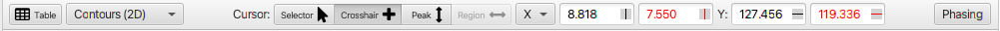
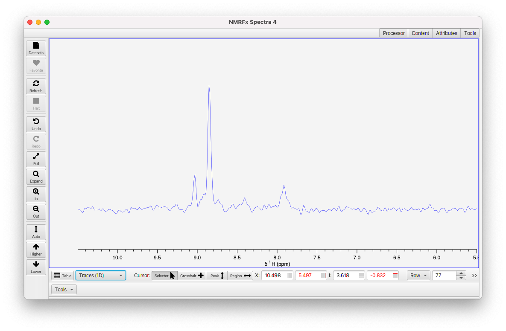
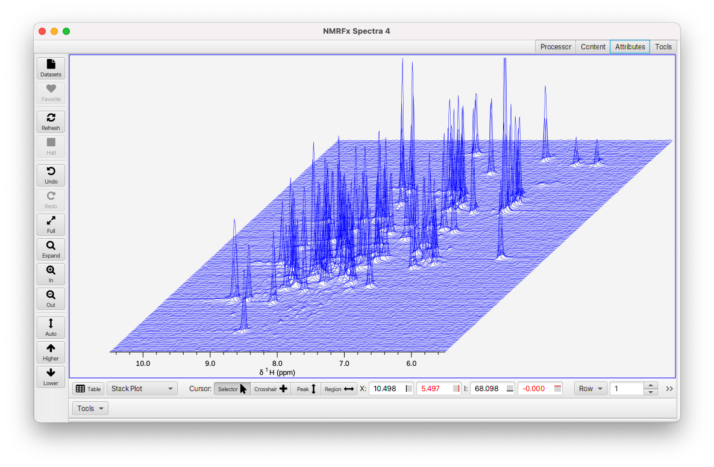
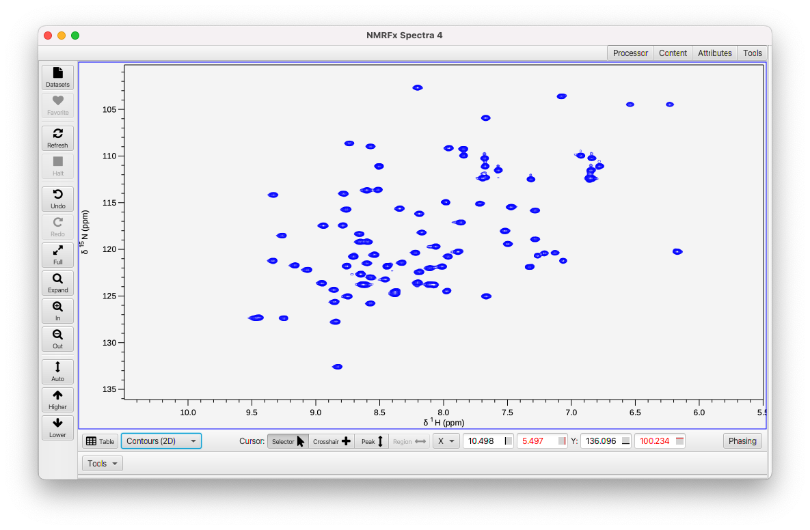
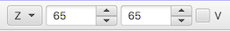

The status bar at the bottom of the spectrum window gives access to controls for changing the mode of the mouse cursor, for displaying the chemical shift position of the crosshairs, for accessing some Tools, accessing spectrum phasing, and changing the display mode (traces, stack plots, contours).  The exact controls available depend on the current state of the window.  For example, in Processing mode (when the Processor window at right is visible) a checkbox to turn on/off display of complex data (include a trace for imaginary values) is present.  If the spectrum has two or more dimensions controls for displaying what dimension appears on what axis, and for stepping through planes of datasets with three or more dimensions will be available.

####View Mode

If the spectrum has more than one dimension (either a 2D, 3D etc. or an arrayed 1D spectrum) then a control will be present for changing the display mode.

Traces(1D)
: Display individual traces of the spectrum.  A **Row** control will be available that allows you to select what rows to display (Full, First or Last) or to step through individual rows.

Stack Plot
: Multiple rows will be displayed and will be offset in a way to present a stack plot.  Rows are drawn from the back to the front so front traces are drawn over rear traces.

Contour
: The spectrum is drawn as a two-dimensional contour plot.  In this mode the X label (to the left of the primary crosshair position text boxes) will switch to a menu that allows the user to select which dimension of the dataset is drawn on the X axis of the plot and a similar control will replace the Y label.  With spectra with more than two dimensions additonal controls (Z, etc.) will be available to control what planes are drawn.

The same spectrum is shown below in the three different modes.

####Cursor Modes

The status bar has controls for selecting the mode of the cursor (Selector, Crosshair, Peak and Region).  These are described on the [GUI Mouse Page](../02.mouseactions/docs.md)

####CrossHair Position Controls

Four text boxes display the current positions of active crosshairs.  The first two show the position of the primary (typically black) vertical and horizontal crosshairs.  The second two show the position of the secondary (typically red) vertical and horizontal crosshairs. You can also use these to change the crosshair positions to a specific value.  Just type a number into the box and hit the Return key or change the focus to another text box.  Note:  if the crosshairs are not currently displayed, then the position values represent the current plot limits for the X and Y axes.

Each text box has an icon at the right side that can be used to deactivate the corresponding crosshair.  If the icon is solid black the crosshair is deactivated (and not visible).  If the icon has a line at the center of the icon, then the number at left is the crosshair position.  If the icon has a line at the edge, then the number at left is the position of the corresponding edge of the spectrum.

#### Plane Controls

If the dataset has more than two dimensions, then for each higher dimension (3rd, 4th etc.) new controls will appear.

The dimension label (Z, A ...) is on a menu which can be used to change displayed planes:

Full
: all planes

First
: the first plane

Last
: the last plane

Center
: the center plane

Max
: the plane with the maximum intensity at the position of the black crosshairs.

To the right of the plane menu are two text boxes.  The two boxes display the first and last of a range of planes.  By default, the text fields display the planes in points (counting from 1).  If the **V** checkbox is selected, then the text boxes show values.  For standard 3 (or higher) dimensional datasets these will be the chemical shift of the plane in ppm.  For some other experiments (pseudo-3D relaxation for example) the field can display a value (relaxation time etc.) corresponding to the plane. 

Phasing

:    Display the phasing tool along the left edge of the spectrum.  Phasing is not yet active for datasets that are not actively the result of processing an FID in the current session.

Complex

:    Display both the real and imaginary parts of 1D vectors.  This menu is not displayed for dataset (spectrum) display.
