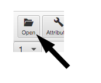
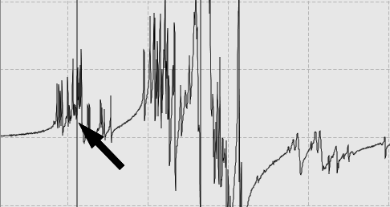
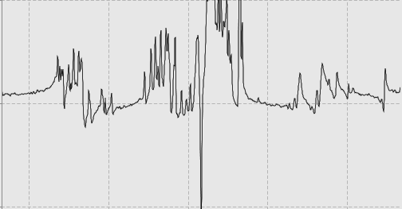
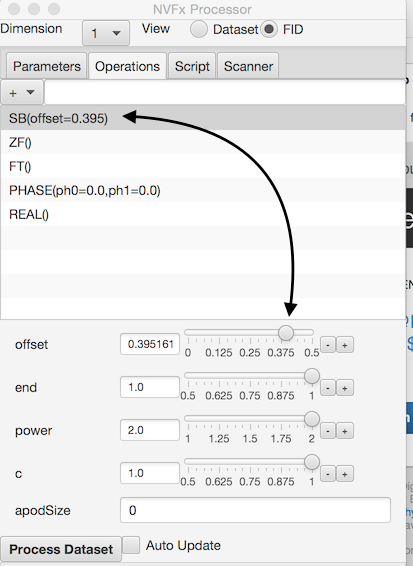

NMRFx Processor is a computer program for processing NMR datasets.  It will read the raw FID file of experimental NMR data and apply a sequence of processing operations to convert the data values into a spectrum useful for subsequent analysis.  NMRFx Processor is written in the Java programming language and uses Jython, the Java implementation of Python, for scripts.  The two parts of the name are derived from the names of the NMRView software with which NMRFx Processor shares some low level code, and the JavaFX Graphical User Interface toolkit used for the NMRFx Processor GUI.

NMRFx Processor has a graphical user interface that can be used for creating, configuring and executing processing scripts.  The scripts can also be executed in a non-GUI mode on the command line of Windows, Linux and Mac OS computers.

The following section of the documentation walks you through the steps involved in processing a 2D NOESY dataset and will introduce basic use of the NMRFx Processor GUI.

NMRFx Processor currently is capable of processing files produced on Varian/Agilent and Bruker instruments.  The first step in processing is to choose a file to process.  Just click the open button  and navigate to the desired file in the file browser.  You'll browse into the folder containing the files and choose the actual file containing the FID data (more control over opening files is available via options in the File menu).

This will be a file named **fid** for Agilent systems and **fid** for Bruker 1D and **ser** (as shown here) for Bruker nD files.  Select the appropriate file and click the **Open** button in the File Browser.  The FID file will be opened and the first row of the FID displayed in the main window.

To process the FID we need to create a list of processing operations that we want to be applied to the FID.  We can do this by opening a pre-existing script, creating a script by sequentially choosing a series of processing operations, or have NMRFx Processor automatically generate a processing script based on the FID's parameters.  We'll do that here by going to the Processor's Operations tab, and choosing **Gen All Dims** from the operations menu.

If we did things right when we programmed NMRFx Processor, and if there's nothing unusual in your experimental parameters, the automatic generation command will come up with a reasonable list of operations. But, of course, we're not perfect and NMR has so many ways of doing experiments that the processing scheme may not be ideal, or may not even work.  Sometimes it's simply impossible to figure out how an experiment should be processed from analyzing the parameters.  So you may want or need to adjust the operations and associated parameters manually.  For this simple example, we'll use the defaults at first, and learn about changing them below.

It's very likely that you'll at least need to adjust the phasing of the spectrum. To do this you'll at least need the **FT** operation included in the script so that the signal is displayed in the frequency domain.  Our automatically generated script includes the FT command so as soon as we generated the script the data is displayed as a spectrum.  Phasing will require at least the adjustment of the zero order phase parameter, and possibly the first order parameter as well.  This spectrum is poorly phased and the phase error appears different across the whole spectrum so we'll certainly need to adjust both phase parameters here.

To adjust the phases we need to display some phasing tools.  Just click the **Phase** button in the toolbar.  You'll see a the phasing tool appear at the right side of the spectrum.  There are two sliders, for the zero and first order phase correction, and a menu at the bottom.

So let's first set a position for the pivot parameter (we could instead do this after adjusting the zero-order phase parameter).  Click the left mouse button (or single mouse button if you don't have a three button mouse) so that a vertical black crosshair appears.  Now position the crosshair at the point where you want the pivot set.  Select the **Set Pivot** menu item in the Phase menu.  Adjusting the zero-order phase slider will set the phase uniformly across the spectrum and the first-order phase slider will set a linearly increasing phase that starts with zero effect where we positioned the pivot.

T> NMRFx can show two sets of crosshairs.  If you're using a 1-button mouse (or the trackpad on a laptop) the mouse moves the black crosshair at first.  The red crosshair will appear if you then click at some distance away from the black crosshair. Further actions of clicking and dragging will move whichever crosshair is closest when you click.  NMRFx will recognize that you have a 3-button mouse as soon as you click with either the second or third mouse button.  Once recognized, the black crosshair will be moved when the left mouse button is down, and the red crosshair when the middle mouse button is down.

Now that you have the pivot set let's go ahead and adjust the zero-order phase parameter.  Slide it up and down until you adjust the phase of the spectrum at the position of the pivot so the lines are nice and symmetrical.

A> Watch how as soon as you release the mouse button on the slider, the **PHASE** operation in the operation window is updated with the new phases.

The spectrum lines look good near the pivot, but they're increasingly out of phase as their distance to the pivot position increases.  So lets adjust the first-order slider till they are all in phase. 

Now that the spectrum is well phased in the first dimension lets check out the 2nd (indirect) dimension.  Go to the Dimension menu  at the top of the Processor window and select **2**.  

I> NMRFx lets you look at the "indirect FID".  It does this by assemblying the datapoints in the FID file that correspond to the first time increment in the direct dimension.  At present this only works properly for 2D datasets, but development of the code for higher dimensions is in progress.  The ability to observe signal in the indirect FID also depends on the type type of experiment and signal-to-noise ratio.  The technique works well for the 2D NOESY used here.

If you're experiment and pulse programs are properly setup it is generally true that there shouldn't be any need for phasing in the indirect dimensions.  One can often fine-tune the pulse program so that the phasing is nearly perfect.  But, that may not be the case for your experiment, or the experiment may be setup so that there is a need for a very specific phase correction.  This experiment was done so that the first row is collected with a time-increment equal to half the dwell time.  These experiments typically need a -90 zero-order phase correction and a 180 degree first-order phase correction.

We can set this phase correction using the sliders, or more easily, just select **-90,180** in the Phase menu.

Now the spectrum is nicely phased in the indirect dimension.  There's some baseline curvature which we can deal with separately.

Let's go ahead and process the dataset.  Just click the **Process Dataset** button at the bottom of the spectrum.

The dataset will be processed and the 1D spectrum or 2D contour plot will be displayed.   Here's our RNA NOESY spectrum.

At any stage of the process we might want to change the processing script.  You can add or remove operations, or change the parameters for each operation.  If the display is set to show a single vector (in any dimension) the processing will be reapplied when you make any change and the display updated to show the new processed vector.

To remove an operation just click on it in the operation list and click the **Delete** key.  You can add an operation by clicking the **+** menu at the top of the Operation list and choose a new operation from the menu.  Operations with similar functions are grouped together.  There is a default location in a script for each operation so when you add an operation it will appear at a reasonable place for that operation type.  You can, however, move an operation to a new location in the script by selecting it and dragging (with left mouse button down) to a new location in the operation list.

If you add an operation that already exists it will replace the existing one, but with default values for the parameters.  This is a convenient way to reset all parameters to their defaults.  It is possible for a sequence, however, to have more than one operation of the same type.  You can add an additional operation by typing in its name, preceded by a + character into the entry box next to the operation menu.  

Processing operations often have one or more parameters that change their action.  For example, the SB (sinebell apodization command) has four parameters.  When you select an operation in the list all parameters will be displayed with interactive controls shown below the list.  Changing the parameter values will update the vector processing and display in real time.

It might be necessary, when processing multi-dimensional datasets, to adjust the phasing parameters while examining the processed dataset.  This can be done by observing slices through the processed dataset.  Display the phasing controls and slices by turning on the corresponding checkboxes in the toolbar above the spectrum.

Positioning the black cursor will refresh the slices so they are drawn with data slices extracted at the crosshair position.  Adjusting the phase controls will update the slices with the current phase values.  You can set a pivot point as described above.  The phasing controls effect the phase of the slice corresponding to the dimension selected in the Processor window, so you should select a dimension with the control at the top of the processor before adjusting phase values.  Each time you release the phase sliders the **PHASE** operation in the current operation list will be updated with new values so that reprocessing the dataset will result in phasing corresponding to that seen in the active slice.

A> Positions, colors and scaling of the slices can be adjusted in the *Slice* tab of the Attributes windows.
