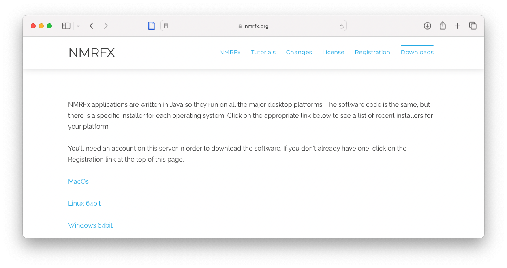

##Java
NMRFx Analyst is written in the Java programming language. Because of this we can produce one version of the program which runs on many different operating systems.  We release versions which run on MacOSX (both Intel and Apple Silicon processors), Windows and Linux. We bundle a Java Runtime Environment (JRE) right in with the application, so there is no need to install Java yourself, or really even be aware that this is a Java based application.  The Java that is embedded in the installer will be installed along with our software application, and in a way that doesn't conflict with your use of Java by other applications.  

###Registration and Downloads

Proceed to the web site: [NMRFx](http://www.nmrfx.org) and select the appropriate page:

- [NMRFx Analyst](https://nmrfx.org/nmrfx/analyst) The pages for this application
- [NMRViewJ](https://nmrfx.org/nmrfx/nmrviewj) Our original NMR Visualization program (no longer under development)
- [NMRFx Structure](https://nmrfx.org/nmrfx/structure) The command line component of NMRFx that can be used for structure calculation and shift prediction

To download any of the applications you need to login to the web site.  You can register for login by clicking on the Registration link at the top right corner of the web site. 

If you already have an account, just click on the download link for your operating system version.  You'll be prompted for your username and password.

###Download

Once you're at the Downloads page for the application (via Downloads on the applications home page) you'll see links for each operating system (MacOS, Windows, Linux).
Click on the appropriate link to get a page for that operating system.  For all operating systems you'll see a link to access some previous versions.  For MacOS you'll see a link for the Intel version (for example, nmrfxa-macos_11_4_5.dmg) and a link for the Apple Silicon (M1 or M2) ARM chip (for example, nmrfxa-macos_11_4_5_ARM.dmg).

The downloaded files for all the different operating systems consist of essentially the same software code, but the installer and embedded Java version is specific to the operating system.

###Installation

Once you've downloaded the installer you can start it. 

On MacOS the downloaded file is a .dmg archive. Just double click on the .dmg archive.  It will open into a Finder window and you can simply drag the NMRFx Analyst application to the Application folder icon.

On Windows,  just click on that file double-click on the installer and respond to a few questions about where the application should be installed.

On Linux computers you should open a terminal window and start the installer with the "sh" command. You may need to first extract this shell script from a tar archive:

    tar xzvf nmrfxa-unix-amd64_11_4_5.sh.tar.gz
    sh nmrfxa-unix-amd64_11_4_5.sh

That will start the installer, and as with Windows, respond to a few questions.

###Activation License

NMRFx (unlike NMRViewJ and dataChord) does not **currently** require an activation license.

 
###Starting the Program

You might want to drag the application to the Dock or place an alias on
the Desktop in order to make it convenient to startup NMRFx Analyst.

After installation you're ready to run NMRFx Analyst. On Windows the installer will place an NMRFx icon on the desktop,
and place an entry in the Start menu. On Linux and Unix, the installer
should also install shortcuts. If it doesn't (and with some Window
manager it won't) you can start NMRFx Analyst by executing the "nmrfxa" shell
script from a terminal. You can also install shortcuts yourself.
