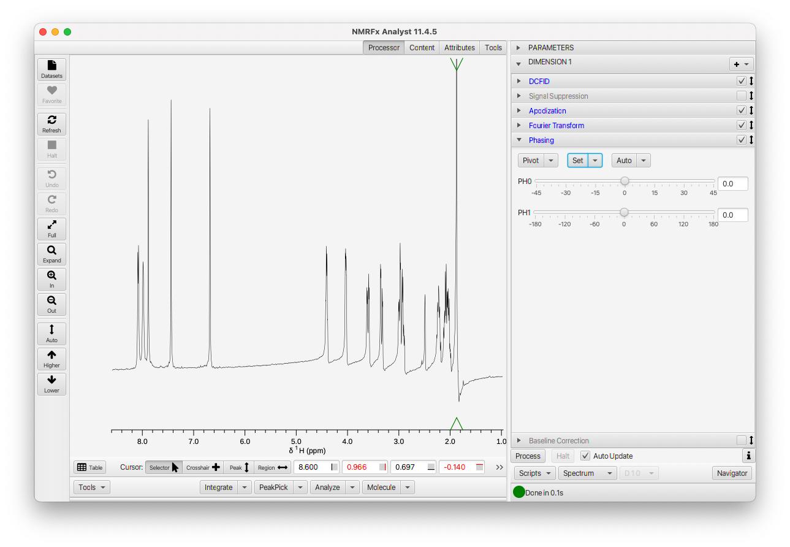

The following section of the documentation walks you through the steps involved in processing a 1D Proton dataset and will introduce basic use of the NMRFx Analyst GUI.

NMRFx Analyst currently is capable of processing files produced on Varian/Agilent, Bruker, Nanalysis and Quad Systems instruments, as well as files from various vendors saved in JCAMP format.  The first step in processing is to choose a file to process.  This will be a file named **fid** for Agilent systems, and **fid** for Bruker 1D, and **ser**  for Bruker nD files. You can drag and drop files on to the spectrum window, use the File Browser to open the file, or use the Dataset Browser to search for NMR files within a folder.

Here we'll use the File Browser.  Choose Open... from the File menu (in the screen menubar on MacOS, or top of spectrum window on other platforms).  Browse into the folder containing the files and choose the actual file containing the FID data (more control over opening files is available via options in the File menu).

Select the appropriate file and click the **Open** button in the File Browser. The FID file will be opened and you will be prompted for a name to save the processed file to.  This allows you to process the same data file into multiple different output files (with differing processing schemes).  If the file is a basic 1D or 2D file then NMRFx will automatically generate a list of processing operations appropriate to the dataset, apply them, and display the processed spectrum.  With many files this will give a reasonable result, but you may need to set phases and optimize the choice of processing operations such as apodization.  If you have already processed the file in NMRFx, there will be a "process.py" script saved with the FID, and that file will be parsed to get the processing operations.

The NMRFx Analyst window will display the spectrum in the center of the window, a row of interactive view controls at left, cursor controls and tools on the bottom, and a Processor region at the right.  The Processor region contains "Accordion Panes".  Each pane has a title bar and clicking on it will open that pane (and close the currently opened one).  There will always be a Parameter Pane at the top, and then a series of Panes for the one or more dimensions of an experiment.  At the bottom are a series of menus and buttons for interacting with processing actions and scripts.

The Parameter Pane will be described in more detail below, but it gives access to information about the pulse sequence, solvent, temperature etc., and acquisition parameters for each dimension.

Each Dimension Pane can be opened to show a list of the various processing operations used to process the current dataset.

The Dimension Pane itself, contains a series of panes, one for each operation that is applied to the data.  A checkbox at the right of the title can be used to turn on or off the action of that operation.  Disabled operations are apparent by the title being rendered in gray, and the checkbox being off.  The automatic generation of processing operations (when loading 1D or 2D files) includes operations that are commonly used.  Some of these operations may, at the start be present in the list (so they are readily accessible), but disabled.  In the example above it can be seen that SignalSuppression operation (typically used for removing solvent signals) is accessible, but turned off by default. Many additional, but less used operations, are available via the "+" menu, but aren't by default added.  Operations are executed, during processing, in the order they appear in the Dimension Pane.  Generally operations are automatically inserted in an appropriate location, but sometimes you will want to move them.  You can click on the arrows to the right of the title, and while holding the mouse button down, drag the operation to a new location.  

Each operation pane can be opened to show controls for parameters that are appropriate to that operation.  Some categories are grouped operations.  For example, opening the Apodization pane shows a series of panes for each type of apodization.  These can be opened and their parameters set.  Here, for example, is the ExpD (exponential decay) operation which has controls for setting the line broadening and a multiplier for the first data point.

By default, with 1D and 2D spectra, the processing is in an "Auto Update" mode.  As you interactively change operation parameters (by typing new values in the text field, or adjusting the slider controls) the spectrum will process and update.  For example, you can interactively slide the "lb" slider (shown in screenshot above) and watch how changing the line broadening effects the spectrum.  You can turn this behaviour off by deselecting the "Auto Update" button at bottom, and then explicitly clicking the Process button when you want to apply your changed operations.

As noted above, you can turn operations on and off, and interactively view the results of applying them.  If you want to fully remove an operation you can right-click on the title bar to get a menu with a Delete entry.

If there's nothing unusual in your experimental parameters or data, the automatic generation command will come up with a reasonable list of operations. But, of course, we're not perfect and NMR has so many ways of doing experiments that the processing scheme may not be ideal, or may not even work.  Sometimes it's simply impossible to figure out how an experiment should be processed from analyzing the parameters.  So you may want or need to add or remove operations and adjust the operation's parameters manually.  For this simple example, we'll use the defaults at first, and learn about changing them below.

When NMRFx creates the processing operations for a 1D file, it uses an automatic routine to calculate appropriate phase values, and inserts a PHASE operation with those values. 
But, it's possible that you'll want to change, or at least fine-tune, those phase values.  It is possible to adjust the phases of processed 1D and nD spectra, but its generally good to get the phases correct during the processing.  In part that's because then the correct phase parameters will be saved in the process.py script.

To adjust the phasing, you'll at least need the **FT** operation included in the script so that the signal is displayed in the frequency domain.  Our automatically generated scripts includes the FT command so as soon as we generated the script the data is displayed as a spectrum. Note that the automatically generated script may include a baseline correction operation.  When adjusting the phase its a good idea to disable the baseline correction algorithm.  Just click the checkbox on the **Baseline Correction** title bar, adjust the phasing, and then reactivate the baseline correction.

 Phasing will require at least the adjustment of the zero order phase parameter, and possibly the first order parameter as well. Expand the **PHASE** operation (click on its title bar).  Besides the parameter settings, the **PHASE** operation has some menus.  These menus (used here and for some other actions in NMRFx) are so-called SplitMenuButtons.  The controls are split into a button area at left and a menu at right.  In our usual convention, clicking the button gives immediate access to the action that is the first item in the menu.  In the **PHASE** operation there are three SplitMenuButtons, for setting the pivot, setting fixed phase values, and automatic phasing.

**Pivot**
: This SplitMenuButton has two actions for setting the pivot position(the pivot being the point in the spectrum where changing the first-order phase correction has zero effect). When activated the pivot position is displayed as a pair of green triangles at the top and bottom of the spectrum.
  -  **Set toMax**  Set the pivot to the largest peak in the spectrum 
  -  **At Crosshair** The second option sets the pivot position to the current position of the main (black) crosshair cursor

**Set**
: This SplitMenuButton has four actions for setting the phase parameters to specified values..  
  - **To DataValues** Set the phase to values saved in dataset
  - **0,0** Reset the zero and first order phases to 0.0
  - **180,0** Set the zero order phase to 180.0 and the first order phase to 0.0
  - **-90,180** Set the zero order phase to -90.0 and the first order phase to 180.0

**Auto**
: This SplitMenuButton has two actions for automatically calculating phase values..  
  - **AutoPhase 0+1**  Estimate both the zero and first order phase values.
  - **AutoPhase 0**  Estimate just the zero order phase value.

So let's first set a position for the pivot parameter (we could instead do this after adjusting the zero-order phase parameter).  Either use **Set toMax** in the Pivot menu (or just click the Pivot button) or position a crosshair and use the **At CrossHair** choice in the Pivot menu.  To use the crosshair make sure the mouse cursor is in crosshair mode. Now position the crosshair at the point where you want the pivot set.  Select the **At CrossHair** menu item in the Pivot menu. 

Now that you have the pivot set let's go ahead and adjust the zero-order phase parameter.  Slide it left and right until you adjust the phase of the spectrum at the position of the pivot so the lines are nice and symmetrical.  The slider starts with a range of -45 to +45, but when you slide near the limit of this range and let go the range will update so the current position is near the center.  That gives it, essentially, an infinite range.

Once you have the spectrum phased at the pivot, look to see if it is uniform across the spectrum.  If not, adjust the first-order phase slider till the entire spectrum is in phase as shown here.

After phasing turn the baseline correction back on if needed.

