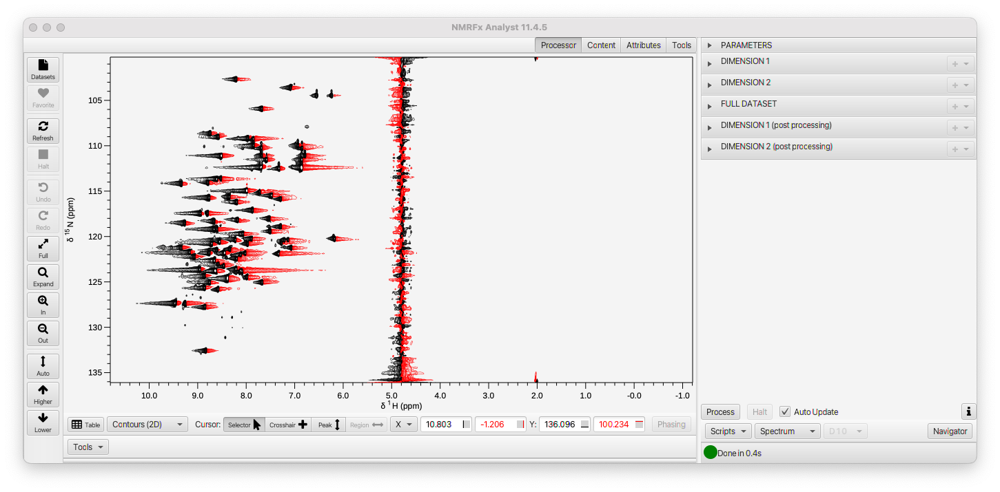
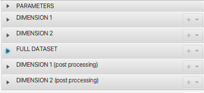
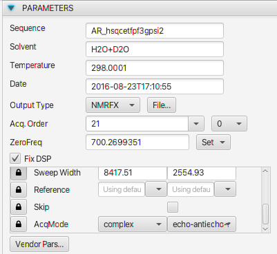
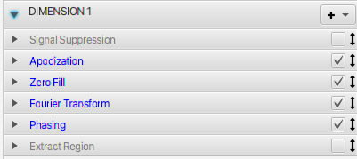
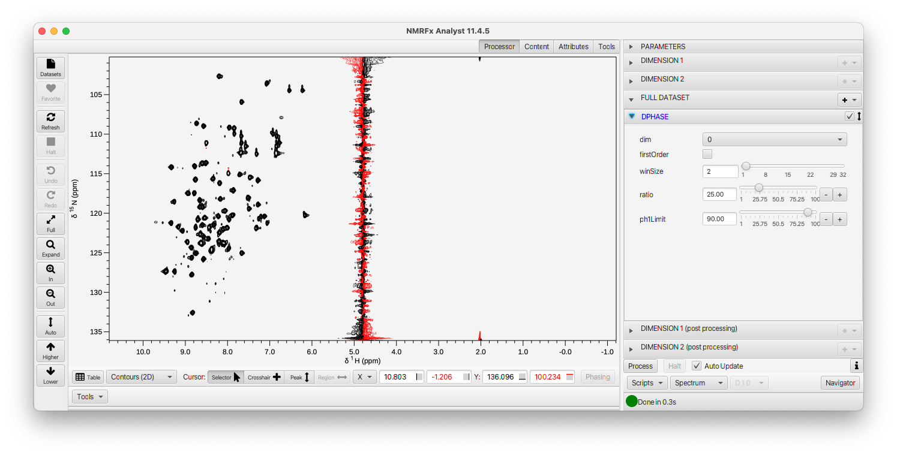
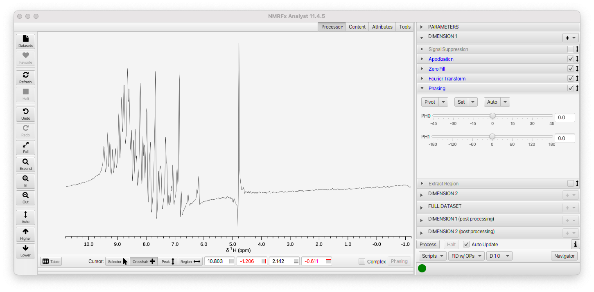
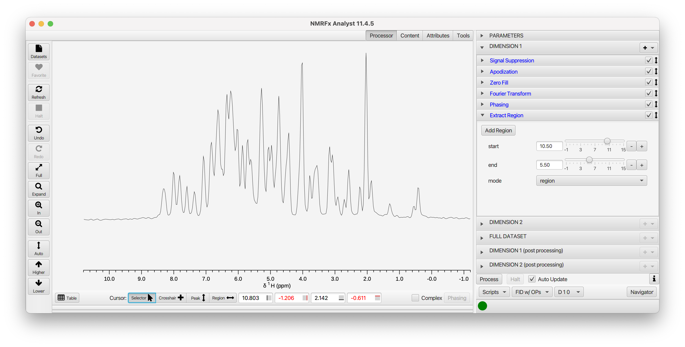
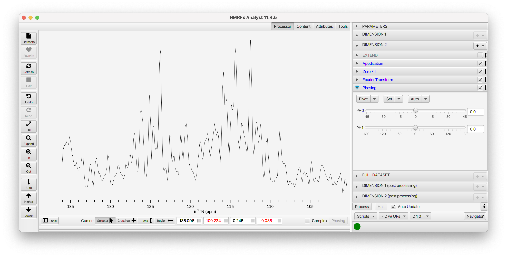
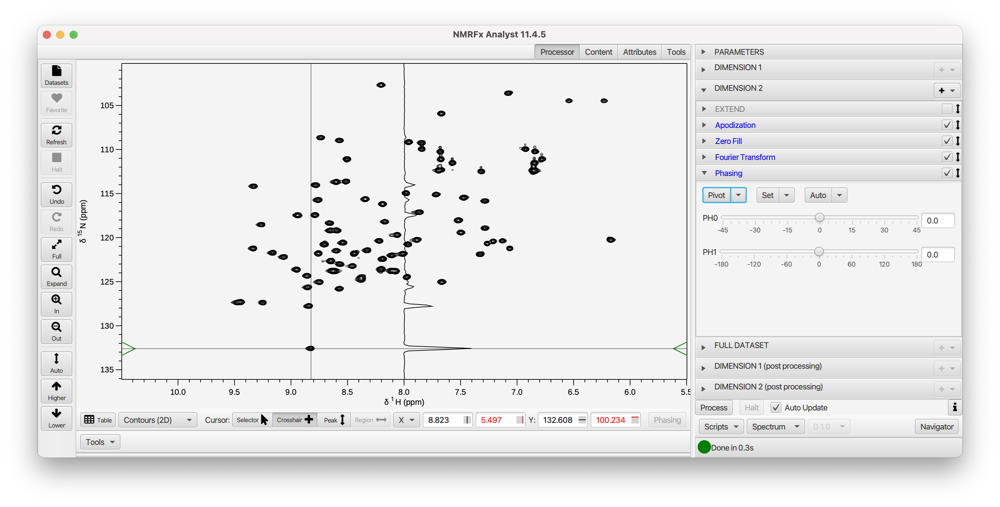

The following section of the documentation walks you through the steps involved in processing a 2D H-N HSQC dataset and assumes that you have read the [1D Basics](../03.1d-tutorial) Tutorial

For this file, lets use drag-and-drop.  Open a file browser in your computers operating system.  Navigate to the directory containing the dataset (here a Bruker 2D file) and select the data file (ser for this Bruker File). Hold the mouse down and drag the file onto the NMRFx Analyst spectrum window.  The FID file will be opened and you will be prompted for a name to save the processed file to.  Here we just entered **hsqc**.

For this 2D file NMRFx will automatically generate a list of processing operations for each of the two dimensions of  the dataset, apply them, and display the processed spectrum.  With many files this will give a reasonable result, but you may need to set phases and optimize the choice of processing operations such as apodization.  If you have already processed the file in NMRFx, there will be a "process.py" script saved with the FID, and that file will be parsed to get the processing operations.

The Processor tab pane will be displayed with a series of Titled Panes for each Parameters, the two Dimensions, the Full Dataset, and post-processing of each dimension

As with the 1D experiment, the Parameters will show sequence, solvent, temperature etc and spectrometer parameters for the dimensions. For this 2D dataset, there will be, of course,
two columns of dimension parameters.  Note that NMRFx has recognized that this dataset was collected with ***Echo-AntiEcho*** acquisition to generate complex data in the indirect dimension and set the **AcqMode** parameter appropriately.

The Dimension 1 operations list has been populated with six operations, including two (**SignalSuppression** and **ExtractRegion**) which are initially disabled.

NMRFx Analyst does not, by default, automatically generate phases for 2D (and higher) datasets.  We can do several things to set the phases.  The easiest method is to use full automatic phasing of the processed dataset.  Do do this just expand the **Full Dataset** pane and activate (click the checkbox on right side of title bar) on **DPHASE**.

As you can see, this dataset is now reasonably phased in both dimensions.  This works well for many datasets, but depending on the dataset you may want to have more control over the phasing.  We can do this by turning off the **DPHASE** command and opening up the *DIMENSION 1* pane.  Within it, you'll find a **PHASE** operation.  Often it is appropriate to manipulate some operations when one is looking at the first row of the FID.  At the bottom of the Processing pane you'll find a menu that gives control over what state of the dataset is displayed.

- **FID** The display is the raw FID, without any operations applied
- **FID w/OPs**  The display is the FID, with any active operations applied
- **Spectrum**  The fully processed data (in all dimensions).  This represents the processed data as output to the output file.

Set the mode to *FID w/OPs* and open up the **Phasing** tab in **Dimension 1**.  The display should now look like this:

Using the **Auto->Autophase 0** menu item in the **Phasing** pane will automatically calculate the zero order phase.  That looks good for this spectrum, but you may want to take advantage of setting a pivot and manually adjusting the zero and first order values for some spectra (as described in the [1D tutorial](../03.1d-tutorial).

While we're looking at the data in this mode (*FID w/OPs*), lets check a few more operations.  There's a significant water signal so lets turn on **Signal Suppression**.  Just click the checkbox on its title bar.  You can open up the tab if you want to optimize the *Window* (effects the width of suppressed region) and *Shift* (effects the exact position of suppression) parameters.  As with most HN-HSQC spectra, this one is essentially empty below 5 ppm. We can activate the **Extract Region** command to remove the right half of the spectrum.  Alternatively, within the **Extract Region** pane, set the mode to *Region* and enter a start and end position (in ppm), or use the crosshair cursors to define a region and click **Add Region**.

Now that the first row looks good, just click the **Process** button at the bottom-left of the Processor pane and you'll see the fully processed 2D dataset (here we used the **Higher** and **Lower** items in the toolbar at left to adjust the vertical scale).

This spectrum does not need phase correction in the indirect dimension, but we can look at the FID w/OPs in the indirect dimension (the same as the first dimension).  This works for many but not all datasets).  Just got to *FID w/OPs* mode and open the *Dimension 2* pane.  You'll see this:

NMRFx Analyst can extract the appropriate data points from the raw FID file to generate what is essentially (for this dataset) an FID for the first row of the 15N indirect dimension.  You can look at the phasing (and other operations).

This dataset doesn't need much more adjustment, but you can use full automatic phasing by turning on **DPHASE** in the *Full Dataset* section.  This can be done even after setting manual phases.  Combining manual and automatic phasing is particularly useful if there is some predefined set of phases that are appropriate.  For example, some datasets require the indirect dimension to be phased with a zero-order value of -90.0 and a first order value of 180.0.  You can set those in the **PHASE** operation, and then have the **DPHASE** operation tune the phases from there.

You can also interactively phase the spectrum by looking at slices through the processed dataset.  After you've set up processing, and are looking at the spectrum (rather than a FID with applied operations) open up the **Phasing** pane for the dimension of interest.  The cursor will change to crosshair mode and a slice will be displayed with data extracted at the position of the cursor.  You'll see a horizontal slice if you're doing dimension 1, and a vertical slice if you're doing dimension 2 (actually whatever dimension is displayed on the y-axis)

You can also do additional processing steps after the initial processing.  For example, doing baseline correction after the dataset is first processed (including phasing) can be useful and more effective than doing it before the indirect dimension is processed.  The **Dimension (Post Processing)** sections are used for this.

At any stage of the process we might want to change the processing script.  You can add or remove operations, or change the parameters for each operation.  If the display is set to show a single vector (in any dimension) the processing will be reapplied when you make any change and the display updated to show the new processed vector.

To remove an operation just just right click on the title bar and choose **Delete** from the menu. You can add an operation by clicking the **+** menu at the top of the Operation list and choose a new operation from the menu.  Operations with similar functions are grouped together.  There is a default location in a script for each operation so when you add an operation it will appear at a reasonable place for that operation type.  You can, however, move an operation to a new location in the script by selecting it and dragging (with left mouse button down) to a new location in the operation list.

If you add an operation that already exists it will replace the existing one, but with default values for the parameters.  This is a convenient way to reset all parameters to their defaults.  It is possible for a sequence, however, to have more than one operation of the same type.  You can add an additional operation by typing in its name, preceded by a + character into the entry box next to the operation menu.  
