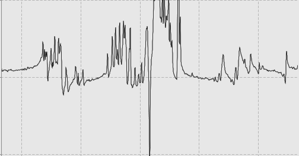
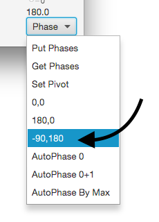
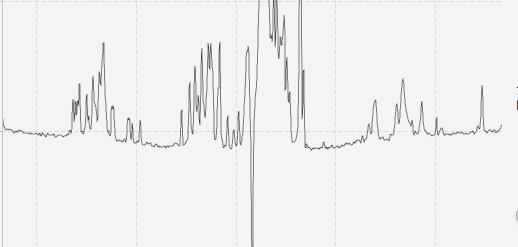
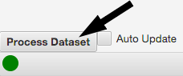
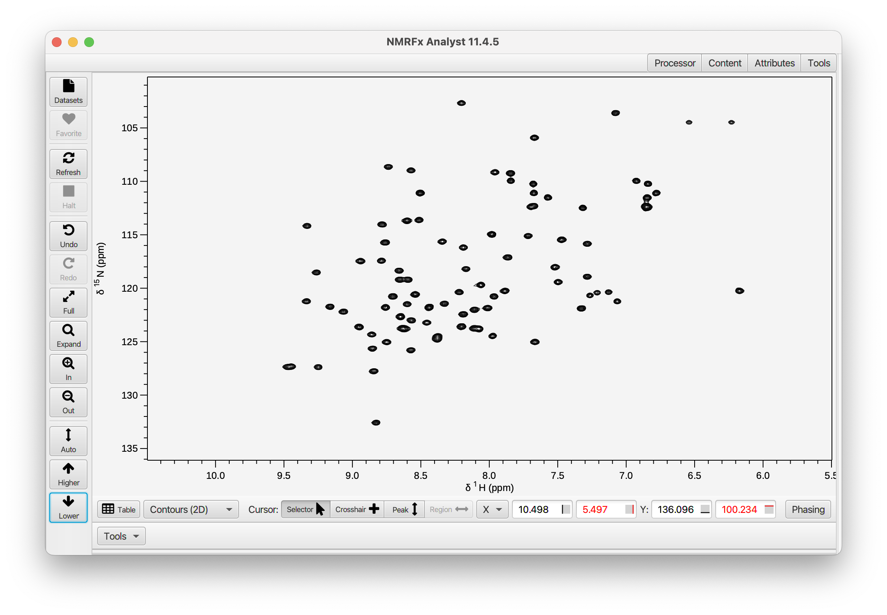
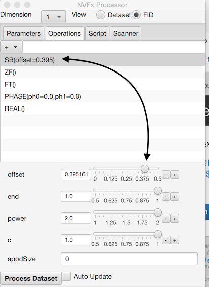
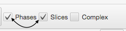
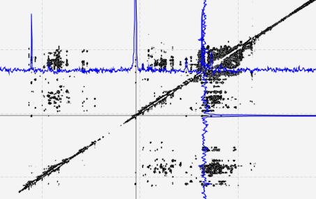

The following section of the documentation walks you through the steps involved in processing a 2D H-N HSQC dataset and will introduce basic use of the NMRFx Analyst GUI.

NMRFx Analyst currently is capable of processing files produced on Varian/Agilent, Bruker, Nanalysis and Quad Systems instruments, as well as files from various vendors saved in JCAMP format.  The first step in processing is to choose a file to process.  This will be a file named **fid** for Agilent systems, and **fid** for Bruker 1D, and **ser**  for Bruker nD files. You can drag and drop files on to the spectrum window, use the File Browser to open the file, or use the Dataset Browser to search for NMR files within a folder.

Here we'll use the File Browser.  Choose Open... from the File menu (in the screen menubar on MacOS, or top of spectrum window on other platforms).  Browse into the folder containing the files and choose the actual file containing the FID data (more control over opening files is available via options in the File menu).

Select the appropriate file and click the **Open** button in the File Browser. The FID file will be opened and you will be prompted for a name to save the processed file to.  This allows you to process the same data file into multiple different output files (with differeing processing schemes).  If the file is a basic 1D or 2D file then NMRFx will automatically generate a list of processing operations appropriate to the dataset, apply them, and display the processed spectrum.  With many files this will give a reasonable result, but you may need to set phases and optimize the choice of processing operations such as apodization.  If you have already processed the file in NMRFx, there will be a "process.py" script saved with the FID, and that file will be parsed to get the processing operations.

We can set this phase correction using the sliders, or more easily, just select **-90,180** in the Phase menu.

Now the spectrum is nicely phased in the indirect dimension.  There's some baseline curvature which we can deal with separately.

Let's go ahead and process the dataset.  Just click the **Process Dataset** button at the bottom of the spectrum.

The dataset will be processed and the 1D spectrum or 2D contour plot will be displayed.   Here's our RNA NOESY spectrum.

At any stage of the process we might want to change the processing script.  You can add or remove operations, or change the parameters for each operation.  If the display is set to show a single vector (in any dimension) the processing will be reapplied when you make any change and the display updated to show the new processed vector.

To remove an operation just click on it in the operation list and click the **Delete** key.  You can add an operation by clicking the **+** menu at the top of the Operation list and choose a new operation from the menu.  Operations with similar functions are grouped together.  There is a default location in a script for each operation so when you add an operation it will appear at a reasonable place for that operation type.  You can, however, move an operation to a new location in the script by selecting it and dragging (with left mouse button down) to a new location in the operation list.

If you add an operation that already exists it will replace the existing one, but with default values for the parameters.  This is a convenient way to reset all parameters to their defaults.  It is possible for a sequence, however, to have more than one operation of the same type.  You can add an additional operation by typing in its name, preceded by a + character into the entry box next to the operation menu.  

Processing operations often have one or more parameters that change their action.  For example, the SB (sinebell apodization command) has four parameters.  When you select an operation in the list all parameters will be displayed with interactive controls shown below the list.  Changing the parameter values will update the vector processing and display in real time.

It might be necessary, when processing multi-dimensional datasets, to adjust the phasing parameters while examining the processed dataset.  This can be done by observing slices through the processed dataset.  Display the phasing controls and slices by turning on the corresponding checkboxes in the toolbar above the spectrum.

Positioning the black cursor will refresh the slices so they are drawn with data slices extracted at the crosshair position.  Adjusting the phase controls will update the slices with the current phase values.  You can set a pivot point as described above.  The phasing controls effect the phase of the slice corresponding to the dimension selected in the Processor window, so you should select a dimension with the control at the top of the processor before adjusting phase values.  Each time you release the phase sliders the **PHASE** operation in the current operation list will be updated with new values so that reprocessing the dataset will result in phasing corresponding to that seen in the active slice.

A> Positions, colors and scaling of the slices can be adjusted in the *Slice* tab of the Attributes windows.
