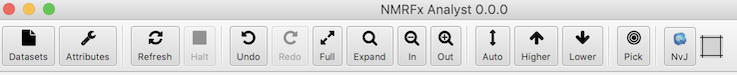
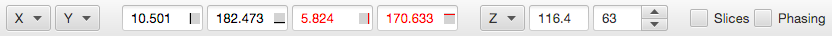
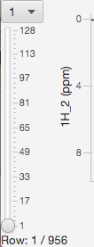

## Menus

### File

Open FID...

:    Display a file dialog in which you can select the unprocessed (FID) NMR data set to open.
Typically you will select an Agilent ".fid" directory, an Agilent "fid" file, or a Bruker "fid" or "ser" file, or an NMRView (.nv). The file will be opened, the first row of raw data displayed,
and the Processor window will be opened.

Open Dataset...

:    Display a file dialog in which you can select the processed  NMR data set to open.
At present you can open NMRViewJ (.nv) and Sparky (.ucsf) format files.
The dataset will be displayed (vector for 1D or contour plot for 2D or higher)
in the currently active spectrum window.  If a dataset is already present it the
active window it will be replaced with the new dataset.

Open Dataset (No Display)...

:    Display a file dialog in which you can select a processed  NMR data set to open.
The dataset will be opened in NMRFx, but won't be immediately displayed in a spectrum
window.  You can select it for display later from the spectrum attributes window
or using the Dataset icon in the toolbar of a spectrum window.

Recent FIDS >

:  A menu of recently opened unprocessed (FID) NMR datasets.  Selecting an item
from the menu will cause it to be opened, and displayed in the active spectrum window.

Recent Datasets>

:  A menu of recently opened,  processed  NMR datasets.  Selecting an item
from the menu will cause it to be opened, and displayed in the active spectrum window.

New Window

:    Create a new spectrum display window.   

New NMRFx Server

:  Sets up a socket that can listen for commands from other applications.  Currently
this can be done from the CoMD/NMR Dynamics Software.

Export SVG...

:    Create an SVG file containing a rendering of the currently active spectrum.  Note:  at present, only the active spectrum chart in a single window will be exported to the file.

### Projects

NMRFx Projects are similar to NMRViewJ projects in that they consist of a main directory and a series of subdirectories.  Each subdirectory contains data for a particular data type (datasets, peaks, molecules etc.).  Data is stored in simple text files (rather than the STAR format used in NMRViewJ).  NMRFx has a built-in copy of Git, a version control system allowing it to keep a history of project changes.

Open...

:    Open an existing project.  Use the file browser that appears to browse to the directory containing the project directory.  Select the project directory and click *Open*.

Open Recent

: This is a sub-menu containing a list of recently used projects.  Choose an entry from the menu to open that project.  Entries in the list show the last three elements of the path to the directory to help you in recognizing projects and distinguishing projects with the same name.

Save

:    Save the project into the various project sub-directories.  All the component files of the project are over-written.  Then a Git commit is done to maintain to record the differences from the previous state of the project.

Save As...

:    Save the project into a new project directory. A file browser will appear that will allow you to choose a directory location in which to save the project.

Close

:  Close the current project.  After you confirm this action, all  molecules, peaklists
and assignments will be discarded.

Open STAR3

:  Read a BMRB STAR3 format file.

Save STAR3...

:  Write project information (peakliss, assignments, molecules etc.) to a BMRB STAR3 format file.

Open Sparky Project:

:  Open a Sparky project file.  Save files reference in the project file and corresponding
.ucsf datasets will also be opened.  This is a preliminary feature and some
attributes of the Sparky files might not be imported properly or at all.

### Spectra

Delete Spectrum

:    Delete the active spectrum chart from a window that has more than one chart in it.  The remaining charts will be resized to fill the empty space.

Arrange

:    Horizontal.  Arrange the spectrum charts in a window with multiple charts such that they occupy a single horizontal row.
:    Vertical.  Arrange the spectrum charts in a window with multiple charts such that they occupy a single vertical column.
:    Grid.  Arrange the spectrum charts in a window with multiple charts such that they occupy a grid of rows and columns.  The number of rows and columns is determined automatically.
:    Overlay.  Convert a grid (or row or column) of spectrum charts into a single chart with all the datasets displayed.  You can switch an overlay of spectra back to a grid (or row or column) using the Grid, Horizontal or Vertical menu items.
:    Minimize Borders. Only display the axis tic marks and labels for charts that are on the bottom or left edge of the spectra.  Those for "internal" spectra are removed to conserve space.
:    Normal Borders. Display the axis tic marks and labels for all charts in the current stage.

Sync Axes

:    Preliminary support for synchronized axes.  All the spectrum charts in a single window will be synchronized across dimensions that share the same label.  Changing the x, y and plane values in one window will result in the other windows being redrawn so that they share the same values on similar dimensions.  There is not currently a method to restrict the synchronization to specified axes, remove synchronization, or synchronize spectrum charts in different windows.  These features will be coming in a subsequent version.

Align Spectra

:    Adjust the referencing so spectra are aligned with each other.  Alignment happens between spectra that are displayed in the same window.  They can be in separate charts within the window, or multiple datasets within a single chart.  Alignment occurs only between the dataset dimensions on the x and y axes (not planes).  Alignment is done by peak picking the spectra (if peak picking has not already been done) and adjusting the referencing such that the distance between nearby peaks is minimized.  The first dataset of the active chart is the target dataset.  Other datasets are aligned to that dataset.  Dataset parameter files are written to save the new referencing.  This process (in current implementation) can be slow if there are a lot of peaks.  Because of this it's a good idea to have the window display zoomed in somewhat.

Analyzer...

:  Display the spectrum analysis window.  This allow you to measure intensities in a specified region of the spectrum (area with the crosshairs).

Show Measure Bar...

: Show a toolbar across the bottom of the spectrum with tools and displayed values used
for measuring positions, position deltas, intensities and signal/noise ratio.

Show Comparator...

: Show a toolbar across the bottom of the spectrum with controls for selecting
a pair from multiple datasets.  You can use it to do pairwise comparisons of
spectra.

Show Regions Analyzer...

:  Show a window with controls for analzying spectral regions.  Regions can be added, adjusted
split and removed. Peaks can be added to the region and an implementation of Objective 
Deconvolution used to add peaks to the region to deconvolute overlapping signals.

Copy Spectrum as SVG Text

:  The spectral display can be copied to the clipboard as SVG (scalable vector graphics)
text.  The result can be pasted into some graphics applications, but at present
this only works for some applications.  For example, we have used this
successfully with Affinity Designer on MacOS.

### Molecules
NMRFx can read in molecular structures in several different formats, including
reading in a sequence and building a molecule from a residue library, reading
PDB files and reading .mol/.sdf files.

***File Menu***

Read Sequence...

:   Bring up a file selection dialog to select and open a file
        containing an amino acid, DNA, or RNA sequence. See the section
        on Molecular Structures to learn about the
        format of this file.

Read PDB...

:   Bring up a file selection dialog to select and open a PDB format
        file. This is the standard way to read in pdb files. NMRView
        first reads the pdb file to determine the amino acid sequence.
        Next, it reads the corresponding residues from the residue
        library. Finally, it reads coordinates from the pdb file for
        those atoms that have names matching the names in the residue
        library. Atoms, that do not have a match in the residue library
        will not be entered into the structure list. Atoms that are in
        the residue library but not in pdb file, will be included in
        structure list but will not be displayed. See the section on
        Molecular Structures to learn about using
        molecular structures in NMRView.

Read PDB XYZ...

:   Reads a file of atomic coordinates of a macromolecule. File must
        be stored in the PDB format as defined by the Protein Data Bank
        (now the RCSB). This command does not also read from the residue
        library so no connectivity information is available. If this is
        needed use the pdb command instead.

Read Mol...

:   Open a small molecule (.mol or .sdf) file.

Sequence GUI

: Display a window in which you can enter the single letter sequence
for an Protein, RNA or DNA polymer.

Atoms

:   Select this to bring up the Assignments Panel that is
    used to keep track of chemical shift assignments.

Viewer

: Display the molecular viewer.  This can be used to display the 3D structure,
a 2D RNA sequence, or a 2D small molecule view.

RDC Analysis...

: Display the RDC Analysis window

Show Spectrum Library

: Display a toolbar at the bottom of the spectrum window that can be used
to select and display the spectrum of molecules from the built-in metabolite
library.

### View

Show Console

:    Display the Console window.  The console can be used in Jython (Java version of Python) or R (statistical language) modes.

Show Datasets

:   Show a table of currently opened datasets.  Each row of the table shows the dataset name, number of dataset dimensions, default contour level, scale value, default contouring parameters and reference information.  Reference information is displayed for a single dimension at a time.  A pop-up menu on the DimN header allows you to choose the display dimension.  The Draw menu at top of the Dataset Table window allows you to draw selected datasets in a variety of arrangements.

Show Attributes

:    Display the spectrum attributes window.

Show Processor

:    Display the Processor control window (it appears automatically if you open an FID)

Show Scanner

:    Display the Scanner window.  The scanner can be used to process, display and analyze sets of spectra.

RNA Label Scheme

: Show a window that can be used to specify the isotopic labeling scheme for RNA
molecules.

### Peaks

Show Peak Tool

:    The Peak tool allows the user to work with peaks and their peak lists.  Users of NMRViewJ will recognize it as being similar to the Peak Inspector and having capabilities of the Peak Reference tool.  

Show Peak Navigator

:    The Peak Navigator will appear as a tool bar at the bottom of the current spectrum window.  It allows stepping through a peak list and updating the spectrum display to a region around the current peak.

Link By Labels

:    This menu action will link peaks that have common labels.  Once linked they will move in synchoriny when using the Peak Slider, and changing the label for one peak will change the label for all linked peak dimensions.

Show Peak Slider

:    The Peak Slider will appear as a tool bar at the bottom of the current spectrum window.  When present peaks that are linked to each other will move together when any one peak is moved.  The toolbar provides tools for freezing (and "thawing") peaks into the current position so they can't be moved.

Show Path Tool

Show Multiplet AnalyzerA

Show Ligand Scanner

Assign Tools
    
    Show Peak Assigner

    Show Assign on Pick

    Show Atom Browser

    Show RunAboutX

### Window

Various menu items for showing and windows.  The menu items available are platform dependent.

### Help

Online Documentation

:    Open the default web browser and display the online documentation.

NMRFx Publication

:    Open the default web browser and display the first NMRFx Processor publication.  Please cite this reference when publishing manuscripts describing research that used NMRFx Processor in the analysis.

## Top Toolbar

Open

:    Display a file dialog in which you can select the NMR data set to open. Typically you will select an Agilent ".fid" directory, an Agilent "fid" file, or a Bruker "fid" or "ser" file. The file will be opened and the first row of raw data displayed.

Attributes

:    Display the attributes panel for controlling how your spectrum is displayed. The attributes panel in NMRFx is designed to work much like that in NMRViewJ (though the code is completely different). 

Refresh

:    Refresh the current display. Useful if a display parameter has been changed, but the display didn't update automatically.

Halt

:    Halt the drawing of the current display. Especially useful for datasets that take longer than a few seconds to draw.

Full

:    Adjust the horizontal (and vertical for 2D spectra) plot limits so the entire dataset is displayed

Expand

:    Expand the view to display the area between the crosshairs.

In

:    Zoom the display in (showing a smaller region of the spectrum).  When the mouse pointer is over this icon you can use the scroll wheel (or scroll gesture on trackpad) to zoom in or out (Scroll control works the same on both the In and Out icons).

Out

:    Zoom the display out (showing more of the spectrum).  When the mouse pointer is over this icon you can use the scroll wheel (or scroll gesture on trackpad) to zoom in or out (Scroll control works the same on both the In and Out icons).

Auto

:    Adjust the vertical scale of 1D spectra so the displayed region of the data mostly fills the vertical expanse of the plot window. Adjust the contour level of 2D spectra to be 5 times an estimate of the noise level in spectrum.

Higher

:    Adjust vertical scale (or contour level for 2D) so peaks appear higher.  When the mouse pointer is over this icon you can use the scroll wheel (or scroll gesture on trackpad) to raise or lower the scale (Scroll control works the same on both the Higher and Lower icons).

Lower

:    Adjust vertical scale (or contour level for 2D) so peaks appear lower.  When the mouse pointer is over this icon you can use the scroll wheel (or scroll gesture on trackpad) to raise or lower the scale (Scroll control works the same on both the Higher and Lower icons).

Pick

:    Peak pick the spectrum.  The region picked is the currently displayed window or the region contained between the crosshairs (if they are present).  The threshold level used for picking 2D and higher dimension datasets will be the current contour level.  The threshold for 1D datasets will be the position of the black, horizontal crosshair.  Picked peaks will be displayed and the peak information immediately saved in a text file in the NMRViewJ .xpk format in a file in the directory containing the dataset.  If the spectrum already has a peaklist then the new peaks will add or replace existing peaks depending on whether peaks are present in the pick region.  If peaks are present, the current list will be cleared and replaced with the new peaks.  If no existing peaks are present in the region, then the new peaks will be appended on to the list of existing peaks.  Peaks can be selected, moved and resized with the cursor in Selection mode.
This is a very early implementation of the peak tools.  Full peak analysis should be done in NMRViewJ until more peak tools are added to NMRFx Processor.

NvJ

:    NMRFx can display contour files of the processed spectra, but it does not have has many display controls as NMRViewJ.  Selecting this menu option will tell your operating system to open the dataset. Installations of NMRViewJ normally configure the program as the preferred renderer for NMRViewJ datasets so it should open and display the dataset. Versions of NMRViewJ before 9.1 would not open an already open dataset. Starting with 9.1 you will be prompted to reopen the dataset, so version 9.1 is the preferred renderer to use in combination with NMRFx.

Chart

:  The chart icon can be dragged onto the existing window to add a new chart into the current window.  As soon as you click and start dragging the item rectangles will appear on the sides of the current window.  Drag and drop the chart icon into one of these window to add a new chart at that location.  Once you have more than one chart you will only be able to add new charts in the existing orientation (horizontal or vertical).

## Bottom Toolbar

CrossHair Mode

:   The crosshair can be in one of two modes.  In Crosshair mode it is used to position crosshairs.  In Selector mode, it is used to select, move and resize peaks.

X,Y

:   Zero, one (X) or two (X and Y) menus will be displayed depending on the dimensionality of the displayed dataset.  These can be used to specify which dataset dimension is displayed on the corresponding axis.  For example, a 2D HSQC dataset would have a single (X) menu with choices like 1:HN and 2:N.  Selecting 2:N, would switch the display so that the N15 dimension is along the X axis, and the H1 dimension is along the Y axis.  These menus are not displayed for FID display.

CrossHair Positions

:    Four text boxes display the current positions of active crosshairs.  You can also use these to change the crosshair positions to a specific value.  Just type a number into the box and hit the Return key or change the focus to another text box.  Note:  if the crosshairs are not currently displayed, then the posiiton values represent the current plot limits for the X and Y axes.

Z,A,...

:  Zero, one (Z), or more menus and plane display controls are displayed depending on the dimensionality of the displayed dataset.  The menu can be used to jump the displayed planes to selected values (Full: all planes, First: the first plane, Last: the last plane, Center: the center plane, and Max: the plane with the maximum intensity at the position of the black crosshairs). 
:    The first text box displays the plane position in ppm.
:    The second text box displays the plane position in plane numbers (pts).
:    The spinner control (up/down arrows) can be used to increment the plane number.
:    If the mouse pointer (cursor) is over either the ppm or plane display you can use a mouse scroll wheel or trackpad scrolling to scroll through the planes.
:    You can type a number into the plane field, and hit the Return key to jump to a plane.
If you have a range of planes displayed, the ppm and pt fields represent the center of the range.  The actual limits of the range can be seen (and controlled) in the spectrum attributes window View tab.

Phasing

:    Display the phasing tool along the left edge of the spectrum.  Phasing is not yet active for datasets that are not actively the result of processing an FID in the current session.

Slices

:    Display horizontal and vertical slices through the spectrum at the position of the black crosshairs.  This menu is not displayed for FID display.

Complex

:    Display both the real and imaginary parts of 1D vectors.  This menu is not displayed for dataset (spectrum) display.

## Vector sliders

At the left side of the data display are two controls, a combobox near the top, and a slider control along the left edge. Typically in 2D, phase sensitive, NMR spectra two data vectors are collected for each time point which differ from each other in the phase of one of the pulses by 90 degrees. With higher dimensional datasets an increasing number of data vectors are collected for each time increment. The combo box at top can be used to select which of the group of data vectors associated with a given time increment are to be displayed. This can be useful in determining whether you've set up the right type of data combination operations.

The slider control can be used to scroll through all the 1D vectors along the active dimension.  As you slide the control any current processing operations for the active dimension will be applied to the vector before display.

