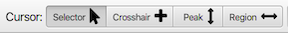

The mouse can be used in four different modes: Crosshair, Selector, Peak, Region.  The two primary modes are a **Crosshair** mode in which
crosshairs can be displayed and moved and a **Selector** mode in which items can be selected and regions can be "dragged out".  Switch between the modes by clicking the buttons at bottom of the spectrum.  The default mode is the **Selector**.

[Selector](#selector)
:  Use this mode to "drag out" view regions, and to select peak or other objects on the spectrum.

[Crosshair](#crosshair)
:  Use this mode to display crosshair cursors.  These can be used for selecting regions to expand and using them as lines to correlate the position of spectral features.

[Peak](#peak)
:  Use this mode to pick peaks by clicing the mouse over a location to pick a peak at or by dragging out a region in which peaks should be picked.

[Region](#region)
:  Use this mode to create regions in one-dimensional spectra..

### Using the Selector Cursor 

Selector mode can be used when the cursor is in the "selector" mode.
Click the arrow button near the lower left corner of the window.

**To expand the spectrum view**

Press and hold the left mouse button with the cursor at the position you want to start the expansion at. Keep the button down as you drag the crosshair to a new position. As you drag the cursor a blue box will be displayed to indicate the new region.  When you release the mouse button the window will expand to display the selected region.  Initially the blue box is drawn with dashed lines, you need to drag the box at least big enough so that the lines are solid when you release the mouse.  This requirement for dragging out at least a minimum sized region minimizes the risk of accidental expansions.  Also, if you change your mind about expanding the region you can just drag the mouse back towards the origin.  Once the box is displayed with dashed lines you can release the mouse button and no resizing will be done.

You can move the viewed spectrum region by dragging the mouse while it is positioned in the left or bottom axis regions.

**To add or adjust a spectrum region**

Spectrum regions, used for integration etc., can be added to 
1D spectra. 
Use the same protocol as above to expand the view, but press and hold
the Alt key on the keyboard while performing the actions.  If you do this in an area that doesn't overlap any previously existing regions, a new region will be added to the spectrum. If the area does overlap a region, then that region will be adjusted so the limits correspond to the selected area.
(You can also do this with the cursor in **Region** mode without needing to hold the key down, see belo)

When the region is added you'll see an integral line drawn above the 
added region.

**To select peaks**

If peak boxes are displayed on the spectrum, you can select the peaks
with the cursor in Selector mode.  Click on an individual peak box
to select it.  If this is a 1D spectrum, then click on the 
peak label drawn below the spectrum to select it.
Once selected, you can move the peak box on the spectrum
by clicking and dragging it.  You can resize the peak box by pressing
the Alt-key down before you start dragging the mouse

You can select multiple peaks by clicking and
dragging a box, as done with expansions or regions described above,
but with the Shift-key held down..
When you release the mouse button, all the peaks in the selection
box (displayed in yellow), will be selected.  As in the above modes,
if you release the mouse while the box border is drawn with dashed 
lines no action will be taken.

## Using the Crosshair Cursor 

T> NMRFx can show two sets of crosshairs.  If you're using a 1-button mouse (or the trackpad on a laptop) the mouse moves the black crosshair at first.  The red crosshair will appear if you then click at some distance away from the black crosshair. Further actions of clicking and dragging will move whichever crosshair is closest when you click.  NMRFx will recognize that you have a 3-button mouse as soon as you click with either the second or third mouse button.  Once recognized, the black crosshair will be moved when the left mouse button is down, and the red crosshair when the middle mouse button is down.

**To display the crosshairs:**

Click the left mouse button with the pointer positioned at the location
you want the first crosshair line(s) to appear.

Click the left mouse button away from the black crosshairs, or click the middle mouse button anywhere, to get the second crosshairs (red).

**Status panel displays crosshair positions**

As the crosshair lines are moved around the spectrum the status panel is
continuously updated with their positions (in PPM). 

The crosshair positions can be precisely adjusted by typing a value into
the status panel entries for each of the crosshair lines. After entering
a value, hit the Return key to move the crosshair to the new position.
This is useful to, for example, set up exact expansions of the spectrum.

**To move an existing crosshair:**

Press and hold the left mouse button with the pointer near the first
crosshair. Keep the button down as you drag the crosshair to a new
position. If you first position the pointer near the intersection of two
crosshairs lines, then both crosshairs will move. If you position the
point near a single crosshair line (vertical or horizontal), then only
that crosshair will move. Use the middle mouse button to position the
second crosshair. Note: as described above, you can initially move
both crosshairs with the left mouse button.  Once you use the middle
button, the crosshairs are black and red crosshairs are moved
with the left and middle buttons respectively respectively.

You can switch between one-button (both crosshairs move with left
button) and two-button mouse modes with key bindings.  Type c1
to switch to one-button mouse mode and c3 to switch to two button
mouse mode ("c3" because this is typically used with three button
mice)..

**Status panel displays crosshair positions**

As the crosshair lines are moved around the spectrum the status panel is
continuously updated with their positions (in PPM). The horizontal
distance (in Hz) between the two vertical crosshair lines is also
displayed. This can be useful for the manual measurement of couplings.
The crosshair positions can be precisely adjusted by typing a value into
the status panel entries for each of the crosshair lines. After entering
a value, hit the Return key to move the crosshair to the new position.
This is useful to, for example, set up expansions of the spectrum.

**Moving the crosshairs in multiple spectra (correlation)**

The crosshair in different windows automatically track each other in
what is generally an appropriate manner. No commands are required to
start correlated crosshair tracking. Crosshair correlation is dependent
on the label given to each axis of the spectrum during the referencing
process. For example, consider the case where 5 windows are open, with
axis labels as indicated below.

|Window-Name   |X-axis label   |Y-axis label  |
|------------- |-------------- |--------------|
|a             |15N            |1HN           |
|b             |13C            |15N           |
|c             |1H1            |1H2           |
|d             |1HN            |13C           |
|e             |15N            |1HN           |
|------------- |-------------- |--------------|

  : Cursor Correlation

If a vertical crosshair moves in window "a", the horizontal crosshair of
window "b" and the vertical crosshair of window "e" will move. If the
horizontal crosshair of window "a moves, the vertical crosshair of
window "d" and the horizontal crosshair of window "e" will move. The
crosshair in each window only tracks the motion of the moved crosshair
if the plot limits of the window overlap the position of the moved
crosshair. Crosshair tracking can be disabled in a window by changing
the window's axis label(s).

The mechanism by which cursors are correlated makes it important to use
a consistent scheme for labeling the various dimensions of experiments.
Also, multi-dimensional datasets should always have unique labels for
the different dimensions. A similar mechanism exists for displaying
peaks on spectra, so the need for consistent labeling of spectra, and
unique labeling within a dataset, is also necessary for the proper
rendering of peak displays. The best way to have cursors correlate and
peak markers display in an appropriate manner is to develop a consistent
labeling scheme, and stick with it.

And remember, there are two types of labels, one set with "label" and
one set with "dlabel". The former is used for things like crosshair
correlation as described here, and the later for the value that is
actually displayed on the spectrum.

### Peak 

Use the cursor in peak mode to pick peaks.  This can be done by clicking the mouse when the cursor (in Peak mode) is over a peak in the spectrum (either in 1D trace or nD contour modes). 

#### Picking traces (1D)

In 1D (trace mode), click with the cursor positioned below the top of a signal.  By default, NMRFx will search to find the highest intensity near where you picked. There must be an data-point with intensity above the cursor position.  If you hold the shift-key down while clicking, then NMRFx will pick a peak at exactly the position of the cursor (and do so even if there is not a data-point with intensity above the cursor position).

A powerful feature is to click the mouse down to the left (or right) of a group of signals and drag it to the right (or left).  A line will be drawn between the starting point and the current cursor position.  All peak signals above the line will be picked.  You can drag the mouse up and down to adjust the threshold line and watch as the picking interactively updates.  If you do this over a region that already has peaks, the existing peaks will be removed and replaced with new ones.  If the region doesn't already have peaks the new ones will be added to the existing (or newly created) peak list.

#### Picking contours (2D)

In contour mode, click with the mouse positioned near the top of a contour signal.  By default, NMRFx will find the highest intensity near where you picked and add a peak box at that position. If you hold the shift key down then NMRFx will pick a peak (and display a peak box) at exactly that position. 

You can drag a region out (click at one point, and with mouse button held down, drag the cursor to a new position.  All peaks within that region, whose intensity is above the current display level, will be picked.

### Region 

Region mode only works (currently) in trace (1D) mode.  Just click the mouse at a starting position (and with mouse button held down) drag the cursor to a new region.  You'll see lines appear to indicate the starting and (current) ending position.  When you releasethe mouse button a region will be added. An integral trace will be drawn across the top of the region and will include an integral value.  The first region you add will receive an integral value normalized to 1.0.  Subsequent regions will be scaled relative to the first.

### Trackpads and scroll mice

Use the trackpad and scroll mouse to change display level and pan
through the spectrum. Trackpad use has only been tested on a Mac, but
may work on other operating systems.

**ScrollMouse Wheel**

:   Pan display region of the spectrum up and down.

**Control-ScrollMouse Wheel**

:   Scroll the mouse wheel with control key down to increase or decrease
    the contour display level (2D) or vertical scaling (1D).

**TrackPad**

:   Two fingered-swipe on the trackpad will pan the spectrum left/right
    and up/down with the direction corresponding to the swipe direction.

**Control-TrackPad**

:   Two fingered-swipe on the trackpad in the "vertical" direction will
    increase or decrease (depending on swipe direction) the contour
    display level (2D) or vertical scaling (1D).
