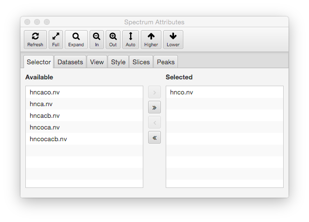
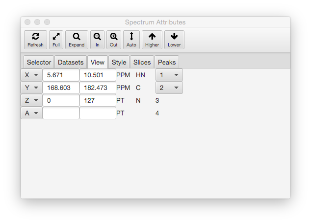
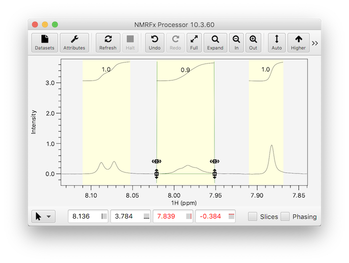
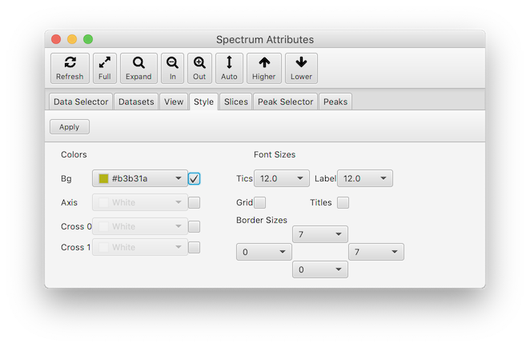
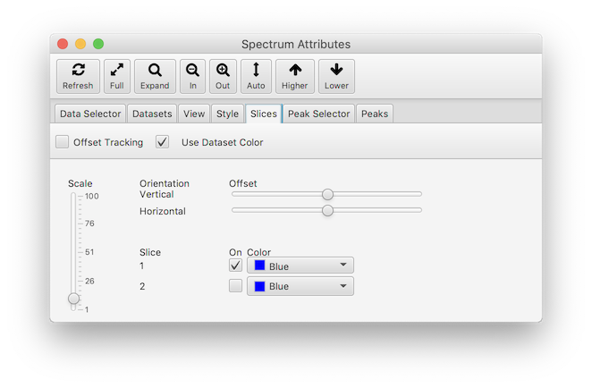
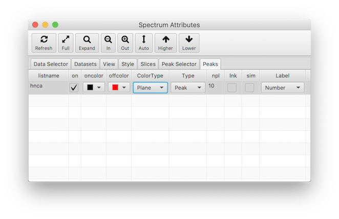

This dialog collects together a wide variety of controls for interacting
with spectral display windows. Only one window is controlled at a time
through this dialog. 

The Attributes Dialog is composed of an icon bar across the top and a
tabbed window which forms the majority of the dialog. The Icon Bar has
a subset of icons and functions of the icon bar that appears
at the top of all standard spectrum windows. 
above.  The tabbed window allows the
user to select from a series of panel controlling different aspects of
the interface. The various tapped panes that compose the Attributes
Dialog are described in the following sections.

### Data Selector Panel

The dataset selector panel is used to control which datasets are displayed in the currently active spectrum chart.  The left panel lists all datasets that are available to be added to the chart.  The right panel lists all datasets currently selected for display in the chart.  Use the buttons between the two lists to add or remove datasets from the selected display list.  The order that datasets are added to the display list determines the order in which they are drawn (there is not yet, but will be, a method to rearrange the list).  You can mix datasets of different dimensionality, but higher dimensional datasets should be listed above lower dimensional datasets.  Click the Refresh button after changing the display list to update the actual spectrum display.

### Dataset Panel

The Dataset Panel is used to control the colors and levels used to render the spectra.
Multiple datasets can be assigned to a single spectrum chart.  Each dataset is represented by a row in the Dataset Table in this panel.Most columns of the header have a menu that appears when you right click on the header.  This provides controls that can be used
to set the parameter for that column across the whole list of tables.  Most columns have at least a **unify** entry in the menu.  By setting the first rows entry to a certain value, and then choosing **unify** you will set all rows to that value.  This always applies the value in the first row to the remaining rows.  Menu entries that are specific to individual columns will be described below.

By default, the rows displayed in the table correspond the datasets that are displayed in a single, active spectrum chart.  Choosing the Scene setting above the table displays all the datasets in the entired window (technically, the JavaFX Scene, hence the name).  This is useful if you want to change values for all the datasets in the window.

The columns in the table are as follows:

dataset

:    This column contains the name of the dataset whose properties are
displayed and controlled by that row of the table.

lvl

:    This column contains the contour threshold (for 2D displays) or
vertical scale (for 1D displays).  It is adjusted by using the 
Auto, Higher and Lower toobar buttons.  You can also click on the value to activate it for editing and then type in new value.  Hit the Return key to complete editing the value and hit the Refresh button to redraw the value.  The level column header has a pop-up menu (right click).  Choose "unify" to set the level for all the datasets in the table to the level value of the first dataset.

Positive & Negative

:    The Positive and Negative column groups each contain three columns: on, color and width.  Those under
positive, control the display of 1D lines, and positive contours in 2D plots.  Those under negative control
the display of negative contours in 2D plots

On

:    The on column contains a checkbox and must be turned on (the default) for 1D lines or 2D contours to be displayed.
The pop-up menu for the **on** column has two items, **all on** and **all off**.  These
can be used to control the display status of all the datasets of the table.

Color

:    This column controls the color used for contours and 1D lines (the positive column only). 
Click on the colored rectangle to display a Color Selection
Dialog. You can choose a color from the palette that appears, or select
**Custom Color...* to get a second dialog that allows selecting a color
based on HSB (Hue, Saturation, Brightness)  or RGB (Red, Green, Blue) values, or entering a web style color descriptor
(like #ff0000).

After you choose a color in the color dialog, you'll see the colored rectangle change to
reflect the new color but you need to click the "Refresh" button to
actually refresh the spectrum with the new color.  

The color column menu has three entries:
unify, interpolate and schema.  Unify works as described above.  Interpolate will set each row
to a color that is interpolated between the colors of the first and last rows.  Schema
will display a dialog in which you can select from a variety of predefined color schema.  Interpolate and schema 
would typically be used for sequential coloring of spectra used in ligand titrations.

Width

:   This specifies the width of 1D and contour lines.  The width column has a pop-up menu with a unify choice, 
which can be used to set the width of all datasets to that of the first dataset.

#### Color Schema ####
The color schema dialog allows the user to select multiple colors that will be applied to
the datasets currently listed in the dataset table. A schema can be applied to 
the spectra by clicking the button with the schema name.  The colors used in the schema
 are those used by the [Vega](https://vega.github.io/vega/docs/schemes) visualization software.

Multiple schema are available and they are grouped in to related sets.  The **categorical**
schema consit of a set of a specific number of discrete colors.  If the number of datasets
to be colored is smaller than the number of colors, then only the required number of colors
are used.  If more datasets are to be colored than the number of available colors then,
in the current implementation, the available colors are wrapped so that the colors are reused.

The sequential and diverging schemes are used when one wants an approximately continuous range of colors.
These are useful when the datasets differ by some quantitative value such as ligand concentration.
The **snglseq** schema consist of a range of colors chosen from a single hue, whereas 
the **multiseq** and **multiseq2** schemas consist of colors of that use multiple hues.
The **diverging** schema are appropriate where there is some midpoint dataset and colors should 
diverge away from the color at the midpoint. They are generally less useful for NMR titration 
experiments.  If the number of datasets to be colored is different than the number of 
colors available in a sequential or diverging dataset then interpolation will be done
to create the specified number of colors.

The **reverse** checkbox can be used to reverse the order of the colors in the schema so 
that the first dataset gets the last color and the last dataset gets the first color in 
the schema.  Changing this setting will update the color display, but you have to
reselect a schema (click the button to the left of the scheme) to apply it to the spectra.

Sometimes the colors at the edge of the spectra may be too light or dark.  You 
can use the range slider at top of the schema window to limit the range of colors
that are used.  This is only used for the squential and diverging schema.  As with
the **reverse** button, changing the values will immediately update the schema
display, but you need to select a schema to apply the updated colors to the spectra.

### View Panel

The View panel is used to select plot regions, control which dimension
of the dataset is displayed on which axis of the plot, and control
the display of integrals and regions.  Note that some of these values can
be changed more quickly via the toolbar at the bottom of each spectrum window.  

### 

**X**

:   Press the Left Mouse button over the X to pop-up a menu of
    predefined plot limits, or enter values in the next two text fields
    to set the plot limits (in ppm) for the x (horizontal) axis. If the
    entry is followed (without an intervening space) by a "p", then the
    value is considered to be in units of points of the dataset. The
    minimum and maximum plot limits can be entered in either order.
    These values are automatically set to give the full spectrum when a
    new dataset is assigned to this window.

    The text in the third field is used as a label for the x
    (horizontal) axis. This value is used to label the axis on hard copy
    plots, is used for determining the correlation of cursors between
    different windows (see cursors, below), and is used during
    peak-picking and peak display (see Peak Picking, below). This is
    automatically set to the value assigned to the corresponding
    dimension (see below) during the referencing of the matrix, but can
    be changed by entering a new value in this field. 1(2,3,4) Hold down
    MENU over this item to select the dimension of the matrix to be
    displayed on x axis.

**Y**

:   Press the Left Mouse button over the Y to pop-up a menu of
    predefined plot limits, or enter values in the next two text fields
    to set the plot limits (in ppm) for the y (horizontal) axis. If the
    entry is followed (without an intervening space) by a "p", then the
    value is considered to be in units of points of the dataset. The
    minimum and maximum plot limits can be entered in either order.
    These values are automatically set to give the full spectrum when a
    new dataset is assigned to this window. The text in the third field
    is used as a label for the y (vertical) axis. This value is used to
    label the axis on hard copy plots, is used for determining the
    correlation of cursors between different windows (see cursors,
    below), and is used during peak-picking and peak display (see Peak
    Picking, below). This is automatically set to the value assigned to
    the corresponding dimension (see below) during the referencing of
    the matrix. 1(2,3,4) Hold down MENU over this item to select the
    dimension of the matrix to be displayed on y axis.

**Z**

:   Press the Left Mouse button over the Z to pop-up a menu of
    predefined plot limits, or enter values in the next two text fields
    to set the plot limits (in ppm) for the z (3rd Dimension) axis. If
    the entry is followed (without an intervening space) by a "p", then
    the value is considered to be in units of points of the dataset. The
    minimum and maximum plot limits can be entered in either order.
    These values are automatically set to display the full range of
    planes when a new dataset is assigned to this window. If the return
    key is pressed in the first Z field, then the second field will be
    set to the same value. The popup menu has a convenient entry to
    select the first or last plane. The spectral display window will be
    cleared prior to drawing the first plane is set. Subsequent planes
    will be overlaid on top of the first plane. To draw a single plane,
    set both values equal to each other.

**Z2**

:   Press the Left Mouse button over the Z2 to pop-up a menu of
    predefined plot limits, or enter values in the next two text fields
    to set the plot limits (in ppm) for the z2 (4th Dimension) axis. If
    the entry is followed (without an intervening space) by a "p", then
    the value is considered to be in units of points of the dataset. The
    minimum and maximum plot limits can be entered in either order.
    These values are automatically set to display the full range of
    planes when a new dataset is assigned to this window. If the return
    key is pressed in the first Z2 field, then the second field will be
    set to the same value. The popup menu has a convenient entry to
    select the first or last plane. The spectral display window will be
    cleared prior to drawing the first plane is set. Subsequent planes
    will be overlaid on top of the first plane. To draw a single plane,
    set both values equal to each other.

####Integrals and Regions

The Integrals and Regions section of the View tab can be used to
turn on and off the display of integrals and regions and
control aspects of their display.  The following figure
shows a spectrum with both displayed.  Additionally, one
integral has been selected, allowing its position to be
adjusted.

Integrals

:  Integral lines can be drawn on one-dimensional spectra.  Turn their
display on or off with the Integrals check box.
The position of the integrals display line is always a certain fraction of the
vertical display region and the start and stop of this 
can be controlled with the range slider.  The largest integral
in the spectrum will occupy the full fractional range.  Other
integral regions will be scaled proportionally to magnitude of the integral.

Regions

:  Regions (used for integration etc.) in one-dimensional spectra can
also be displayed.  Use the **Regions** check box to turn their
display on or off.  The regions will be displayed as a filled yellow
box spanning the full y-range and the x-range between the start and
stop of the region.

### Style Panel

The **Style** panel is used to control various colors, font sizes,
borders and the display of a grid and dataset titles.

Colors

:  The colors section allows you to control the color of 
the background, axes, and crosshairs.  Each attribute has
a color chooser and a checkbox.  If the checkbox is turned off
that attribute will use a color set in the main NMRFx 
preferences dialog.  If it is turned on, you can set the
color for this specfic spectrum with the color chooser.

Fonts

:  The font size for tic marks and axis labels can be selected
with these two choosers.  When you change the font size
the border will be increased to a large enough value that the
tic mark labels and axis labels are fully visible.

Borders

:  These controls set a minimum border size for the top,bottom
left and right borders (based on the position of the control).
Note: the border size may be bigger than that seledcted if 
a larger size is necessary based on the selected font sizes
(see above).

Grid

:  If this checkbox is selected, then grid lines will be drawn.
Grid lines are drawn at the position of the major tic marks (the
ones with numerical labels).

Titles

:  If this checkbox is selected, then each dataset displayed
in the spedctrum chart will have a title.
For 2D (or higher)
displays the labels will appear starting at top left of
the spectrum.  If more than one dataset is present they
will be arranged to the right of previous label.  If the
top border is large enough the titles will appear in 
the border area, otherwise they will appear just under
the top border line (inside plot area).  For one-dimensional
spectra the title will just above the spectrum baseline
at the left edge of plot.  If multiple 1D datasets are
present the vertical location depends on whether there
is a vertical offset between each dataset.  If there 
isn't, or it's too small, then a calculated vertical
displacement will be used to offset the labels so
they don't overlap.  If there is sufficient
offset between spectra, then the title will
be drawn just above each spectrums baseline.

### Slices Panel

Slices (1D vectors extracted from dataset) can be drawn in a horizontal
and vertical orientation
across the spectrum.  Slices are turned on with the checkbox in the
control region below the spectrum, and their appearance is controlled
with this dialog.  Two slices can be drawn, one at the position of
the black crosshairs and one at the position of the red crosshairs.
By default, only the first is drawn.

**Offset Tracking**

:  By default the slices are drawn with an offset to position them at the
center of the spectrum.  This offset value can be changed with the
Vertical and Horizontal Sliders.  If the **Offset Tracking** 
checkbox is selected then the slices will be
automatically positioned to be drawn so they are centered at
the current postion of the crosshairs.

**Colors**

::  By default, the slices are drawn with the color of the
dataset they are slicing.  If you turn off the **Use Dataset Color**
checkbox then the color of the slices will be controlled by
the two (one for each pair of slices) color slectors.

**Slice**

:  The checkboxes under **On** is used to turn on / off the display
of each pair (vertical/horizontal) of slices.  By default only
the first (corresponding to the black crosshair position) is drawn.

**Scale**

:   Type an entry in this box to specify the scale value at which 1D
    slices are to be drawn. This value is multiplied by a global scale
    parameter (set in the Prefs dialog, default 1e6) to generate the
    actual value that is used. The up and down arrows provide a
    convenient means to increment or decrement the scale level. Clicking
    on the up arrow raises the scale level to a value equal to the
    current level times the current value of the multiplier (the value
    in the next field). Clicking on the down arrow lowers the scale
    level to a value equal to the current level divided by the current
    value of the multiplier (the value in the next field). Whenever the
    **Level**value is changed the **Scale** value is changed to be 10.0
    times the **Level** value as this generally provides good results.

**Offset for Vertical Slices**

:   Select a value using the slider to specify the offset position(from
    0.0 to 1.0) at which X (and Z) slices are drawn. be drawn.  Only
    active if **Offset Tracking** is off.

**Offset for Horizontal Slices**

:   Select a value using the slider to specify the offset position(from
    0.0 to 1.0) at which Y (and Z2) slices are drawn. be drawn.  Only active
    if **Offset Tracking** is off.

### Peak Selector Panel

The peak selector panel is used to control which peak lists are displayed in the currently active spectrum chart.  The left panel lists all peak lists that are available to be added to the chart.  The right panel lists all peak lists currently selected for display in the chart.  Use the buttons between the two lists to add or remove peak lists from the selected display list.  The order that peak lists are added to the display list determines the order in which they are drawn (there is not yet, but will be, a method to rearrange the list).  
Click the Refresh button after changing the display list to update the actual spectrum display.

At the bottom of the Peak Selector tab is a choice box which allows you to select what peak lists are available to be displayed.  The three choices are, Matching, Compatible and All.  When set to Matching, only peak lists that have the same dimension label values (like HN, 13C, CA, N etc.) as the dataset dimensions are listed.  When set to Compatible, peak lists only need to have matching nuclei typesd (13C, 15N 1H etcv.) in order to be listed.  This allows you to select and display peak lists that don't have exactly matching names.  All lists are shown when set to All.

### Peak Panel

The Peaks Panel is used to control the colors and other options  used to render the peak lists.
Multiple peak lists can be assigned to a single spectrum chart.  Each peak list is represented by a row in the Peak List Table in this panel.

The columns in the table are as follows:

on

:    The on column contains a checkbox and must be turned on (the default) for this peak list to be actually displayed.

oncolor

:    The color of the peak annotation can be one of two values.  The choice of value is dependent 
on a property of the each individiual peak and this property is selected in the ColorType column.
The "on" color, chosen in this column, is the color used when the selected property is in the true
state.
Click on the colored rectangle to display a Color Selection
Dialog. You can choose a color from the palette that appears, or select
**Custom Color...* to get a second dialog that allows selecting a color
based on HSB (Hue, Saturation, Brightness)  or RGB (Red, Green, Blue) values, or entering a web style color descriptor
(like #ff0000).

After you choose a color in the color dialog, you'll see the colored rectangle change to
reflect the new color but you need to click the "Refresh" button to
actually refresh the spectrum with the new peak list color.  

offcolor

: The color of the peak when the selected peak property is in the "off" state.

colorby

: The property used to determine the peak coloration.  There are five choices and these
are described in the section below.

type

: The display type used for drawing the peak indicator.  The types are described below.

npl

: Only used for 3D (or higher) dimensional datasets.  If a single plane is drawn and this
value is set to 0, only peaks that are closest to the displayed plane will be drawn.  If 
set to a value greater than 0, then peaks that are no more than that  many planes above, or below, the displayed
plane will also be drawn.  For example, if set to 1, you'll see peaks that are exactly on the
displayed plane, and peaks that are one plane above and one plane below the displayed plane. 
You can distinguish, by color, peaks exactly on the display plane from those off the
plane by having the ***colortype*** field set to ***Plane***

lnk

:  Peaks can be linked to other peaks in one or more dimensions.  If this field is set to
true then lines will be drawn between the linked peaks.

sim

: Only used for 1D datasets.  If turned on, each peak will be displayed with one or more
Lorentzian lineshapes.  Multiple components are drawn if a Multiple Analysis has been done
and the peak is a doublet or higher.

label

: Each displayed peak has a label drawn next to it.  By default (Peak setting) this label is an integer
number representint the peaks unique peak identifier.

####Peak Color Types

The **ColorType** field listed above controls how the color of peaks are determined.
The following are the different modes that can be used.

Plane

: Used for 3D (and higher dimension data). True (on) if a single plane is drawn
 and the peak is exactly on it. False (off) if the peak is not one or more planes away from
the displayed plane.  This option is only appropriate if the ***npl*** setting is set to one or more.

Assigned

: True (on) if the peak is assigned.  False (off) if it is not assigned.  To be assigned
it needs to have a non-empty label for each dimension.

Error

: Peaks can have an error field that depends on whether there are adjacent peaks
found when picking.  If any dimension is not set to "++" the state will be False.

Status

: Peaks have a status value.  Peaks originally have the status value set to 0.
If the status value has been changed to a value greater than 0 the 
peaks property will be false (off) for purpose of the color choice.

Intensity

:  If the peak intensity is positive the peak will have the true (on) state.
if the peak intensity is negative it will be false (off).

####Peak Display Types
By default, peak positions are displayed with a box, but the
**Type** field listed above, allows you to choose from six 
different modes.

**Peak**

:   The peak position is annotated with a box centered on the
peak position, with a width equal to the peak bounds. A label
is placed at the corner.

**Cross**

:   The peak is drawn as a cross centered on the peak position, with
a width equal to the calculated ellipse size (see below). A label is placed at the
corner.

**Label**

:   The peak position is labeled, but a box is not drawn.  A line
is drawn from the label position to the peak center.

**Ellipse**

:   The peak position is drawn with an ellipse centered on the peak
position.  The width of the ellipse is calculated based on the 
linewidth.  The area inside the ellipse is that used for elliptical
volume integration and is a size chosen to optimize the
signal to noise ratio of the calculated integral.

**FillEllipse**

:   Same as **Ellipse** (see above), but the ellipse is filled.
Useful for drawing simulated peak lists.

**None**

: The peak position is labeled, but a box (or other annotation) is
not drawn.  Unlike, **Label** mode, no line is drawn from the label
to the peak center.

####Peak Label Types
The label that is displayed next to each peak annotation is
controlled by the Type field.  The following are the choices
that can be used.

**Number**

:   The label is the peak number.

**Label**

:   The label is composed of the assignment labels for each peak
        dimension.

**Residue**

:   The label is composed of the unique residue numbers from the
assignment label for each peak dimension.

**SglResidue**

:   The label is composed of the unique residue number preceded by
the single letter residue type.  Only applicable if the 
peak dimension labels include this.

**Atom**

:   The label is composed of the atom fields from the assignment
label for each peak dimension.

**Cluster**

:   The label is composed of the number of the cluster (as used
in RunAbout) for each peak dimension.

**User**

:   The label is composed of the user field for 
for each peak dimension.

**Summary**

:   The label is composed of a summary of information about
the peak based on shift and multiplicdity.  Only 
relevant for 1D peak lists.

**PPM**

:   The label is composed of the chemical shift of the first
dimension.  Normally used for 1D peak lists.

