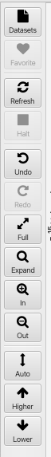

## Left (View Control) Toolbar

Datasets

:  Click this icon to get a window with the Dataset Browser which allows scanning folders for NMR datasets and presenting a table of all the datasets that are found. You can select a dataset from the table and open it.

Favorite

:    Save the current view into a favorites file (in the windows folder of a project). This only works if you have an NMRFx project active.  Saved favorites can be opened from the Spectra->Favorites menu.

Refresh

:    Refresh the current display. Useful if a display parameter has been changed, but the display didn't update automatically.

Halt

:    Halt the drawing of the current display. Especially useful for datasets that take longer than a few seconds to draw.

Undo

:  Undo the last change in spectral view (display region and levels) or peak actions.  Multiple
undo actions are stored in a history so they can be redone.  Peak actions include interactive moves of peaks and other actions done through the cursor or spectrum pop-up menu.

Redo

:  Redo the last last undone command (from the history).

Full

:    Adjust the horizontal (and vertical for 2D spectra) plot limits so the entire dataset is displayed

Expand

:    Expand the view to display the area between the crosshairs.

In

:    Zoom the display in (showing a smaller region of the spectrum).  When the mouse pointer is over this icon you can use the scroll wheel (or scroll gesture on trackpad) to zoom in or out (Scroll control works the same on both the In and Out icons).

Out

:    Zoom the display out (showing more of the spectrum).  When the mouse pointer is over this icon you can use the scroll wheel (or scroll gesture on trackpad) to zoom in or out (Scroll control works the same on both the In and Out icons).

Auto

:    Adjust the vertical scale of 1D spectra so the displayed region of the data mostly fills the vertical expanse of the plot window. Adjust the contour level of 2D spectra to be 5 times an estimate of the noise level in spectrum.

Higher

:    Adjust vertical scale (or contour level for 2D) so peaks appear higher.  When the mouse pointer is over this icon you can use the scroll wheel (or scroll gesture on trackpad) to raise or lower the scale (Scroll control works the same on both the Higher and Lower icons).

Lower

:    Adjust vertical scale (or contour level for 2D) so peaks appear lower.  When the mouse pointer is over this icon you can use the scroll wheel (or scroll gesture on trackpad) to raise or lower the scale (Scroll control works the same on both the Higher and Lower icons).

