The right hand side of a spectrum window can contain four different panes, **Processor**, **Content**, **Attributes**, and **Tools**.  Here we describe the use of the **Attributes** pane for the control of the display of spectra and peaks, including axes, color and borders.

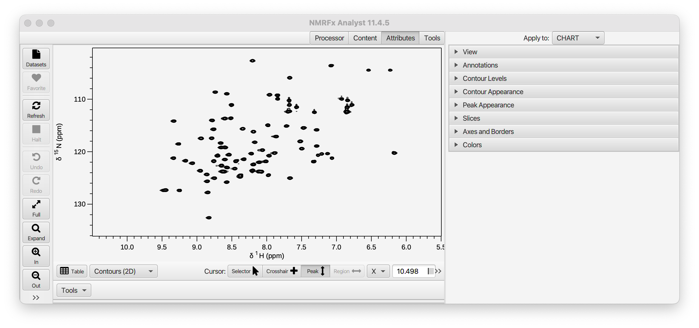

The Attributes section has the following titled panes.

[View](#view)
[Annotations](#annotations)
[Contour Levels](#contourlevel)
[Contour Appearance](#contourappearance)
[Trace Attributes](#traceattributes)
[Integrals](#integrals)
[Peak Appearance](#peakappearance)
[Axes and Borders](#axes)
[Colors](#colors)
[Slices](#slices)

---

Apply To
: NMRFx can display multiple charts in one window.  If this is set to **CHART** then changes in the attributes will apply only to the *active chart* (the last one you clicked the mouse in).  If set to *WINDOW* then changes in attributes apply to all the charts in the window.

---

###View###

Controls the overal shape of the spectrum region view.

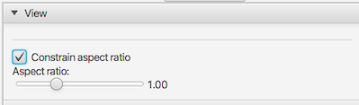

Constrain Aspect Ratio
: If turned on the then the spectrum plot area retains its aspect ratio (the ratio of width to height), no matter what the shape of window.

Aspect Ratio
: The ratio of width to height of the spectrum plot area.  The ratio is calculated with each chemical shift range of each dimension scaled by the frequency ratio of the axis's nucleus.

---

###Annotations###

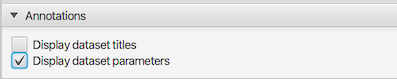

Display dataset titles
:  If this checkbox is selected, then each dataset displayed in the spectrum chart will have a title.  For 2D (or higher) displays the labels will appear starting at top left of the spectrum.  If more than one dataset is present they will be arranged to the right of previous label.  If the top border is large enough the titles will appear in the border area, otherwise they will appear just under the top border line (inside plot area).  For one-dimensional spectra the title will just above the spectrum baseline at the left edge of plot.  If multiple 1D datasets are present the vertical location depends on whether there is a vertical offset between each dataset.  If there isn't, or it's too small, then a calculated vertical displacement will be used to offset the labels so they don't overlap.  If there is sufficient offset between spectra, then the title will be drawn just above each spectrums baseline.

Display dataset parameters
: Display a summary of the datasets parameters (solvent, spectrometer frequency, sweep width, size)

---

###Contour Level###
 (only displayed for contour plots)

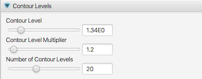

This pane only appears when the spectrum is drawn in contour mode (for two or more dimensional spectra). The parameters control the vertical scale of the contour level, number of contour lines, and the ratio of height between levels.

Contour Level (only displayed for contour plots)
: Contour lines are drawn for signal intensities higher than this value.  So lower numbers make the signals look higher.

Contour Level Multiplier
: Multiple contour lines are drawn and the height of each one is drawn at a level calculated as this value times the next lower level (starting with a contour line at the **Contour Level** value)

Number of Contour Levels
: This specifies the number of contour levels to be used.

---

###Contour Appearance###

(only displayed for contour plots)

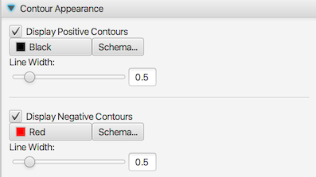

Here we describe controls for the positive contours.  There are an analogous set for negative contours.

Display Positive Contours
: Turn on or off (on by default) the display of contours for positive signals (intensities greater than 0.0)

Color Selector
: Click on this selector to bring up a dialog allowing you to specify the color for positive contour lines
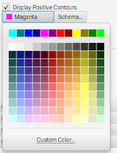

Schema
: Display the color schema tool to select a range of colors when multiple datasets are present in the window.  See the section below on [Color Schema](#schema) for information on using the schema tool.

Line Width:
: Use the slider (or text box) to specify the width of contour lines for positive signals (defaults to 0.5)

---

###Peak Appearance###

The Peak Appearance Panel is used to control the colors and other options  used to render the peak lists.

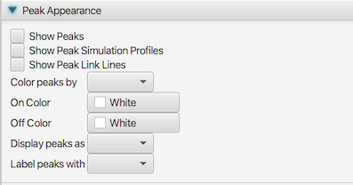

Show Peaks
: Turn on or off the display of the peak list(s) assigned to this spectrum chart.

Show Peak Simulation Profiles
: Only used for 1D datasets.  If turned on, each peak will be displayed with one or more Lorentzian lineshapes.  Multiple components are drawn if a Multiple Analysis has been done and the peak is a doublet or higher.

Show Peak Link Lines
:  Peaks can be linked to other peaks in one or more dimensions.  If this field is set to true then lines will be drawn between the linked peaks.

Color peaks by
: The color of the peak annotation can be one of two values.  The choice of value is dependent on a property of the each individual peak and this property is selected in the here.  There are five choices and these are described in the section below.

 
On Color:
: The "on" color, chosen in this column, is the color used when the selected property is in the true state. Click on the colored rectangle to display a Color Selection Dialog.

Off Color
: The color of the peak when the selected peak property is in the "off" state. Click on the colored rectangle to display a Color Selection Dialog.

Display Peaks as
: The display type used for drawing the peak indicator.  The types are described below.

Label peaks with:
: Each displayed peak has a label drawn next to it.  By default (Peak setting) this label is an integer number representing the peaks unique peak identifier.

####Peak Color Types

The **ColorType** field listed above controls how the color of peaks are determined.  The following are the different modes that can be used.

Plane

: Used for 3D (and higher dimension data). True (on) if a single plane is drawn and the peak is exactly on it. False (off) if the peak is not one or more planes away from the displayed plane.  This option is only appropriate if the ***npl*** setting is set to one or more.

Assigned

: True (on) if the peak is assigned.  False (off) if it is not assigned.  To be assigned it needs to have a non-empty label for each dimension.

Error

: Peaks can have an error field that depends on whether there are adjacent peaks found when picking.  If any dimension is not set to "++" the state will be False.

Status

: Peaks have a status value.  Peaks originally have the status value set to 0.  If the status value has been changed to a value greater than 0 the peaks property will be false (off) for purpose of the color choice.

Intensity

:  If the peak intensity is positive the peak will have the true (on) state.  if the peak intensity is negative it will be false (off).

####Peak Display Types
By default, peak positions are displayed with a box, but the **Type** field listed above, allows you to choose from six different modes.

**Peak**

:   The peak position is annotated with a box centered on the peak position, with a width equal to the peak bounds. A label is placed at the corner.

**Cross**

:   The peak is drawn as a cross centered on the peak position, with a width equal to the calculated ellipse size (see below). A label is placed at the corner.

**Label**

:   The peak position is labeled, but a box is not drawn.  A line is drawn from the label position to the peak center.

**Ellipse**

:   The peak position is drawn with an ellipse centered on the peak position.  The width of the ellipse is calculated based on the linewidth.  The area inside the ellipse is that used for elliptical volume integration and is a size chosen to optimize the signal to noise ratio of the calculated integral.

**FillEllipse**

:   Same as **Ellipse** (see above), but the ellipse is filled.
Useful for drawing simulated peak lists.

**None**

: The peak position is labeled, but a box (or other annotation) is not drawn.  Unlike, **Label** mode, no line is drawn from the label to the peak center.

####Peak Label Types

The label that is displayed next to each peak annotation is controlled by the Type field.  The following are the choices that can be used.

**Number**

:   The label is the peak number.

**Label**

:   The label is composed of the assignment labels for each peak dimension.

**Residue**

:   The label is composed of the unique residue numbers from the assignment label for each peak dimension.

**SglResidue**

:   The label is composed of the unique residue number preceded by the single letter residue type.  Only applicable if the peak dimension labels include this.

**Atom**

:   The label is composed of the atom fields from the assignment label for each peak dimension.

**Cluster**

:   The label is composed of the number of the cluster (as used in RunAbout) for each peak dimension.

**User**

:   The label is composed of the user field for for each peak dimension.

**Summary**

:   The label is composed of a summary of information about the peak based on shift and multiplicity.  Only relevant for 1D peak lists.

**PPM**

:   The label is composed of the chemical shift of the first dimension.  Normally used for 1D peak lists.

---

####Trace Attributes
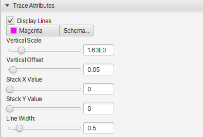

Display Lines
: Turn on and off the display of the trace (1D spectrum) with this

Color Selector
: Click on this selector to bring up a dialog allowing you to specify the color for positive contour lines

Schema
: Display the color schema tool to select a range of colors when multiple datasets are present in the window.  See the section below on [Color Schema](#schema) for information on using the schema tool.

Vertical Scale
: This controls the height of the displayed spectrum.  Smaller values result in higher peaks, and higher values lower  peaks.

Vertical Offset
: This controls the vertical offset of the spectrum as a fraction of the chart height. So a value of 0.0 puts the a signal intensity of 0 at the bottom of the chart and a value of 0.5 would put a signal of 0 intensity at the center of the chart.

Stack X Value 
: This value controls the horizontal offset of each trace in a stack plot.  With a value of 0.0 the edges of all the traces are aligned. A value of 1.0 means that each trace is shifted to the right so that it doesn't overlap the previous trace.

Stack Y Value 
: This value controls the vertical offset between traces in a stack plot.  With a value of 0.0 there is no vertical offset between traces and they are directly on top of each other.  With a value of 1.0 the vertical offset is calculated so that the each trace is offset by a fraction of the total vertical area equal to 1.0/n, where n is the number of traces.

Line Width
: Use the slider (or text box) to specify the width of the trace lines (defaults to 0.5)
---

####Integrals and Regions

The Integrals and Regions section of the View tab can be used to turn on and off the display of integrals and regions and control aspects of their display.  The following figure shows a spectrum with both displayed.  Additionally, one integral has been selected, allowing its position to be adjusted.

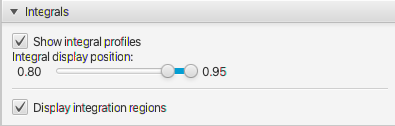

Show integral profiles
:  Integral lines can be drawn on one-dimensional spectra.  Turn their display on or off with the Integrals check box.  

Integral display position
: The position of the integrals display line is always a certain fraction of the vertical display region and the start and stop of this can be controlled with the range slider.  The largest integral in the spectrum will occupy the full fractional range.  Other integral regions will be scaled proportionally to magnitude of the integral.

Show integration regions
:  Turn the display of the integration regions on or off with this check box.  

---

### Axes and Borders

The **Axes and Borders** panel is used to control various colors, font sizes, borders and the display of a grid and dataset titles.

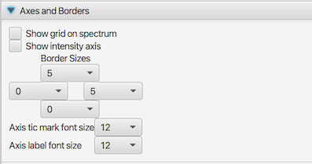

Show grid on spectrum

:  If this checkbox is selected, then grid lines will be drawn.  Grid lines are drawn at the position of the major tic marks (the ones with numerical labels).

Show intensity axis
: By default there is no intensity (y) axis on 1D (trace) spectra.  Use this check box to show the axis
Border Sizes

:  These controls set a minimum border size for the top,bottom left and right borders (based on the position of the control).  Note: the border size may be bigger than that selected if a larger size is necessary based on the selected font sizes (see above).

Axis tic mark font size
: Set the font size for the axis tic mark labels

Axis label font size
: Set the font size for the axis labels

---

###Colors###
The colors section allows you to control the color of the background, axes, and crosshairs.  Each attribute has a color chooser and a checkbox.  If the checkbox is turned off that attribute will use a default color.

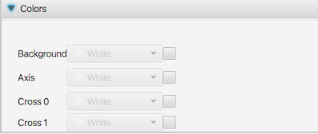

Background
: The color of the background.  If turned off, the background is transparent and the default color of the spectrum canvas shows through

Axis
: Set the color of the axis lines and labels

Cross 0
: Set the color of the primary crosshair

Cross 1
: Set the color of the secondary crosshair

---

### Slices Panel

Slices (1D vectors extracted from dataset) can be drawn in a horizontal and vertical orientation across the spectrum.  Slices are turned on with the checkbox in the control region below the spectrum, and their appearance is controlled with this dialog.  Two slices can be drawn, one at the position of the black crosshairs and one at the position of the red crosshairs.  By default, only the first is drawn.

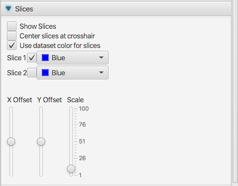

Show Slices:
: Turn this on to show slices (1D traces drawn through the contour plot).

**Center slices at crosshair**

:  By default the slices are drawn with an offset to position them at the center of the spectrum.  This offset value can be changed with the Vertical and Horizontal Sliders.  If the **Offset Tracking** checkbox is selected then the slices will be automatically positioned to be drawn so they are centered at the current postion of the crosshairs.

Use dataset color for slice
:  By default, the slices are drawn with the color of the dataset they are slicing.  If you turn off the this checkbox then the color of the slices will be controlled by the two (one for each pair of slices) color selectors.

Slice 1
: Turn on or off the display of slice number 1 (two slices are available).  If **Use dataset color** is turned off then you can control the color of this slice with the color selector.

Slice 2
: Turn on or off the display of slice number 2 (two slices are available).  If **Use dataset color** is turned off then you can control the color of this slice with the color selector.

Scale
: Use the slider to control the scale of the slider.  Larger values will result in higher slices (slices are also get bigger with smaller contour levels)

X Offset
:   Select a value using the slider to specify the offset position(from 0.0 to 1.0) at which vertical slices are drawn. be drawn.  Only active if **Center slices at crosshair** is off.

Y Offset
:   Select a value using the slider to specify the offset position(from 0.0 to 1.0) at which horizontal slices are drawn. be drawn.  Only active if **Center slices at crosshairO** is off.

---
#### Color Schema ####
 
The color schema dialog allows the user to select multiple colors that will be applied to the datasets currently listed in the dataset table. A schema can be applied to the spectra by clicking the button with the schema name.  The colors used in the schema are those used by the [Vega](https://vega.github.io/vega/docs/schemes) visualization software.

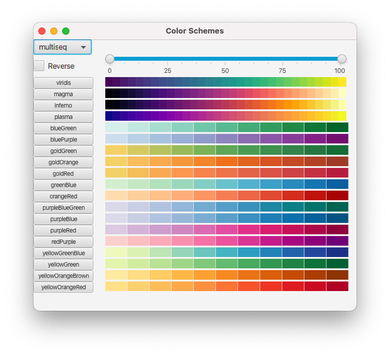

Multiple schema are available and they are grouped in to related sets.  The **categorical** schema consist of a set of a specific number of discrete colors.  If the number of datasets to be colored is smaller than the number of colors, then only the required number of colors are used.  If more datasets are to be colored than the number of available colors then, in the current implementation, the available colors are wrapped so that the colors are reused.

The sequential and diverging schemes are used when one wants an approximately continuous range of colors.  These are useful when the datasets differ by some quantitative value such as ligand concentration.  The **snglseq** schema consist of a range of colors chosen from a single hue, whereas the **multiseq** and **multiseq2** schemas consist of colors of that use multiple hues.  The **diverging** schema are appropriate where there is some midpoint dataset and colors should diverge away from the color at the midpoint. They are generally less useful for NMR titration experiments.  If the number of datasets to be colored is different than the number of colors available in a sequential or diverging dataset then interpolation will be done to create the specified number of colors.

The **reverse** checkbox can be used to reverse the order of the colors in the schema so that the first dataset gets the last color and the last dataset gets the first color in the schema.  Changing this setting will update the color display, but you have to reselect a schema (click the button to the left of the scheme) to apply it to the spectra.

Sometimes the colors at the edge of the spectra may be too light or dark.  You can use the range slider at top of the schema window to limit the range of colors that are used.  This is only used for the sequential and diverging schema.  As with the **reverse** button, changing the values will immediately update the schema display, but you need to select a schema to apply the updated colors to the spectra.

