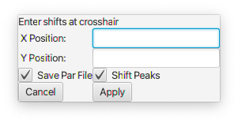

Hold down MENU (the right mouse button) within a spectral display window to display this menu.

### View

Expand
: Expand the view to the region contained within the crosshairs

Full
: Change the view to show the entire spectrum

Zoom In
:  Zoom the view in to show a smaller region of the spectrum

Zoom Out 
:  Zoom the view out to show a larger region of the spectrum

Pop View Out
: Create a new top-level spectrum window containing this dataset and displayed with the same view region

###Peaks

Adjust Labels
: Position peak labels (on 2D contour displays) to minimize the overlap of the labels with each other.

Tweak Selected
:  Move the positions of any selected peaks so they are located over a neaerby maximal intensity

Tweak All Lists
:  Move the positions of all peaks so they are located over a neaerby maximal intensity

Add Duplicate PeakList
: Create a new peaklist that has the same peak data as another list, but is associated with the dataset in the current spectrum.  This is useful if you want to start from an existing list and then shift peaks to align with the position in a new spectrum.  You'll be prompted for the origin list and for a name for the new list.

#### Peaks->Fit

Fit
: Do a lineshape fit of peaks to the dataset.  If any peaks are currently selected then only those peaks will be fit.  Otherwise all peaks in the list currently displayed will be fit.

Fit Clustered Column
: Fit peaks in a column of peaks (linked together on the dimension displayed on the first axis).  All peaks in each column will have the same chemical shift and linewidth on the dimension on the x axis, but differeing shfits and widths on the y-axis dimension.

Fit Clustered Row
: Same as the above, but peaks linked into rows

Fit Planes
: Fits peaks in pseudo-3D spectra so each peak is fit to the data on all the planes.  A unique intensity is used for each plane, but the single peak has chemical shifts and linewidths that are fit jointly to data on all planes.

Fit Planes (EXP)
: Fits peaks in pseudo-3D spectra so each peak is fit to the data on all the planes.  Each single peak has chemical shifts and linewidths that are fit jointly to data on all plane, but the intensity is on each plane is fit to an exponential decay.  The dimension used on the planes must have a set of values associated with it that contain the relaxation delays.

Fit Planes (ZZ)

Fit Planes (ZZ Intensity)

### Reference

Set Reference...
: Set reference values at the current crosshair position

Enter a reference value for the X and Y (if 2D) positions and click **Apply**

Shift Reference
: Position the red crosshair at the position you want to move and the black crosshair at the chemical shift positions that you want the red position to be changed to.  Often you'll be positioning the red crosshairs on a peak in a spectrum you want to adjust, and the black crosshairs to overlap with the position of the corresponding peak in a spectrum that is properly referenced.

Adjust Diagonal
: Position the primary (black) crosshair on a peak that should be on the diagonal and choose this menu item.  The reference value of the y-axis will be changed so that the crosshair position has the same chemical shift on the two axes.

Shift Peaks
: Move peaks so that the position at the secondary (red) crosshair has the chemical shift of the  position of the primary (black) crosshair.

Undo
: Undo the last reference change

Write Reference Parameters
: Write out a parameter file for the dataset so new reference values are saved.

### Peak Linking

Link Selected Column
: Link a set of selected peaks using the dimension displayed on the x-axis

Link Selected Row
: Link a set of selected peaks using the dimension displayed on the y-axis

Unlink Selected
: Unlink all selected peaks

Unlink Selected Column
: Unlink all selected peaks using the dimension on the x-axis

Unlink Selected Row
: Unlink all selected peaks using the dimension on the y-axis

Link Four Peaks (ZZ)
: Link four peaks together that represent a set of exchanging peaks used in zz-exchange spectroscopy 

### Extract Slice / Projection

Project
: Calculate 1D projections on both axes of a 2D spectrum and display in the borders

Remove Projects
: Remove the projections from the borders and resize the borders back to smaller values 

Extract-X
: Extract a vector parallel to the x-axis at the position of the primary (black) crosshair and display it in a new window

Extract-Y
: Extract a vector parallel to the y-axis at the position of the primary (black) crosshair and display it in a new window

Extract-Z
: Extract a vector parallel to the z-axis at the position of the primary (black) crosshair and display it in a new window
