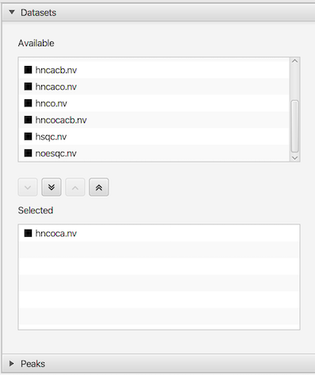
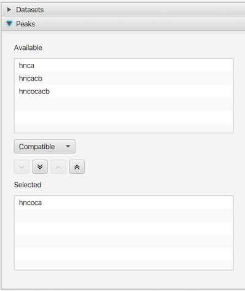

There is essentially no limit to the number of datasets and peak lists that can be displayed within a single spectrum chart window.  The Content panel can be selecting the **Content** button (in the set of Processor, Content, Attributes and Tools) at top right of spectrum area.

The Content panel has two sections, one for Datasets and one for Peaks.  They can be used to select which of currently open datasets or peak lists will be displayed in the active chart.

### Datasets Panel

The dataset selector panel is used to control which datasets are displayed in the currently active spectrum chart.  The top panel lists all datasets that are available to be added to the chart.  The bottom panel lists all datasets currently selected for display in the chart.  Use the buttons between the two lists to add or remove datasets from the selected display list.  The order that datasets are added to the display list determines the order in which they are drawn  list).  You can click and drag (with mouse button held down) dataset entries to different positions in the list (changing the order in which they are drawn).  You can mix datasets of different dimensionality, but higher dimensional datasets should be listed above lower dimensional datasets.  Each entry in the list has an icon to the left of the dataset name.  The color of the icon indicates the color used for drawing that dataset.

### Peak Panel

The peak selector panel is used to control which peak lists are displayed in the currently active spectrum chart.  The top panel lists all peak lists that are available to be added to the chart.  The bottom panel lists all peak lists currently selected for display in the chart.  Use the buttons between the two lists to add or remove peak lists from the selected display list.  The order that peak lists are added to the display list determines the order in which they are drawn.  Click the Refresh button after changing the display list to update the actual spectrum display.

Between the top and bottom panels of the Peak Selector is a choice box which allows you to select what peak lists are available to be displayed.  The three choices are, Matching, Compatible and All.  When set to Matching, only peak lists that have the same dimension label values (like HN, 13C, CA, N etc.) as the dataset dimensions are listed.  When set to Compatible, peak lists only need to have matching nuclei types (13C, 15N 1H etc.) in order to be listed.  This allows you to select and display peak lists that don't have exactly matching names.  All lists are shown when set to All.
