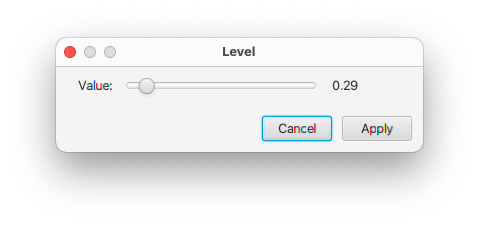

The Dataset Table can be displayed by clicking the **Table** icon at the left side of the status bar (bottom of spectrum window). It is primarily used when you have multiple datasets displayed in a single chart, though it can be used to update spectrum attributes of a single window (as an alternative to some features of the **Attributes** panel).  In this documentation page the basic use of the **Datasets Table** will be described.  The table also is used in the **Scanner Tool** that adds additional controls and table columns for analyzing multiple datasets (or rows of a pseudo-2D dataset) as might be done in, for example, metabonomics research.  The table will appear in the lower portion of the window and the height of the area used by the table can be adjusted by sliding the divider bar between the table area and the main area of the window.

Multiple datasets can be assigned to a single spectrum chart.  Each dataset is represented by a row in the Dataset Table. 

Two controls are available at the left side of the table:

Reload
: If you change the datasets displayed in the chart using gui tools like the **Content** panel, this **Dataset Table** may not be updated.  Use this **Reload** button to update the table so the rows in the table are consistent with the datasets in the chart.

Sel.Mode
: Use this control to determine what datasets in the table are shown.  The three modes are:

    ALL
    : Show all the datasets are shown

    HIGHLIGHT
    : Show all the datasets, but highlight the dataset(s) corresponding to the currently selected rows.  Datasets are highlighted by drawing them with a wider line width

    ONLY
    : Only show the datasets that are currently selected in the table.

#### Table columns

Columns of the header that have an icon with three bars (Lvl, Offset etc.) have a menu that appears when you right click on the header.  This provides controls that can be used to set the parameter for that column across the whole list of datasets.  Most columns have at least a **unify** entry in the menu.  By a selected rows entry to a certain value, and then choosing **unify** you will set all rows to that value.  Some column menus have an **Adjust** item.  Selecting that will display the following control:

You can use the slider to adjust the value of the currently selected row(s).  The spectrum will update as you change the value.  If you click **Cancel** the spectrum will be restored to have the original value.  If you click **Update** the display of the selected row(s) will be updated to the new value.

Menu entries that are specific to individual columns will be described below.

dataset
: This column contains the name of the dataset whose properties are displayed and controlled by that row of the table.

row
: The row in table (and in dataset if it has multiple rows)

lvl
: This column contains the contour threshold (for 2D displays) or vertical scale (for 1D displays).  The column header menu has **Unify** and **Adjust** entries that function as described above.

Offset
: The vertical offset of one-dimensional traces from the bottom of the chart as a fraction of the chart height.  The value ranges from 0.0 to 1.0.
The column header menu has **Unify** and **Adjust** entries that function as described above and a **Ramp** entry.  The latter entry will change the offset so values for the rows are interpolated between 0.0 and 1.0

CLM
: The contour level multiplier (ratio of height of a displayed contour to the next lower contour).  The column header menu has **Unify** and **Adjust** entries that function as described above.

Positive & Negative

:    The Positive and Negative column groups each contain two columns: on and color.  Those under positive, control the display of 1D lines, and positive contours in 2D plots.  Those under negative control the display of negative contours in 2D plots

On

:    The on column contains a checkbox and must be turned on (the default) for 1D lines or 2D contours to be displayed.  The pop-up menu for the **on** column has two items, **all on** and **all off**.  These can be used to control the display status of all the datasets of the table.

Color

:    This column controls the color used for contours and 1D lines (the positive column only).  Click on the colored rectangle to display a Color Selection Dialog. You can choose a color from the palette that appears, or select **Custom Color...* to get a second dialog that allows selecting a color based on HSB (Hue, Saturation, Brightness)  or RGB (Red, Green, Blue) values, or entering a web style color descriptor (like #ff0000).

After you choose a color in the color dialog, you'll see the colored rectangle change to reflect the new color but you need to click the "Refresh" button to actually refresh the spectrum with the new color.  

The color column menu has three entries: unify, interpolate and schema.  Unify works as described above.  Interpolate will set each row to a color that is interpolated between the colors of the first and last rows.  Schema will display a dialog in which you can select from a variety of predefined color schema.  Interpolate and schema would typically be used for sequential coloring of spectra used in ligand titrations.
