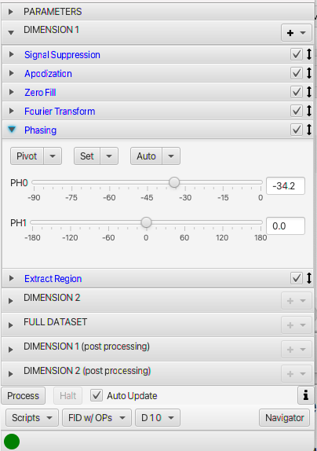

The Processor window appears automatically when you open an NMR dataset and can also be displayed by clicking the **Processor** button in the toolbar. This part of the GUI is used for configuring and executing processing scripts. It is divided into four tabs, dedicated to setting processing parameters, adding and customizing processing operations, reading/writing and executing processing scripts, and scanning directories for NMR datasets and processing multiple files with one script. 

Processing is normally triggered, after setting up appropriate parameters and a script, by clicking the **Process Dataset** button at the bottom of the Processor window.  This will process the dataset using the current script. The processing will use the script as it is currently displayed in the Script tab. You can edit the script first to change it from what was generated from the operations and parameters, but note that if you switch to another tab, and back to the Scripts tab, your changes will be lost as the script will be regenerated automatically. During processing an indicator at the bottom of the window will display the progress of processing.  If processing is completed successfully the elapsed time will be displayed at the bottom of the window (next to status circle).  If an error occurred the status circle will be red, and an error message will be displayed next to it.

The Processor can be set, by selecting the **Auto Update** checkbox to automatically process the dataset when any processing operation is modified.  This allows rapid feedback of the effect of the change, but is only feasible if the dataset is small enough that processing can be completed rapidly (ideally 1sec or less).  Note that this is an experimental feature.

Controls at the top of the processor can be used to change the active dimension and whether or not the processed multidemensional dataset (.nv file) is displayed.

Dimension

:    Sets the dimension of the dataset used for data, parameter and operation display. NMRFx Processor is capable of extracting a vector along indirect dimensions so that one can see and observe the effect of processing operations not only on the directly detected FID, but also on indirectly detected FIDs. At present, this is only working correctly for 2D datasets, but should work correctly for higher dimensional spectra in a forthcoming release. A special 2,3 dimension is available with 3D datasets for setting operations that operate on planes. This is used for processing of non-uniform sampling datasets. Operations (ISTMATRIX) specified for this dimension are applied after the 1D operations are done on the first dimension and before the 1D operations done on the second and higher dimensions.

View

:    Switches between viewing the FID or processed dataset (for multidimensional datasets).
