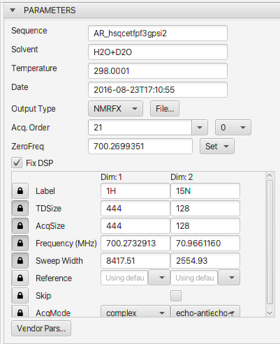
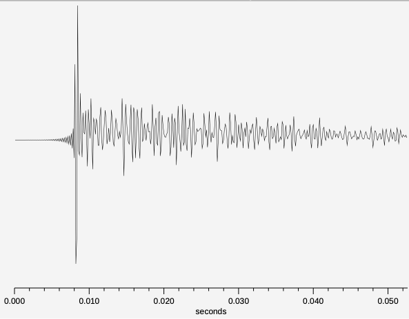
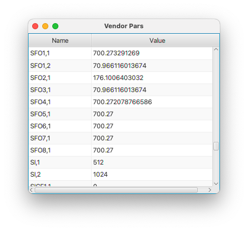

Parameters used for controlling processing and referencing of each dimension. Some parameters can be changed, but some are currently (for example, Solvent or Temperature) only used for display.

: 

The top part of the parameters panel include values that apply to the entire dataset.

Sequence
: The pulse sequence used for acquisition

Solvent
: The solvent that the sample is in

Temperature
: The temperature of the sample (as given by a parameter in the vendors parameter file, this may not be the actual or exact temperature of the sample)

Date
: The date the sample was acquired in the format year-month-day**T**hour::minutes::seconds

Output Type
: The format used for the output file (spectrum). NMRFx Analyst can output data in the formats used by NMRFx/NMRViewJ, SPARKY (UCSF) and SpinIt.  The default format is the native format of NMRFx.

File...
: When you open a dataset (FID file) for processing you will be prompted for the name of the file to use. The default value for the name is set when NMRFx opens an FID. It checks in the directory for an existing processing script, in which case it uses the dataset name in that script, or existing datasets, in which case it uses the name of the newest dataset. You can use this button to open a dialog in which you can change the name of the dataset that will be used (so, for example, you can process the same FID into different dataset files using different processing options).

Acq. Order
:    Multidimensional NMR datasets are normally acquired by collecting a series of FIDs at a combination of incremented time and phase values. The acqOrder parameter indicates the order in which these values are incremented and having the correct value can be important for processing of datasets with three or more dimensions. Three dimensional, Agilent datasets are typically acquired with an order of p1,p2,d1,d2 (array parameter set as phase2,phase)or p2,p1,d1,d2 (array parameter set as phase,phase2). Bruker datasets are typically acquired as p1,d1,p2,d2. The software attempts to figure out what acquisition order was used, but modified pulse sequences can generate acquisition orders that are not correctly reflected in parameter values.
As an alternative to using the full description (like p1,p2,d1,d2) you can use shortcuts for the different orders.  For example, Bruker pulse programs can have an *acqseq* parameter.  For a 3D experiment this would typically be "321" (equivalent to "p1,d1,p2,d2"), but might be set to "312" (equivalent to "p2,d2,p1,d1").  You can enter this value (312 or 321) in the acqorder field.   Varian/Agilent systems have an array parameter that specifies the order which the phase values  (used, for example, in hypercomplex data) are incremented.  For a 3D dataset these could be set to "phase,phase2" in which case you could specify an acqorder of "12", or "phase2,phase", in which case you could specify "21".

ZeroFreq
: The recommended way to reference spectra is to use chemical relative to the proton frequency of TSP (or DSS for aqueous solutions).  This is done regardless of the nuclei under investigation.  A table of frequency ratios is used to translate the proton frequency at 0 ppm to 0 ppm for the nucleus used (which may be the directly detected nuclei or an indirect nuclei in a multidimensional experiment.  This zerofreq value is calculated from spectromter values as a default.  Adjusting the reference (see below) during processing will update it to a calculated value based on the specified reference. 

Set
: This menu has too options.  Selecting **Set from lock** will use spectrometer parameters to calculate the zero frequency.  Selecting **Input** allows you to enter a value into the field.  For example, you might collect a proton experiment and determine the zero frequency, and then copy and paste that into the field to reference a carbon experiment.

FixDSP
:  If you're in a hurry, ignore the following and if the "fixdsp" checkbox is present, turn it on and off and see which way gives your processed direct dimension FID a better baseline. Use that setting. If you're curious about what it does, read on.
 NMR spectrometers need to implement some method to filter out signals with frequencies outside of the desired spectrum width. On modern NMR systems this is typically done with a software algorithm implemented in a digital signal processor (DSP). These algorithms conventionally generate a new data point in the filtered FID, by taking a weighted combination of the original data points that are at earlier and later times than that corresponding to the new point. At early time points, there aren't enough acquired data points for all the filter coefficients and some adjustment must be made in the algorithm.
Bruker systems seem to deal with this by providing the filtering algorithm with zeros for the unmeasured values. This leads to the generation of an output FID that has a region of increasing intensity at its beginning whose length is related to the so-called group delay of the filter. These FIDs require special processing. 
: 
:  Simply removing the data points in this region will result in a processed spectrum that has significant baseline artifacts. Most dramatically, "smiles" or "frowns" at the edges of the spectrum are observed, but more importantly a broad curvature across the entire baseline can be present. We provide several methods for correcting for the group delay of the filter. If the "fixdsp" button is checked, then an algorithm is used to remove this region in a way that generally preserves a good baseline. If the "fixdsp" button is not checked then the FID is left unchanged until the Fourier Transform is performed. At that time an alternative algorithm is applied to correct it. Most operations that can be used before the FT have been modified to recognize and alter their actions based on whether the group-delay region is present or not. Finally, there is a specific operation, BZ, that can be inserted in the processing operation list. It provides several optional methods and parameters to deal with this issue. 
:  Agilent systems deal with the lack of data points before time zero by padding the data with estimated (rather than zeroed) values and generating a final FID that appears as a conventional FID. No special processing is needed and the fixdsp control is not displayed with Agilent datasets. 

####Dimension Parameters

The lower section of the Parameters panel is used to display and set parameters that are specific to each dimension.  There is a column of parameters for each dimension. Each row has lock icon at left.  If locked the values are the values read from the parameter file and they will not be added as commands to the Python processing script.  Most parameters are locked by default so the user doesn't accidentally change them, but *Label*, *Reference*, *Skip* and *AcqMode* are unlocked by default.

Label
: The label that will be used for the processed dataset on this dimension.  Labels are not just aesthetic values, but are used when multiple datasets are present.  Correlation of crosshair positions across multiple charts is based on the dataset label.  So for example, moving a crosshair on an axis with the label 15N will result in positioning of the crosshair on the axes with that same label in other charts.  Similarly, NMRFx uses the labels to decide whether a peak list can be properly displayed on a chart.  Labels can be changed after processing, but it is always easiest to have a consistent method of labeling axes and set them during processing.

TDSize
:  Set time domain size that should actually be used.  Normally set to a value less than or equal to the acqsize value. Only the size for the indirect dimensions can be changed.  Specifying a value of 0, or an empty value indicates that the actual acquired size should be used.  Useful if you want to see what the processed data would be like if fewer data rows were acquired, or if there is some corruption of data (by changes to sample or fault in instrument) after a certain point.

AcqSize
:  Set acquired size. This is not normally needed, but might be useful if the experiment did not run to completion and you need to specify the number of rows of data that were actually acquired.  Only the size for the indirect dimensions can be changed.  Specifying a value of 0, or an empty value indicates that the actual acquired size should be used.

Frequency (MHz)
: The spectrometer frequency for this dimension

Sweep Width (Hz)
: The sweep width for this dimension

Reference
: Use this entry to change the referencing.  It is always best to get the referencing correct during processing if possible.  If the field is left empty then the reference value for the dimension will be calculated based on the parameter values in the dataset.  Indirect dimension referencing is generally done by using the zero frequency value calculated and multiplying by the frequency ratio appropriate to the nucleus.  Each dimension entry has a menu from which preselected options can be chosen.  You can choose to set the chemical shift (ppm) at the center of the spectrum, the chemical shift at the position of the crosshair, or the specify a nucleus to use for indirect ratio referencing.

Skip
: If this checkbox (only present for the second and higher dimensions) is selected then this dimension will be skipped during processing.  In that case a 3D dataset would, for example, be processed as a 2D dataset.

AcqMode
: This parameter is used to set the acquisition mode used for this dimension.  The first dimension is normally Complex, but the indirect dimensions have various options.  The correct mode is normally set by NMRFx after examining the acquisition parameters, but pulse sequence can be written such that the acquisition mode used is inconsistent with the parameter values.  In those cases the user will need to set the mode here.

    hyper
    : HyperComplex

    hyper-r
    : HyperComplex (but negate the imaginary values)

    echo-antiecho
    : Echo-Antiecho: Real values are the first row real values minus second row real values

    echo-antiecho-r
    : Echo-Antiecho: Real values are the first row real values plus second row real values

    array
    : The dimension should not be processed (Fourier transformed). It is an array (relaxation delay etc.)

    sep
    : The dataset doesn't have a pair of acquisitions for each time point.  Use the real and imaginary mode and the do a  magnitude mode calculation

:    Datasets collected in echo-antiecho mode require taking pairs of FIDs and creating a new pair by addition and subtraction of the original FIDs. This is done during processing using the TDCOEF operation. Selecting this flag effects only the display of indirect FIDs (dimension 2 and greater) so that you can see what will happen during processing. It does not, in the current implementation, change any processing operations.

####Vendor Pars

Click the **Vendor Pars** button to display a table of all the parameter names and values in the vendor parameter files.

: 
