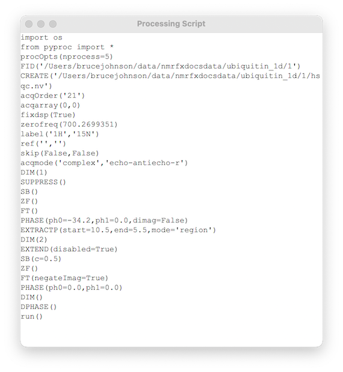

Display, edit and invoke the processing script. The script is automatically changed to reflect operations and parameters that have been selected whenever you select this tab. The **File** menu has options for opening and saving scripts.

Show Script
: Display the Python script that implements the reference values and operations.
    

Auto Generate
: Examine the dataset parameters and generate an appropriate set of processing operations.

Auto Generate (Arrayed)
: Examine the dataset parameters and generate an appropriate set of processing operations appropriate to an arrayed (pseudo-2D or pseudo-3D) experiment. This command is useful as sometime s it is not possible to tell from the dataset parameters if the experiment is an arrayed experiment.

Open Default

:    Look for a file named *process.py* in the directory containing the currently opened FID.  This should only be done if a dataset is already opened. The script will be analyzed and the operation list and reference values for each dimension will be updated and then the displayed script will be updated. The FID and CREATE operations will be changed to be consistent with the currently opened dataset (and will therefore be changed from what was in the original script file).

Open...

:  Display a file dialog with which you can choose a particular processing script to open.

Save

: Save the current script into a file named *process.py* in the directory containing the currently opened FID.  Note: the script will be automatically saved with the name "process.py" in the directory containing the FID file when you click the process button. You can use this button if you want to save the script without doing the processing.

Save As...

:    Save the script to a file.  Use this button to explicitly save the script to a different location and name and name than the default (*process.py* in the FID directory).

Load Operations...

:  Load a text file containing operations.  This is not a Python script, but a simple list of operations as they would appear in the Operations List tab.  The operations in the file can leave off the parentheses if there are no optional arguments.  So you could have an entry like "SB()" or "SB".  The operations in the file will be appended on to whatever operations are currently displayed in the Operations List tab.  This is partiularly useful for loading in commands to generate and process a simulated FID.

Save Operations...

:  Save the current list of operations (in the Operations List tab) to a file.  Choosing this operation will display a File browser so you can choose a location and file name.  Since the operation file is not a Python script it is best to give it an extension like ".txt" rather than ".py".

