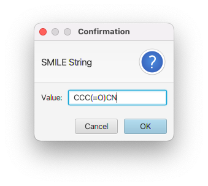

NMRFx Analyst applications are often about studying molecules, so it's not surprising that you can use it to keep track of information about your molecule.  NMRFx Analyst supports the use macromolecules like proteins and RNA and the use of small molecules (including ligands of macromolecules). But how do you get all those bonds and atoms into the program where you can do something useful with them. Files containing moleculear structures are generally input through the **Molecule->File** menu or (for macromolecular sequences) additionally through the **Sequence GUI** tool.

### Reading small molecule files 

#### mol, sdf or mol2 files

NMRFx can read files in these three formats containing one (mol or mol2) or multiple molecules (sdf) files.  Just use the corresponding **Molecule>File** item (Mol for .mol and .sdf, Mol2 for .mol2 files)

#### SMILES
[SMILES](https://en.wikipedia.org/wiki/Simplified_molecular-input_line-entry_system) is a format that describes the molecular connectivity (atomic elements and the bonds that connect them) in a simple text string.  You can enter a molecule in SMILES format using the **Molecules->Input SMILES** menu item or by reading a file containing SMILES strings.

If you use the GUI input you'll be prompted to enter a SMILES string, and then a name for the molecule.

If you read a file containing SMILES strings you can import multiple molecules.  Each line of the file should have one or two entries separated by tab characters (if there are two items).  If there are two items then the first item is used as a molecule name and the second item is parsed as a SMILES string.  If there is only one item, then it is parsed as a SMILES string and a name is automatically generated from the file name and an incremented index for each line.

### Reading macromolecular sequences

####Sequence File
Macromolecules like proteins, RNA and DNA,  are polymers of a small number of standard residues so all you need to do is give NMRFx Analyst a list of the names of the monomers. The simplest format for this information is just a text file containing the names of the monomers. To read the file, use the **Molecules -> File ->  Read Sequence**  menu item.  This will read the molecule in, and setup up some information within NMRFx Analyst so that when you save a "STAR" file (explicitly or as part of a project) the molecular structure will be saved as well. That way, you only need to explicitly read the molecule in once.

The entries in the file are the three letter names of the amino acids, and one or two letter names for nucleotides. For DNA nucleotides, the name has a first letter of "d" to distinguish it from RNA.

    GLY
    ALA
    MET
    ASP
    SER
    LYS
    THR

Each line can have a residue number as well as the residue name

    GLY 1
    ALA 2
    MET 3
    ASP 4
    SER 5
    LYS 6
    THR 7

Lines without numbers continue incrementing from the number of the previous residue's number.  So this file would have residues with numbers 10, 11, 12,13,16,17,18

    GLY 10
    ALA 
    MET 
    ASP 
    SER 16
    LYS 
    THR 

By default the molecule name used within NMRFx Analyst is derived from the name of the sequence file. What if you want your file named myfavoritemoleculein2006.seq, but want to use a simpler name within the program, like Fred? Just put a name for the molecule in your sequence file. To do this you should include a molecule line at the beginning of the sequence file. This line should have two fields, the first should read "-molecule" and the second should be the name of the molecule. Two additional special lines can also be added to further define the molecule.  The "polymer" and the "coordset" fields lines have the same format as the molecule line, that is "-polymer" or "-coordset" followed by the name. NMRFx Analyst will use them to allow multiple polymer and coordset entries. Think of the polymer as being a unique amino acid (or nucleic acid) sequence. The coordset corresponds to what X-ray crystallographers refer to as an assymetric unit. A homodimer would have one polymer, and two coordsets.

Ligands can be specified in the ".seq" file with a line like "-sdfile fileName.sdf". The file specified with the name must an ".mol" or ".sdf" file and must be in the same directory as the ".seq" file.

Here are some examples of sequence files

Simple sequence
: met
 ala
 asn
 glu
 lys

Sequence starts at "5"
: met 5
 ala
 asn
 glu
 lys

Sequence with breaks    
: met 5
 ala
 asn 8
 glu
 lys
 thr
 his 15
 arg
 thr

RNA sequence
: G  
  G  
  C  
  A  
  U  
  C  

Sequence with entity names 
: -molecule fred
 -polymer chainA
 -coordset mono1
 met 5
 ala
 asn
 glu
 lys

Heterodimer
:-molecule mymol
 -polymer poly1
 -coordset A
 met
 ala
 asn
 glu
 -polymer poly2
 -coordset A
 val
 asp
 arg

Homodimer
:  -molecule mymol
 -polymer poly1
 -coordset A
 -coordset B
 met
 ala
 asn
 glu

Polymer with ATP ligand
: -molecule atpBinding
 -polymer chainA
 -coordset A
 -sdfile atp.sdf
 met
 ala
 asn
 glu
 lys   

DNA with negative resnum
: -molecule quad
 da -2
 dt
 dg 1
 dc
 dg

####PDB Files

What if you already have a PDB file and don't want to be bothered writing a sequence file. Not too worry, you can read the PDB file
directly with the **Molecules->File->Read PDB** menu item.  If you use this command, then NMRFx Analyst figures out what the residue sequence is from the PDB file, and then loads the appropriate residue topologies from NMRFx Analyst's own residue library. The resulting atoms and bonds should be the same as if you had read a sequence file with the same sequence as the that in the PDB file. Because of this, the atom names may not be exactly the same as what's in the PDB file. 

If instead, you use the c**Molecules->File->Read PDB XYZ** menu item, then NMRFx Analyst will use the exact atoms that are in the PDB file. In this case NMRFx Analyst figures out the bonding based on inter-atomic distances and it may not get the bonding exactly right.

If you have a molecular structure loaded already, but want to update the atom coordinates with those in a PDB file then you can use the c**Molecules->File->Read Coordinates** menu item. NMRFx Analyst will set the coordinates of atoms in the already loaded molecule to be the same as those in the PDB file.  Only atoms whose name exactly matches the name of an atom in the file will have their coordinates set.

### Sequence Editor

You can also enter a molecular sequence directly within NMRFx without loading a file. Just use the **Molecules->Sequence Editor** menu item to display a sequence editor. Enter a **Type** (Protein, RNA, DNA),  molecule name, a chain name (defaults to A) then enter a sequence using one letter codes. You can have spaces and line-breaks in the sequence.  Then click **Add Entity** to add a polymer chain with that sequence.  You can do this multiple times to add multiple chains to the molecule.

### Topology and Coordinates

The Topology from Sequence commands (either reading a sequence file, reading the sequence from a PDB file, or using the Sequence Editor) just generate molecular topology information within NMRFx Analyst. (Whats topology? Just the names of the atoms, and what atoms are bonded to what other atoms.) There is no information about where in space (not to mention time) they are. You can have your topology and coordinates too (if you know what they are). If you've already generated a topology and want to add coordinates use the Molecules \> Read Coordinates \> PDB File menu command. The above two methods that use PDB files will get coordinates for each atom they can find in the PDB file

When using the above menu option to read coordinates in NMRFx Analyst will read all the "models" in the PDB file. Each model will be stored in a structure accessible with the specified model number. For example, all the coordinates after "MODEL 4" will be in structure number "4" in NMRFx Analyst. All the models will be used when using the peak identification tools and when calculating atom rmsd values and molecular superpositions. When NMRFx Analyst first reads a sequence file it will automatically generate 3D coordinates for the atoms. These will be for the molecule in an extended conformation and will be stored in structure number "0". Structure number "0" is deselected in coordinates are explicitly read in. To specify which structures are currently active use the Structure Selector described below.

