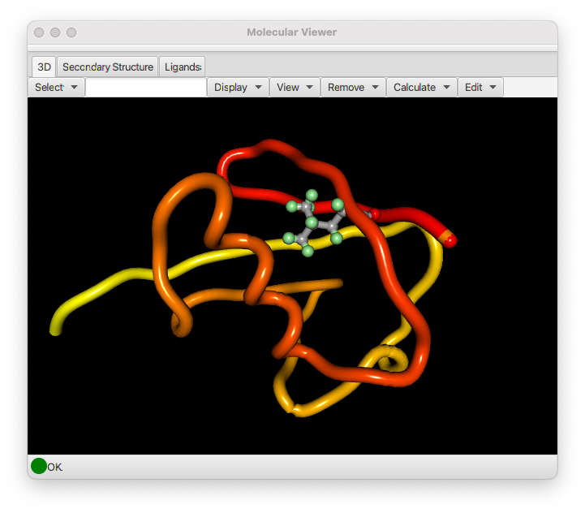

The Moleculear Viewer has three tab panes.  One for a three-dimensional viewer, one for an RNA secondary structure viewre and one for a flat-2D viewer for small molecules.

### Three-Dimensional Viewer

The Three-Dimensional Molecular Viewer is, like all of NMRFx Analyst, a cross-platform tool written in the Java programming language. It makes use of the JavaFX 3D environment which gives access to hardware accelerated three dimensional graphics. The viewer is not designed to be a full featured molecular graphics program, but rather to be able to allow you to make effective use of molecular visualization while working on an NMR project. Because it is integrated directly inside NMRFx Analyst it is easy to use to visualize any internal 3D data. The viewer is implemented in a way that makes it analogous to other canvas windows in NMRFx Analyst. It can render various graphical items, from simple shapes like spheres and cylinders, to more complex items like full molecular structures. This allows us to use it to render molecules and associated information like constraints and the coordinate system of an orientation tensor. 

The Molecular Viewer will display the currently active molecule. See the previous chapter (Molecules) for information about loading molecular structures. Displaying the molecule consists of two steps, selecting the atoms to be displayed, and selecting the mode, lines or spheres, in which they are to be rendered. Molecules can also be rendered as a tube that follows the backbone and is colored with colors that sequentially change from one end to the other end of the molecule.  When displaying a Tube, there is no need to first select atoms. A set of atoms appropriate to either a protein or nucleic acid will automatically be chosen when you click the Tube button.

#### Controls
The control sections at the top of the 3D molecular viewer are described here.

Select
:   Choose from the following menu items 

    Backbone
    :    Backbone atoms (N, Ca, C of proteins)

    Heavy
    :   All non-hydrogen atoms

    All
    :   All atoms

    Ligand
    :   All atoms of ligands (entities that are not in a polymer)

    Residues
    :   All atoms of any residues with a currently selected atom

Text Field
:   Type in selections like 3.\* to select all atoms in residue "3" or 5-10.N,C,CA to select backbone atoms in residues 5 through 10. After entering a value, hit the Enter key to activate the selection. 

Display

:   Use items in this menu to display selected atoms according.

    Lines
    : Draw bonds between selected atoms with thin lines

    Sticks
    : Draw bonds between selected atoms with sticks and atoms with larger spheres 

    Spheres
    : Draw Spheres at each selecte atom (but no bond lines)

    Tubes
    : Draw a tube that threads through backbone atoms of proteins or nucleic acid polymers.  Use a color that starts with red and gradually becomes yellow

    Box
    :  Draw the edges of a box that fully encloses the molecule

    Axes
    : Draw lines starting at the origin at extending along each of the three (x,y,z) axes

    SVD Axes
    : Calculate the principle components of the coordinates useing an SVD algorithm and draw lines along those components.

    RDC Axes
    : Calculate the the orientation of the molecule using RDC values and draw lines along those components.

View
:   Change the view of the molecule as follows

    Center on selection 
    : Translate the view so the average positoin of the currently selected atoms are at the center. Rotations will be around the this point.

    Reset Transform
    : Reset rotation and scale to the original view. 

    Rotate to SVD Axes
    : Calculate the principle components of the coordinates useing an SVD algorithm and rotate the view so those components align with x,y,z view.

    Rotate to RDC Axes
    : Calculate the the orientation of the molecule using RDC values and draw lines along those components and rotate the view so those components align with x,y,z view.

Remove
: When any item is drawn an entry is added to the Remove menu with the type of item and an index. Selecting the menu item will remove the corresponding item from the display.  As an example, successive drawing of objects with stick mode would add *stick*, *stick1* and *stick2* to the list. Selecting *stick* would remove all sticks, selecting *stick1* would remove just the subset of items labeled *stick1*. 

Calculate
: This menu item gives access to a several (still somewhat experimental) tools for 3D structure calculation.

    To3D
    : Used only for small molecules.  It will convert 2D coordinates into a low-energy 3D conformation.

    Calc Structure
    :  Will structure calculation on a polymer.  At present is not using any distance restraints.  Normally structure calculation in NMRFx is done with the command line, **NMRFx Structure** program

    Refine Structure
    : Do a low temperature refinement with torsion angle dynamics of a polymer.  Currently this is mostly of use for refining RNA structures generated with the 2D->3D calculation (from the Secondary Structure menu tab).

The molecule can be rotated, translated or scaled as follows.

Rotate

:   The molecular view can be rotated by pressing and then dragging with the left mouse button.

Scale

:   The molecular view can be scaled by pressing and then dragging with the right mouse button. Dragging right will increase the size of the viewed molecule, and dragging left will decrease it.

Selection

:    Click with the left mouse button on atoms or bonds to select them.  If the shift key is held down you will select an additional atom/bond without deselecting any existing ones.
