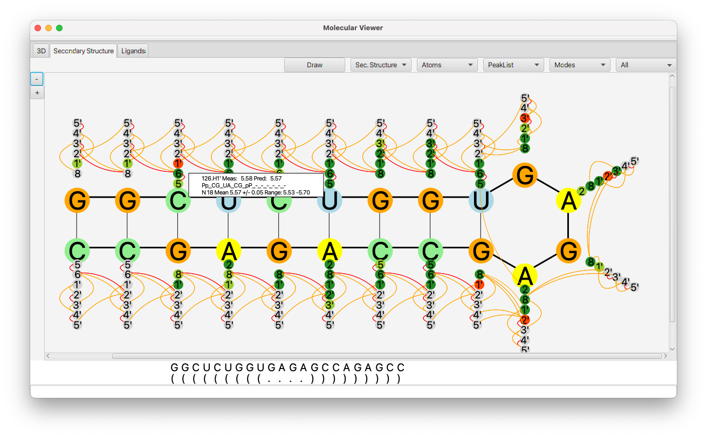

This tool allows displaying the secondary structure of RNA and can include the display of distance constraints and deuterium labeling.  Open the tool up by choosing the **RNA Sec Structure** menu item from the Molecule -> Analysis menu.  If you're RNA molecule has not had a secondary structure assigned within NMRFx Analyst using the dot-bracket notation, then click the Dot-Bracket button.  This will display the following dialog.

The dot-bracket notation is used to indicate base-pairing.  A left parenthesis, is base paired to the corresponding base with a right parenthesis.  Either a dot ("."), or the nucleotide base character can be used to indicate the base is not paired.

The first row of the display shows the sequence of RNA bases.  The row below shows the dot-bracket assignment.  By default this will consist of all "." values, indicating that there are no base pairs.  You can update the assignment by typing dot-bracket notation into the text box, and hitting the Return key, or by clicking with the mouse on the assignment symbol below each base pair character.  Clicking the mouse will toggle through values in the following order: "(",")","X","." (where X is the base pair character.  If the number of left and right parentheses are not equal, the background will be displayed in yellow.

Clicking the Draw button will generate a layout of the sequence in a manner consistent with the base-pairing specified with the dot-bracket notation.  This works well for relatively small RNAs.  We have not yet optimized it for larger RNAs (which may take some time to layout).  We plan to add the ability to import a file of x,y positions, so that the layout could be done in an external program.

Various tools for interacting with the secondary structure and rendering the display are available.

Sec. Structure
: This menu has tools for interacting with the secondary structure

    From 3D
    : Determine the secondary structure from the current 3D structure.  Various rules are used to determine what bases are paired.

    Predict 2D
    : This is an experimental feature that uses a deep-learing model to predict secondary structure from the primary sequence.  Currently it requires separate download of a trained model.

    To 3D
    : This is an experimental feature that will generate 3D coordinates consistent with the secondary structure.

Atoms
: Use the choices in this menu to select what atoms are displayed. Displayed atoms are used to show what atoms have been assigned and whether the assignment is consistent with predictions for that atom type.  Atoms colored gray are unassigned, and atoms in green, light green, or red are assigned (in decreasing order of consistency).  You can select all ribose, all base, all exchangeable or a subset of ribose atoms.

Peaklist
:  The display can be annotated with lines indicating the presence of distance constraints.  Use the choices in this menu to select what peak list is used for displaying connectivities between atoms.  Any peaks in the list with complete assignments will be used to draw a connecting line between the pair of peaks.  This is only used for peaks with two hydrogen atom dimensions.

Modes
: Turn on or off various display modes.
    
    Numbers
    :  Display the residue number instead of residue name (G,C etc.) on each residues circle.

    Probabilities
    : If a secondary structure prediction has been done turn on this mode to display the probability that a selected residue is base-paired to other residues.  Any residue with a probability above a limit will have the probability displayed.

    Active
    : If the **Active** checkbox is selected, then the display of hydrogen atoms (the smaller circles) will reflect the "active" state of atoms.  The "active* state is normally used in the tool used to generate RNA Peaks (RNA Peak Generator).  Atom types that are marked as deuterated (turned off in the Peak Generator) are inactive.  Atom types marked as non-deuterated are active.  Thus, the tool can be used to display the deuteration profile of the molecule.

    Frozen
    : If the **Frozen** checkbox is selected, then only peaks that have been marked as Frozen in the Peak Slider will be used for generating constraints.  This allows a visual display of the location of frozen peaks.  If the checkbox is not selected, then all peaks with assignments will be used.

    Predictions
    : If you click on an atom it will display the prediction data for that atom.  This lets you switch between showing hydrogen and carbon predictions

    Peak Intensities
    : This has a submenu that lets you choose an intensity level for display of connectivities between atoms.  Levels are s)trong, m)edium, w)eak and v)ery w)eak.

Peak Type
: Select All, Intra-residue, or inter-residue to display peak based connectivities based on atom types.

Zoom buttons
: At the left side of the window are **+** and **-** buttons that can be used to zoom in the display.  Use can use the scrollbars to move the view.  Alternatively, you can Use a trackpad to zoom in, out or pan the view.
