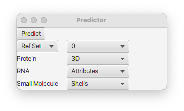
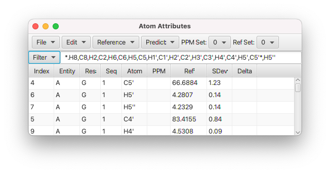

NMRFx can predict the chemical shifts of proteins, RNA and small molecules. Each of these three molecule types has a specific type of predictor.  The Chemical Shift Predictor GUI is available from the **Predict** menu of the **Atom Table** (display it from the **Molecule** menu).

NMRFx has multiple locations, associated with each atom, to store predictions (and experimental assignments).  These are divided into two categories, the "Assigned" and the "Reference".  Typically, the Assigned set is used for experimental assignments, and the Reference set for predictions (or average values loaded from databases like the BMRB).  Within each type you can store multiple values indexed by a number starting at "0".  When you do a prediction you can decide where the value is stored.  Select the Reference or Assigned Set, and choose an index value.  The default, which is usually appropriate, is to store predictions into index 0 of the Reference set.

Predictions are done in a different manner for each type of entity within a molecule, Protein, RNA or Small Molecules. Your molecular assembly can consist of multiple entity types and the corresponding prediction type will be done for each entity type.  For example, you might have a protein-RNA complex.  The protein predictor will be used for the one or more polypeptide chains, and the RNA predictor for the RNA chain.

### Proteins

Protein predictions can be done in two different ways. For standard proteins with three dimensional coordinates a method based on the molecular geometry is appropriate.  For small peptides, that might have unnatural amino acids, an alternative is to use the Shell method described below for small molecules. That method is independent of the molecular structure and only depends on the atoms in the neighborhood of the atom to be predicted. Select the method with the choice box to the right of **Protein**.  The default value is *3D*.

An alternative to the predictors, if you don't have a molecular structure available, is to use the Reference menu in the Atom Table to set the chemical shifts to values based on BMRB statistics, or based on a random coil prediction. Those two methods are independent of the molecular geometry and depend only on the sequence.  

For protein predictions that are based on the three-dimensional structure so you need to have first read in molecular coordinates.  See [Molecules](../01.molecules/docs.md)

The protein predictions are done with a linear regression fit to a set of attributes derived from a sequence of three residues.  The attributes are based on four categories of structural information:

- Dihedral angles, represented as the sin and cosine of the residue to be predicted and those of the previous and successive residue
- Residue properties, including a measure of size, charge, hydrophobicity and aromaticity.
- Ring current shifts, calculated for atoms that are near aromatic rings
- Hydrogen bonding and electrostatic interaction

The use of a linear regression algorithm limits the ability to make use of interactions between parameters. As an alternative to using a complex, non-linear algorithm, we introduce attributes that are the product of two attribute and the use of multiples of the angles in the sin and cos functions.  Attributes ending in
**C** are from the central residue (to be predicted), those ending in **P** are from  the previous residue, and those ending in **S** are from the
successive residue.   Examples of attributes are:

- sin(psiC), where psiC is the psi angle of the central residue
- sin(2 * psiC)
- cos(psiC) * sin(phiC), where phiC is the phi angle of the central residue
- sin(psiC) * sin(psiP), where psiP is the psi angle of the previous residue
- sin(phiC) * BULK_P, where BULK_P, is a measure of the size of the previous residue

A large number of attributes are used that might influence the chemical shift, but this large number of potential attributes can lead to a high degree of correlation between attributes and to overfitting.  To minimize this we perform the linear regression with a Lasso model using LARS (Least Angle Regression) to train the model.  Lasso regression uses regularization to shrink the contribution of unimportant attributes to zero and thereby minimizes the risk of overfitting.

### RNA

RNA predictions can be performed in three different ways. The first method relies on attributes that are obtained from the primary and secondary structure.  
In the attribute method,  every atom is classified by the type of atom, the two bases on each side and their (possible) base-pairing partners (**Attributes**).
The other two rely on calculations using the coordinates and require that three-dimensional structural information is available.  The **3D-Dist** method is trained to use the distances to nearby atoms as parameters.  The **3D-RC** exclusively uses ring-current shift calculations, as this can be the dominant influence on the chemical shifts of RNA atoms.
	
#### Attributes method

In the attributes method attributes are used for each base in a sequence of five bases, where the central base of the five, is the one to be predicted. Internally these attributes are represented as a sparse matrix of zeros and ones where a one indicates that that type of attrirbute is present.  The attributes can be also be represented symbolically so they are more interpretable.  For example, this set of attributes,

    Pp, GC, UG, G-, P-, -, -, -, gnra1, gnra2, -

represents the last base in a helix before a GNRA turn.  The central base (3, counting 1 to 5), to be predicted, is a U, in a wobble base pair to a G.  Bases two residues away, positions 1 and 5, have less effect so to minimize the number of attributes they are represented as P (for A and G) or p (for U and C).  Residues adjacent to the 
central residue are represented as their explicit nucleotide type (A,G,C,U). If there is no base-pairing partner, as is the case for residues 4 and 5 the base pair position is indicated with a "-" character (here, the G- and P-).  These base pairing patterns are represented in the first five attributes listed.  The second set of five represents additional attributes.  Here positions 4 and 5 are at positions one and two of a GNRA tetraloop.

The actual training and prediction is done using a regression method based on the sparse matrix of attributes. Two challenges are faced in fitting the data.  First, as mentioned above, the data is sparse, in any given five-member RNA sequence most potential attributes are not present.  Second, given the large number of attributes and relatively small number of assigned RNAs available for training, there is limited information on the contribution of all possible sets of attributes. An appropriate machine learning method for this problem is a Factorization Machine.  Factorization machines work well with sparse data and, can handle interactions between attributes by embedding features into a lower dimensional interaction space, and can derive interaction information between attributes where there isn't explicit information in the training data.

Some attribute sets are very well represented in the training data, with multiple assigned RNAs with bases with those attributes. For others there are few or no examples in the database. For bases with multiple training examples, it is reasonable to simply form the prediction from an average of the chemical shifts for those examples.  NMRFx forms the actual prediction by a weighted combination of the prediction value from the Factorization Machine and the statistical average from any training examples.  Where a large number of examples is present the prediction is largely based on the example average, where a small number (or no) examples are available the prediction is largely (or entirely) based on the FM prediction. 

#### Distance Method
In the this method, the prediction values is formed from a weighted sum of contributions of atoms that are near the target atom.  Atom contributions depend on the type of neighboring atom, and the distance to the neighboring atom (scaled as 1/r^6).  Neighboring atoms contribute more to the prediction than more distant atoms.  Training is done by generating a matrix of attributes, weighted by their distance, and performing a linear regression fit to the training datas chemical shifts. Each atom to be predicted has a reference value, and the linear regression estimates an additive value that represents the influence of its neighbors.

#### Ring-Current Method

Each RNA nucleotide has an aromatic base, and the local magnetic field cause by the ring current shifts of these aromatic ring systems is often the dominant contributor to the chemical shift of the atoms that are not involved in base-pairing hydrogen bonds.  When this method is selected nearby aromatic rings are identified and the contribution to the chemical shift of the target atom is calculated.  As with the above method, each atom has a reference shift and the ring-current contribution is an additive value on that reference shift.

### Small Molecules
These predictions are done using atoms in surrounding shells (by bond).  This is similar to HOSE code methods.

To actually perform a prediction, select the appropriate settings (where the predictions should be stored and the method to be used for each entity type)  as described above and click the Predict button.  You can do a prediction on a molecular assembly that includes protein, RNA and a small molecule.  Each entity will be predicted using the specified method.  Using the default values, the prediction values and error estimates can be seen in the **Ref** and **SDev** columns of the **Atom Table**.  If there are chemical shift assignments for the atoms then there will also be a value in the **Delta** column.  This is the difference between the assignment (in **PPM** column) and the prediction, divided by the prediction error estimate.

