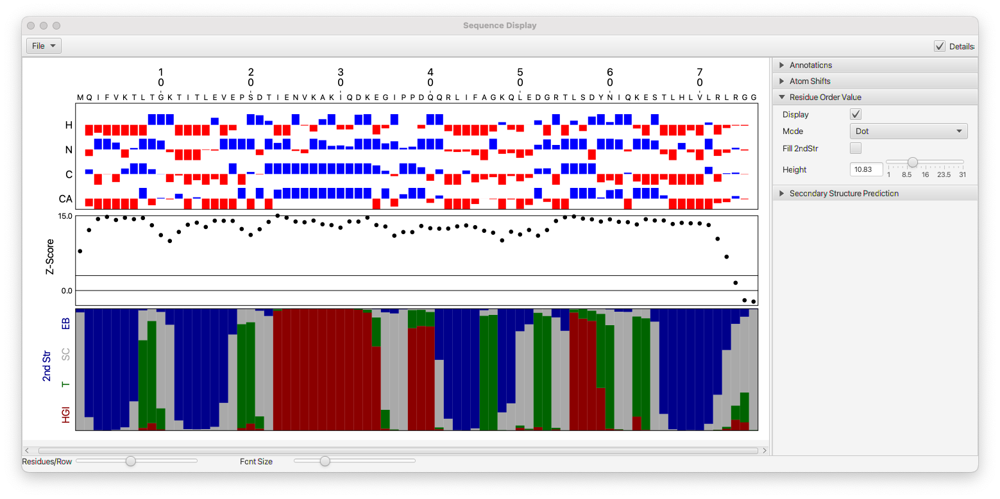

NMRFx Analyst can use chemical shift to provide an analysis of the molecule. The **Sequence Display** tool (available from the **Molecule** menu can display polymer (protein and RNA) sequences and plot information derived from the chemical shifts.

----

#### Annotations
The Sequence Display tool can render the residue sequence of protein and RNA polymers.  The **Annotations** section, and controls at the bottom of the window, control some basic rendering parameters.

Residue Orient
:  Changes the orientation (horizontal or vertical) of the residue numbers.  

Font Scale
: Change the font size of residue numbers

Residue Char
: Turn off to hide single letter residue characters

Dot-Bracket
: Turn on to display dot-bracket (vienna) notation of RNA secondary structures

Residues/Row
: This slider (at bottom of window) controls the number of residues per row

Font Size
: This slider (at bottom of window) controls the font size of residue characters, and thereby the size of the whole displayed chart

----

#### Atom Shifts
Chemical shifts are dependent on the residues secondary structure and visualizing the shifts relative to a reference value is useful for seeing patterns in the structure.  This section allows you turn on the display of plots of these delta (shift-refshift) values.  There are several modes for calculating the reference shifts that are used.  Use the **Reference** menu in the atom table.

Display
: Turn this on to add a plot with relative chemical shifts

Protein Atoms
:  Use this menu to select atoms that are present in amino-acids.  You can select one or more choices.

RNA Atoms
: Use this menu to select atoms that are present in RNA.  You can select one or more choices.

Dot
: If off, the chemical shift differences will be displayed as a bar chart.  If on display as a dot plot

Combine
:  Combine multiple atoms on a single row.  Useful for RNA.

Group By
:  Combine multiple atoms on a single row by grouping by these atom types.

Scale
: Divide the delta shift by this amount to scale the size of the pars (or dot positions).  Smaller values yield taller bars.

Height
: The relative height of the whole chart taken up by this (Atom Shift) section

----

#### Residue Order Value

This plot displays a calculated Z-score for each residue (with chemical shifts).  This is measure of order and is calculated as described in Nielsen & Mulder, 2016.  Note the code to do the calculation is independently written, and it is not guaranteed to exactly reproduce the values in the reference.
To use this plot you should calculate reference shifts with the **Peptide Random** mode (Reference menu of the Atom Table)

Display
: Turn this on to add a plot with residue order values

Mode
: Select a dot plot or bar plot

Height
: The relative height of the whole chart taken up by this (Residue Order Value) section

Fill 2nd Str
: Fill the bars (if in bar plot mode) with colors based on the secondary structure calculation (see below) 

----

#### Secondary Structure Prediction

NMRFx has a deep learning model trained to do secondary structure prediction.  The model predicts the probability of each of four possible secondary structure states which are based on DSSP terminology.  Helix (combines H,G and I states), Turn (T), Coil (S and C states) and Extended (E and B states)

Display
: Turn this on to calculate and display the secondary structure.  There will be a pause when you turn it on as the model data is loaded.

Height
: The relative height of the whole chart taken up by this (Secondary Structure) section

----
