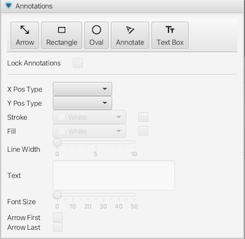
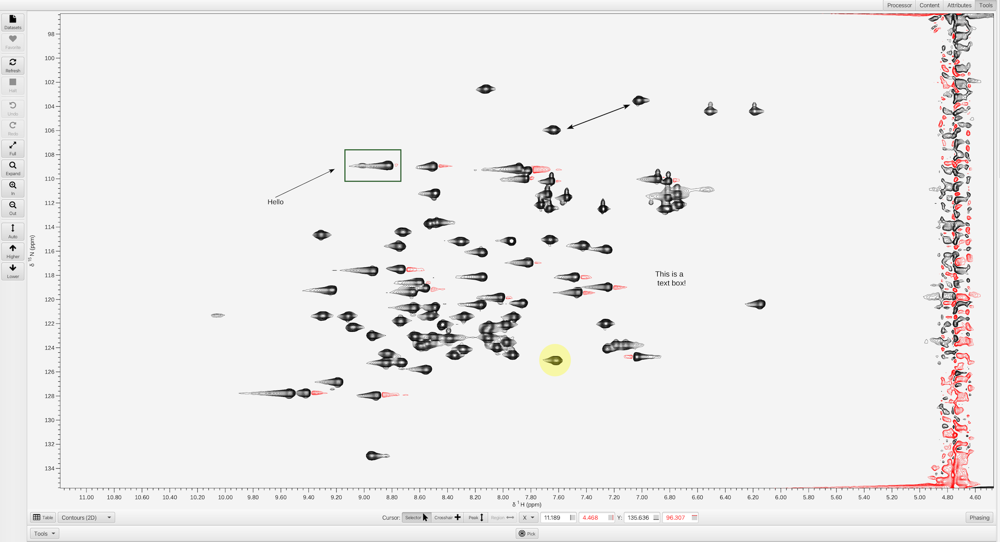

The **Annotation Tool** allows the user to add various annotation text and shape items to the spectral canvas.  Annotations will be included when the canvas is exported to a graphical file (SVG, PDF, or PNG) and when the the window is saved in a project.

Annotations can be added to the canvas by clicking on the respective buttons.  They will appear in the upper left corner of the canvas.  If the cursor is in *Crosshair* mode and all crosshairs are enabled, shapes appear in the space enclosed by the crosshairs. Text appears to the upper right of where the black crosshairs intersect. Clicking on an annotation reveals customizable attributes.

Shapes

:   Lines, Rectangles, and Ovals. Shapes have attributes such as stroke color, fill color, and line width. For an Arrow Line, arrow heads on either end can be turned on/off using the **Arrow First** and **Arrow Last** checkboxes.

Text

:   Text can be added using an Annotation Line or a Text Box. Fill changes the color of the text. For an Annotation Line, stroke changes the line color.  When an applicable annotation is selected, the text field is enabled.  The annotation will be updated upon pressing the Enter key. Use the **Font Size** slider to adjust the size of the text.

Attributes

:   **Fill** attributes apply to Rectangles, Ovals, and Text.  Initially shapes have no fill and text have Black fill. To modify fill color, select the checkbox in the Fill row to enable the color editor. Unselecting the checkbox sets the item to no fill. Colors are further customizable through the *Custom Color* option at the bottom of the color editor.

:   **Stroke** attributes apply to Rectangles, Ovals, and Lines.  Initially stroke color is set to Black for all shapes. Stroke color is reflected in the border of rectangles and ovals. Unselecting the checkbox in the Stroke row sets the item to no stroke. If the shape has no stroke color and no fill color, the stroke color is set to Black. Colors are further customizable through the *Custom Color* option at the bottom of the color editor.

:   **Line Width** applies to Rectangles, Ovals, and Lines.  The line width is reflected in the border of rectangles and ovals. 

Geometry

:   The size and location of items on the canvas can be manipulated by selecting them and dragging the whole object to position them, or one of the handles that appear when selected to resize them.

:   Graphical items can be positioned and sized in three different coordinate systems:

    Pixels
    :    In this system, coordinates are expressed in pixel units of the graphical display with the origin of the coordinate system (0,0) being at the upper left corner of the canvas.

    World
    :    In this system (the default), coordinates are expressed in units of a spectrum object. In particular, they will be in chemical shift (ppm) units of the object that is below them when they are switched to this coordinate system. Items using this system will then stay in the same chemical shift position no matter how the underlying spectrum is zoomed or panned.

    Fraction
    :    In this system, coordinates are expressed as fractions of the canvas size, so that the origin 0,0 is at the upper left corner, and 1,1 is at the lower right corner. Objects positioned in this system will take up the same relative portion of the canvas no matter how the canvas is resized.

    You can switch items between the three coordinate systems using the X Pos Type and Y Pos Type drop-down boxes. X Pos Type reflects the coordinate system on the X axis and Y Pos Type reflects the Y axis. The actual position of the displayed item will not be changed, but the coordinates of the item will be transformed to give the same position on the canvas as it was in the previous coordinate space.

Lock Annotations

:   Annotations are positioned in front of the spectrum. In order to 
    interact with the spectrum and peaks without accidentally selecting 
    annotations, you can select the **Lock Annotations** checkbox to freeze
    the annotations in place. Unselecting the checkbox will re-enable
    the annotations to be modifiable.

