## Peak Lists Table

NMRFx Analyst can have an essentially unlimited number of peak lists in memory.  You can get a quick overview of
all the peak lists currently in memory by displaying (from the Peaks->Peak Lists Table menu item)
the Peak Lists Table.  This table shows a row for each open peak list.  Columns are available for
displaying the peak list name, the name of the dataset (if any) associated with the peak list, the
labels for each dimension, and various counts of the numbers of peaks.  These counts include
the total number of peaks, the number of peaks marked for deletion, the number of peaks that
are fully assigned, partially assigned and unassigned.

An **Edit** menu provides access to commands to compress, degap, delete and duplicate the 
peak list in a selected row.  This table is not currently automatically updated when changes
are made to peak lists, so use the Refresh button to update it.  The Inspector and Table
buttons open the corresponding display tools to get more detailed information for a selected peak list.

## Peak Inspector
 

Every peak is characterized by a great many properties and it can often
be useful to inspect each peak to check and modify these properties.
There are two primary tools, aside from actually visualizing peaks on
spectra, for this purpose. The Peak Inspector allows a detailed view of
one peak at a time. The Peak Table, presents somewhat less information
about each peak, but presents all the peaks in a list at once. The Peak
Inspector is displayed by choosing the Peaks - Show Peak Inspector menu
item. You can have multiple Peak Inspectors operational, to add
additional ones choose Peaks - Add Peak Inspector menu item. Having
displayed an inspector you must next select a particular list to
display. Clicking the List: triangle will bring up a menu of all
currently opened peak lists. Choose one from the list and the inspector
will be populated with information from the first peak in that list. You
can navigate forwards and backwards through the peak list by clicking
the up or down arrows next to the peak id number. Alternatively type in
a peak id number and hit Return to jump directly to that peak.

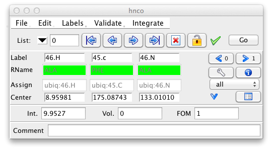

The Peak Inspector can also be set to display a particular peak directly
from the spectrum display. Just let the mouse pointer hover over a
displayed peak and press the spacebar. If the Peak Inspector is not
already displayed it will this action will also display it.

Besides the buttons for navigating through the peak list, the top row of
this interface provides a button for marking peaks as deleted, and for
marking them as locked so their properties can't be changed. (BAJ,
verify this). Clicking the Go button will jump the currently active
window to display the plane containing that peak, and position the
crosshairs at the position of the peak.

You can select which peaks will be displayed in the Peak Inspector by
selecting one of the options in the combobox on the right side of the
interface. Settings include **all** (display all peaks), **ok** (display
only peaks not marked for deletion), **deleted** (only deleted peaks),
**assigned** (only peaks with all dimensions assigned), **partial**
(only peaks that are partially assigned), **unassigned** (no dimensions
assigned), **ambiguous** (peaks with multiple assignments), and
**invalid** (peaks, that have assignments inconsistent with the
molecular structure).

To keep the size of the Peak Inspector small, only a subset of the peak
information is shown by default. This includes the peak label, the
residue name, the assignment, and the chemical shift at the center of
the peak. The peak intensity, peak volume and an optional comment are
also displayed. Remember that peak volumes are not automatically
calculated so don't be surprised if these are all set to zero.

Clicking the downward pointing arrow will expand the inspector to show
additional information about the peak. This includes the peak width,
bounds, coupling constant, resonance id number, user data, and an error
field.

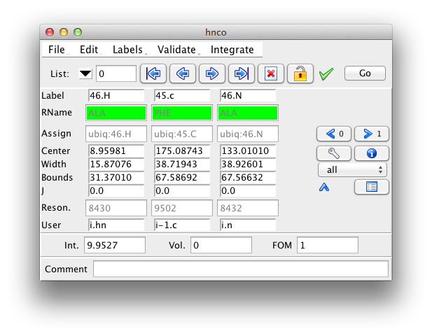

All the displayed fields are editable, with the exception of the residue
name field. It will only be displayed if the peak dimension is assigned
to a specific atom, and a residue sequence for the current molecule has
been read in. To change an editable value type in a new value and hit
the Return key. As soon as you start typing the field that displays the
peak identification number will change so that its background is red, to
alert you to an unsaved change. When you hit the Return key the red
background will revert to the normal gray. To ignore a change just go on
to the next peak without hitting Return.

The Label, RName and Assign fields require special explanation. The
Label field is essentially a name given to the particular dimension of
the particular peak. You can type most anything in the field, but it
will generally be beneficial to use labels that conform to the syntax of
NMRVIEW atom specifiers (see the Molecules chapter). This way the labels
can be properly interpreted as representing a particular atom in the
molecular topology.

As noted above the RName field is a derived value. If you type in a
label with appropriate syntax such that the residue number can be
evaluated then the name of that particular residue (if it exists) will
be displayed in the RName field. For example, if you enter 46.h, and
residue 46 is an Alanine, then the RName field will show ALA. If the
residue number is prefixed with a single letter amino acid code, then
that code is validated against the residue name and the RName field will
be colored appropriately. For example, with the above example if we
entered in A46.h, the RName field would be green. The single letter code
"A" is consistent with the type of the residue at position 46 (ALA). But
if we entered H46.h, the RName field would be rendered with a red
background, indicating that the entered amino acid type H (His), is
inconsistent with the residue at position 46 (Ala). If you enter a
residue number that is not present in the sequence, the background will
be colored orange. Entering labels with the amino acid prefix is a good
idea, because you'll get immediate feedback if you attempt to label the
dimension to something inconsistent with the molecular structure.

The Assign field is, like the RName field, not editable. While similar
to the label field, it is a more formal linkage to an atom. The label
can be entered as any string of text, ideally, but not necessarily, in a
format that specifies an atom in the structure. The Assign field is
populated with various assignment tools and represents an explicit
linkage of that peak dimension to a specific atom in the structure. Peak
lists often are set up with a certain pattern defining what types of
atoms can be in what dimensions, and what are the relationships between
the dimensions. If you have patterns set up, and turn-on auto-completion
then you may only need to assign part of the peak to get the complete
assignment done.

For example, if you have an hnco with patterns i.h i-1.c i.n and you
type a "32" into the label for the carbon dimension and hit Return the
labels will automatically be set to 33.h 32.c 33.n If you have a proton
tocsy with i.h\* and i.h\* and one dimension is labeled 32.hn and you
type "hb2" into the other dimension it will automatically be set to
32.hb2 Auto-completion is turned on with the
checkbutton. Peak Patterns can be set up in the
Peak Reference Dialog, brought up from the Peak menu, or by clicking the
checkbutton, and are discussed more fully in
the section on Peak Identification.

A later section of this chapter will discuss the concept of peak linking
and resonances. But here we want to point out that by double-clicking on
the **Reson.** entry for a particular dimension you can display a window
with a list of all the peaks that share that resonance. That display
list can be used to unlink this peak from the remaining, thereby giving
it a new Resonance number by itself.

## Peak Table

The Peak Inspector is quite useful at getting detailed information about
one peak (or a few, by using multiple inspectors), but it is fairly
useless at getting the big picture. For that you'll want to use the Peak
Table to display all the peaks in a specified peak list.The Peak Table
is displayed by choosing the Peaks - Show Peak Table menu item. You can
have multiple Peak Tables operational, to add additional ones choose
Peaks - Add Peak Table menu item.

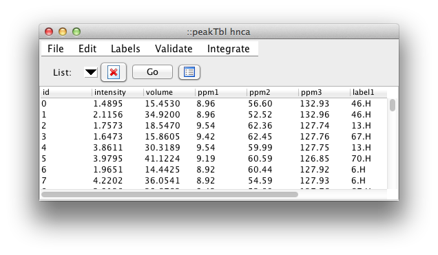

The most useful feature of the table is the ease with which the
displayed information can be sorted by the values in one or more
columns. Just click on a column header to sort by that column. Click a
second time to reverse the order of sorting, and a third time to revert
to the unsorted state. You can do secondary sorts on as many additional
columns as you would like. After selecting the first (primary) column,
hold down the Control key while clicking any additional column headers.
Sorting by intensity provides an easy way to remove weak peaks. Sort the
peaks, then select a range of peaks from the weakest to that with the
maximum intensity you wish to remove. Then click the Delete button
(Skull & Crossbones). All the peaks marked for deletion will now be
colored in red and will be permanently removed if you compress the peak
list. The Delete button is really toggles the deletion status flag.
Any peaks not marked for deletion will be so marked, any already marked
will be "unmarked".

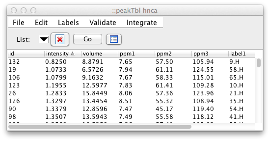

By default, the peak intensity, peak volume, and the chemical shift and
label for each dimension are displayed. Scripting level, commands are
available to provide for customized column display. For example, to
change the table so that it shows the peak id, chemical shifts, peak
widths, and the comment field, use the following command in the NMRFx Analyst
console: `peakTbl headers "id ppm width comment"` Note, when using this
command you don't need to specify the individual columns for those data
values that are associated with individual dimensions. In this example,
we only listed "ppm" once, but got the chemical shift columns for all
three dimensions of this list.

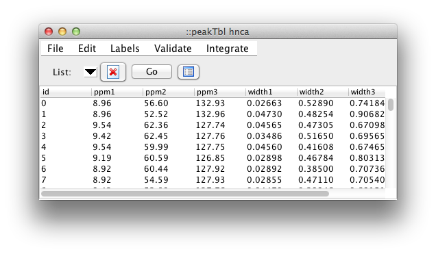

## Peak Commands

The NMRView peak picker, is fast but relatively simple, and this can
lead to the inclusion of peaks that correspond to noise or artifacts.
Instead of eliminating these during the initial identification of peak
positions, NMRView provides a variety of routines for filtering out
these peaks. Peaks can be deleted interactively via the GUI, both
directly on the spectrum, and using the Peak Inspector or Peak Tables as
described above. There also a variety of scripted procedures that are
available for deleting peaks that are thinner, wider or less intense
than specified criteria or are on the diagonal. Furthermore, simple Tcl
scripts can be written by users to filter out peaks based on other
criteria.

Here is a simple Tcl procedure (included in the standard NMRFx Analyst
distribution) that deletes any peaks in a specified list whose intensity
is below a specified threshold. The user could invoke this script by
typing in the NMRView console ?Nv\_PeakCutLow noesy 0.4?.

proc Nv\_PeakCutLow {plist threshold} { set n [nv\_peak n \$plist] set
ncut 0 foreachpeak iPeak \$plist { set lvl [eval nv\_peak elem int
\$plist.\$iPeak] if {[ expr {abs(\$lvl)\<\$threshold} ] } { eval
nv\_peak delete \$plist.\$iPeak incr ncut } } puts "Cut \$ncut of \$n
peaks" }

Two commands in the script are worth emphasizing. The `foreachpeak`
command loops over all the peaks in a specified list (setting the iPeak
variable to the peak number of each in turn). By using this command the
user doesn?t need to worry about the number of peaks in the list or
whether there are gaps in the peak numbering. The `nv_peak elem` command
provides read and write access to all the parameters that characterize a
particular peak. In this example, the `nv_peak` command is used to
obtain the peak intensity, but all other elements of each peak such as
chemical shift, width, volume, assignment label, and comments are
accessible as well. Together these two commands can form the basis for
scripts that perform a wide variety of operations on peak lists.

A graphical interface to some of the builtin filtering commands is
available via the Peaks - Edit - Filter menu item. Documentation coming.

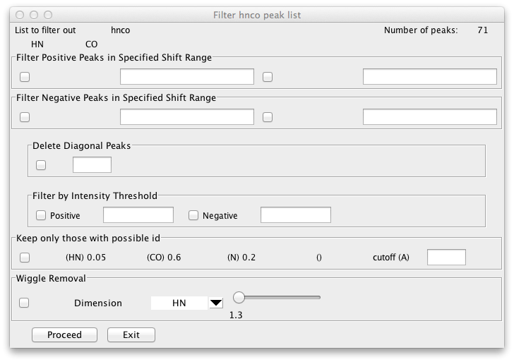

There are a variety of ways to delete peaks in NMRFx Analyst including: on
the spectrum with the deletion cursor or delete selected peaks commands,
from the Peak Inspector or Tables with the delete button, or with the
low level `nv_peak
                    delete` command. All of these actions don't actually
permanently eliminate the peak. Instead they all set a status flag on
the peak indicating that it should be considered as deleted. All peaks
have a status value that is normally set to "0", but can be set to any
integer value. Values less than 0 indicate a deleted peak. Peak
resuscitation can be achieved by changing the status flag back to 0
(either by toggling the peak delete buttons or using the
`nv_peak undelete` command.

But often you really want to be rid of the peaks forever. Perhaps you've
established that they're just noise and you don't want them around
cluttering up your analysis. Peak list compression will do the trick by
searching through the peak list and permanently removing any peaks
marked for deletion (status flag less than 0).

Every peak in NMRView has an identification number. When a peak list is
first created the peaks are numbered sequentially starting at zero. When
we delete peaks and then compress the list the peaks retain their
original peak numbering. That is if we have three peaks, \#0, \#1 and
\#2, and then delete peak \#1, we now have two peaks, \#0, and \#2.
There is now a gap in the sequential numbering. There is absolutely no
harm in this, but you may wish to update the numbering so that a
gap-free sequential numbering again obtains. Now you'll have two peaks,
\#0, and \#1, the new peak \#1 is the original \#2 peak.

Peak compressing and degapping is available from the Peak - Edit menu

##Peak Inspector and Table Menu

File

:   

    Write List

    :   Write the peak list displayed in the current peak inspector to a
        text file (.xpk).

Edit

:   

    Compress

    :   Remove peaks that have been marked for deletion. This is not
        reversible, and will create gaps in the peak numbering.

    Degap

    :   Renumber peaks (after compressing the list) so that there are no
        gaps in the peak numbering.

    Compress and Degap

    :   Combination of compress, followed by degap. Peaks will be
        permanently deleted, and the list will be sequentially numbered
        with no gaps.

    Delete List

    :   Delete the current list displayed in the peak inspector.

    Reference

    :   Display a graphical interface for setting various attributes of
        the current peak list.

    Couple

    :   Display a graphical interface that can be used to collapse
        multiple peaks separated by defined splittings into a single
        centered peak.

    Cluster

    :   Cluster peaks in the current list based on their chemical shifts
        in certain dimensions. Dimensions used and the tolerance that
        determine whether peaks are clustered are set with a peak
        template. Peak dimensions that are clustered will have a common
        resonance id after clustering.

    Fit

    :   Not yet active.

    Partners

    :   Search all lists for peaks whose chemical shifts (for matching
        dimensions) are similar (within the id tolerance) of the shifts
        of the current peak. Matching peaks are listed to console.

    Identify

    :   Display the Peak Identification interface. This interface will
        suggest possible assignments for the current peak based on the
        chemical shifts of assigned atoms, and distances in the current
        structures.

    Filter

    :   Display the Peak Filtering interface. This interface allows you
        to delete peaks based on various criteria.

    Clear

    :   Clear assignments of current peak

Labels

:   

    Auto Complete

    :   Each peak list can have a set of patterns (like i.hn, i-1.c
        etc.) for the types of atoms that give rise to the peaks. This
        command scans the labels for each peak and attempts to complete
        any labels based on the existing labels for other dimensions and
        the peak lists patterns. So, for example, if the patterns were
        "i.h and i.n" and the first dimension had the label 35.h the
        second one, if blank, could automatically be set to 35.n.

    Add Residue Prefix

    :   Precede each residue label with the single letter code for the
        residue. If, for example, the residue 3 as alanine, and the
        label for a peak was 3.H, the label would be changed to A3.H.

    Remove Residue Prefix

    :   Remove single letter residue labels from peaks. For example,
        change A3.H to 3.H.

Validate

:   

    Check Pattern

    :   Each peak list can have a set of patterns (like i.hn, i-1.c
        etc.) for the types of atoms that give rise to the peaks. This
        command displays an interface used to check the consistency of a
        peak lists assignments with its patterns.

    Check Assignments

    :   Check the assignments of a selected peak list with expected
        values for the assigned atom types (based on BMRB statistics).

Integrate

:   

    Associate Dataset

    :   Each peak list has an associated dataset. By default this
        dataset is the one from which the list was originally picked.
        You can use this command to select a dataset to be assigned to a
        list.

    Get Volumes

    :   For each peak in the list, integrate the intensities over the
        "footprint" of the peak in the dataset associated with this
        list.

    Get eVolumes

    :   For each peak in the list, integrate the intensities over the
        optimal elliptical "footprint" of the peak in the dataset
        associated with this list.

    Get Intensities

    :   For each peak in the list get the intensity at the peak center
        from the dataset associated with this list.

    Plot Vol. vs. Intensities

    :   Plot an XY chart with the one symbol for each peak positioned on
        the X axis at the peaks intensity, and the Y axis at the peaks
        volume.

    Plot Intensities

    :   Sort the peaks by their intensities and plot the peak
        intensities in decreasing order.

    Plot Volumes

    :   Sort the peaks by their volumes and plot the peak volumes in
        decreasing order.

## Peak Examination

The Peak Inspector and Table provide excellent access to information
about each peak, but often there is nothing better than actually looking
at them. But how do you know you've seen them all. If you try to
visually scan across peaks displayed in a spectrum it's hard to be
systematic and check every peak. NMRFx Analyst provides a very powerful and
relatively rapid method for systematically examining peaks. One or more
windows can be set to have their spectral display region adjusted
whenever the choice of peak displayed in the Peak Inspector changes. By
stepping from the first to the last peak in the Peak Inspector, and
observing the corresponding display in the spectra you can be sure
you've examined each and every peak.

The controlled windows have their display region changed so that they
are centered on the chemical shift of the corresponding peak. Windows
are set up to be controlled by setting the **Show Mode** in the **Peak**
tab of the **Spectrum Attributes**panel. When setting this up it is a
good idea to first set the **Show Mode** attribute to the Expand mode.
With this setting, the width of the display region will be set to a
multiple of five times that of the width of the peak's bounding box.
Step through a few peaks with the Peak Inspector till you find a peak
that has a fairly typical intensity for the particular peak list. Now
change the **Show Mode** to the ExpandFixed mode. With this setting, the
display will center on the peak position, but the display regions width
will remain constant. Now, as you step through the individual peaks in
the list their relative widths will be visually obvious.

This facility for peak examination is very useful in the analysis of
biomolecular NMR spectra. While it's possible to automate the
elimination of artifactual peaks as described above an interactive
method can be valuable. Actually looking at the shape and distribution
of peaks can be very important for discovering artifacts in spectra that
may lead to insights into new NMR experiments, and for recognizing extra
peaks or missing peaks that indicate conformational dynamics, multiple
species in solution, or ligand binding effects.

It's useful to remember that multiple spectra can be updated
simultaneously with this method. In this way you can systematically
compare peaks from spectra collected under different conditions, for
example comparing spectra of proteins collected in the presence of
different ligands or for comparing wild type and mutant forms of
proteins. In this case you'll often set the Peak Inspector to use a peak
list from a dataset collected under the reference condition (wild type
protein, zero ligand, etc.) Using this method for quickly examining
peaks has been also very useful for cleaning up peak lists prior to
using the lists in relaxation analysis or assignment using the RunAbout
tool described below. While RunAbout provides its own systematic way of
visualizing multiple datasets simultaneously, it's a good idea to use
Systematic Peak Analysis on the reference list (typically the HSQC or
HNCO experiment before starting with RunAbout).

The default spectrum key bindings are set up so that it is easy to step
through spectra. After clicking in the target spectrum window, you can
use the Page Up and Page Down keys to move forward and backward through
peak list.

##Peak Menu Commands

There are a variety of commands that can be invoked from the Peak menu
on the main NMRFx Analyst menubar. Many of these commands operate on a
specific peak list and it is important to be aware of which list that
will be before invoking them. Generally these will operate on the list
that is currently displayed in the Peak Inspector (or Peak Table).
Therefore, before invoking them, you should display the Peak Inspector
or Peak Table and select the desired list.

## Peak Integration

The peak-picking routines of NMRFx Analyst do not determine the volumes of
the peaks. Instead, so that the peak picking itself can be as fast as
possible, a subsequent analysis routine is used. The peak volume routine
is initiated by choosing either Get Volumes or Get eVolumes from the Int
menu of the Peak Analysis interface panel. Both these methods will
calculate the sum of intensities in the dataset of a footprint region
calculated from the peak attributes. By default, the intensities are
obtained with the dataset from which the peak list was originally
picked, and the dataset must be open within NMRFx Analyst prior to using the
command. The footprint used by the first method is a rectangular region
corresponding to the peak bounds identified when the peak was picked
(Section 5.2), while the latter (and preferred) method uses an
elliptical region whose width is a certain "optimal" multiple of the
peak width. The elliptical region minimizes the contribution of noise
and neighboring peaks to the calculated peak intensity.

A second advantage of this two-step process is that it makes it possible
to measure volumes (or intensities) from a different dataset than the
original list was determined from. You can do this by changing the
dataset that is associated with the peak list. Bring up a dialog for
doing this by selecting the Peaks-Integrate-Associate Dataset menu item.

You can see the elliptical area that is used by setting the peak display
mode (in the Peaks tab of the Spectrum Attributes window) to Ellipse.
The ellipse bounds are calculated from the full-width at half -height of
each peak, and thus is, unlike the peak bounds, are relatively
independent of the threshold used during peak picking.

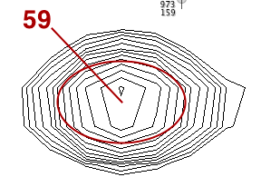

A second advantage of this two-step process is that it makes it possible
to measure volumes (or intensities) from a different dataset than the
original list was determined from. You can do this by changing the
dataset that is associated with the peak list. Bring up a dialog for
doing this by selecting the Peaks-Integrate-Associate Dataset menu item.

As with all NMRFx Analyst operations, peak volumes can be obtained using
custom scripts. For example, the script shown in Figure 11 could be used
to obtain volumes (or intensities) from a whole series of datasets with
regions corresponding to the peaks in a single peak list, such as in the
analysis of relaxation data.

The basic process then, is:

1.  Open the Peak Inspector or the Peak Table

2.  Select a peak list to measure.

3.  If desired, change the dataset associated with the peak list with
    the Peaks-Integrate-Associate Dataset menu item

4.  Select the Get Volumes, Get eVolumes or Get Intensities menu items
    from the Peaks - Integrate menu.

Plotting peak volumes and intensities can be a useful way to get an
overall sense of the distribution of intensities or volumes. You can do
these sorts of plots right withing NMRFx Analyst. Choose Plot Volumes or Plot
Intensities menu items from the Peaks - Integrate menu to generate a
plot as shown below. From this plot one might conclude that the
threshold used in peak picking was set to low.

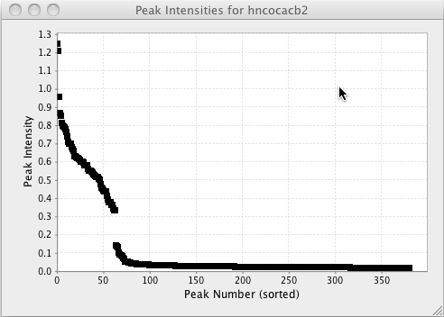

Plotting volumes vs. intensities can be useful to get a sense of the
relationship between these two factors, and to look for outliers as
measured by either method.

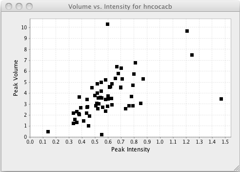

## Peak Searching

Analysis of the peaks in the NMR spectra is obviously much more useful
if one has the assignment of which atoms in the molecule (or molecules)
give rise to which peaks in the spectrum. Section 7 will focus on some
tools in NMRFx Analyst for the initial assignment of peaks from
triple-resonance (13C, 15N, 1H) spectra and Section 5.7 on the more
specific problem of identifying the pairs of hydrogen atoms that give
rise to NOE peaks. Here we will describe some tools that are of general
utility in working with the identification of NMR peaks.

Every peak list stores within itself several parameters that facilitate
peak searching and matching. The peak template parameter is a list of
dimension name and tolerance pairs that are used in searching peak lists
for peaks with certain chemical shift values. The search template can
have fewer dimensions than the peak list. So, for example, a 3D HNCO
experiment could have its template set with `nv_peak template
                hnco 1HN 0.1 15N 0.3`. Searching this peak list with two
chemical shifts, `nv_peak find hnco 8.3 117.0`, would find any peaks
whose 1HN chemical shift is between 8.2 and 8.4 ppm, and whose 15N
chemical shift is between 116.7 and 117.3 ppm. Because the 13C dimension
is not specified in the template the 13C chemical shift is ignored in
the search.

The peak-list's pattern and tolerance parameters are used when a search
is done to find atoms whose assigned chemical shifts are consistent with
those of a given peak. The peak pattern of an individual dimension has
the format *sequenceNumber.atomType*. For example, a peak pattern could
be set for a peak list named **hnco** with the command: `nv_peak
                pattern hnco i.hn i.n i-1.c`. This implies that any atom
assignments for the first dimension should be of atom type **hn**, for
the second dimension should be of type **n**, and the third dimension of
type **c**. Because the first and second dimensions share the same
symbolic sequence number (which can be either an **i** or a **j** the
atom assignments for these two dimensions should always have the same
sequence number. The third dimensions atom assignment should have a
residue that is one less than the residue assignment for the first and
second dimensions. The tolerance value indicates the allowable deviation
between the peaks chemical shifts and the chemical shift of any atoms
assigned to the peak. For example, `nv_peak tolerance hnco 0.1 0.3
            0.4`, would set the tolerance for the first dimension to
0.1, the second dimension to 0.3, and the third to 0.4. The peak pattern
and tolerance values are most readily set within the **Peak Reference**
panel. Note: the peak pattern and tolerance values are not enforced for
peaks in the present versions of NMRFx Analyst. They exist as storage for
parameters that can be used by Tcl scripts for the analysis and
assignment of peaks.

The following shows the **Peak Reference** panel for an 15N NOESY-HSQC
experiment. The first and third dimensions are for the amide proton and
nitrogen, respectively, as can be seen from the patterns "i.h" and
"i.n". The second dimension is for the indirectly detected proton which
could be on the same or a different residue, and is not necessarily an
amide proton, so it has the pattern "j.h\*". The proton in the first
dimension has relation D3, this means it is bonded (the D comes from
descendant, in a tree structure) to the atom in the third dimension
(that is, the amide proton is bonded to the amide nitrogen). The
relation field is not necessary in this case as the only atoms that
would match the i.h pattern are the amide protons, but in many cases it
is necessary to explicitly indicate which dimensions correspond to atoms
which must be bonded to the the atom in another dimension.

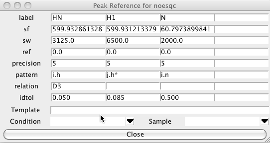

## Peak Identification

The pattern and tolerance parameters are central to the use of the
**Peak Identification Dialog**. This dialog, brought up from the
Edit-\>Identify menu of the Peak Analysis panel, can be used to
interactively assign atom identifiers to individual peaks for a molecule
with existing chemical shift assignments. If this dialog is open, then
each time you step to a new peak in the Peak Analysis panel this PeakID
panel will be updated with a list of the atoms. The atoms listed are
those atoms for which their chemical shifts are within the peaklist's
tolerance of the peaks chemical shift values, and for which their atom
names are consistent with the peaklist?s pattern.

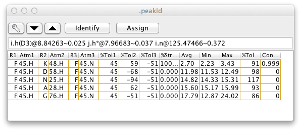

Each possible assignment will be listed in the table with a set of
scores indicating how close the chemical shifts of the atoms in that
assignment are with the chemical shifts of the corresponding dimensions
of the current peak. If three-dimensional coordinates of the atoms are
available, and two of the peak dimensions correspond to hydrogen atoms,
then additional information is given about the distance between the pair
of hydrogen atoms. The columns of the table contain the following
information (the column numbers given are for the example 3D peak list,
and will differ for peak lists with a different number of dimensions).

-   (0,1,2) Atom names, one column per peak dimension

-   (3,4,5) Difference between atom chemical shift and the peak chemical
    shift (for the corresponding dimension). Differences are expressed
    in percent of the peak identification tolerance for that dimension.
    So if the tolerance is 0.4 ppm and the difference is shown as -50,
    the peak and atom shift would be -0.2 ppm apart. One column per peak
    dimension.

-   \(6) Percent of structures where the proton proton distance is less than
    a threshold distance (by default this is 10 Angstroms).

-   \(7) The proton proton distance averaged over all the structures.

-   \(8) The proton proton distance in the structure with the smallest
    distance.

-   \(9) The proton proton distance in the structure with the largest
    distance.

-   \(10) The square root of the sum of the squared chemical shift
    differences, that is, a single number expressing how close the chemical
    shifts of the atoms and peaks are.

-   \(11) Contribution of this possibility to the overall assignment. This is
    a fractional value with the sum of the values for all possible
    assignments equaling 1.0. Calculated from the 6th root (or specified
    exponent) of the proton-proton distance in the structure where the
    distance is largest.

The most probable assignments, based on the distances in the current
structure set are those with the highest assignment contribution, as
given in the last column of the table. The column is sorted by this
value, so the most probable assignments are at top. After the table is
populated a subset of the rows will be selected (highlighted in yellow
in above example). This is the minimum set of assignments required for
the sum of the assignment contribution to exceed a target value. This
value, by default 1.0, can be set by entering a value in the CLimit
field. The exponent applied to the distances when calculating the
contributions is by default 6.0, and can be set by entering a value in
the Exp field.

Only those assignments where at least one structure has a distance less
than a specified cutoff will be shown. By default, all assignments are
shown. The cutoff can be set by entering a value in the CutOff field.

If the Spectrum1 or Spectrum2 checkboxes are activated then the region
of the spectrum (of the dataset assigned to the peaklist) around the
peak can be displayed in the panels on the right side of the PeakId
panel. Double-clicking on an entry in the atoms list will refresh the
display of the spectrum and draw the crosshair cursor at the position of
the chemical shifts of the atoms in that entry.

NOE spectra are often collected so that the experimental sweep width is
less, in the indirect dimensions, than the sweep width needed to include
all the peak resonances. In this case the peaks will appear at a
position folded by some number of sweep widths from their actual
position. These peaks would not normally be matched with atoms whose
chemical shifts are at their correct, unfolded, position. The peak
identifier can be configured to search not only at the actual peak
position, but at one or more folded chemical shifts. This can be
configured using the dialog brought up by clicking Configure Folding.

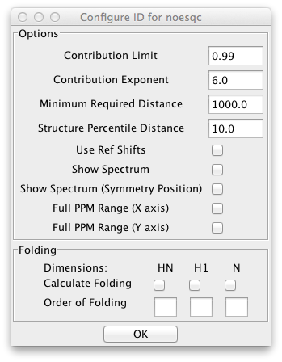

The NMRFx Analyst user should themselves synthesize the information from the
chemical shift deviations, hydrogen pair distances, and spectral display
to reach a conclusion about which, if any, of the atom entries are the
correct assignment for the peak. Selecting the entry and then clicking
the Assign button will update the assignment labels for the current peak
with the names of the atoms in that entry.

## Peak Resonances

At any given point in a project it may not be possible to assign a
unique set of atoms to a particular peak. Instead, because of overlap of
chemical shifts there may be an ambiguous group of atoms that could give
rise to the peak. NMRFx Analyst, supports the explicit assignment of an
ambiguous set of atoms to a particular peak. This can be done within the
PeakId panel by selecting more than one row of atom sets in the list and
clicking the assign button. The entire group of atoms will be stored
with the peak. These assignments can be viewed within the Peak Analysis
panel by using the arrows adjacent to the peak label entry. In this
manual there will often be references to Links and to Resonances.
Fundamentally, these refer to the same thing. Both terms are used
because of the historical manner in which these were implemented in
NMRFx Analyst, and because sometimes one or the other term is a more natural
fit to the topic being described. In an early implementation of NMRView
it was found useful to be able to associate peaks with each other. For
example, all the peaks that represent a given proton in a set of
backbone assignment experiments (HSQC, HNCA, HNCO, ...) might be linked
to each other. These links were internally maintained using the computer
science concept of a bi-directional linked list so the abstract concept
of links was actually implemented by computer code of the same name.
Commands were written (nv\_peak link, nv\_peak unlink) to set, query,
and remove links between peaks. Having created these links it was
possible to propagate the assignments of one peak to another in the
group of linked peaks. But this did not happen in any automated way, one
had to explicitly invoke a command to transfer the assignments from one
peak to all its partners. During the development of the CCPN project, and
the complementary development of the BMRB STAR version 3 archive format
the concept of a Resonance was introduced. The Resonance concept and
links shared many useful features, but the Resonance concept certainly
has some advantages. The above set of linked peaks can be represented
using Resonances by setting all the peaks to share a single Resonance
"object". The Resonance can be seen as representing the underlying atom
that gives rise to each of the peaks. In fact, both Resonances and
Links, actually refer to individual peak dimensions. So all the proton
dimensions of a set of "linked" peaks share one Resonance, and all the
nitrogen dimensions share another. A key advantage of using the
Resonance concept is that assigning a peak is actually done by assigning
the corresponding Resonance. Then all peak dimensions that share that
same Resonance immediately share the same assignment. There is no need
to actually propagate the assignment across the set of linked peaks.
While NMRFx Analyst implements Resonance, the older concept of linking is
still used in practice. When one links (with the "nv\_peak link"
command), one is actually removing the Resonance of one of the peaks,
and replacing it with the Resonance of the other. The peaks now share a
single Resonance, and can be considered to be "linked". Each Resonance
has an identification number so you can actually tell if peaks are
linked by looking at this number in the peak inspector. If they have the
same number in the Resonance field, they share the same Resonance.

## Peak Matching

One often has a case where one has atom assignments but they have not
been applied to all of your data sets. In this section we describe a
tool for assigning all the peaks in a list based on the current
assignment table. Note, a closely related alternative is when one has
one assigned peak list and one wants transfer assignments to an
unassigned list. This is discussed in the next section

To start this process bring up the Peak -Atom Matcher from the Peaks -
Analyze - Atom Peak Matcher menu entry. Choose the peak list that you
wish to assign by clicking on the list chooser near the top. Once you
choose a list you'll see a series of rows of information, with one row
for each dimension.

For each dimension number listed choose the name of the dimension to
match. You can set a tolerance to be used for the matching process. If
you leave this blank it will default to 0.1 ppm. Sometimes you know that
the peaks are all shifted by a certain amount in one or more dimensions
from the assigned shift. This might be because of a deuterium isotope
effect for deuterated samples, or due to a splitting from residual
dipolar couplings. If this is the case enter an approximate value for
the expected shift. In the example below the peaks are shifted by the
dipolar coupling so we'll enter a shift of about 0.5 ppm to allow for
the expected shift in the 15N direction (the spectra are collected at 81
MHz (15N)so the shift is roughly 90.0/81/2.0). Be careful to choose the
sign of the offset correctly. The offset value specified is added to the
chemical shift of the corresponding peak dimension, before comparison
with atom chemical shifts.

The matching algorithm will search for atoms of a specified type that
match the chemical shifts of the peaks. Since the experiment here is an
15N HSQC we'll enter hn for the first dimension and n for the second
dimension atom names.

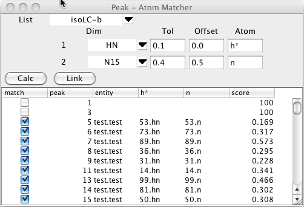

The matching process is started by clicking on the Calc button. The
comparison code will then generate a list of atoms of each residue with
the specified atom names. Each atom will be compared with the chemical
shifts of the each peak in the selected list and a bipartite pattern
matching algorithm will be used to generate an optimal matching of peaks
and atom.

The table below the control section will be filled in with a list of
peaks and their optimal assignment (if one is found within the specified
tolerance). The peak column will list each peak identification number.
The entity,and atom name columns (hn and n, in. the example) will show
the atom that best matches with the peak. The score value is based on
the chemical shift deviation between the matched atom and that of the
peak positions. Remember that you can click on any column header to sort
(ascending or descending) by the values in that column.

Clicking the Link button will assign each peak to the corresponding
atom, but this will only be done for rows where the match button is
selected.

The process then, is:

1.  Select Peak List

2.  Choose dimensions, tolerances, offsets and atom names.

3.  Click Calc to match peaks and atoms.

4.  Review scores and deselect any inappropriate matches.

5.  Click Link to assign selected (match checkbox) peaks to atoms.

The match between peaks and and atoms can be considered an example of a
bipartite graph. The atoms form one set of nodes, and the peaks another
set of nodes. The graph has edges that connect nodes but can only occur
between the two sets, that is atoms connect to peaks, and vice-versa,
but peaks don't connect to other peaks, and atoms don't connect to other
atoms. Different possible assignments of peaks to atoms correspond to
graphs with edges between different nodes. We can apply a score (or
weight) to each edge that is based on how similar the chemical shifts of
the peak dimensions are to the those of the assigned atoms. An overall
score for any graph (or assignment possibility) is given by summing the
weights of each of the edges used in that graph. We assume here that the
best possible choice of the peak assignments is the one with the best
score. By posing the peak assignment problem in this way we can take
advantage of a substantial body of mathematical and computer science
research into algorithms for this general problem.

One often has a case where one has a set of peak lists that represent
resonances from the same atoms, but there is currently no relationship
established between the corresponding peaks in each of the lists. In
many cases, one of the lists may already have assignments (though this
is not necessary for the following tool to work). In this section we
describe a tool for comparing two lists and finding an optimal match
between the peaks in the first list and the peaks in the second list.
The tool can obviously be used sequentially to link peaks in multiple
lists back to those in the first one. The underlying algorithm used here
is exactly the same as used for the Peak Atom matching described above,
but here the two sets of nodes used in the bipartite matcher correspond
to peaks in the two different lists.

To start this process bring up the Peak -Peak Matcher from the Peaks -
Analyze - Peak Peak Matcher menu entry. Choose the first peak list that
you wish to assign by clicking on the list chooser near the top left,
and the second from the top right.. Once you choose a list you'll see a
series of rows of information, with one row for each dimension.

For each dimension number listed choose the name of the dimension to
match. You must choose matching dimensions from each list for each
desired dimension. Typically the dimension labels for each row will be
the same (as show below, HN on the first, and N on the second), but you
may well have used different names for what are actually corresponding
dimensions (perhaps N in one list and 15N in a second). You can set
tolerances to be used for the matching process. If you leave these blank
it will default to 0.1 ppm. Sometimes you know that the peaks are all
shifted by a certain amount in one or more dimensions from the assigned
each other. This might be due to a splitting from residual dipolar
couplings, for example. If this is the case enter an approximate value
for the expected shift. In the example below the peaks are shifted by
the dipolar coupling so we'll enter a shift of about 0.5 ppm to allow
for the expected shift in the 15N direction (the spectra are collected
at 81 MHz (15N)so the shift is roughly 90.0/81/2.0). Be careful to
choose the sign of the offset correctly. The offset value specified is
added to the chemical shift of each peak from the lists before the
comparison is done.

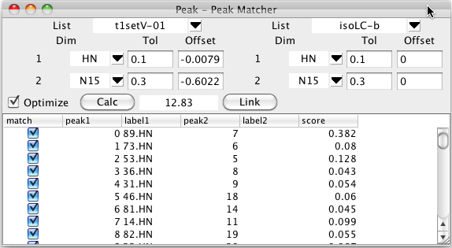

The matching process is started by clicking on the Calc button. The
shifts of each peak in the first list will be compared with the shifts
of the each peak in the second list and a bipartite pattern matching
algorithm will be used to generate an optimal matching of two sets of
peaks..

The table below the control section will be filled in with the peaks
from the first list and the peak of the second list that corresponds to
that in the optimal assignment (if one is found within the specified
tolerance). The score value is based on the chemical shift deviation
between the matched peaks. Remember that you can click on any column
header to sort (ascending or descending) by the values in that column.

Clicking the Link button will link together the matching peaks by
setting them to share a common resonance. As with all resonance based
linking, if one of the peaks is already assigned, the second one will
now share the assignment.

The optimal matching between two peak lists will depend on how well
aligned the two peak lists, or how well chosen the offset values are
that are used. The Peak-Peak matcher can iteratively refine the match by
modifying the global offset value for each dimension. This can be turned
on by selecting the Optimize button prior to initializing the match with
Calc. Matching with optimization turned on will be slower than without
it, because the optimization process is repeated multiple times until
convergence.

The process then, is:

1.  Select Peak List One

2.  Select Peak List Two.

3.  Choose dimensions, tolerances, and offsets.

4.  Check the Optimize button if you wish to automatically optimize the
    peak-peak offset for each dimension.

5.  Click Calc to match peaks from the two lists.

6.  Review scores and deselect any inappropriate matches.

7.  Click Link to link selected (match checkbox) peaks in the two lists.

## Interactive Peak Linking

Links between peaks can be visualized and adjusted interactively. If
link display is turned on (use the Links checkbutton on the spectrum
attributes Peak tab, or the "nv\_win link" command), lines will be drawn
connecting peaks that are linked. In the example below peak link display
is on and one can see that the black peak (with assignment 31.HN) is
linked to the magenta peak (numbered 9).

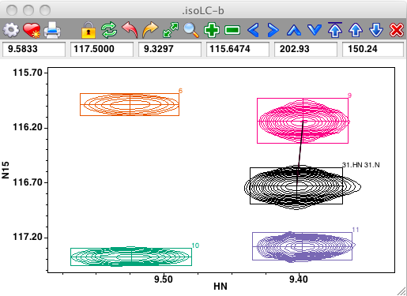

Peaks can be interactively linked on the spectrum display. First, ensure
that the cursor is in the selection mode, and then select two peaks by
clicking on the first, and shift-clicking on the second. Now use the
Peaks - Link menu item from the Spectrum pop-up menu to link the
selected peaks together. If link display is turned on you'll now see a
line connecting the linked peaks. Remember that peak linking (or sharing
of a common resonance) actually happens at the level of peak dimensions.
The code invoked from the Peaks - Link menu item chooses only one
dimension to link. This will be the dimension, chosen between that
displayed on the x axis, and that on the y axis, with the minimum
chemical shift difference between the two peaks. In the example below,
where the two peaks on the left side of the spectrum are selected, the
link will be formed between the HN dimensions of the peaks.

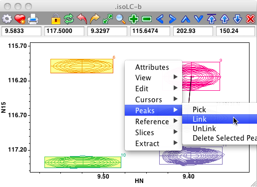

Links between peaks can be removed in a similar manner, just select the
two peaks and choose the Peaks - Unlink menu item.

##Interactive Peak Assignment

You can type assignments directly onto peaks in the spectrum. To do
this, put the crosshair in Selector mode, and then select one or more
peaks on the spectrum. Now, the normal keypress bindings of the spectrum
window are skipped. Instead the characters you type are considered as an
assignment of the peak. As soon as you start typing a yellow rectangle
will appear on the window and the text you type will appear in the
rectangle as shown here.

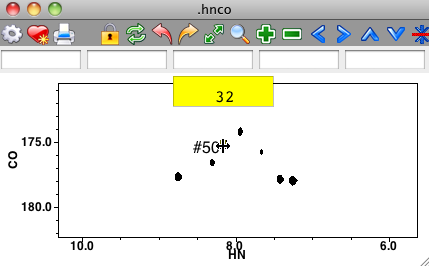

Assignment will not be done until you hit the Return key. If you pause
in this process for more than a few seconds, or hit the Escape key, the
entry will be canceled and the yellow rectangle will disappear. You can
assign individual dimensions of the peak by separating the assignment
labels with a comma. Typing "**32.h**" would assign the first dimension,
typing "**,32.c**" would assign the second dimension, and "**,,32.n**"
the third dimension. You can assign more than one dimension at a time:
"**32.h, 31.c,32.n**".

The process works particularly well if you've set up an appropriate
pattern for the peak list. For an hnco experiment you might have a peak
pattern of **"i.h i-1.c i.n**" indicating that the first and third
dimensions ard the amide proton and nitrogen of one residue, and the
second dimension is the carbonyl carbon of the previous residue. In this
example, you could simply type "**32**" followed by a Return and all
three dimensions would be assigned to "**32.h 31.c 32.n**". More than
one peak can be selected, so if you selected all the peaks in a vertical
stripe of an 15N noesy and typed "**32**" then they would all have their
direct proton dimension set to **32.h** and nitrogen dimension set to
**32.n**

Sometimes you'll want to work in a spectrum window without this effect
in action. You can turn off this behavior by deselecting the "Extra key
bindings" preference in the Spectrum Preference panel.

You can also use the Peak Identify tool directly from the spectrum. Just
position the mouse cursor (in either crosshair or selector mode) over a
peak (don't actually select it) and hit the i key. The Peak Identify
tool will appear immediately to the right of the peak and suggest a list
of possible assignments.

Users are generally quite familiar with data relating to peaks and
atoms, but less so with resonances. NMRFx Analyst now has a table to display
and manipulate some key properties of resonances and their relationship
to peaks and atoms. The Resonance Table is accessible from the Resonance
Table menu item in the Analysis Menu. The columns in the table are as
follows:

id

:   A number that uniquely identifies each resonance.

label

:   A textual label describing the resonance. This is normally set when
    you enter a label value for a peak dimension. Labels are typically
    set in the Peak Inspector, by means of some script such as those
    used in RunAbout, or directly with the nv\_peak elem dimNum.L
    command. Any resonances linked to that dimension will receive that
    label (actually the the label really only exists on the resonance
    itself, setting the peak label sets the corresponding resonances
    label. That way all peak dimensions linked to the same resonance
    have the same label). There are no constraints on what the label is,
    but generally it is a good idea to stick to the residue.atomName
    convention. That makes it easier to actually assign the resonance to
    an atom at a subsequent step of analysis. The label field can be
    empty (and initially is for a new resonance).

atom

:   The atom that the resonance is assigned to. This will appear as the
    formal "fully qualified" name of the atom, thus specifying a
    specific atom (even in a multi-component molecular system).

peak

:   One of the peaks that the resonance is linked to. A given resonance
    can be linked to multiple peaks so the choice of what peak to show
    here is somewhat arbitrary, though it is done in a way that
    resonances linked to peaks of the same lists, will show a peak of
    the same list. A pop-up table showing all the peaks linked to the
    resonance will be available in a subsequent version of NMRFx Analyst.

dim

:   The label for the peak dimension to which this resonance is linked
    (as multiple peaks linked to one resonance could have different
    labeling schemes, the label shown is that from the peak given in
    the previous column).

npeaks

:   The number of peaks that are linked to this resonance.

ppmavg

:   The average value of the chemical shift of all the peaks that are
    linked to this resonance.

ppmdev

:   The standard deviation of the chemical shifts of all the peaks that
    are linked to this resonance.

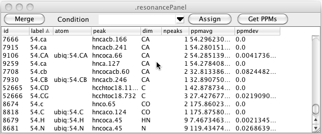

As can be seen in the figure above there can be multiple resonance that
have the same label. This is entirely dependent on how you (or some
script) entered labels for the peaks. Clicking the Merge button will
merge together all resonance that have the same label. The atom
assignment must be the same for any of the resonances that already have
an atom assigned. Furthermore, the chemical shift of the resonances must
be similar. After merging the data illustrated here the table looks like
this. You can see that resonances 7666, 7915, and 9259 (all with label
54.CA) have been merged with resonance 9106 (also with label 54.CA and
atom 54.CA).

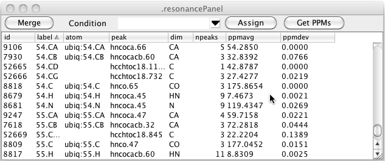

In the above table you can see that there are still resonances, like
52665, that have a resonance label, but no atom label. Clicking the
Assign button will search through all resonance like this, and if the
resonance label uniquely identifies an atom in the current molecular
structure, the resonance will be assigned to that atom as shown here.

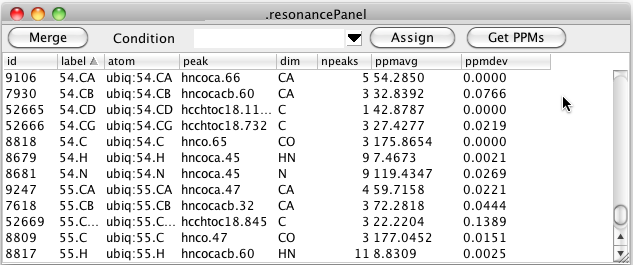

## Peak Conditions

Peak lists may be derived from datasets collected under a variety of
different conditions. You may want to view the chemical shifts for given
resonances averaged peaks from only a certain set of experiments. In
NMRFx Analyst you can assign a condition label to each peak list in the Peak
Reference dialog. Click the menu arrow to the right of the **Condition**
field and choose New... to get a input dialog in which you can enter a
name for a condition. At present these are just names (without an
associated set of parameter values).

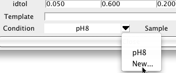

Having assigned a sample condition to one or more peaks you can choose
that condition in the Resonance Table. All resonances are still
displayed but the peak shown, number of peaks and the chemical shift
average and standard deviation are derived only from peak lists with
that condition label.

You can change the chemical shift that is assigned to atoms by clicking
the Get PPMs button. This will scan the resonance list for any
resonances that have assigned atoms (not just labels) and set the
chemical shift of that atom to the average of all the values of the
corresponding dimensions of peaks linked to that resonance. By using
different conditions you can set the chemical shifts of the atoms to
values found in the different conditions. The underlying code of
NMRFx Analyst allows atoms to have multiple chemical shift values, but we
have not yet provided easy access to that information via the GUI. At
present, therefore, using this command will replace the "default"
chemical shift of the each atom.

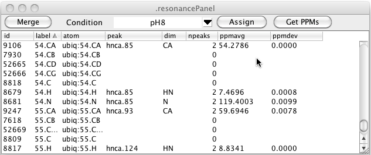

The resonance table shows you the name of one linked peak, and how many
total peaks are linked to that particular resonance, but you may want to
see a list of all the peaks that are linked. You can easily get this by
double-clicking on one row in the resonance table. A window will appear
with a list of all the peaks linked to that resonance, their assignment
labels, and chemical shift positions. Remember that resonances are on a
per peak dimension basis so the peak entries in the list will have a
format like *listName.peakIDNumber.dimensionName*. You can unlink one
peak from the remaining peaks with this list as well. Just select one
peak and then click the Active Dim or All Dims button. The former button
will just unlink the single dimension referenced in the peak name (HN as
shown here), whereas the latter button will remove links from all the
dimensions the peak has. You can also display and use this list from the
Peak Inspector. Just double click on the Resonance field for the
dimension you want to show linked peaks for.

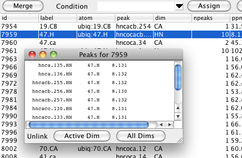
