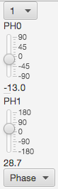

## Controls

Spectra can be phased (after adding processing operations that convert the time domain to frequency domain data) by using the phasing tool that can be displayed (by clicking the Phases button in toolbar). The zeroth order phase correction is controlled by the top (PH0) slider and the first order correction is controlled by the bottom (PH1) slider. Before using the PH1 slider you should set the pivot point. This can be done by first clicking the left mouse button to create a vertical crosshair and dragging it to the desired position. Then choose "Set Pivot" from the Phase menu which can be found at the bottom of the Phase tool. 

The phase menu includes the following options the options listed below. **Note: At present you cannot automatically phase the spectrum if you have done anything to make the data real (adding the REAL operation, or a baseline correction operation)**

Set Pivot

:    Sets the pivot position to the location of the currently displayed black, vertical crosshair

-90,180

:    Sets the current phase values to -90 degrees for the zero order value, and 180.0 degrees for the first order value

AutoPhase 0

:    Automatically calculate the value for the zero order phase parameter. Note the algorithm used here was designed for small-molecule spectra, and may work poorly in complex, low signal-to-noise protein spectra with water signals.

AutoPhase 0,1

:    Automatically calculate the value for the zero and first order phase parameters. Note the algorithm used here was designed for small-molecule spectra, and may work poorly in complex, low signal-to-noise protein spectra with water signals.

AutoPhase By Max

:    Automatically calculate the value for the zero order phase parameter. This algorithm finds a phase value that maximizes the amount of signal above the baseline. If there is a significant water signal that is out of phase with the other signals it is recommended that you include a solvent suppression operation (like TDSS).
