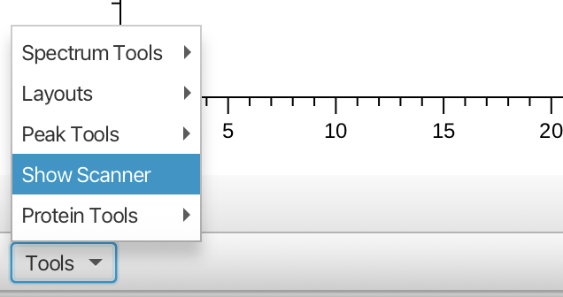
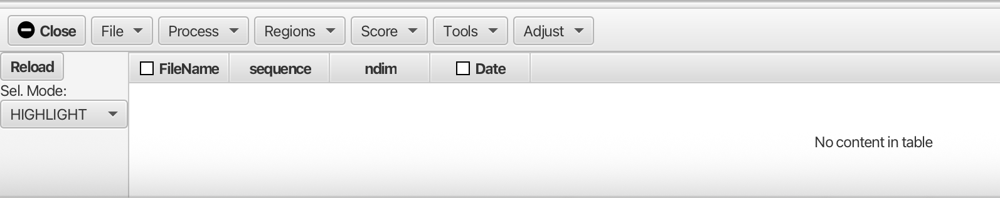
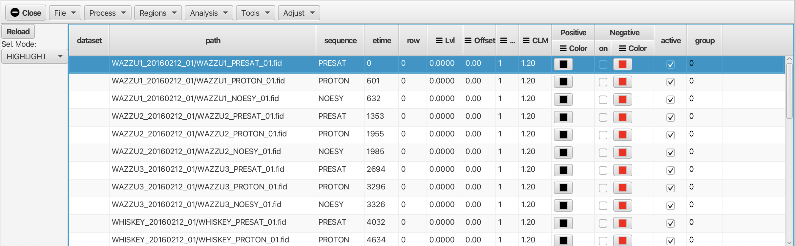
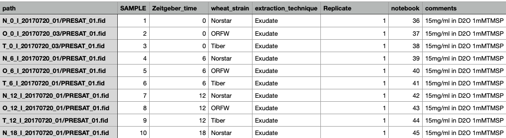
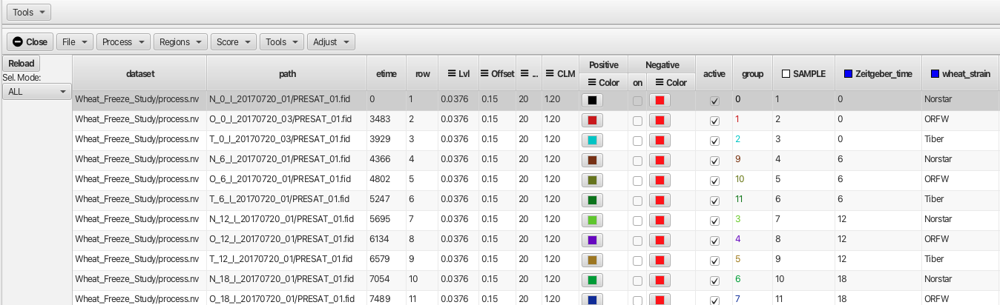
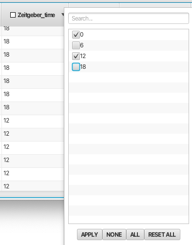
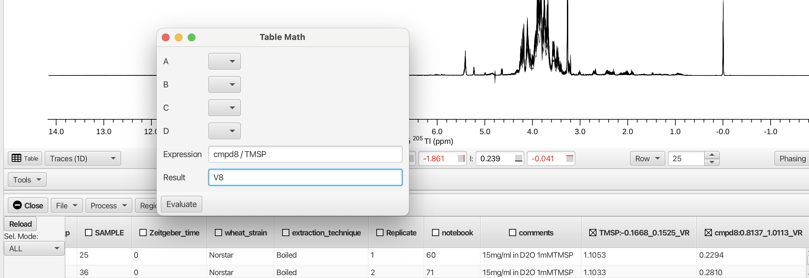
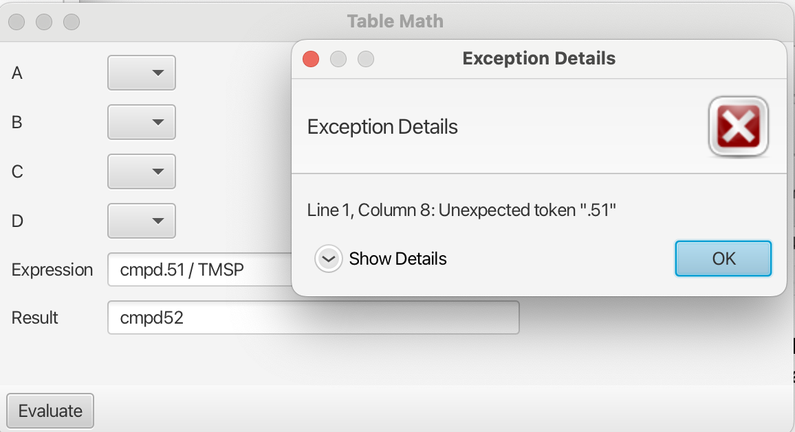
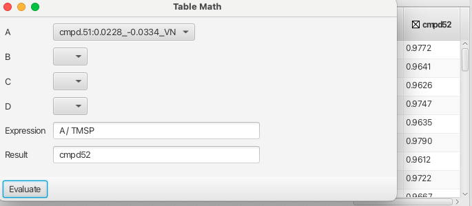
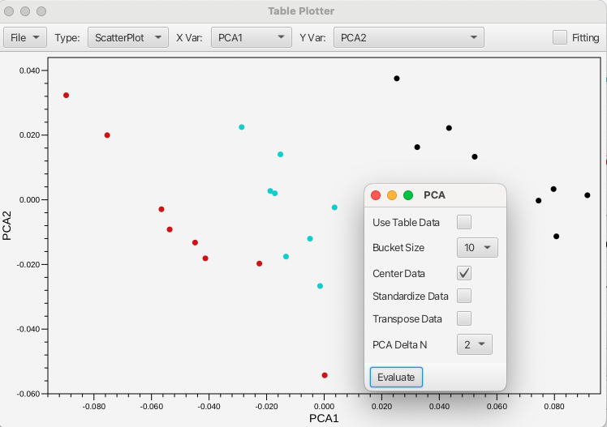

The Scanner Tool can be used to process, visualize and analyze groups of spectra.  Intensity and integral measures are stored in a table and this tabular data can be exported for use in other applications. 

An example of the use of the Scanner tool is available in a [tutorial](/13.tutorials/02.scanner_wheat) on the analysis of NMR metabolomics data from Winter Wheat.

The Scanner Tool is accessed from the "Tools" menu in the lower left of the main spectrum window as follows:

 

Opening the Scanner Tool gives the following empty table and menus:

You can either scan a directory of files ("File -> Scan Directory...") to identify all the NMR datasets in the folder or load a table (text file) that lists the locations of the files and any metadata about each file.   When scanning a directory for files the scan is recursive, so folders containing folders are searched.  

After loading the table via "Scan Directory" the Scanner window will contain a table listing all of the available files.  At a minimum, the following columns in the table will be poplulated.

*   path: The file system path to the file.
*    sequence: The pulse sequence used to aquire the data
*   ndim: The number of dimensions in the data
*   etime: The time the dataset was collected, in seconds from the time of the first (in chronological order) file
*   row: Processed files can be placed into a single dataset file.  This gives the row in the file (or plane if the data is 2D).
*   dataset: This gives the name of the dataset containing the processed data for this dimension. 

The path column is the directory (or sub-directory) containing the NMR data file.  The actual file location is relative to the specified (with the Set Scan Directory item in the File menu) scan directory.  For example, if the Scan Directory is set to

/Users/helms/NMRFx/data/Skinner_USDA/1D_Scanner

a path entry of "T_6_1b_20170720_01" will specify a file at

/Users/helms/NMRFx/data/Skinner_USDA/1D_Scanner/T_6_1b_20170720_01

Scanning a directory would populate the table in a way that looks similar to the following example:

Information in the **sequence**, **ndim**, and **etime** columns will be automatically populated when the directory is scanned.  The appropriate parameter files will be examined to extract this information.  The **etime** field is calculated from the time each dataset was acquired.  The first dataset will given a time of **0** and subsequent datasets will have an **etime** value equal to their acquisition time minus that of the firrst dataset (in seconds).

The **row** and **dataset** columns will be empty until the data is actually processed.
In this case the data have not been processed yet so the "dataset" and row columns are empty.

If you load data via a table file, your table file can contain additional columns that will appear in this table. An example created in a spreadsheet application is shown below:

The table can be saved either as a .csv or .tsv text file which can be opened using the "File -> Open..." menu. In the example shown the additional metadata categories are SAMPLE, Zeitgeber_time, Wheat_strain, extraction_technique, Replicate, notebook and comments. These additional columns can be used for grouping and sorting of the data. In this example the data have been processed so that the "dataset" and "row" columns are populated.

The Scanner Table can be used to update the current spectrum display.  The method for doing this depends on what data is available and the state of the Processor Controller Window.  If the Processor Control window is open, and it's display mode is set to FID you can load the corresponding dataset by double-clicking on a table row.  The FID will be loaded and the current processing script will be applied.

If the Processor Control window is hidden, or it's display mode is set to Dataset the spectrum chart is updated as you change which rows of the table are selected.  For this to work, processed data must be available for each row.  Just click once to select a single row, shift click to add a range of rows, or Command-click to select a multiple, possibly non-contiguous, rows.

The table can be sorted by clicking on the column header.  Clicking a second time will invert the sort order and a third time will remove the sorting.

The Scanner Table rows can be filtered based on their values. This is very useful to exclude certain rows based on a variety of criteria.  Right click on the column header to bring up a filter list with entries for each unique valu in the column.  Deselecting an entry and clicking **Apply** will hide all rows with that value.  You can deselect all values by clicking **None** and select all values by clicking **All**.  Filtering can be applied in multiple columns.  Any filter choice can be undone using the option **RESET ALL**.Any columns with filtering active will have a Yellow checkbox displayed in the column header. For columns with many types of entries the user can use the "Search..." box at the top of the filter pop-up to look for instances of a given filter type. An example of filtering is shown below using the Zeitgeber_time column:

It can be useful to permanently apply sorting or filtering.  After you've set up sorting or filtering choose the **Purge Inactive** entry in the **File** menu.  Any rows that have been filtered out of the display will actually be removed from the table.  The current sort order will be applied to the actual data values so they will have this order without any sorting applied.

The datasets displayed can be managed with the "Sel Mode:" selector in the upper left corner of the Scanner Tool. The three modes are "All", "Highlight" and "ONLY". Selecting "All" will display every row spectrum in the table. The "ONLY" selector will display only those rows selected by clicking on the. The display will be either one spectrum or can display a continuous range if the shift key is held down while selecting. If a non-contiguous selection is needed the command key can be used to select multiple spectra. The "HIGHLIGHT" selector can highlight a given spectrum or multiple spectra when all of the rows are displayed. The linewidth is increased for the "selected" row effectively highlighting the choice as shown in the following example.

The table can be saved to a text file with **Save Table...** entry in the **File** menu.  Saved tables can be reloaded with the **Open Table...** entry.  When loading a table that has row and dataset entries the dataset in the first row of the table will be opened and displayed in the spectrum chart.

## Menus

### File

Scan Directory...

:    Search through the **scan directory** (specified with the "Set Scan Directory" menu item) and sub--directories to find a list of NMR datasets (with fid/ser files). The names of all the found datasets will be displayed in the Table tab.  If a **scan directory** hasn't already been specified a directory chooser will be displayed which you can use to choose one.

Open Table...

:    Load a table file that contains the locations of the data files that should be opened.  Additional columns can describe additional metadata about the datasets.  See information below about the format of the file..

Save Table...

:    Save the current table to a text file.

Purge Inactive...

:    Remove data rows which are not selected by filtering the column values. These column entries are not "active" and will be removed from the table.

Load from Dataset...

:    Load table information from a processed dataset.

Load Column...

:    Load an additional column into the table from a text file. This column can be created as a tab separated text file. The title of the column will be derived from the filename and should not be included within the tab separated entries.

---

### Process

Load Row RID

:     Load the FID for the currently selected row. This will open the "Processor" and file dialog.

Process and Combine

:    Process all the datasets using the current script. The processed files will be combined into single dataset.  If the original data files are one-dimensional a pseudo-2D dataset will be created, with one row for each original dataset.  If the original data files are two-dimensional, then a pseudo-3D dataset will be created, with one plane for each original dataset.  A pop-up dialog will allow for the creation of a directory (default **output**) to place the The dataset created (default **process.nv**). The table created for the "Process and Combine" operation is **scntbl.txt** and can be used with the "Open Table" menu choice to load the dataset.

Process 

:    Process all the datasets using the current script.  The processed data will will be placed in a series of files named **processN.nv**, where N is the table row number (counting from 1).  The files will be written into the directory specified with a pop-up dialog box. The default directory is **output**. Again, the table file that is created with the "Process" menu choice is **scntbl.txt** which loads the **N** rows of spectra.

Combine

:    Combines the separate **processN.nv** into a single .nv file. A file-save dialog will open to prompt for a filename for the combined dataset. Note: the filename should be given the .nv extension. The dataset column of the table will show the entry will change from output/processN.nv to that of the combined dataset. 

 
---

### Regions

The Scanner Tool can be used to measure intensities and integrals across specified regions of all the dataset rows referenced in the table.  Measurement is performed by selecting a region of the spectrum with the vertical crosshairs and choosing **Add Crosshair Region** from the Scanner Tool's "Region" menu.  The exact measurement performed is based on choices in the **Measure Modes** and Offset Modes also found in the "Region" menu.  Measured values, stored in the table, can be analyzed using the integrated R scripting capability.

Add Crosshair Region

:    Opens a dialog for adding a column to the table corresponding to the region between the currently displayed vertical crosshairs. The type of measurement is set by the "Measure Modes" value (Volume, Maximum, Minimum or Extreme) and the "Offset Mode" (None, Region, Window). The column header then displays name:chemshiftmin_chemshiftmax_measuremode offsetmode, i.e. 
compound1:1.2456_1.3678_VR which gives the name as compound1, the chemical shift range of the region and that it was measured as Volume and the offset mode was set to Region (a local baseline correction was done based on the edges of the region). The measured values for each row are then displayed in the table. If no name is given the column will be labeled as V.n:, where *n* is an index incremented for each new column (V.0:,V.1: etc.).

Measure Modes 
     
*  **Volume**: The integral of intensities across the region of the dataset row between the vertical crosshairs.
*  **Max**: The maximum intensity in the region of the dataset row between the vertical crosshairs.
*  **Min**: The minimum intensity in the region of the dataset row between the vertical crosshairs.
*  **Extreme**: The intensity with the largest absolute value in the region of the dataset row between the vertical crosshairs.

Offset Modes

A local baseline correction can be done based on the state of the **Offset Modes** setting.  A local correction is useful when the measured region is "riding" on a hump or other baseline distortion.  The baseline can be calculated locally and subtracted without needing to apply a baseline correction to the entire spectrum.  The following choices are available:

*  **None**: Don't do a baseline correction.
*  **Region**: Subtract a baseline correction based on the intensities of the points at the edge of the selected region (as defined by the crosshairs).  In the intensity modes (Max, Min, Extreme) the interpolated intensity at the position of the measurment is subtracted from the measured value.  In the volume mode, the integral of a line between the edge points is sbutracted.
*  **Window**:  This works the same as the **Region** mode, except the edge points are taken to be the edge of the display window.  This allows using a different region for defining the measurement and for defining the local baseline.

After the measurement is performed, the table is updated with the new measurment values. 

Save Regions...

:    Opens a file save window that allows the user to save the defined regions as a plain text file.

Load Regions...

:    Opens a file window that allows the user to load the defined regions for (re)measurement.

Measure All

:    Applies the measurement mode and offset mode to all of the defined regions.

Show All

:    Posts yellow bars across the defined regions for any displayed spectra.

Clear All

:    Clears all defined regions and measurements. All columns are removed from the table.

### Analysis

Table Math...

: Opens a pop-up window that allows the user to perform mathematical operations on numerical contents of table columns by creating an expression and clicking "Evaluate". Variables used in the expression can be taken from the column headers.

As an example, the columns containing the measured integral values for the region bounding the TMSP peak and the region for cmpd8 (0.8137 to 1.0113 ppm) are shown. Creating an expression dividing the integral for cmpd8 by the integral for TMSP and recording the result in a new column V8 is given by:

Note: the expressions can be constructed using the heading of the column preceding the ":" and omitting the remainder, i.e. cmpd8 instead of cmpd8:0.8137_1.0113_VR. The column headers must be "acceptable" Java variable names. For example Onetest is an acceptable variable however 1test is not. Variable names containing a period "." are also not acceptable and will create an error upon evaluation as shown:

Columns headed with unacceptable variable names can still be used by placing them into one of the four placeholders A to D which can be used to form expressions as shown:

 
Columns containing numerical data that are used for spectrum sorting such as "Zeitgeber_time" are acceptable variables for building expressions as are the column headings "row" and "etime" and "group".

More sophisticated mathematical operations can be accessed by using the java Math class (https://docs.oracle.com/javase/8/docs/api/java/lang/Math.html) with acceptable variables as shown in this example:

Principal Component Analysis...

:    Opens a pop-up window for performing a [Principal Component Analysis](https://en.wikipedia.org/wiki/Principal_component_analysis) on the area bounded by the crosshair cursors. The PCA is performed using either the data contained in the table (Use Table Data checkbox selected) or will use bucketed values (where the bucket size being selected between 1 to 20). The data can be centered, standardized or transposed using the associated checkboxes. The results of the PCA are presented in the Table Plotter as PCA1 along the X axis and PCA2 along the Y axis. The plot can be changed to give any of the principal components up to PCA5. 

Use Table Data

:    Checkbox to use the column data for spectral area bounded by the crosshair cursors. The tabulated values, which have been selected by the user as pertinent regions are used to construct the PCA. The data can be centered, standardized or transposed using the additional checkboxes.

Bucket Size

:    Adjacent data points can be averaged into a single value prior to building the matrix used for the PCA.
This reduces of the matrix and helps reduce the affect of misallignment between spectra. The method also requires no intervention from the user beyond definition of the spectra region (bounded by the crosshair cursors) to be analyzed.  The value specified here determines the number of adjacent values
that are combined.  A value of 1 indicates that no combination of adjacent points should be done.

Center Data

:    Centers the data distribution about the origin by subtracting the mean of each variable is subtracted form each data point. This keeps dominant components of the dataset from skewing the first principal component.

Standardize Data

:    Divides the centered data by the standard deviation of each variable. This is useful for datasets where the scale of each variable may be orders of magnitude in difference. Data that is not standardized may then be skewed by variables with a larger scale relative to others.

Transpose Data

:    This value causes the matrix of data to be transposed prior to performing the singular value decomposition.  This is generally not necessary and is mostly provided for experimentation.

PCA Delta N

:    After the PCA is performed the distance in principal component space can be calculated relative to the PC values of the currently selected table row.  Plotting this value realtative to some known parameter can show a trend in the data.  For example, plotting this distance relative to the ligand concentration (for 2D spectra of titration experiments) gives a trend similar to a binding curve.  This parameter specifies the number of PC values used in calculating the distance.

Peak Minimum Chemical Shift

:    Performs a minimum chemical shift calculation when you have a set of spectra (generally performed on 2D HSQC spectra) with picked peaks.  For each peak in the reference peak list the algorithm finds the closest peak in a second peak list. This gives the Minimum Chemical Shift (MCS) value for each peak.  Assuming the peaks have moved (not disappeared) due to some perturbation (ligand binding, pressure etc.) the peak has moved at least that far.  This allows
an estimate of how far peaks have moved, without needing to assign the peaks in either list.  The average value (across all peaks in the reference list) is
reported in a new MCS column in the table.  Spectra that are more similar (whose peak positions have been perturbed less), will have smaller MCS values (
relative to the reference peak list). The reference list is the first selected list in the table (or fist list in the table if none have been selected).

Cosine Score

:   Calculate the [Cosine Similarity](https://en.wikipedia.org/wiki/Cosine_similarity) between a reference spectrum and each of the other spectra.  This is
only appropriate to 1D spectra. The region between the crosshair cursors is divided into 100 buckets and the sum of the points in each bucket becomes an
element of a math vector.  The Cosine Similarity is then calculated between the reference vector and all other vectors.  The resulting scores (which can range from -1.0 to 1.0) is entered into a new table column named ***score***.  The reference spectrum corresponds to the first selected row (you must select at least one) in the table.

### Tools

Show Plot Tool

:    Opens the Table Plotter window that allows the user to plot values present in table columns. Any two columns can be plotted against one another including those numerical values used for grouping.

File...    
    
    Export SVG...	Exports the plot as a SVG file.

Type

    Plot types are Scatterplot or Boxplot.

X Var

    Sets the X axis variable to any of the numerical value columns.

Y Var

    Sets the Y axis variable(s) to any of the numerical value columns.

Fitting

    Check box used for fitting the scatterplot table values to various equations.

Show Diffusion Tool

:    Opens the Table Plotter window with additional tools for diffusion analysis.

Show TRACT Tool

:    Opens the Table Plotter window with additional tools for determining rotational correlation times.

### Adjust

Contains tools for normalization of data as well as alligning spectra.

**Normalize**

To Max

:    Normalizes the values contained in the columns to the maximum value.

To Median

:    Normalize to the median value.

To Integral

:    Normalize to the total integral.

Undo

:    Undoes the applied normaization.

**Align**

By Max

:    Shifts each spectrum so the position of maximal intensity within the crosshair region matches that in the reference spectrum. The actual
shift of the spectrum is done with a circular shift operation.

By Covariance

:    Shifts each spectrum so that they have a maximal covariance value with the region between the crosshairs in the reference spectrum. The actual
shift of the spectrum is done with a circular shift operation.

Segments

:    Experimental tool to align entire spectra based on segments.  Unlike the Max and Covariance methods this cannot currently be undone as it is
not a simple circular shift of the entire spectrum.  

Undo

:    Undoes the applied alignment method.
