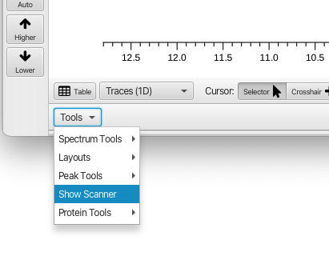
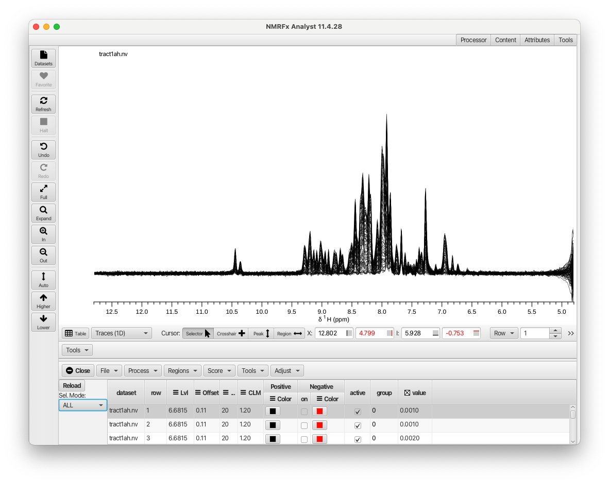
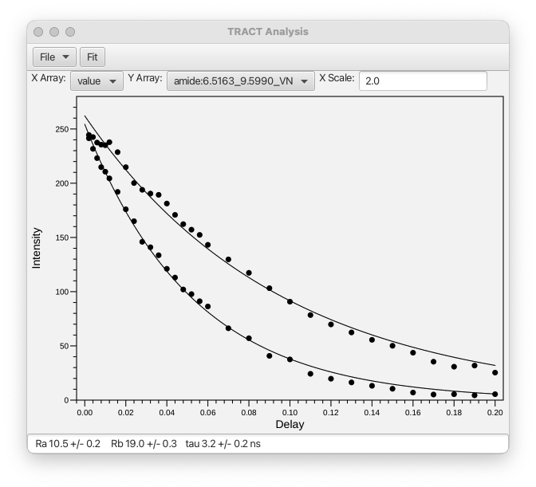

1.  Process the arrayed spectrum
2.  Open the Scanner tool

    
3.  Use the table to adjust your view.  Here the Mode is set to All so all rows 
    of the spectrum are shown.  You can use the Trace controls in the Attributes panel to adjust vertical offsets etc.

   

4. If your data is from a Bruker instrument and the data directory has a *vdlist** file  it will have been read and the scanner table will
have a values column corresponding to the relaxation delay times.  Otherwise create a text file with the delay values on each row.  You can
use the *Load Column* menu item from the Scanner Tools File menu to load that file in.

5. In crosshair region mode drag out a region of interest.  You'll get a pop-up asking for a column nname and the integrals will be added to the table
   As an alternative to dragging out the region, you can ue the cursor in crosshair mode to position the vertical crosshairs around a region of interest
and then use *Add Crrosshair Region* in the Region menu. You can extract integrals from multiple named regions and choose which ones to use in the analysis.

6.  From the Tools Menu (in the Scanners tool bar), choose *Show TRACT Tool".  A plot tool will appear.  Use the *X Array* and *Y Array* menus to
select table columsn for the delay (X) and integrals (Y).  Eter a value in the *X Scale* entry to scale the delay values as needed.  In this example
a value of 2.0 is appropriate.

   

7.  Click the **Fit** button to perform the fit.  The status bar at the bottom of the plot will display the two relxation rates and the calculated
tau value (with errors).

   

