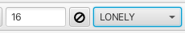

## Menus

The RunAbout tool is accessed via the "Tools" menu in the lower left corner of the main window. RunaboutX consists of two tabs, "Configure" and "Helm" as shown below:
	

In the "Configure" tab the main space is dedicated to displaying the peak lists that will
be used for the assignment process. The peak lists reflect the data sets opened for the 
project. 

# Top Level Menu Bar Configure

**Close**

:	Close the RunAbout Tool

**Ref List** Menu

:	Accompanying pull down menu allows for selection of the peak list that will become the 
	main list that the assignment process works from. This is typically the HNCO experiment
	or in the absence of an HNCO peaklist an HSQC peaklist can be used.

**Inspector** Button

:	Upon selection of one of the peak lists in the main table the "Inspector" button opens 
	a separate window as shown:
	

	The "Inspector" is a multi-functional tool for performing a number of operation on peaks 
	and peaklists. A more indepth description can be found here.

**Refresh** Button

:	Updates the "Pattern" in the experiment table if changes are made for a pattern in the 
	"Inspector".

**Guess** Button

:	Populates the "Type" and "Pattern" fields in the list of peaklists based on the name
	of the peaklist.

**Setup** Button

:	Set the values for "Type", "Pattern" and "Tolerance" into RunAbout for use in the Helm.
	Also sets the "Count" parameter.

**Arrangements..** Button

:	Opens a dialog to allow loading user defined arrangements of experiment views for linking 	of peaks.

**Tolerances** Menu

:	Pull down menu that allows the user to set the tolerances that will be used for matching 
	chemical shifts. There are three options.

	1. Calculate: This option will calculate the median line width for each dimension of each
	peaklist and set the tolerance to that value.
	
	2. Set To Defaults: This option uses the default set of tolerances for each dimension.

	3. Set To User Values: This option allows the user to overwrite the default values 
	with values set by the user. These values will be applied with the "Setup" button.

**Add Lists** Button

:	Opens a dialog to allow the loading of additional peak lists to be used in the analysis.

**Unify Limits** Check Box

:	"Unify Limits" allows for multiple spectra within a given "Arrangement" to vary the plot
	limits such that the horizontal cursors between experiment types to allign correctly.	

The "Helm" tab is shown below:
	

# Top Level Menu Bar Helm

**List** Menu

:	Sets which dataset peak list is used to step through the peak list using the 
	

forward and back arrows. Choices are set to the active peak lists being used in the analysis. 

**Arrangements** Menu

:	Provides the user with a series of views for the various data sets that assist in the 
	assignment process.
	1. HC arranges two columns of experiments, left side is HNCOcaCB, HNCOCA, HNCO, right side
	HNCACB, HNCA, HNCACO with X-axis being the amide proton view of residue *i* and the Y-axis 	gives views of the carbon shifts. The left column show peaks belonging to residue *i*-1 	while the right column show peaks belonging to both residue *i* and *i*-1.
	2. HCij arranges six columns of experiments using the same views and experiments as the HC
	arrangement described aove. The leftmost column displays crosspeaks belonging to the
	spinsystem *i*-1 (HN, CO, CA, CB) whereas the second column from left displays the 	crosspeaks belonging to both residue *i*-1 and residue *i *, both columns based on the 	amide proton shift of residue *i*-1. The middle two columns display similar information
	but based on the amide proton shift of residue *i*. The rightmost two columns displays
	crosspeaks belonging to residue *i* as well as residue *i*+1 (residue *j*) based on the
	chemical shift of the amide proton for residue *j*.
	3. HCij_CACB arranges six columns as the HCij arrangement but omits the HNCO and HNCACO 
	experiments so as to concentrate the view on only the CA and CB crosspeaks.
	4. HCij_CB focuses the view on the HNCOcaCB and the HNCACB experiments.
	5. HCij_CA focuses the view on the HNCOCA and HNCA experiments.
	6. HCij_C focuses the view on the HNCO and HNCACO experiments.
	7. HCNC affords the same views as in the HC arrangement but supplements each with the 
	view from the nitrogen shift of residue *i*. This arrangement affords a view where the 
	notrogen chemical shift allows for separation of crosspeaks that may be overlapped in the
	amide proton view.
	8. HN provides the HN plane centered at the proton and nitrogen shifts for residue *i* from 	the same experiment set as in the HC arrangement.
	9. HNfull provides an overlay of all of the HN planes for the each experiment. This view
	is useful for establishing the contour levels and general insoection of the data.

**Actions** Menu

:	Provides the tools used to arrange the peak lists and spectra into spinsystems which
	can be assigned into positions on the protein sequence. The "actions" are meant to be
	applied starting at the top and working down through the menu items.

	1. Show Ref Chart: Opens a separate window that displays the HN plane for the "Reference
	List" experiment (usually the HNCO). The displayed peak is the amide proton/nitrogen 
	crosspeak for residue *i* and corresponds to the peaklist numbering in the HNCO peaklist.
	The crosspeaks can be advanced using the forward and back arrows. The peak number will 
	change to an assigned value upon confirmation of the assignment into the protein sequence.

	2. Align: Allows for alligning cross peak chemical shifts that are slightly off in the 
	referencing between the various experiments. This action seeks to line up the chemical
	shifts for cross peaks onto the amide proton/nitrogen cross peak of the HNCO experiment
	so that the chemcial shifts of all correlated peaks are within the tolerances specified.
	The chemical shift referencing of peaks in the alligned peak lists are then updated to 
	reflect the changes. 
	
	3. Filter: This action seeks to filter out spurious peaks and artifacts. Filter compares 
	each peak list to the "Reference" list (HNCO) and removes peaks that do not match 1H and
	15N chemical shifts founf in the reference list. When filtering, RunAboutX looks at whether
	a peak is within 2 times the tolerance value of a reference peak and if not that peak is
	deleted from the list. The increase in tolerance value minimizes the risk of erroneously
	removing peaks that are valid but slightly misalligned.

	4. Assemble: This action will group together peaks from the peak lists that contain the
	same amide H and N chemical shifts. This effectively determines which peaks in different
	peak lists belong to the same residue as well as determine which peaks may be inter-
	residue as opposed to intra-residue for certain peak lists. The peaks are "clustered" 
	based on the tolerance values set up for each list. Each cluster must also have only one
	peak from the reference list and this peak number is used as the cluster identifier. The 
	"Assemble" action also populates a new "spinsystems" entry into the "List" menu. Choosing
	the spinsystem option n the "List" menu displays a series of letters above each dataset
	that correspond to the expected correlations for that experiment and whether or not
	the correct number has been found. A green bar and the number 0 indicate that all expected
	correlations have been found whereas a red bar under a given correlation (i.e. the cb-1)
	and the number -1 indicates that the C-beta correlation for the *i*-1 pattern is missing
	from the HNCACB spectrum for the *i*-1 column. The number may also be positive meaning 
	RunAboutX has found more than the expected correlatons. Right clicking on any crosspeak
	brings up a pulldown menu that allows for either opening the peak inspector or gives the
	best guess as to the pattern identity of the crosspeak, i.e. the CB of residue *i*-1.
	

	5. Combinations: This action examines each cluster and attempts to assign the cluster to 
	a given amino acid type. This action also seeks to determine which cross peaks belong to
	residue *i* or to residue *i*-1. The conection between clusters based on the identity of 
	a crosspeak going back to residue *i*-1 is given by a green line between the current 
	cluster being examined and the previous cluster (to the left). A blue line between cross
	peaks indicates a connection between a cluster and the successive cluster.
 
	6. Compare: Compare is the action that seeks to link up clusters in a way that the peaks
	can be assigned to amino acids in the protein sequence. At this point in the analysis the
	clusters can be more correctly thought of as spinsystems that are linked into the amino 
	acid sequence. Important aspects of the Helm after the "Compare" action has been taken are
	shown below:
	

	The cluster under current inspection is shown in the window (1). In this example it is 
	cluster 19 and the chemical shifts for the current cluster are given by the capital 
	letters designating the amide H, N, the carbonyl (C) and the CA and CB with the chemical
	shifts given for each atom (blue box). The cluster being analyzed can be advanced using
	the arrows or by clicking on any cluster in the linear display of clusters. 
	The best match on the N-terminal side *i*-1 is
	given on the left side, in this example cluster 47 (2) and the lower case letters 
	designating the carbonyl (c) and the ca and cb with the chemcial shifts given for each
	atom (red elipse). The best match for the C-terminal side *i*+1 is given on the right
	side, in this example cluster 21 (3). The match probability is given by a score which
	spans +100 to -150 where -150 is the highet probability and +100 very low probability.
	For the current cluster the best fit for amino acid spin system is given by the list of 
	amino acids (4). Amino acids in capital letters have a higher probability of a match
	for the current cluster spinsystem. The probability is highest for a letter in lighter
	background. White background is a very high probability match and for this example,
	cluster 19 is best matched to a spinsystem for threonine (CB = 70.2 ppm, CA = 60.3).
	Hovering the mouse pointer over the chemical shifts for each atom in either the *i*-1 
	or *i* cluster gives the average of chemical shifts for the atom type from the peak
	position from all of the experiments where that peak is found. The deviation from the 
	average is also given. In cluster 47 the *i*-1 ca has a chemical shift of 52.8 ppm that is
	derived from values from 3 different experiments and has a deviation of 0.2 ppm from the 
	average.
	

	
**ALL** Menu

:	Provides tools to work with clusters. These menu choices allow the user to easily target
	clusters that are either deficient in inter and intra-residue connections or may have too
	many.  

	1. ALL: Provides a list of all clusters after the "Assemble" action. 

	2. CORRECT: Lists all cluster that contain the correct number of peaks between the *i*-1
	and *i* clusters.

	3. LONELY: After the "Combinations" action clusters may be created that contain only one
	or two peaks in the cluster. These spurious clusters are deemed "lonely" and can be 
	removed from the cluster list by clicking the circle with the slash.
	

	4. MISSING:	Lists all clusters that are missing one or more of the inter and intra-residue 
	connections. 

	5. MISSING_PPM: After the "Combinations" action this menu option lists all clusters that 
	have missing inter and intra residue connections and lists which chemical shift is missing.

	6. EXTRA: Lists all clusters that contain additional inter or intra-residue connections.

**SpinSysActions** Menu

:	Provides tools to work with clusters

	1. Split: Divides a cluster into two (creates another cluster number at the end of the 
	current enumeration) if the original cluster contains two peaks in the reference experiment
	(HNCO) and or there are a large number of extra peaks over which is expected (i.e. 20 peaks
	where 11 are expected). Overlap in the reference experiment is the biggest cause of
	additional peaks. If a peak is assigned to the new cluster and it should belong in the 
	original cluster then clicking on the peak and choosing "Move to Cluster" it will reassign
	to the original cluster.

	2. Move to Cluster: Will move a selected peak to another cluster (how to choose the cluster
	where the peak is being moved to?)

	3. Analyze: Performs the action that "Combinations" provides. Use "Analyze" to correct a
	cluster if the atom patterns have been missassigned. 

	4. GraphMatching:

	5. Trim: This tool looks at each cluster and all peaks associated with it and determines 
	how many peaks are expected to appear for each cluster for a given experiment type (i.e.
	HNCACB. If there are more than the expected number of peaks, the weakest peaks are trimmed
	from the cluster. (is this different from the previous documentation)?

	Expected number of peaks per cluster for Residue *i*-1 to Residue *i* if using the 
	HNcoCACB/CBCACONH experiments:
			*i*-1	,	*i*
		non-Gly non-Pro, non-Gly = 11
		Gly non-Pro, non-Gly = 9
		non-Pro non-Gly, Gly = 10
		non-Pro non-Gly, Pro = 0

	Expected number of peaks per cluster for Residue *i*-1 to Residue *i* if using the 
	HNcoCACB/CBCAcoNH experiments:
			*i*-1	,	*i*
		non-Gly non-Pro, non-Gly = 12
		Gly non-Pro, non-Gly = 10
		non-Pro non-Gly, Gly = 11
		non-Pro non-Gly, Pro = 0	

	6. Trim All: This tool trims all weak peaks from clusters so that the expected number of 
	peaks for each experiment type is met.

	7. Extend: Automatically extends the cluster matching if the score is good and the RAV 
	(R = Recipricol both cluster *i*-1 -> *i* and *i*-1 <- *i* both match well), 
	(A = Availability a particular cluster has not already been matched and confirmed with 
	another cluster), (V = Viable a cluster is viable with another if three or more carbon
	frequencies match one another across spectra and the proposed pair exhibit chemiscal 
	shifts conistent with a pair of residues in the protein sequence) is matched. Extend
	will arrange the extended matched clusters and color codes them.	
	8. Extend All: Examines all clusters and attempts to assemble all available clusters that
	can be matched and confirmed. 

	9. Freeze: If a fragment of matched clusters (same color clusters) looks to be well placed
	in the amino acid sequence (dark green bars underlining the amino acids) choosing the
	"Freeze" option will map the two. After the "Freeze" option is used both the cluster group
	and the amino acid sequence will adopt the same coloration and will be bounded on the top
	with a dark line.

	10. Thaw: Reverses the "Freeze" action for a given stretch of clusters.

	11. Thaw All: Reverses all "Freeze" actions.

**Controls and Information** Dashboard

: 	The RunAbout Helm main window has a number of control and information functions similar to 
	a dashboard. Several of the information functions have already been discussed in the 
	"Actions" Compare section. 

	1) Assemble and Combinations: The dashboard appears as follows after the "Assemble", 
	"Combinations" and "Compare" actions have been taken.
	

	The clusters have been "assembled" and appear in a linear row. The check boxes adjacent to
	the RAV color bars allow for the "Confirming" of the match for cluster *i* to cluster
	*i*-1. Upon confirming the connection the cluster list is reorganized and the confirmed 
	clusters are colored. In addition sections in the amino acid sequence are highlighted that
	match the cluster chemical shifts for given amino acid residues that are sequentially 
	situated. The best match is underlined with a darker color.

:	**Slider** Tool: The slider to the right of "SpinSysActions" allows for tightening or 
	loosening the match criteria for amino acid chemical shifts to a given cluster matching
	to a residue in the sequence (is it just one amino acid or is the sensitivity to the 
	chemical shifts for all 3?). In this example, sliding the slider to the right from 0.1
	to 0.249 removes the possible match into the sequence at residue 12 (TITL) and shows
	only the segment beginning at residue 55 (TLSD). Hovering the mouse over either segment
	gives a probability for the match (in the case of TLSD it is 0.748 vs 0.239 for TITL.

:	**Alternative Matches** Selection Box: A selection box tool with up and down arrows to
	the left of the *i*-1 and *i*+1 cluster numbers allows for up to 10 alternative cluster
	matches that can be explored if the R, A or V values are not green. The first choice (0)
	has the lowest score but subsequent choices may be a better match despite having a lower 
	score. If a different choice alllows for better matching via the R,A or V value then it
	may be the better choice for checking the "confirm" box. The number of atoms matching
	across the connection is given by the value N:3, in this case the carbonyl, c-alpha and
	c-beta all match between the *i* and *i*-1 clusters. In the case where either *i*, *i*-1
	or *i*+1 is Gly the value would be N:2 as there is no beta carbon in any of the HNCACB or
	HNCOcaCB experiments. 

:	**Keys** Shortcuts: vp - view pop-out, as - add peak, aa - add peak at maximum

