## Experiments

For RunAbout to be useful, a number of experiments must be performed on
a uniformly-13C/15N- labeled polypeptide. At minimum, these include the
HNCO, HNCACB, and CBCACONH (aka HNCOCACB). Redundant spectral
information, however, make assignment much easier, so several more
experiments should, if possible, be performed. These include, in order,
the HNCA, HNCACO, HNCOCA. The CCONH should also be considered, as it can
readily identify the amino acid type of many residues by their 13C
chemical shift patterns.

Extra care should be taken to acquire high-quality data for the HNCO, as
it will be used as the reference spectrum. Also, little progress will be
made if the signals are weak in the HNCACB and HNCOCACB/CBCACONH
experiments. When budgeting experiment time, it will not make sense to
skimp on these experiments. 

To begin the process of assigning spectra it is best to contain the work within the 
structure of an NMRFx Project. A project is simply a directory which
contains subdirectories for datasets, molecular structures, peak lists among
other information. Key to the NMRFx Project concept is the use of the NMR-STAR
data format https://bmrb.io/standards/#nmr-star which holds information 
on all aspects of the project in a portable and interchangeable format.
To initiate a Project, choose Save As... under the Projects menu and give a name
and location for the new project such as runaboutdocproject. This will create the 
series of directories as shown:

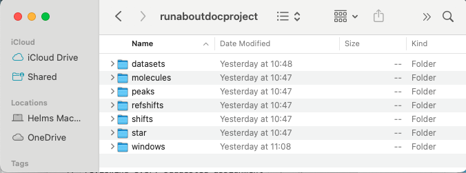

Assuming all of the datasets required for RunAbout have been processed 
the first step is to open a dataset (starting with the NHCO) using the 
File Open... dialog. The spectrum will appear in its own window. Click the 
"Z" button and choose the "Full" selection from the pull down menu to 
draw all of the planes as shown:

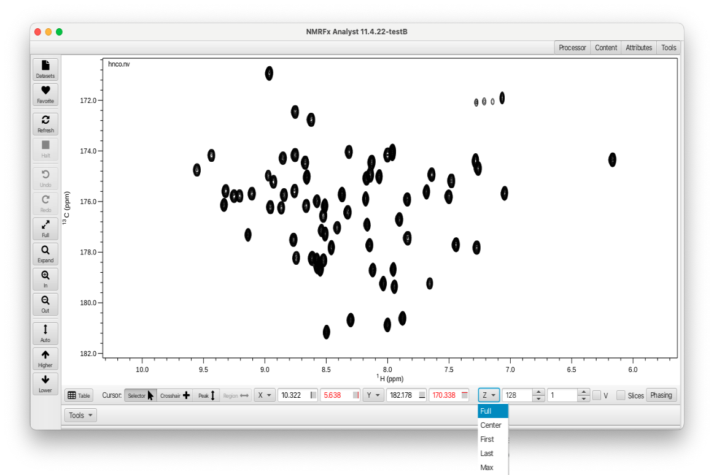

It's very important to the use of RunAbout that you assign reasonable
contour levels to each of your spectra. Whenever RunAbout assigns a
dataset to a particular window, it will use that contour level. If it's
not set appropriately your likely to see the spectrum displayed at too
high or low of a level. The same goes for setting whether negative and
positive contours should be displayed. The number of contour levels, the 
interval between contours and vertical scaling can be set using the 
Attributes tab "Contour Levels" accordion menu and the choice of displaying
positive or negative contours along with the associated color schemes and
linewidths can be set using the "Contour Appearance" accordion menu as shown:

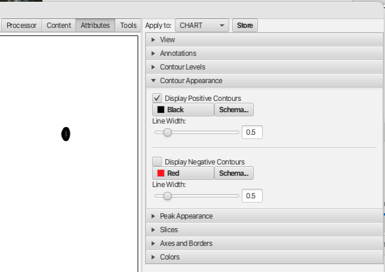

If the contour levels, vertical scaling and whether or not the negative contours
are displayed look appropriate then the values for this dataset can be saved into a .par
file by 
choosing (in the Attributes tab) Apply to: Window and then clicking the "Store" 
button as shown:

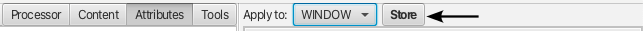

This operation needs to be repeated for all of the datasets needed for assigning
your protein via RunAbout. If you’ve already set appropriate display levels in your spectra’s .nv files, you may wish to check them by opening up “View…Show Datasets” where the scale of the datasets is shown in the figure below:

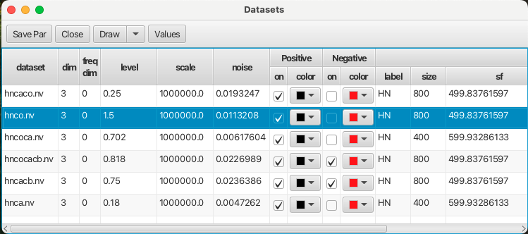

Prior to starting RunAbout the peaks will need to be picked in each of the spectra used
for assignments. Peak picking is done using the contour level and vertical scaling stored
in the .par file and it is especially important to have the peak picking done correctly
for the HNCO dataset as it will serve as the reference dataset in RunAbout. To peak pick
a spectrum open the Tools tab, open the "PeakPicker" accordion menu and click the "Pick" 
button as shown:

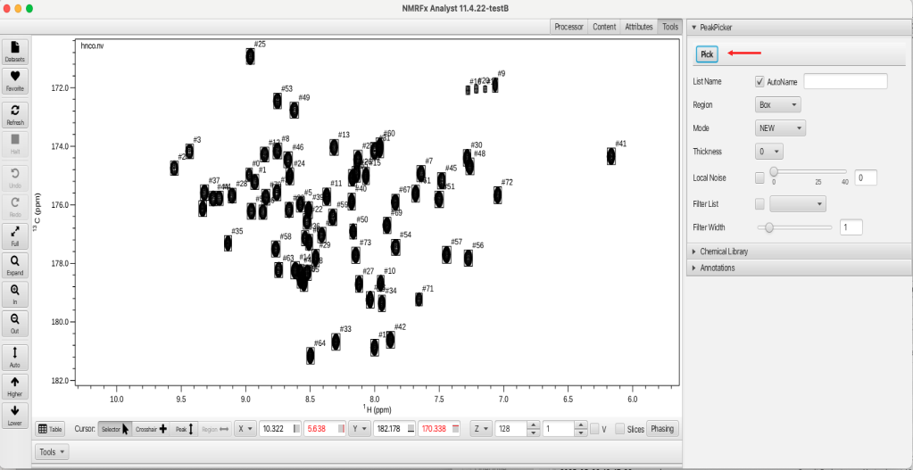

If the "AutoName" check box is selected (by default) the peak list name will be synonymous
with the dataset name. If the checkbox is deselected then the user can supply a name for
the peaklist in the adjacent text box. This is a way of being able to generate a series of
peaklists for a given dataset that may be picked at different vertical scale or contour level.
RunAbout allows for the use of different peak lists during the analysis and these can be 
chosen at the configure stage.

Once all of the spectra have been peak picked the peak lists can be displayed by choosing the 
"Peaks" top level menu and selecting "Show Peaklists Table".

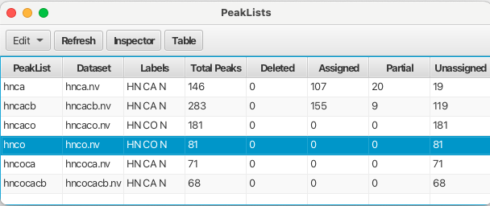

After all of the datasets have been loaded, the contours levels chosen and stored,
the datasets peak picked, the last step is to load in the sequence of the protein. 
This can be done by reading in a textfile containing the 3-letter codes for the amino acids 
in the sequence by choosing "Molecules" from the top level menu and selecting 
File -> Read Sequence... from the pull down menu. In this case the file ubiq.seq is loaded 
and the amino acid sequence can be seen by choosing "Molecules" from the top level menu and then clicking on "Sequence Viewer..." which provides the following display:

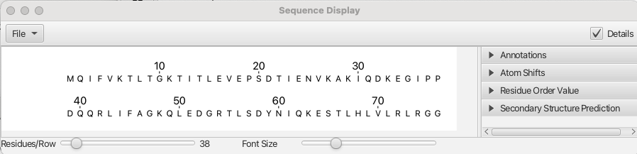

Alternatively the sequence can be entered into a GUI based editor by choosing "Molecules" 
from the top level menu and then selecting "Sequence Editor..." from the menu. A 
window opens that lets the user build a sequence for either proteins, DNA or RNA strands.
In the case of proteins the seqeunce is built using the single letter codes for amino acids
follwed by giving the file a name and choosing "Add Entity".

With the amino acid sequence loaded the "Atom Table" is populated with all of the atoms
designated to each amino acid residue and the object of RunAbout is to assign chemical
shifts to each of the H,N and C atom types in the table. The "Atom Table" can be viewed 
by choosing "Molecules" from the top level menu and then choosing "Atom Table..." from 
pull down.

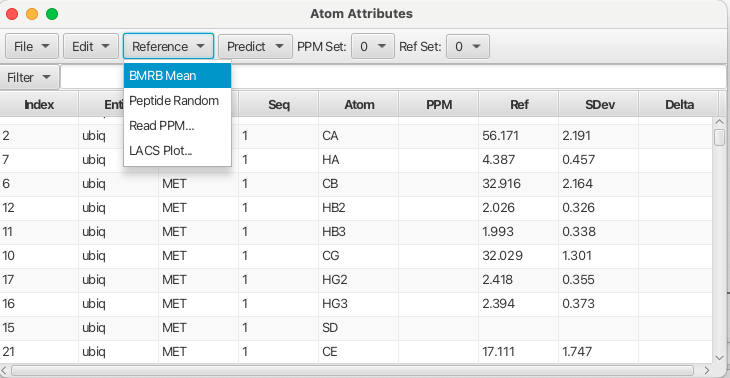

In order for RunAbout to work with assignments to residue atoms the typical chemical shifts
for a given atom need to be known as a reference point for deciding whether or not an 
experimental chemical shift may belong to that residue atom type. Reference chemical shifts 
can be loaded into the Atom Table using the "Reference" menu. Choosing the "BRMB Mean" loads
the chemical shift mean values from the BRMB database into "Ref Set 0". Up to 4 different reference sets can be loaded by choosing a different number for the reference set and then either reading in a file containing chemical shifts or choosing one of the other menu entries.

With the datasets read in, peak picked, sequence read in and reference chemical shifts
chosen it would be a good time to save the project. NMRFx has a built-in project manager
that allows for saving the state of a project and to be able to return the project to any
state that has been saved. This allows the user to be able to explore different workflows
with the knowledge that all work saved to a given state can be returned to with all data
and windows reflecting the project at the point of the save operation. To access this manager
choose "Projects" -> "GIT Manager..." from the Top Level Menu. This open the GIT Manager as shown below:

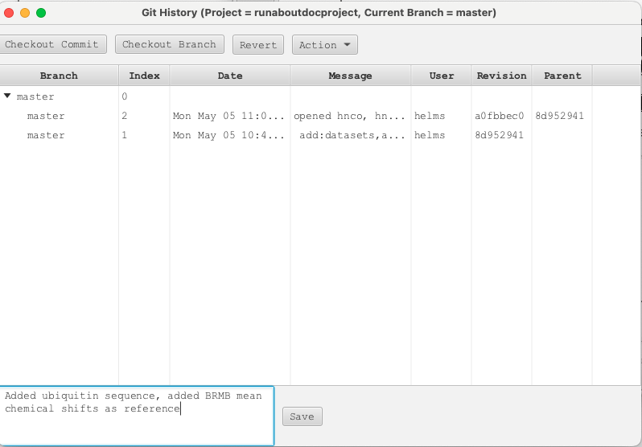

Comments can be added to each "Save" operation which is then given an index number for the
project state. A user can return to this state of the project by selecting the index 
number and clicking "Checkout Commit". The project will then be brought to this exact point.
Users are encouraged to save project states often.

Further documentation on the GIT Manager can be found at (###Need reference to this)

## Starting RunAbout

In this tutorial all of the datasets for assigning ubiquitin have been processed and peak picked.
The amino acid sequence for ubiquitin has been loaded and the BRMB mean chemical shift values
have been loaded into the reference section of the atom table. 

To start RunAbout navigate to the "Tools" menu at the lower right corner of the window and choose "Protein Tools" -> "Show Runabout" which brings up the RunAbout GUI:

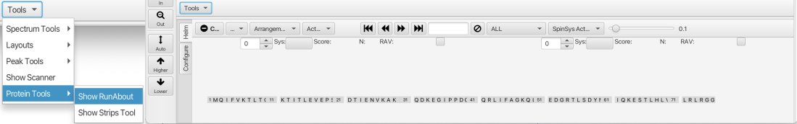

The GUI consists of two parts, a "Configure" tab which sets up the data to
analyze and a "Helm" tab which contains tools for navigating through the datasets, matching peaks to spin systems and connecting those systems into contiguous assignments. The protein sequence is shown inthe "Helm" tab and will be used to orient the spin system clusters and monitor the assignment process.

Selecting the "Configure" tab brings up the following window:

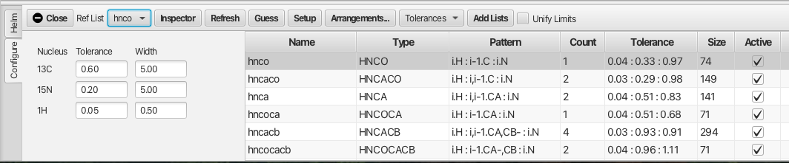

The configure tab contains the names of the peaklists created from the series of datasets
and the peaklists to be used in the analysis are made "Active" by checking the "Active"
checkbox. The "Ref List" should be set to the hnco peaklist, or in the absence of an hnco experiment an hsqc peaklist should be used. Much of RunAbout's analysis is concerned with
matching up chemical shifts of the different backbone experiments to determine whether they
represent the same resonance. The matching of chemical shifts such that assignments can be 
made between adjacent residues depends on the expected patterns of correlations in the 
different experiments. The alignment of these shifts also has a degree of error which 
requires tolerances that can compensate for the error. The patterns expected for each experiment type can be set using the "Guess" button which attempts to match the name 
of the peaklist with the "Type" of backbone experiment. It is best to use peaklist names
that match the canonical experiment type however the "Guess" button will attempt to match 
the peaklist to an expected backbone correlation pattern. An example is the HNCO 
experiment which correlates the amide proton of residue *i* (Pattern i.H)to the amide nitrogen of residue *i* (Pattern i.N) with the carbonyl carbon of the preceding residue *i* - 1 
(Pattern i-1.C). If the list name cannot be matched to an experiment type and pattern 
using the "Guess" button the user can select the list and click the "Inspector" button
which brings up a window as shown:

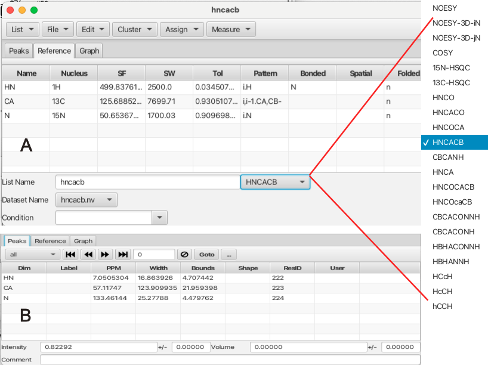

The Peak Inspector "Reference" tab is shown in A. If the peaklist name does not match a
given experiment type an experiment type can be chosen from the menu. This will fill in
the expected pattern, in the case of the HNCACB experiment the amide proton of residue *i*
(Pattern i.H) correlates to the amide nitrogen of residue *i* (Pattern i.N) which is 
correlated to the CA and CB resonances of both residue *i* and *i* - 1 with the resonance 
of CB appearing with negative phase (Pattern i,i-1.CA,CB-). Other information in 
the "Reference" tab are the spectrometer frequencies and sweep widths as well as the 
tolerances in chemical shift positions associated with each dimension in the peaklist.
Users can add new experiments via editing the Name, Nucleus and Pattern fields. 
(how is this saved?)

The "Peaks" tab of the Peak Inspector is shown in B. This panel allows the user to step
through the peaklist and see information about each peak. This tab also allows the user to 
filter peaks via criteria such as whether the peak is assigned, unassigned, ambiguous or
other choices.

The tolerance criteria for peaks is of high importance and can be set in several different
ways via the "Tolerances" menu as shown:

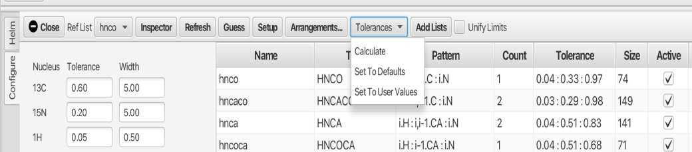

The default values to compensate for errors in matching chemical shifts are
0.05 (H), 0.2 (N) and 0.6 (C). While these values can suffice, the user may use the
"Calculate" option which will calculate the median line width for each dimension of each
peak list and sets the tolerance to that value. Choosing "Set To Defaults" will set the 
value to the defaults. The "Set To User Values" allows the user to specify values in the 
three boxes and then apply those to the various peak lists. In this example the calculated 
values were utilized. 

Clicking the "Setup" button will now provide all of the configuration information and the
expected number of correlations for a given experiment type will now appear in the "Count"
column. These values will be used later in the analysis to determine if the expected 
number of connections for a given peak cluster are found or if there are fewer or more
connections than expected. If the user changes any of the configuration parameters the 
"Setup" button must be clicked again and a dialog appears to confirm this choice.

At this point in the process the datasets have been loaded, the amino acid sequence has been 
loaded, the atom table has been populated, the BMRB reference shifts have been loaded, the 
peak lists have been selected as "Active", the *i* and *i*-1 patterns for each peak list 
have been established and the tolerances for matching peaks has been either calculated or
entered. The reference list has been set to the HNCO peak list as the HN chemical shifts of
the HNCO are what all of the connections are linked to. Each "cluster" or *i* residue
spinsystem contains a unique HN pair of chemical shifts from the HNCO peak list and each
connection going to either residue *i*-1 or to *i*+1 connect into this "reference" point.
 
After all of the configuration choices have then been confirmed with the "Setup" button.
It is now time to move to the section of RunAboutX that will begin the assignment process.
This section is referred to as the "Helm" as it allows the user to navigate their way to
the islands of NMR signals and connect them together.

## The Helm 

After setting up the configuration parameters clicking on the "Helm" tab brings up the 
following window:

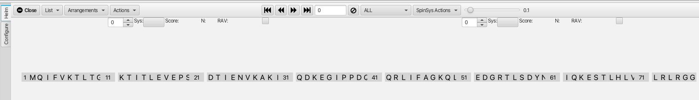

The amino acid sequence is shown in the dashboard window along with a number of menus 
and the main spectrum canvas is blank. To display the spectra being used in the "Helm" analysis an "arrangement" must be chosen using the "Arrangements" menu. Choosing HNfull from the menu will provide an array of 6 spectra in the main spectrum canvas with the HNCOcaCB, HNCOCA and HNCO experiments in the left column and the HNCACB, HNCA and HNCACO experiments in the right
column. The rows are arranged with the top row containing the CB related experiments, the
middle the CA and the bottom the CO related experiments. this arrangement is shown below:

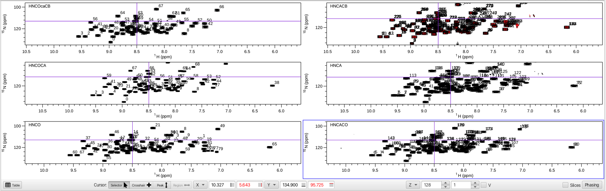

The HNfull arrangement is a good way to visualize all of the HN correlations for each experiment and allows for checking to see if the referencing is correct. This can be done by putting the cursor into crosshair mode and choosing a peak in the HNCO experiment. The crosshair should line up correctly with all of the crosspeaks associated with that peak in each spectrum. The HNfull arrangement is also a good way to make sure the vertical scaling and contour levels are set correctly. If the spectra contain a lot of noise or the vertical scale is such that peaks are missing the spectra can be adjusted so that the appearance is suitable. Each spectrum can then be saved via clicking on "Attributes", choosing Apply to: WINDOW and then clicking "Store".

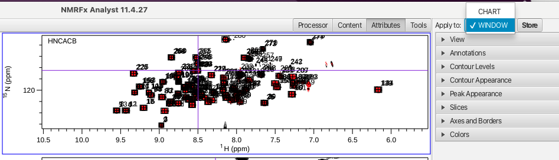

A more zoomed in view of the amide H and N frequencies across the experiments can be 
found in the HN arrangement which allows a closer look at each peak as you step through the HNCO peak list using the << >> arrows. Each peak that shares the H and N frequencies with the HNCO peak being examined should be centered on the horizontal and vertical purple lines. This is a good way to check the referencing of each of the data sets. If the peaks for some or all of the data sets do not perfectly align they can be corrected by choosing the "Align" option from within the "Actions" menu.

The operations presented within the "Actions" menu are meant to be chosen in a sequential
"top down" fashion with the "Assemble", "Combinations" and "Compare" actions being the core
of RunAbout's sequential assignment process.

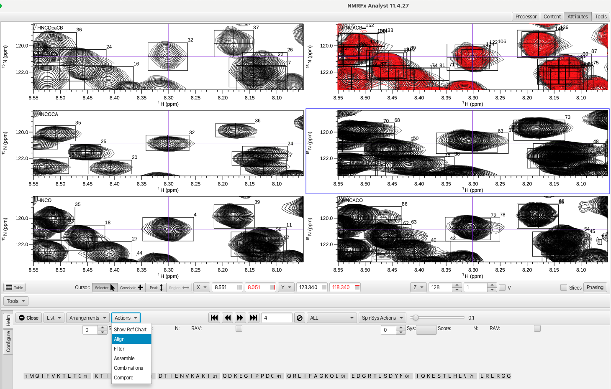

The "Align" option overlays the various experiments onto the HNCO and adjusts the 
referencing of each spectrum so that the peaks will overlap with the HNCO experiment. Alternatively the referencing can be adjusted for a single data set by putting the cross hair cursor where the peak should be aligned and right clicking, choosing "Reference" and then "Shift reference"

The next arrangement to choose is the HC arrangement which gives the amide proton 
frequency on the X axis, the nitrogen plane for that peak on the Z axis and the Y axis is the full carbon shift range for that peak. An augmented version of this arrangement is the HCNC
arrangement where in addition to the views afforded by the HC arrangemnt there are 
spectra where the X axis is the nitrogen frequency (the Z axis is the proton plane). This
arrangement is shown below.

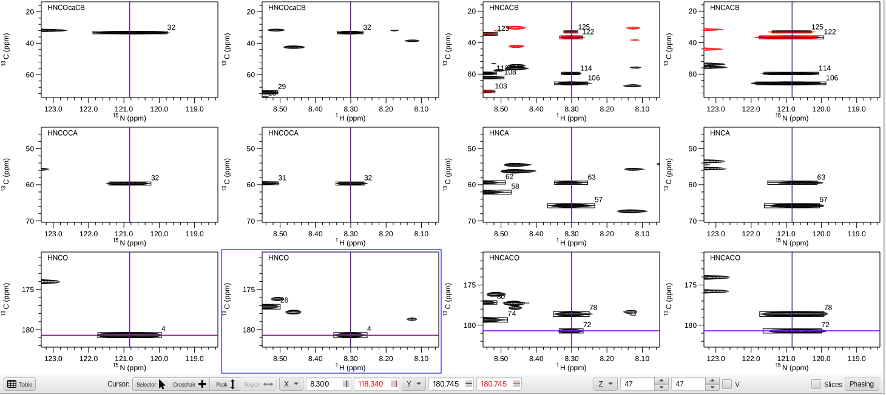

In this example the HNCO peak 4 (1H = 8.300 ppm, 15N = 120.832 ppm) shows inter-residue
crosspeaks *i*-1 CO = 180.745, CA = 59.673 and CB = 33.332 ppm while the intra-residue *i*
crosspeaks at CO = 178.438, CA = 65.877 and CB = 36.391 ppm.  With this many spectra 
displayed it is often useful to remove the redundant chemical shift axis labels by
going to the top level menu "Spectra", choose "Arrange" -> "Minimize Borders". Clicking
on any of the spectra and typing vp will put that spectrum into a separate pop-up 
window which allows for a closer look. This new pop-up window can be manipulated using
all of the tools for zooming in or out on peaks and changing the vertical scale. Any
crosshair cursors also interact with the arrangement view of spectra. In addition, 
by choosing "Actions" -> "Show Ref Chart" a pop-up window containing a zoomed view of
the HNCO peak under inspection is shown.

One of the utilities of the HCNC arrangement is to quickly step through each of the 
HNCO peaks using the << < > >> arrows and do a "quality control" sweep. At each HNCO
peak being inspected the user can assess if there is extraneous noise, are there too
many or too few peaks, is one of the datasets (i.e. the HNCACB) of insufficient quality?
In this example, upon stepping to HNCO peak 1 there are virtually no peaks in any of
the accompanying datasets that have a connection to it. Clicking on the circle with
the slash will delete the HNCO peak and associated peaks in the associated spectra and
subsequently will renumber the peaks. In this tutorial the HNCO peaks 1, 2, 7, 26, 40,
66 and 67 were deleted due to few or no peaks in the associated spectra.

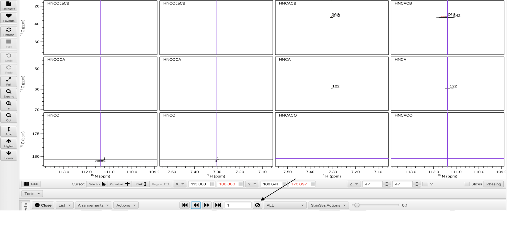

Prior to any delete operation it is a good practice to open up the Git Manager, enter 
a comment to document the state of the project prior to the delete operation and click
the "Save" button. Saving the Git state post-deletion of the peaks allows for a level
of undo for these operations as well as document which deletions were made.

The next step is to apply the "Actions" -> "Filter" operation which will look for
extraneous peaks by going through each experiment and seeing if there is overlap with
the reference HNCO experiment (the most sensitive experiment). Opening a Console window
by choosing "View" -> "Show Console" from the top level menu shows that  5 weak peaks
were removed from the HNCA experiment and 8 weak peaks were removed from the HNCACB. Again, saving the Project state using the Git manager pre and post-filtering is
recommended. 

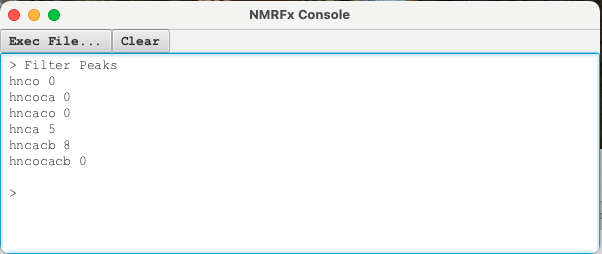

Once extraneous and weak peaks have been deleted and filtered out the next step is to
choose "Actions" -> "Assemble". This is one of the crux operations for RunAboutX and 
the result is to look through all of the experiments and find all peaks that do have
an overlap with a given peak in the HNCO (share common H and N frequencies) and cluster
them into groups that should be of the same residue. This essentially assigns peaks to
spinsystems. A view of the spectral display and Helm panel is shown.

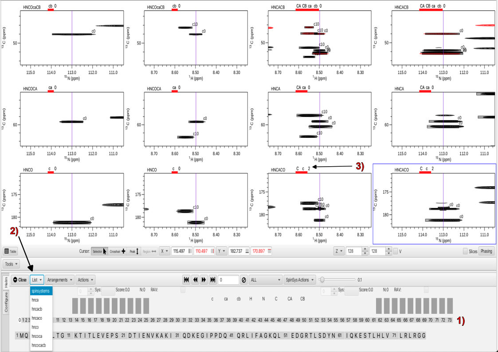

Upon the "Assemble" action a sequential series of boxes appears as shown in **1**. These
represent "clusters" or spinsystems that are associated with each HNCO H and N frequency.
In this case there are 73 spinsystems associated with the 73 peaks in the HNCO. In the
spectra panels all peaks for each experiment that are associated with the cluster have
the same number which is that of the HNCO peak in the HNCO peaklist. A new entry,
"spinsystems" now appears in the "List" menu as shown in **2**. Choosing "spinsystems"
brings up labels above each displayed experiment which is shown in **3**. For the experiments
that give rise to *i*-1 correlations the letters are in lower case, i.e. c for carbonyl,
ca and cb for c-alpha and c-beta respectively. For *i* correlations the letter are
capitalized. The number adjacent to the letters gives information on whether the correct
number of expected peaks are present (0) in the spectrum or there are too many peaks
(positive number) or missing peaks (negative number). The take-home is that zeros are 
desirable and both positive numbers or negative numbers warrant attention. 

In the "assemble" stage, finding and correcting the clusters that are missing peaks or
have too many peaks will lead to much better results when moving to the next stages of
the assignment process. In the case of cluster 0 in this example we can see that in both
of the HNCACO panels there are 2 additional peaks that are likely due to very minor or
weak peaks that were assembled into the cluster. By popping out the view using the vp
key command and expanding around the peaks it can be seen that there are 2 additional
very weak peaks labeled c0 above and below the peak at 178.8 ppm.

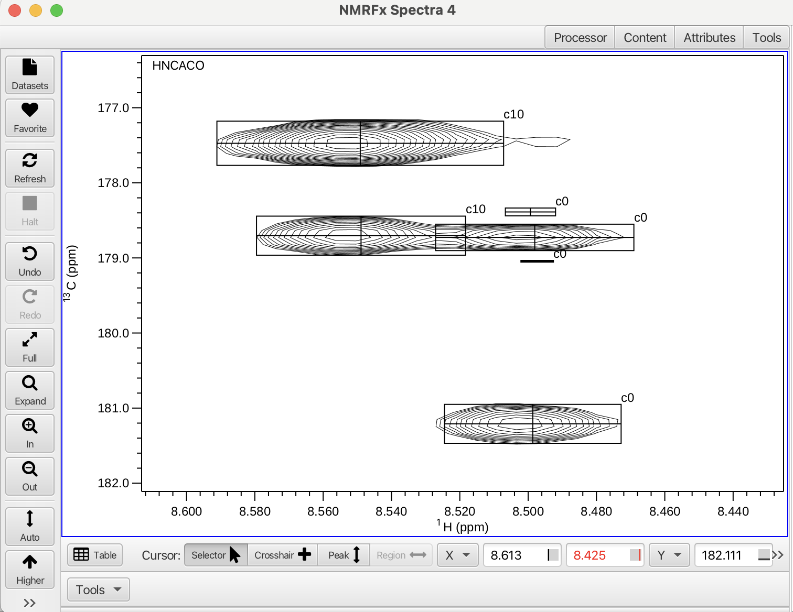

By using the "Selector" cursor mode one of the weak peaks can be selected (it turns yellow)
and removed using the delete key. Each peak needing removal can be selected and deleted.
These peaks can also be removed by selecting the spectrum containing the additional peaks
and selecting "Trim" from the "Spinsys Actions" menu. The "Trim" action removes the weakest peaks from the cluster. After this action the number should be 0 and all expected 
correlations should be accounted for. The "Trim All" option will go through all clusters
that contain additional peaks and remove the weakest peaks. A dialog box will open asking 
if you want to proceed with trimming all of the weak peaks from the clusters. In this 
tutorial peaks were trimmed from clusters 0, 4, 5, 10, 15, 21, 22 and 23. 

As always it is recommended to save the project state before using the "Trim" or "Trim All" actions.

Whereas it is a good idea to step through all the clusters in your project an easy way
to look for clusters with extra peaks or with missing peaks is to use the menu to the right
of the "circle-slash" delete button. This menu is a filter for displaying either "All"
clusters, "Correct" clusters (those with all zeros indicating the correct expected
correlations), "Lonely" clusters (those which have only 1 or 2 spectra with crosspeaks
overlapping with the HNCO peak, most spectra have no crosspeaks), "Missing" clusters 
(those missing expected correlations), "Missing_PPM" (those missing an assigned chemical
shift) and "Extra" (those clusters with additional peaks above the expected number).

Selecting the "Lonely" cluster filter shows that four clusters meet the "lonely" criteria,
clusters 69, 70, 71 and 72. Selecting cluster 69, (click on the cluster box or navigate to it
using the < > arrows) shows no other spectra besides the HNCO show any peaks. This cluster
is most likely an artifact or a sidechain amide and can be deleted using the circle-slash
button. A dialog box will open and ask if you want to proceed with deletion of the cluster
and all of its associated peak data. In this tutorial clusters 69, 70, 71 and 72 were deleted. Upon deletion the clusters are renumbered and ordered.

Selecting the "Missing" cluster filter brings up a list of 29 clusters missing 1 or more peaks.
Choosing cluster 8 as an example, the HNCACB experiment is missing a CB and a CA crosspeak. Using the vp (view pop-out) keystroke combination the HNCACB spectrum at N plane 24 (121.58 ppm) can be seen with an unpicked CB crosspeak at 30.7 ppm and a CA crosspeak at 55.5 ppm
as shown below in panel 1.

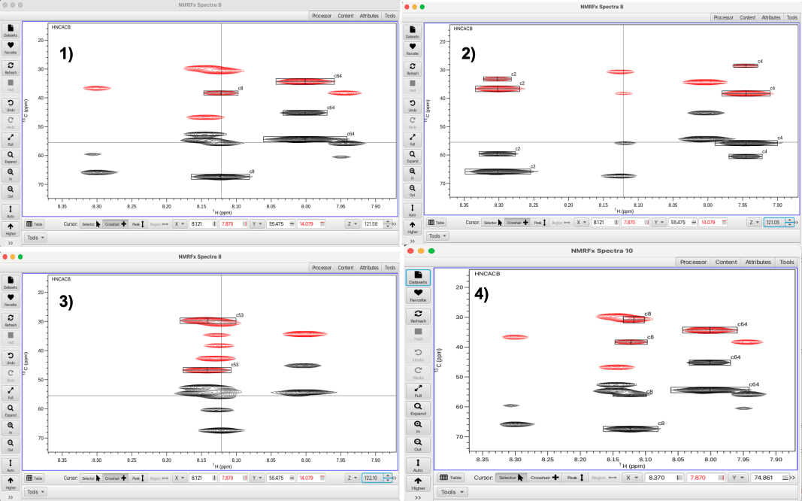

Using the Z-plane "up" arrow allows the nitrogen plane 25 (121.05 ppm) to be displayed 
which is shown in panel 2. A black (CA) crosspeak and a red (CB) crosspeak can be seen
that align along the crosshair cursor. Using the Z-plane "down" arrow the nitrogen plane
23 (122.10 ppm) can be displayed which is shown in panel 3. Going back to Z-plane 24
(121.58 ppm) and placing the cross hair cursor at 55.5 ppm (aligned with the crosspeaks
in cluster 8 and typing the keystroke command 'as' will add a peak at the crosshair cursor
position. In this fashion both peaks can be added to cluster 8 and this results in the 
cluster having a full complement of expected correlations. In addition to examining adjacent
planes, missing peaks can also be found by increasing the vertical scaling to look for 
peaks that may have been missed in the peak picking.

In this tutorial peaks were added to clusters 8, 14, 16, 17, 19, 46 and 56. Once clusters
have been examined and corrections made in terms of adding or removing peaks the data is 
ready for the next step in the "Actions" menu. The next step is to choose the "Combinations"
option from the "Actions" -> "Combinations" menu. "Combinations" is the operation which 
examines every cluster and all of the peaks in the cluster and seeks to assign each peak to 
a type, whether CA or CB and to which residue *i* or *i*-1 the peak belongs. The "Combinations" action uses an exhaustive combinatorial search of chemical shifts and peak intensities to assign each peak to its respective type via a scoring system. After choosing "Combinations" the graphic display is as shown.

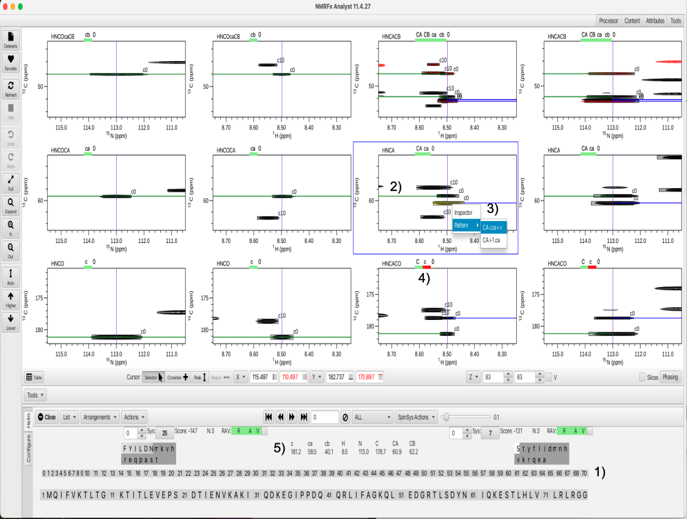

The complete list of clusters is depicted in 1 and can again be filtered for clusters missing
peaks or have too many peaks. A key feature of the sorting of peaks as to belonging to 
residue *i* or *i*-1 is depicted in 2, where a green line crossing through a peak or pointing
leftwards indicates the peak belongs to *i*-1 whereas a blue line pointing rightwards indicates
the peak belongs to residue *i*. In addition to utilizing the *i*-1 experiments such as the 
HNCOCA and HNCOcaCB to discriminate the identities of the peaks, RunAbout also takes into account which of the peaks in the *i* experiments such as the HNCA is larger or smaller as the smaller of the two should belong to the correlation to the *i*-1 residue. This is depicted in 3, which shows that if a peak is selected in an experiment such as the HNCA and the right button is used a "pattern" choice can be selected. The indication of whether the pattern for
the peak is CA from residue *i* or *i*-1 is via the << arrows. The green or red bars under
the atom types shown in 4, depict whether or not the assignment to *i* or *i*-1 is highly
probable (green) or ambiguous or incomplete (red). Now that the atoms are given a type within the residue a list of the atom types for *i*-1 (lower case letters) and *i* (upper case letter) as well as the chemical shifts for each atom are shown in 5. The chemical shifts are 
averaged between all of the experiments containing those chemical shifts for each atom and listed below the atoms. Hovering the mouse over any of the values gives the number of chemical shifts averaged and the deviation, for example the *i*-1 CA chemical shift of 58.5 is an average of 3 values and the deviation is 0.2 ppm.

An additional feature is given by the rows of boxed letters as shown below.

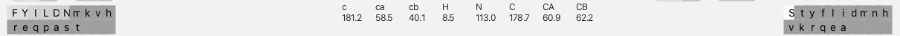

Since the chemical shifts have been assigned to atom types a ranking of amino acid types can be given. In this example, the atom types and chemical shifts for residue *i* (capital letters) show a CB shift of 62.2 ppm and a CA shift of 60.9. These shifts match most closely to the amino acid serine and the capital letter S is shown in a white box for the right hand grouping of letters. The second box (dark grey) show a lower case letter t indicating that there is a much lower probability that residue *i* is a threonine. The likelihood of the match is given by the shading of the box (lighter shade is more probable) as well as whether the letter is upper case (more likely) or lower case (less likely). The *i*-1 residue (lower case letters) with a CA shift of 58.5 and a CB shift of 40.1 matches a greater number of amino acids with phenylalanine (capital F in the left hand light grey box) being the most probable match. Tyrosine, isoleucine, leucine, aspartic acid and asparagine are also likely and are similarly color coded. These chemical shifts are more ambiguous and hence more possibilities exist. To determine the correct identity and to place the amino acids within the protein sequence requires comparing the residues to further sequential matches. This is the object of the last "Actions" menu item.

During the "Combinations" step there is opportunity to continue to edit the clusters and to add missing peaks and to delete peaks if there are too many. Choosing the "Missing_PPM" filter shows that cluster 8 is missing a chemical shift for the *i* residue carbonyl. A green line indicates the cross peak at 178.761 belongs to the *i*-1 residue however the peak is missing from the peaklist. Using the keystroke command vp and setting the cross hair cursor on the peak and typing 'as' adds the peak to the peaklist. Using this operation again and adding the peak at 178.329 leads to satisfying the missing two carbonyl peaks. In addition, using the "Extra" filter showed clusters 36 and 66 contained additional peaks. Using the "Trim" option in both clusters removed the weakest additional peaks. Running "Combinations" again allows the corrected atom types to be entered. The corrected cluster 8 is shown below.

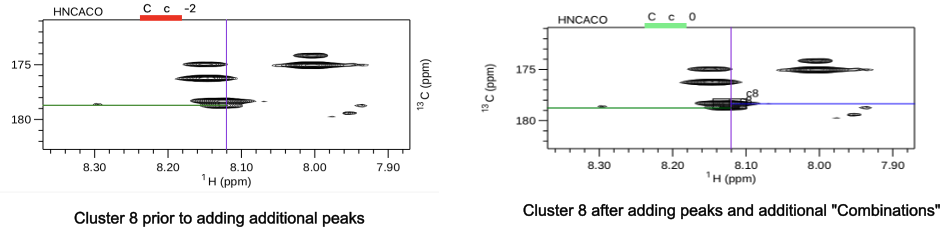

After correcting any clusters that need additional peaks or peaks removed the next step in the process is to compare the clusters for matching sequentially both to preceding residue *i*-1 but also to the successive residue *j* (*i*+1). To best visualize this matching the arrangement HCij is chosen from the "Arrangements" menu. This view gives the view for residues *i*-1 (left most 2 columns), residue *i* (middle 2 columns) and residue *j* (*i*+1, right most 2 columns). Choosing "Compare" from the "Actions" menu sets up being able to sequentially assign the clusters to amino acid placement in the sequence hence completing the backbone assignment process. The "Compare" action examines every cluster and tries to match all 3 chemical shifts (carbonyl, CA and CB) to see which cluster the shifts overlap best with. This orders the clusters in a way that stepping through the *i* residue cluster (with the << >> arrows) gives the best match to the preceding cluster and succeeding cluster and produces a score from +100 to -150 with the lowest number being the best match. In this example (shown below) cluster 0 (residue *i*) matches best with cluster 25 as the *i*-1 residue (score -147) and with cluster 7 as the *j* residue (score -131). 

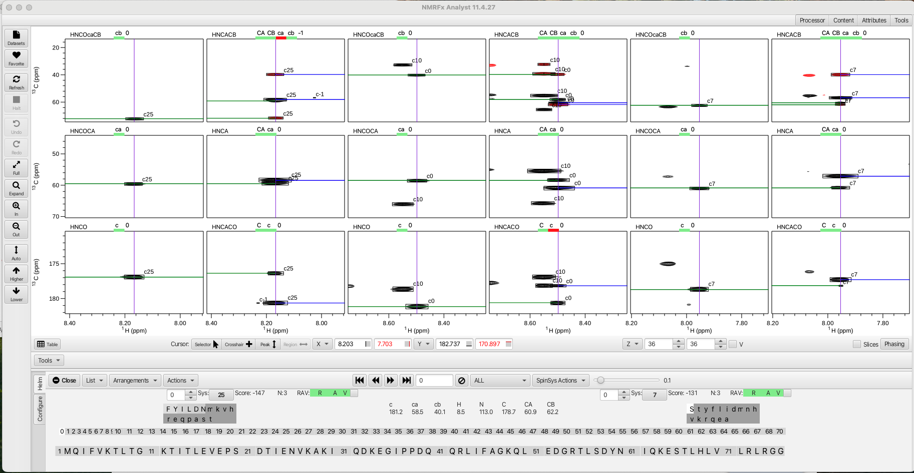

To the right of each score value is information about how many carbons were involved in the match, in this example N:3 means the carbonyl, CA and CB were matched between cluster 25 and cluster 0, likewise between cluster 0 and cluster 7. An 'N' of 2 usually means a CB is missing, often times indicating the *i* cluster is a glycine or is matched to a glycine. The color coded RAV graphic gives information about the cluster match as being reciprocal 'R', available 'A' or viable 'V'. In this example if the 'R' is green it indicates that cluster 0 (*i*) is best matched with cluster 25 (*i*-1) and that cluster 25 is reciprocally matched to cluster 0 with cluster 0 being the *j* cluster to 25. Likewise for cluster 0, the 'R' is green when matched to cluster 7 as the *j* cluster. For cluster 7 the reciprocal is cluster 0 as the *i* -1. 

In another example shown below, cluster 10 is best matched to cluster 2 (*i*-1) but the 'R' box is yellow and holds the number 9 and the score is only -33. If the cluster 2 is clicked on or navigated to using the << >> arrows it shows that cluster 2 is best matched to 9 in the *j* position with a score of -140. The green 'A' available box indicates that the clusters in the match are available to confirm the connection. A yellow 'A' would indicate that the cluster has already been confirmed in another match and is no longer available. The green 'V' viable box shows that the match is possible with respect to how the possible amino acids in the match might be present in the protein sequence. 

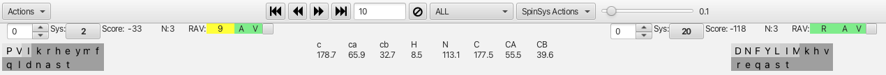
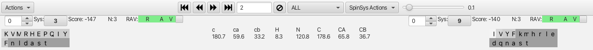

Each cluster can have multiple matches which are ranked via the score with the lowest score being choice '0'. The other choices can be accessed via a choice selector widget to the left of the *i*-1 and *j* cluster labels. An example for cluster 14 is shown below. For cluster 14 the best match for the *i*-1 match is cluster 47 (score 34) yet cluster 47 is reciprocally matched to cluster 19. In addition the amino acid types that are most probable for cluster 47 is not viably matched with cluster 14 in the protein sequence. 

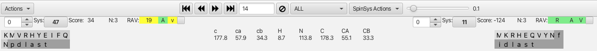

By using the up or down arrows on the choice selector widget alternative cluster matches can be investigated. In this example setting the choice to '1' shows cluster 16 is matched as the *i*-1 residue to cluster 14 with a score of 50, which is worse than that for cluster 47 yet it is 'viable' as far as the possible placement into the protein sequence. Up to 10 alternative matches can be investigated yet each successive match will have a lower score. 

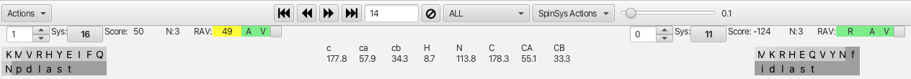

At this point in the assignment process, cluster matches with low scores and with RAV values in the green can begin to be confirmed as confident matches. The check box to the right of the RAV indicators allow for 'confirming' the match. Starting with cluster 0 we can confirm the match to cluster 25 (*i*-1) and to cluster 7 (*j*) by checking the boxes. Multiple changes to the dashboard appear and are shown below.

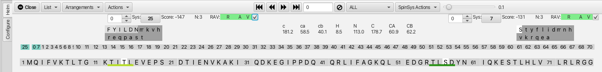

The cluster ordering in the cluster sequence is now 25-0-7-1.... and the 3 matched clusters are now colored in teal. In the protein sequence graphic there are now 2 underlined areas as shown below, one dark green (1) T-I-S-D with the *i* cluster as serine at position 57 (white highlight) and isoleucine at position 56 and aspartic acid at position 58. Serine is the most probable amino acid for the *i* position as it is colored in white (CA 60.0 and CB 62.2 ppm) while isoleucine is listed as the 3rd most probable choice for the *i*-1 residue but shares the same light-grey color shading as phenylalanine and tyrosine. A second lighter green bar (2) appears on the protein sequence T-I-T-L with the threonine at position 14 being residue *i* (white highlight). This is the second-most probable amino acid for the *i* residue, however the shading is dark grey and the 't' is lower case making this very unlikely to be threonine. Hovering the mouse over any of the residues underlined by the dark green bar (i.e. serine 57) shows a probability score between 0 and 1, in this case 0.748 (3) for this cluster grouping to be matched into the protein sequence. Hovering over the threonine at position 14 shows a score of 0.239 (4), significantly lower which ties into the lower case 't' and dark shading and unlikely to be residue *i*. A slider tool adjacent to the 'SpinSysActions' menu (5) allows for changing the sensitivity to cluster groupings being matched into the protein sequence. A lower number (0.100 being the default) allows more possibilities based on lower ranked choices for amino acid identity for a given cluster and cluster grouping. Increasing the slider (in this case to 0.241) (6) tightens the criteria by raising the level to be slightly above score for the lighter green line. After applying the new sensitivity level the lighter green line disappears and the sequence T-I-T-L is no longer considered as viable for the cluster grouping of 25-0-7.

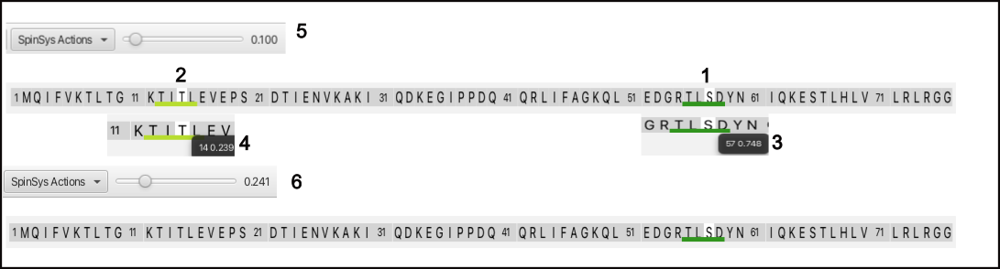

With the assignment process started by confirming the connection between cluster 25 (*i*-1), cluster 0 (*i*) and cluster 7 (*j*), the next step is to click on either cluster 7 or 25 to begin to extend the assignments. Clicking on cluster 7 (either on the cluster sequence graphic or on the cluster 7 box adjacent to the score value) brings up the following graphic. 

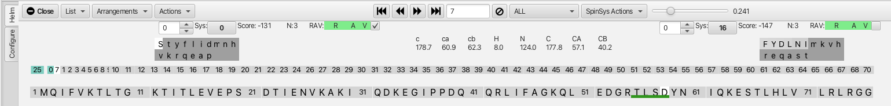

Here we can see that cluster 0 (serine 57) is now the residue at the *i*-1 position for cluster 7 and that cluster 16 is now matched at the *j* position. The score is -147 and the RAV values are all green so it is appropriate to go ahead and click the confirm checkbox. This extends the dark green line to the tyrosine at position 59. Similarly clicking on cluster 25 as the *i* residue brings up cluster 41 as the best match for the *i*-1 residue. The score is -125 and the RAV are all green and clicking the confirm checkbox now extends the dark green line to the threonine at position 55. This back and forth confirmation process leads to a segment that encompasses clusters 48-41-25-0-7-16-49 (residues 53-60) before running into a non-reciprocal match at cluster 48 and a higher score match at cluster 49 as shown. 

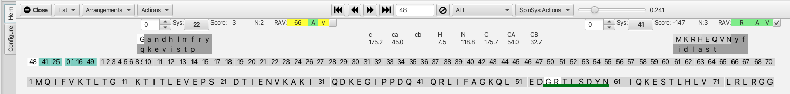

In the case of running into clusters with non-reciprocal matches or high scores it is best to start at a new place in the cluster sequence to build up additional contiguous regions of assignments. Clicking on cluster 1 shows good matches with cluster 13 on the *i*-1 side and with cluster 3 on the *j* side. Confirming these matches and subsequently working back and forth as before allows the segment 4-8-13-1-3-2-9-5-17-14-11-60 to be built up. Similarly starting at cluster 19 allows the segment 70-28-67-46-47-19-21-6-36-58-30 to be built up. At this point the graphic shown below contains 3 different color coded segments accounting for about a third of the total assignments.

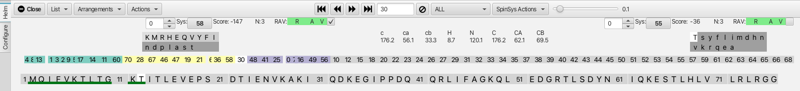

The next step is to set the confirmed assignments such that those segments of the protein sequence become unavailable to match to other clusters. This is done by clicking on one of the color coded segments and choosing the "Freeze" option from within the "SpinSysActions" menu. This color codes the amino acid sequence with the cluster segment color as well as puts a bar atop both the cluster segment and the associated amino acid sequence as shown.

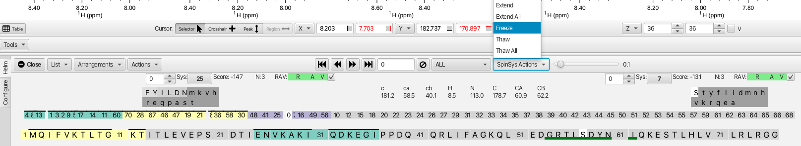

A way of semi-automating the confirmation process is by using the "Extend" option from the "SpinSysActions" menu. This will auto-confirm successive cluster matches that have both low scores and good RAV values. An example is starting with cluster 45, matches can be made on the *i*-1 side to cluster 61 and to cluster 29 on the *j* side. Choosing the "Extend" option then fills in clusters 29, 50 and 18 on the *j* side and 10, 20, 37, 27 and 61 on the *i*-1 side. The option "Extend All" from the "SpinSysActions" menu auto fills in segments comprising all of the clusters with the exceptions of 35, 54, 55 and 66. The graphic after the "Extend All" option now looks like this.

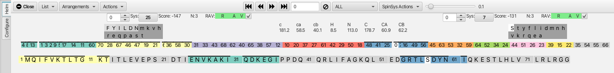

At this point all but 4 clusters have been assembled into colored groupings that match clusters sequentially. Some have been "frozen" so that they have been mapped into the amino acid sequence. When the "Freeze" operation is performed the chemical shift assignments for the clusters are subsequently written into the atom table for the residues that the cluster has been mapped to. In addition, for clusters that are now mapped into the amino acid sequence the reference chart HNCO experiment will now display the amino acid residue number rather than the cluster number. This is illustrated by serine 57 (cluster 0) as shown.

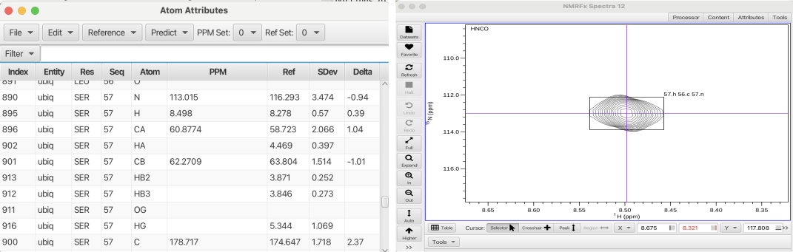

The assignment process now requires that the newly extended cluster groups be connected and "frozen" into the amino acid sequence. A way to do this is to click on the end cluster of a given color group and see if a good match to another color group is available. For example, clicking on cluster 12 of the purple grouping shows that cluster 39 is a good match at the *j* position (score = -146, RAV all green). Confirming this match maps cluster 31-33-43-68-62-40-65-38-57-12-39-15-22 onto the amino acid sequence at position 62 to 75. Clicking now on cluster 22 gives a good match to cluster 66 (one of the unmatched clusters) which happens to map to the C-terminal glycine at residue number 76. Confirming this match (score -100, RAV all green) extends the mapped sequence to the terminus. Applying the "Freeze" operation to the cluster 31 grouping commits these assignments. 

Clicking on cluster 18 (the end of the red color grouping) shows that a good match is available to cluster 64 at the *j* position (score -99, RAV all green) which is a glycine residue. Confirming this match extends the grouping that starts with cluster 10 and ends with cluster 24. Clicking on cluster 24 shows that a good match can be made to cluster 35, another of the unmatched cluster (score -113, RAV all green). Confirming this match extends the group by another residue. Applying the "Freeze" operation to clusters 10, 45 and 44 gives the following assignments.

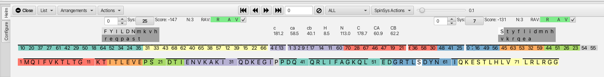

The amino acid sequence has complete assignments with 2 clusters remaining. To check the accuracy of the assignments a reference chemical shift set of the known assignments for ubiquitin can be downloaded and put into one of the reference files for the atom table. This will allow a direct comparison between the assignments made via RunAbout and the established chemical shift assignments for ubiquitin. To do this navigate to the top level "Projects" menu and choose "STAR/NEF/BMRB" -> "Fetch STAR3..." which will place the BMRB ubiquitin assignments into whichever reference set (0 to 4) number you would like. 

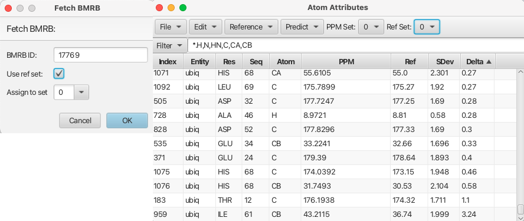

The BMRB chemical shifts for ubiquitin have now replaced the BMRB mean reference set in the "Atom Table". The atom table can be filtered to show only the backbone atoms and the Delta value can be used to ascertain the accuracy of the assignment process. The Delta value is derived from the assigned chemical shifts (PPM column) - the new reference set (BMRB actual ubiquitin assignments) / SDev. The Delta values range from -0.46 to 3.24 with most values being 0.2 or less which indicate the RunAbout assignments are in excellent agreement with the BMRB assignments for ubiquitin. The only significant outlier is the CB of isoleucine 61 (cluster 56) which has a delta value of 3.24. Inspecting cluster 56 in the HNCACB spectrum it can be seen that the pattern label for the CB crosspeak at 36.7 ppm is given as CAi-1.cb- when it should be CAi.cb- (meaning it belongs to residue *i* (isoleucine 61). Setting it correctly by choosing CAi.cb- sets the correct chemical shift into the atom table for Ile 61 CB and the atom table Delta value is now 0.0. 

CONGRATULATIONS! Ubiquitin has now been assigned.
  
