**Tutorial on using the Scanner Tool to analyze metabolomics data**

In this tutorial a study on the survival of three different wheat strains during periods of cold stress is analyzed. This work is published in the journal [PLOS One](https://doi.org/10.1371/journal.pone.0198042) and wsa originally processed using DataChord Spectrum Miner. The data is used in this tutorial to show how the files are processed and analyzed using NMRFx' Scanner tool.

The data consists of two replicates of three wheat strains that were grown under conditions of freezing during specific times (Zeitgeber Times) during an ultradian photoperiod where ZTime 0 hour is the start of the light cycle, Ztime 6 hours is the midpoint of the light cycle, ZTime 12 hours is the beginning of the dark cycle and ZTime 18 hours is the midpoint of the dark cycle. The freezing cycles (temperature lowered to -15 C) were started at each of the various Ztimes and the survival, gene expression and metabolite production monitored. In this study the wheat samples were extracted and the metabolites analyzed by 1H NMR for variations in concentrations as well as by PCA.

To import the data so that metadata fields pertinent to the sudy can be present in the Scanner Table a spreadsheet was constructed containing columns for path, SAMPLE, Zeitgeber_time, wheat_strain, extraction_technique, Replicate, notebook and comments. A total of 47 samples were entered into the spreadsheet as follows:

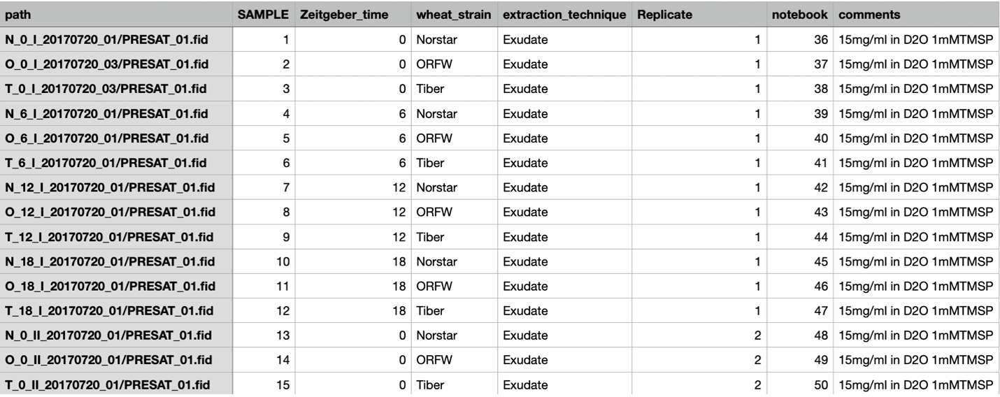

...

The spreadsheet can be saved as either a comma separated or tab separated text file which is placed into the directory containing the FID files in a way such that the "path" variable is relative to the data. In this case the "path" variable (for the first data entry) is N_O_I_20170720_01/PRESAT_01.fid so the CSV or TSV file should be save in the directory containing the directory N_0_I_20170720_01.

The Scanner Tool is opened via the "Tools" menu in the bottom left corner of the spectrum window. Choosing "Tools -> Show scanner" will open the Scanner tool as shown:

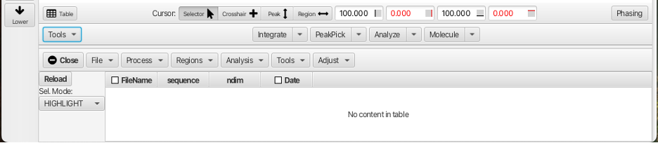

To import the raw data for the wheat study go to the "File" menu and choose "Open Table..."

Navigate to the tab or comma separated file and choose Open. This will populate the scanner Table as shown:

The "path" column will contain the path to the fids that will be processed and the root or starting point is relative to where the table file is located. Here the actual raw data file (fid) is contained in the directory PRESAT.fid which is contained in the directory N_O_1_20170720_01 so the path is N_0_1_20170720_01/PRESAT.fid/fid. The columns for "dataset" and "row" are blank or 0 and will be filled when the data is processed. The column "etime" gives the time record for each fid in seconds relative to the first acquired dataset. In this example, a series of 47 spectra were acquired in an overnoght acquisition with the first spectrum acquired after a lengthy temperture equilibration and then each subsequent spectrum being acquired in 8 minute increments. The columns for "SAMPLE" (order of sample in the queue), "Zeitgeber_time" (photoperiod time for freezing), "wheat_strain" (the names of the 3 wheat varieties), "extraction_technique" (exudate or boiled), "Replicate" etc. are populated with the values from the spreadsheet and have a checkbox to the left of the column header. The checkboxes allow for these descriptors to be used for sorting and combining the spectra. The addition of these meta-data descriptors is perhaps the best reason for loading the data via creation of a table using the method described above.

To process the data, click on any row (in this example the firstrow N_0_1_2_20170720_01 is chosen). The data will be auto-processed and a dialog will open to save the processed file under a given name. The default is to keep the given file name appended with the .nv extension.

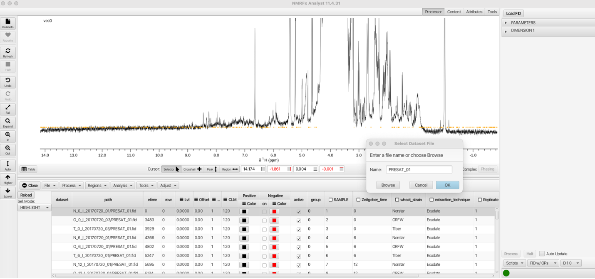

Clicking OK will save the processed data into the directory N_)_1_20170720_01/PRESAT_01.fid/PRESAT_01.nv along with a PRESAT_01.par and a process.py file. The process.py file is the python processing script which can be altered by choosing processing parameters from the "Processor" menus. Details of the processing options can be found in the NMRFx Processor documentation. The processing script used for this inital data row will then be used for subsequent rows of the data table. Care should be taken that the processing parameters for this file are suitable for the subsequent data. 

The subsequent data rows can be batch processed and combined into a single pseudo 2D dataset using the "Process and Combine" option from the "Process" menu:

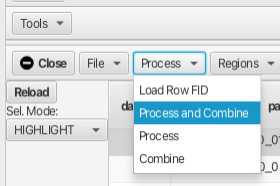

Choosing "Process and Combine" brings up a dialog to create a directory to contain the processed file after which another dialog opens to create the file name for the combined .nv file. The defaults are "output" for the directory and "processed" for the combined data file. In this example we chose to create the output directory Wheat_Freeze_Study and the combined file as processed.nv. The Scanner Table now has the "dataset" column as Wheat_Freeze_Study/process.nv and the "row" column is now populated with a number 1 to 47.

At this point it is a good idea to save the current state of the Scanner Table into a new table that will contain the newly processed data. At any point a new "loadable" table file can be saved using the "File -> Save Table..." menu option. This opens a file dialog that allows for saving the current table into a text file that can be loaded using the "File -> Load Table..." option.

All 47 fids have now been processed and ther results can be displayed in multiple ways. The "Sel. Mode:" selector allows for display of a single row, all rows, selected contiguous rows, selected non-contiguous rows or highlight a particular spectrum from within a multi-spectrum display. In the following example a single row is displayed using the "Sel. Mode: -> ONLY" option:

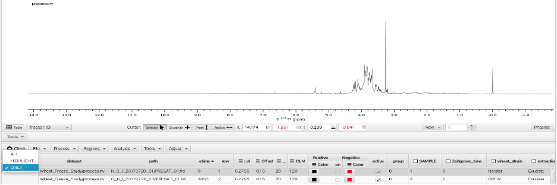

Choosing the "Sel. Mode: -> ALL" optionsuperimposes all 47 spectra in an overlay fashion:

The "Sel. Mode: -> HIGHLIGHT" option is best used by applying different colors to each spectrum. This is most easily accomplished by selecting the check box for the "SAMPLE" column. This causes the check box to turn blue (active) and applies a different color to each row. Right-clicking on the "Color" column for either positive or negative signals allows choosing a variety of color pallets for distributing color across the sample rows:

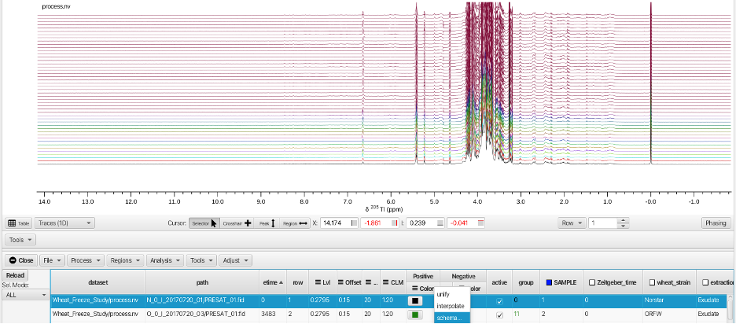

Checking the box on the "SAMPLE" column (and choosing a color scheme) causes the HIGHLIGHT option to show the selected row as thicker linewidth.

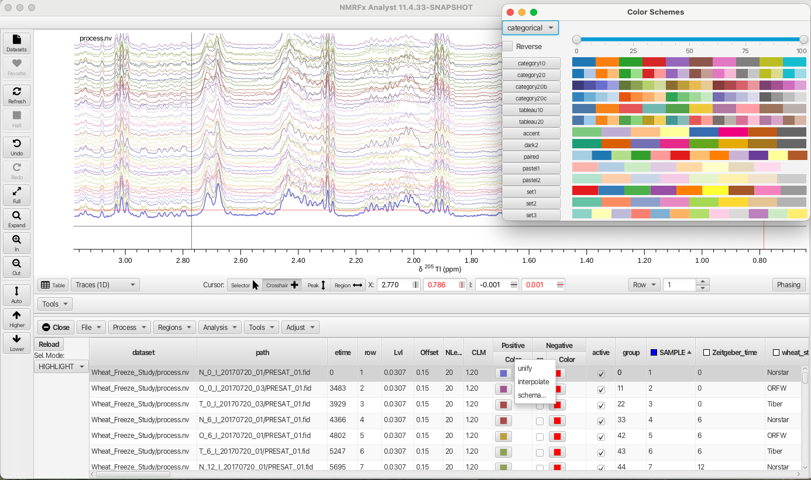

In the "Sel.Mode" "ONLY" and "HIGHLIGHT" multiple spectra can be displayed or highlighted by using the shift key for contiguous rows or the command key for non contiguous rows. 

The "Attributes" top level tool set opens a series of accordion menus that allow for changing the way the stack plot is viewed. In this example the Stackk Y and Stack X values are shifted using the sliders to produce a slanted stack.

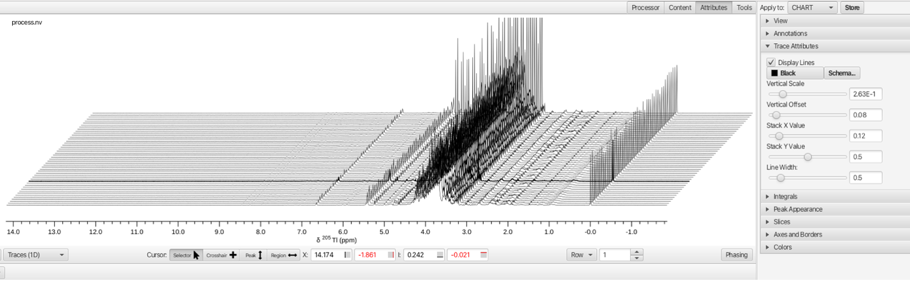

Selection and grouping of spectra can be obtained by checking the boxs on columns either individually or in combination. Selecting the "wheat_strain" column separates the spectra into 3 groups (Norstar, ORFW and Tiber) which are overlays of 16 spectra (4 Zeitgeber_times, 2 extraction_techniques and 2 Relicates). 

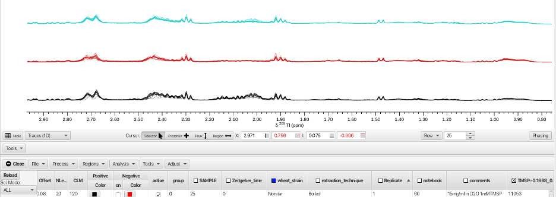

By combining "wheat_strain" with "Zeitgeber_time" displays 12 spectra (3 wheat strains at 4 different Zeitgeber times). The order of display can be sorted by left-clicking any column to produce sorting of numerical values low to high, high to low or cycled in combination with another column sort. Text variables are sorted alphabetically in a similar fashion A -> Z or Z -> A (i.e. wheat_strains). An up or down arrow in the column indicates whether the sort is from low to high or high to low for numerical values or A -> Z or Z -> A for text.

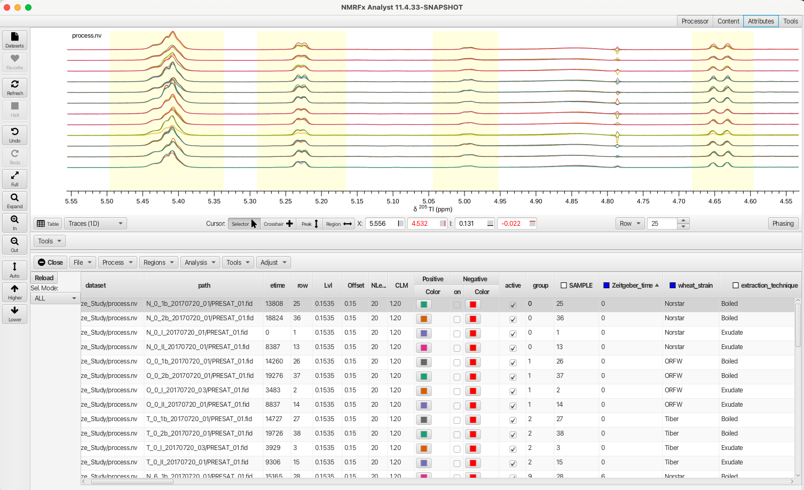

Any selection column can be right-clicked upon which brings up a selection box that allows for variables to be selected or deselected. Deselecting a choice and clicking APPLY will remove the corresponding rows from the table and causes the selection box to change to orange. Clicking NONE removes all choices, clicking ALL selects all choices and choosing RESET ALL restores the choices to the original set. In this example the variable "boiled" is deselected from the "extraction_technique" column thus removing those rows from the Scanner Table.

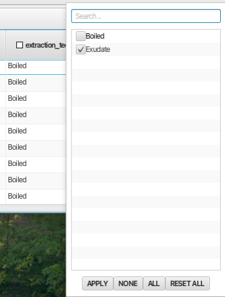

Doing a similar operation on the "Replicate" column and deselecting replicate 1 displays spectra from all 3 wheat strains under all 4 Zeitgeber times but only those where the extraction technique was "exudate" and the replicate number was 2.

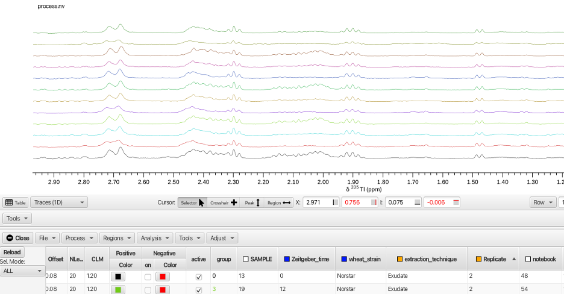

NMRFx Scanner Tool allows the user to sort, group and display the data in ways that highlight features, similarities and differences between the various rows. The Scanner Tool also allows the user to measure the spectra in multiple ways. By defining regions for each row, the spectra may be measured by integration, maximum value within the region, minimum value within the region or the most extreme difference within the region. The spectra can also be alligned to account for differences in rows that may be due to pH or concentration variations. The rows can also be normalized in a number of ways.

Before integrating regions of the wheat spectra the spectra were aligned using the TMSP peak. Displaying all of the rows superimposed, the crosshair cursors are placed around the grouping of TMSP peaks and the spectra aligned by choosing the "Adjust -> Align -> By Max" menu option.

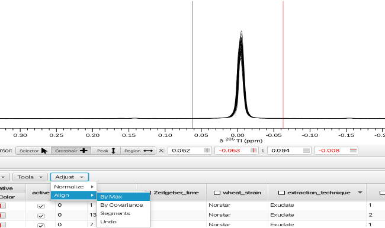

Other options for aligning the spectra are covariance of each spectrum or by segments. An option to "Undo" the alignment process is also available.

Once aligned the spectra can be normalized. Normalization can also be acheived via using the "Table Math..." option under the "Analysis" menu. Use of table math will be described later. 

To integrate spectra across rows, display either all spectra overlaid or a single row. The mode of the measurement needs to be selected by choosing "Regions -> Measure Modes -> Volume" for simple integration.

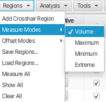

Choose the offset mode for the measurement mode, here by using "Regions -> Offset Modes -> Region" which will subtract a portion of the start and end of the integral to account for uneven baseline under the peak of interest. 

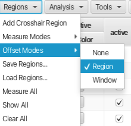

Having set the measure and offset modes the integration is accomplished by placing the crosshair cursors around a peak or region of the spectrum and choosing "Regions -> Add Crosshair Region". Another way of defining regions is by using the "Region <->" button under the spectrum display window. This is often a faster way to choose regions as it avoids having to pull down and choose within a separate menu system. A dialog will appear asking for a name for the new column that will be created. Leaving the name blank results in the column being labeled Vn where n begins at zero and is incremented for each subsequent column. In this example the crosshair cursors were placed around the TMSP peak and the name given to the column is "TMSP".

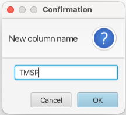

This creates a new column in the Scanner Table which has the format:

ColumnName:ppm high field_ppm low field_VR 

Where V is for *V*olume measurement and R is for *R*egion offset mode. In this example the column is labeled TMSP:-0.1668_0.1525_VR. Repeating this process across as many regions as needed creates a table where multiple columns contain integral values for each row as shown:

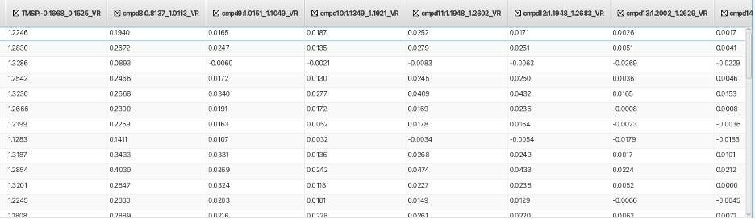

Once all of the regions have been measured the integral regions can be saved to a text file using the "Regions -> Save Regions..." menu option. This text file can then be reloaded and applied to freshly processed data is the same regions are to be measured for a new dataset. This allows for facile measurement of the same regions between datasets or for a reprocessed dataset. To load a saved integral region file use the "Regions -> Load Regions..." option. Once a rgion file has been loaded for a new dataset the columns will be all 0 values. The regions will be measured using the "Regions -> Measure All..." option (make sure the Measure and Offset Modes are chosen before using Measure All).

The values in the table can then be used for analysis of the data using tools found in the "Analysis" and "Tools" menus. The Plot Tool ("Tools -> Plot Tool") allows the user to construct scatter or box plots of any set of two or more columns. In this example, the integral region between 2.20 and 1.95 ppm represents a resonance that rises and falls in concentration between the 4 Zeitgeber times for each wheaat strain. Plotting the integral value of this region against Zeitgeber_time (X-axis) and color coding for the 3 wheat strains gives the following plot (sorted for "exudate" and "replicate 2" for clarity):

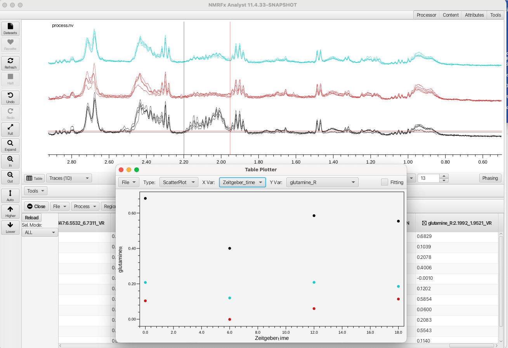

The plot shows the metabolite (later identified as glutamine) is highest in the wheat variety Norstar, median in Tiber and lowest in ORFW. The plot also shows that glutamine varies with Zeitgeber time in a way that correlated strongly with survival during freezing.

The data can be further analyzed using Principle Component Analysis which is accessed via the "Analysis -> Principle Component Analysis" menu. This opens a window where the user can choose between using a data bucketing approach or an approach which uses the integrated regions defined in the table. The region of the spectrum is bracketed by the crosshair cursors (in this example the region between 3.1 and 0.61 ppm) and the user can choose to Center the data, Standardize the data or Transpose the data before perfoeming the PCA. Another choice for how many data points are combined into a given bucket is also available. The default is 10 but the user can choose between 1 to 20. The PCA produces values for principle components up to PC5 and the table plotter opens to plot PCA1 vs PCA2 as shown:

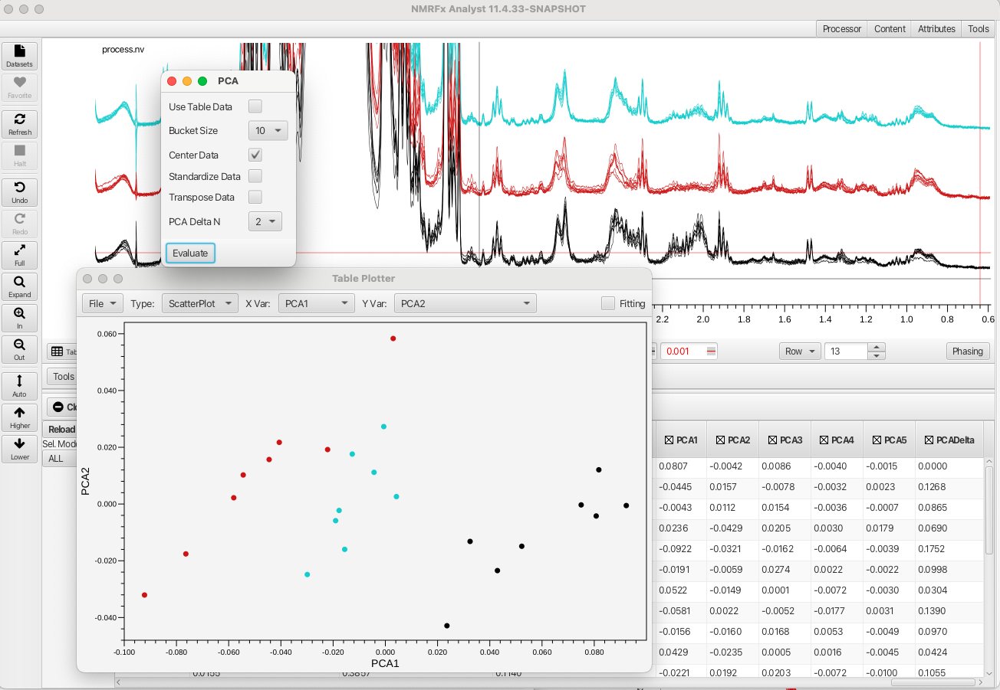

The PCA readily separates the three wheat varieties based on variations in metabolite concntrations. 

NMRFx Scanner Tool also allows the user to perform mathematical operations on the table data. Choosing the "Analysis -> Table Math..." option brings up a window that provides building expressions that operate on column values and can create a new column with the resultant values. The Table Math option can provide a way to normalize integral values to a given peak or provide a way to calculate concentration of metabolites given an internal standard value among many other applications. The following formula can be used to relate the internal standard TMSP integral to the integrals for given metabolites:

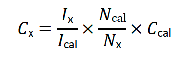

Where Cx is the concentration of the metabolite, Ix the integral for the metabolite, Ical the integral for TMSP, N the number of TMSP protons (9), Nx the number of metabolite protons represented in the integral and Ccal the concentration of TMSP (1 mM). To calculate the glucose concentration for the various samples the anomeric protons (alpha and beta) need to first be summed. These signals are accounted for in the columns for cmpd43 (beta form 4.597 to 4.682 ppm) and cmpd44 (alpha form 5.164 to 5.290 ppm). Summing cmpd43 + cmpd44 and placing the value into a new column glucoseH1total is shown as follows:

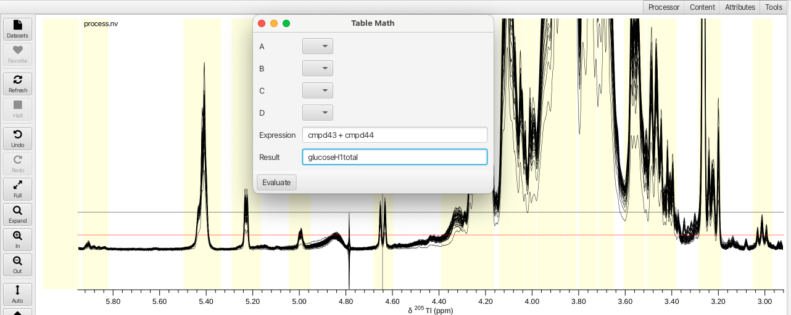

Calculating the mM concentation of glucose in each sample can be done using the sum of the anomeric protons divided by the TMSP integral multiplied by 9 as Nx = 1 and Ccal =1.

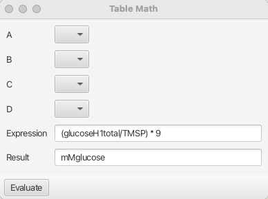

Similarly, the concentration of the glutamine can be calculated using Nx = 2 for the region between 1.961 to 2.203 ppm (C-beta protons). The resulting plot of glutamine concentrations as a function of Zeitgeber_time for the 3 wheat varieties (replicate 2, exudate, Norstar = black, Tiber = aqua, ORFW = red) is shown:

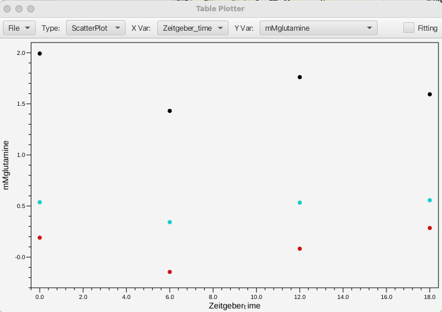

More sophisticated mathematical operations can be accessed by using the java Math class (https://docs.oracle.com/javase/8/docs/api/java/lang/Math.html) with acceptable variables as shown in this example:

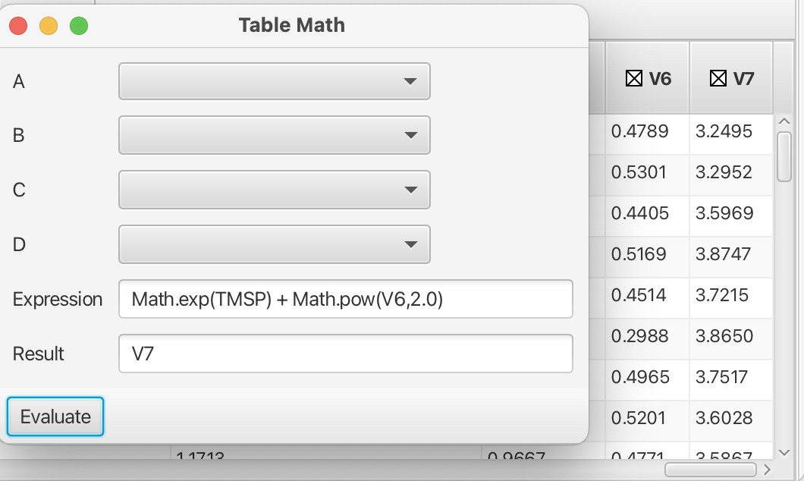

Syntax rules for the building of expressions in the Table Math tool can be found in the NMRFx documentation (i.e. column names using in expressions use the portion of the name preceeding the :). Addiitonal tools exist within the Scanner Tool which can be applied to more specialty datasets such as diffusion data or data for TRACT analysis of rotational correlation time. Hopefully this tutorial suffices to get the user started in using the Scanner Tool, one of the more powerful sections of NMRFx.
