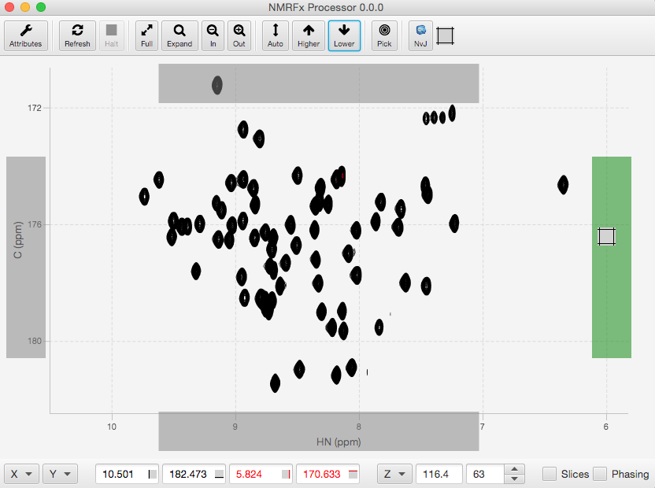

## Menus

### File

Open and Draw...

:    Display a file dialog in which you can select the NMR data set to open. Typically you will select an Agilent ".fid" directory, an Agilent "fid" file, or a Bruker "fid" or "ser" file, or an NMRView (.nv). If the file represents an FID, the file will be opened and the first row of raw data displayed.  If the file represents an NMRView format dataset, the dataset will be displayed (vector for 1D or contour plot for 2D or higher).  The dataset will be displayed in the currently active spectrum window.

Open...

:    Display a file dialog in which an NMRView format dataset can be opened.  The dataset will not be immediately drawn.  Instead use the attributes panel to choose one or more datasets to display in a window.

New Window

:    Create a new spectrum display window.   A dataset can be added to the window using the Attributes dialog or by using the Open and Draw menu item.

Open and Draw Recent

:    NMRFx Processor maintains a list of recently opened datasets.  Use the attached menu to select one of these to be opened and displayed in a spectrum window.

Export PDF...

:    Create a PDF file containing a rendering of the currently active spectrum.  Note:  at present, only the active spectrum chart in a single window will be exported to the file.

Export SVG...

:    Create an SVG file containing a rendering of the currently active spectrum.  Note:  at present, only the active spectrum chart in a single window will be exported to the file.

Save PeakLists

:    Create NMRViewJ ".xpk" files for all current peak lists.  Note: peak list use and import/export is currently in the prototype stage.

### Spectra

Delete

:    Delete the active spectrum chart from a window that has more than one chart in it.  The remaining charts will be resized to fill the empty space.

Arrange

:    Horizontal.  Arrange the spectrum charts in a window with multiple charts such that they occupy a single horizontal row.
:    Vertical.  Arrange the spectrum charts in a window with multiple charts such that they occupy a single vertical column.
:    Grid.  Arrange the spectrum charts in a window with multiple charts such that they occupy a grid of rows and columns.  The number of rows and columns is determined automatically.
:    Overlay.  Convert a grid (or row or column) of spectrum charts into a single chart with all the datasets displayed.  You can switch an overlay of spectra back to a grid (or row or column) using the Grid, Horizontal or Vertical menu items.
:    Minimize Borders. Only display the axis tic marks and labels for charts that are on the bottom or left edge of the spectra.  Those for "internal" spectra are removed to conserve space.
:    Normal Borders. Display the axis tic marks and labels for all charts in the current stage.

Sync Axes

:    Preliminary support for synchronized axes.  All the spectrum charts in a single window will be synchronized across dimensions that share the same label.  Changing the x, y and plane values in one window will result in the other windows being redrawn so that they share the same values on similar dimensions.  There is not currently a method to restrict the synchronization to specified axes, remove synchronization, or synchronize spectrum charts in different windows.  These features will be coming in a subsequent version.

Align Spectra

:    Adjust the referencing so spectra are aligned with each other.  Alignment happens between spectra that are displayed in the same window.  They can be in separate charts within the window, or multiple datasets within a single chart.  Alignment occurs only between the dataset dimensions on the x and y axes (not planes).  Alignment is done by peak picking the spectra (if peak picking has not already been done) and adjusting the referencing such that the distance between nearby peaks is minimized.  The first dataset of the active chart is the target dataset.  Other datasets are aligned to that dataset.  Dataset parameter files are written to save the new referencing.  This process (in current implementation) can be slow if there are a lot of peaks.  Because of this it's a good idea to have the window display zoomed in somewhat.

### View

Show Console

:    Display the Console window.  The console can be used in Jython (Java version of Python) or R (statistical language) modes.

Show Datasets

:   Show a table of currently opened datasets.  Each row of the table shows the dataset name, number of dataset dimensions, default contour level, scale value, default contouring parameters and reference information.  Reference information is displayed for a single dimension at a time.  A pop-up menu on the DimN header allows you to choose the display dimension.  The Draw menu at top of the Dataset Table window allows you to draw selected datasets in a variety of arrangements.

Show Attributes

:    Display the spectrum attributes window.

Show Processor

:    Display the Processor control window (it appears automatically if you open an FID)

Show Scanner

:    Display the Scanner window.  The scanner can be used to process, display and analyze sets of spectra.

### Window

Various menu items for showing and windows.  The menu items available are platform dependent.

### Help

Online Documentation

:    Open the default web browser and display the online documentation.

NMRFx Publication

:    Open the default web browser and display the first NMRFx Processor publication.  Please cite this reference when publishing manuscripts describing research that used NMRFx Processor in the analysis.

## Top Toolbar

Open

:    Display a file dialog in which you can select the NMR data set to open. Typically you will select an Agilent ".fid" directory, an Agilent "fid" file, or a Bruker "fid" or "ser" file. The file will be opened and the first row of raw data displayed.

Attributes

:    Display the attributes panel for controlling how your spectrum is displayed. The attributes panel in NMRFx is designed to work much like that in NMRViewJ (though the code is completely different). 

Refresh

:    Refresh the current display. Useful if a display parameter has been changed, but the display didn't update automatically.

Halt

:    Halt the drawing of the current display. Especially useful for datasets that take longer than a few seconds to draw.

Full

:    Adjust the horizontal (and vertical for 2D spectra) plot limits so the entire dataset is displayed

Expand

:    Expand the view to display the area between the crosshairs.

In

:    Zoom the display in (showing a smaller region of the spectrum).

Out

:    Zoom the display out (showing more of the spectrum).

Auto

:    Adjust the vertical scale of 1D spectra so the displayed region of the data mostly fills the vertical expanse of the plot window. Adjust the contour level of 2D spectra to be 5 times an estimate of the noise level in spectrum.

Higher

:    Adjust vertical scale (or contour level for 2D) so peaks appear higher.

Lower

:    Adjust vertical scale (or contour level for 2D) so peaks appear lower.

Pick

:    Peak pick the spectrum.  The region picked is the currently displayed window.  The threshold level used for picking 2D and higher dimension datasets will be the current contour level.  The threshold for 1D datasets will be the position of the black, horizontal crosshair.  Picked peaks will be displayed and the peak information immediately saved in a text file in the NMRViewJ .xpk format in a file in the directory containing the dataset.  This is a very early implementation of the peak tools.  Full peak analysis should be done in NMRViewJ until more peak tools are added to NMRFx Processor.

NvJ

:    NMRFx can display contour files of the processed spectra, but it does not have has many display controls as NMRViewJ.  Selecting this menu option will tell your operating system to open the dataset. Installations of NMRViewJ normally configure the program as the preferred renderer for NMRViewJ datasets so it should open and display the dataset. Versions of NMRViewJ before 9.1 would not open an already open dataset. Starting with 9.1 you will be prompted to reopen the dataset, so version 9.1 is the preferred renderer to use in combination with NMRFx.

Chart

:  The chart icon can be dragged onto the existing window to add a new chart into the current window.  As soon as you click and start dragging the item rectangles will appear on the sides of the current window.  Drag and drop the chart icon into one of these window to add a new chart at that location.  Once you have more than one chart you will only be able to add new charts in the existing orientation (horizontal or vertical).

## Bottom Toolbar

X,Y

:   Zero, one (X) or two (X and Y) menus will be displayed depending on the dimensionality of the displayed dataset.  These can be used to specify which dataset dimension is displayed on the corresponding axis.  For example, a 2D HSQC dataset would have a single (X) menu with choices like 1:HN and 2:N.  Selecting 2:N, would switch the display so that the N15 dimension is along the X axis, and the H1 dimension is along the Y axis.  These menus are not displayed for FID display.

CrossHair Positions

:    Four text boxes display the current positions of active crosshairs.  You can also use these to change the crosshair positions to a specific value.  Just type a number into the box and hit the Return key or change the focus to another text box.  Note:  if the crosshairs are not currently displayed, then the posiiton values represent the current plot limits for the X and Y axes.

Z,A,...

:  Zero, one (Z), or more menus and plane display controls are displayed depending on the dimensionality of the displayed dataset.  The menu can be used to jump the displayed planes to selected values (Full: all planes, First: the first plane, Last: the last plane, Center: the center plane, and Max: the plane with the maximum intensity at the position of the black crosshairs). 
:    The first text box displays the plane position in ppm.
:    The second text box displays the plane position in plane numbers (pts).
:    The spinner control (up/down arrows) can be used to increment the plane number.
:    If the mouse pointer (cursor) is over either the ppm or plane display you can use a mouse scroll wheel or trackpad scrolling to scroll through the planes.
:    You can type a number into the plane field, and hit the Return key to jump to a plane.
If you have a range of planes displayed, the ppm and pt fields represent the center of the range.  The actual limits of the range can be seen (and controlled) in the spectrum attributes window View tab.

Phasing

:    Display the phasing tool along the left edge of the spectrum.  Phasing is not yet active for datasets that are not actively the result of processing an FID in the current session.

Slices

:    Display horizontal and vertical slices through the spectrum at the position of the black crosshairs.  This menu is not displayed for FID display.

Complex

:    Display both the real and imaginary parts of 1D vectors.  This menu is not displayed for dataset (spectrum) display.

## Vector sliders

At the left side of the data display are two controls, a combobox near the top, and a slider control along the left edge. Typically in 2D, phase sensitive, NMR spectra two data vectors are collected for each time point which differ from each other in the phase of one of the pulses by 90 degrees. With higher dimensional datasets an increasing number of data vectors are collected for each time increment. The combo box at top can be used to select which of the group of data vectors associated with a given time increment are to be displayed. This can be useful in determining whether you've set up the right type of data combination operations.

The slider control can be used to scroll through all the 1D vectors along the active dimension.  As you slide the control any current processing operations for the active dimension will be applied to the vector before display.

