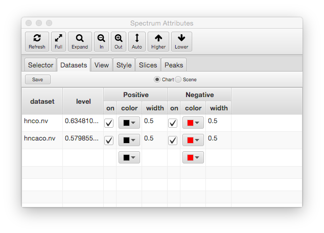

W> The following documentation is being adapted from that for the NMRViewJ
Spectrum Attributes panel.  The two panels are diesigned to work in 
a similar, but not identical way, and the documentation is not yet finished.

This dialog collects together a wide variety of controls for interacting
with spectral display windows. Only one window is controlled at a time
through this dialog. 

The Attributes Dialog is composed of an Icon Bar across the top and a
tabbed window which forms the majority of the dialog. The Icon Bar has
the a subset of icons and functions of the Spectrum Window Icon Bar described
above.  The tabbed window allows the
user to select from a series of panel controlling different aspects of
the interface. The various tapped panes that compose the Attributes
Dialog are described in the following sections.

### Selector Panel

The selector panel is used to control which datasets are displayed in the currently active spectrum chart.  The left panel lists all datasets that are available to be added to the chart.  The right panel lists all datasets currently selected for display in the chart.  Use the buttons between the two lists to add or remove datasets from the selected display list.  The order that datasets are added to the display list determines the order in which they are drawn (there is not yet, but will be, a method to rearrange the list).  You can mix datasets of different dimensinality, but higher dimensional datasets should be listed above lower dimensional datasets.  Click the Refresh button after changing the display list to update the actual spectrum display.

### Dataset Panel

The Dataset Panel to control the colors and levels used to render the spectra.
Multiple datasets can be assigned to a single spectrum chart.  Each dataset is represented by a row in the Dataset Table in this panel.

The columns in the table are as follows:

dataset

:    This column contains the name of the dataset whose properties are
displayed and controlled by that row of the table.

level

:    This column contains the contour threshold (for 2D displays) or
vertical scale (for 1D displays).  It is adjusted by using the 
Auto, Higher and Lower toobar buttons.  You can also click on the value to activate it for editing and then type in new value.  Hit the Return key to complete editing the value and hit the Refresh button to redraw the value.  The level column header has a pop-up menu (right click).  Choose "unify" to set the level for all the datasets in the table to the level value of the first dataset.

Positive & Negative

:    The Positive and Negative column groups each contain three columns.  The colum labeled "on" is a checkbox, that when turned on allows
the display of positive contours of the dataset. The "Color" column,
which is a colored rectangle, displays and controls the color used for
positive contours. Click on the rectangle to display a Color Selection
Dialog. After you choose a color using either the "Swatch", "RGB", or
"HSV" modes, click OK. You'll see the colored rectangle change to
reflect the new color but you need to click the "Draw" button to
actually refresh the spectrum with the new color.  The column labeled
"width" specifies the width of lines.
The on column header has a pop-up menu with two choices.  Turn all datasets on or all datasets off.
The color column headers has a pop-up with a choice of unify and interpolate.  Choosing unify sets the color for all datasets to the value in the first row.  Choosing interpolate sets the colors for all datasets to a value interpolated between the color setting of the first and last rows.  This would typically be used for sequentail coloring of spectra used in ligand titrations.
The width column has a pop-up menu with a unify choice, which can be used to set the width of all datasets to that of the first dataset.

By default, the rows displayed in the table correspond the datasets that are displayed in a single, active spectrum chart.  Choosing the Scene setting above the table displays all the datasets in the entired window (technically, the JavaFX Scene, hence the name).  This is useful if you want to change values for all the datasets in the window.
 

### View Panel

The View panel is used to select plot regions and control which dimension
of the dataset is displayed on which axis of the plot.  Note that some of these values can
be changed more quickly via the toolbar at the bottom of each spectrum window.
    
### 

**X**

:   Press the Left Mouse button over the X to pop-up a menu of
    predefined plot limits, or enter values in the next two text fields
    to set the plot limits (in ppm) for the x (horizontal) axis. If the
    entry is followed (without an intervening space) by a "p", then the
    value is considered to be in units of points of the dataset. The
    minimum and maximum plot limits can be entered in either order.
    These values are automatically set to give the full spectrum when a
    new dataset is assigned to this window.

    The text in the third field is used as a label for the x
    (horizontal) axis. This value is used to label the axis on hard copy
    plots, is used for determining the correlation of cursors between
    different windows (see cursors, below), and is used during
    peak-picking and peak display (see Peak Picking, below). This is
    automatically set to the value assigned to the corresponding
    dimension (see below) during the referencing of the matrix, but can
    be changed by entering a new value in this field. 1(2,3,4) Hold down
    MENU over this item to select the dimension of the matrix to be
    displayed on x axis.

**Y**

:   Press the Left Mouse button over the Y to pop-up a menu of
    predefined plot limits, or enter values in the next two text fields
    to set the plot limits (in ppm) for the y (horizontal) axis. If the
    entry is followed (without an intervening space) by a "p", then the
    value is considered to be in units of points of the dataset. The
    minimum and maximum plot limits can be entered in either order.
    These values are automatically set to give the full spectrum when a
    new dataset is assigned to this window. The text in the third field
    is used as a label for the y (vertical) axis. This value is used to
    label the axis on hard copy plots, is used for determining the
    correlation of cursors between different windows (see cursors,
    below), and is used during peak-picking and peak display (see Peak
    Picking, below). This is automatically set to the value assigned to
    the corresponding dimension (see below) during the referencing of
    the matrix. 1(2,3,4) Hold down MENU over this item to select the
    dimension of the matrix to be displayed on y axis.

**Z**

:   Press the Left Mouse button over the Z to pop-up a menu of
    predefined plot limits, or enter values in the next two text fields
    to set the plot limits (in ppm) for the z (3rd Dimension) axis. If
    the entry is followed (without an intervening space) by a "p", then
    the value is considered to be in units of points of the dataset. The
    minimum and maximum plot limits can be entered in either order.
    These values are automatically set to display the full range of
    planes when a new dataset is assigned to this window. If the return
    key is pressed in the first Z field, then the second field will be
    set to the same value. The popup menu has a convenient entry to
    select the first or last plane. The spectral display window will be
    cleared prior to drawing the first plane is set. Subsequent planes
    will be overlaid on top of the first plane. To draw a single plane,
    set both values equal to each other.

**Z2**

:   Press the Left Mouse button over the Z2 to pop-up a menu of
    predefined plot limits, or enter values in the next two text fields
    to set the plot limits (in ppm) for the z2 (4th Dimension) axis. If
    the entry is followed (without an intervening space) by a "p", then
    the value is considered to be in units of points of the dataset. The
    minimum and maximum plot limits can be entered in either order.
    These values are automatically set to display the full range of
    planes when a new dataset is assigned to this window. If the return
    key is pressed in the first Z2 field, then the second field will be
    set to the same value. The popup menu has a convenient entry to
    select the first or last plane. The spectral display window will be
    cleared prior to drawing the first plane is set. Subsequent planes
    will be overlaid on top of the first plane. To draw a single plane,
    set both values equal to each other.

### Slices Panel

Slices (1D vectors can be drawn in a horizontal and vertical orientation
across the spectrum.  Slices are turned on with the checkbox in the
control region below the spectrum, and their appearance is controlled
with this dialog.

By default the slices are drawn with an offset to position them at the
center of the spectrum.  This offset value can be changed with the
Vertical and Horizontal Sliders.  Alternatively, the slices can be
automatically position to be drawn at the current postion of the 
crosshairs.  This mode is turned on by selecting the "Offset Tracking"
checkbox. The color of the slices can be selected by clicking on
the "Slice Color" control.

The vertical scale of the slices is controled with the Scale parameter.

**Scale**

:   Type an entry in this box to specify the scale value at which 1D
    slices are to be drawn. This value is multiplied by a global scale
    parameter (set in the Prefs dialog, default 1e6) to generate the
    actual value that is used. The up and down arrows provide a
    convenient means to increment or decrement the scale level. Clicking
    on the up arrow raises the scale level to a value equal to the
    current level times the current value of the multiplier (the value
    in the next field). Clicking on the down arrow lowers the scale
    level to a value equal to the current level divided by the current
    value of the multiplier (the value in the next field). Whenever the
    **Level**value is changed the **Scale**value is changed to be 10.0
    times the **Level**value as this generally provides good results.

**Offset for Vertical Slices**

:   Select a value using the slider to specify the offset position(from
    0.0 to 1.0) at which X (and Z) slices are drawn. be drawn.

**Offset for Horizontal Slices**

:   Select a value using the slider to specify the offset position(from
    0.0 to 1.0) at which Y (and Z2) slices are drawn. be drawn.

### Spectrum Pop-up Menu

Hold down MENU (the right mouse button) within a spectral display window
to display this menu.

**Add Extract Region**
:   Set the region to be extracted during processing to the area between the vertical crosshair lines.
A "EXTRACT" command will be inserted into the processing script for the currently active dimension.

**Add Baseline Region**
:    Add a baseline region to be used during processing to the area between the vertical crosshair lines.
If not present already, a REGIONS command will be inserted into the processing script for the currently active 
dimension.  If the REGIONS command is already present, the baseline area will be appended to the commands
region argument.

**Clear Baseline Region**
:   Remove the baseline region that overlaps the crosshair positions.

**Clear Baseline Regions**

