Working with NMRView is easier if you understand a couple of key
concepts. First, there is what we'll call the working memory. To get
data into NMRView, you first "read" spectra, protein sequences, peak
lists, etc., yet these initial readings will have no immediately
apparent consequence. For something meaningful to happen, you must open
a "window," which at first will be blank. Clicking within the window
will give you a range of actions you can perform, some of which enable
you to bring in data from the working memory. Thus, you can bring one
spectrum into two windows by creating two windows and reading the same
spectrum into each from the working memory. You can also bring multiple
spectra in to one window, and keep other windows open with the
individual spectra, if you choose. For simply displaying one spectrum,
you can use the "open and draw dataset" option, which brings the
spectrum into the working memory, creates a window with the spectrum's
name, and draws it in the window. The system is very flexible, and is
limited largely only by the number of windows you can tolerate on your
desktop. There are also advanced tools within NMRViewJ, like RunAbout,
titration analysis, and rate analysis, that create a single panel with
an organized array of windows inside. These are particularly helpful
when analyzing triple resonance data for assigning protein spectra.

If you open multiple windows, you will probably soon discover that they
talk to one another. Moving the cursors in one window can move the
cursors in the other windows, enabling the spectral positions of the
cursors to be the same in all windows. This is a very nice feature when,
say, comparing TOCSY and NOESY data to see which peaks are shared in the
two spectra.

Most actions in NMRView are effected by left-clicking. Right-clicking
and center-clicking are also necessary for many essential functions. If
you're using a Mac with one button, as you would on a laptop, left-click
normally, Option-click for center-clicking, and Control-click for
right-clicking. Or pop for a \$15 two-button + center scrollwheel/button
USB mouse. In this guide, simple "clicking" without reference to left,
right, or center, should be taken to mean "left-clicking.

We've tried to stick to consistent usage for the words "toolbar",
"menu", "window" and "panel." In our scheme, a "panel" is an object that
appears on the screen into which you can enter text, make choices,
effect adjustments, etc. A "window" is an object primarily for display,
such as that used for showing spectra. Thus, multiple windows can appear
in one panel. A "toolbar" is a row of buttons, usually horizontal, which
enable access to menus, which are usually vertical. A toolbar may be its
own object on the screen, like the NMRView Main Toolbar (?), or a
horizontal row of buttons atop a panel. A menu is a simple vertical set
of choices that can be selected by clicking; menus are most commonly
accessed by clicking toolbar buttons.

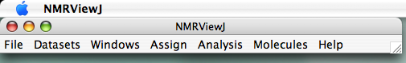

We assume you've somehow transformed your raw data into NMRView format.
If you only have a transformed NMRPipe spectrum, go to your command
line, cd to your fid directory, and type (replacing test.ft with the
name of the nmrPipe data, and test.nv with the desired output file
name).

`pipe2xyz -in test.ft -out ./test.nv -nv`

If you're looking at multiple spectra, you will find it handy to place
all of your .nv files into one new directory. It will also probably be
useful to rename your files with meaningful names. You can use long,
complicated names if you wish, but it is often easier and will
facilitate some interactions with NMRViewJ and other programs if keep
your file names generic, like "hsqc.nv," "hnco.nv," "hncocacb.nv," etc.

Start NMRViewJ either by clicking (single or double as appropriate) on
the NVJ icon representing the program or a shortcut on your desktop or
dock, or by explicitly running it (the nvj script on Unix/Linux like
systems or nmrviewj.bat on Windows) from the command line of a shell (or
terminal window). locations.)

-   The main toolbar should appear in the upper left corner of your
    screen (or across the top of the screen on Mac OS X). (?)

-   The TkCon/SwkCon window should appear in the lower left of your
    screen. (?)

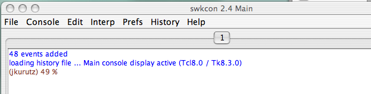

The NMRViewJ console window's (?) main utility for the new user is its
display of error messages when they occur and acknowledgment that
certain processes have completed when no otherwise apparent effect is
observed. For example, after loading a STAR file containing information
such as molecular topology you will see a message indicating the name of
the file that was loaded, and the name of the molecule whose topology
was defined.

You can also enter commands at the prompt in the console window. This
enables NMRView to be scriptable, which can be very handy. This central
feature of NMRView will be covered to some extent in further sections of
this guide, but will not be introduced just yet. You can also issue some
simple commands that will be familiar from computer shells like `dir` to
get a directory listing, `pwd` to display the current working directory
and `cd` to change the current working directory.

Here is what the pulldown menus of the main toolbar look like (?). You
access these pulldowns by left-clicking on the toolbar buttons. You also
select your menu choice by left-clicking.

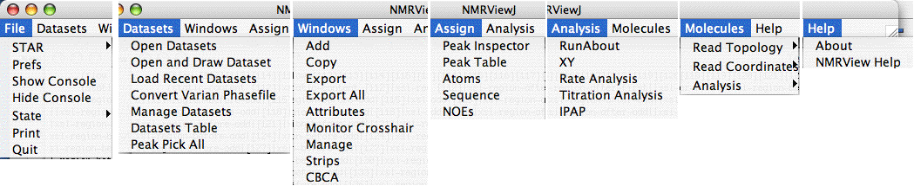

NMRView is most efficiently operated when it has good default locations
in which to look for files of different types. Otherwise, you will need
to hunt down your files every time you look for them, wasting lots of
time going from directory to directory.

With the current version of NMRViewJ, the most efficient way to organize
your data is by setting up a project as described in chapter 7. When not
working with a project, however, you can tell NMRView where to look for
files of different types by setting its various preferences.

To set these locations, go to the Main Toolbar (?) and click
"File...Prefs." You'll see this window: (?)

Click the 'Paths and Filenames Button to get to the paths preferences
(?) :

The default paths for NMRView assume your data and related files will be
somewhere in the NMRViewJ folder, which for me was
"/Applications/NMRViewJ/data," "/Applications/NMRViewJ/peaklists," and
others. If you're like me, I keep my data in a location outside my
/Applications folder. Indeed, if you're working on a shared computer,
you probably can't write to /Applications anyway. So you need to modify
your paths to make your usage more efficient. The fastest thing to do is
to make a "data" directory in your home folder and keep everything
there. For this solution, I would enter "/Users/jkurutz/data" on every
line. However, I generally think it's easier to keep data more separated
so I don't get a million files in one place. ? shows the default paths I
entered when setting up to analyze protein G, our standard sample in the
U of C Biomolecular NMR Facility.

For this to work, you must check the "Use Paths" radio button so that it
says it's "On". Otherwise, NMRViewJ will default to your home directory.
If this button is checked, but you don't have a good name for the path,
like the one for VNMR files above (?), you'll be shunted to the default
directory and you'll have to click your way to where you want to go.

Other Preferences You can set all sorts of other preferences, including
those that determine display features like line width and font, but
those aren't necessary for the "quick start" part of this guide, and
will be covered in a later section.

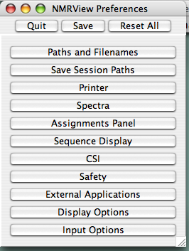

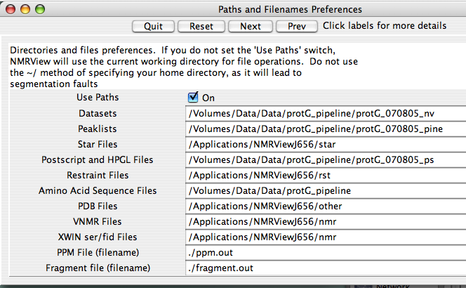

This will be the easiest way to get going with just one spectrum. If
you're doing something more complicated with several spectra, you may
wish to create windows first, then fill them with data afterwards. That
procedure will be covered in the next section of this guide.

On the NVJ main toolbar (?), click "Datasets" and choose "Open and Draw
Dataset." You'll see a menu that looks like a normal Apple-style menu
for selecting files, enabling you to easily navigate to your files
wherever they might be (?).

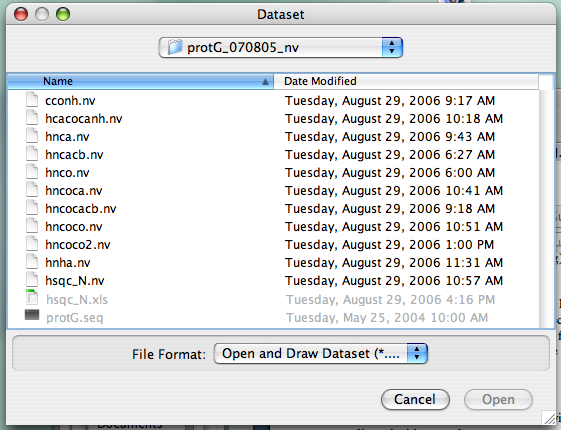

Find your file with the extension ".nv" and click on it. Here, (?) We've
selected the file "hsqc\_N," a 1H-15N HSQC experiment. Note that the
"open" button doesn't turn blue (i.e., active) until you make a
selection.

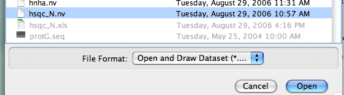

Click on the file a second time or click the "Open" button, and a new
window should be created and your spectrum should be drawn inside. The
intensity scale should be calculated automatically:

The automatic scale feature defaults to drawing spectra a bit noisily,
so click a few times on the button bearing the 1D peak and blue
threshold with the up-arrow. Your spectrum will be redrawn each time,
and in a few clicks you'll see a prettier spectrum. You can also grab
the lower-right corner of the panel to resize your window.

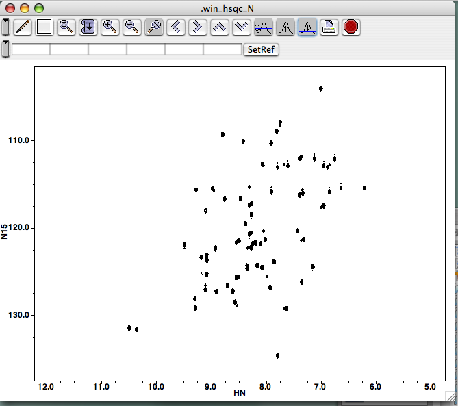

The "Open and Draw" function combines two functions that can also be
performed separately. You may wish to do so if you're overlaying spectra
or something more complicated.

First, you open the spectrum by going to the Main Toolbar (?), clicking
"Datasets", and selecting "Open Datasets". Yes, that's plural in case
you want to open several at one time. The panel you get looks just like
the "Open and Draw" panel, but this one only opens them:

"Opening" a dataset can be thought of as bringing it (the spectrum) into
the working memory. From the working memory, you can retrieve it and
place it in any spectrum window, including those that already have
spectra in them. You can also place the same spectrum in multiple
windows, which is handy when, say, displaying the HN-HA region of a
NOESY while also displaying the HN-HN region.

If you've going to be examining several spectra in this session, you can
select multiple files at the same time in the normal Apple way, by using
the Shift and Command ("open-apple") keys while clicking. It is
especially convenient to hold the shift key here while the file type is
set tot ".nv", because this will select all the NMRView datasets in your
range but skip the files that don't have the ".nv" suffix.

If you lose track of what you've brought into the working memory and you
try bringing in something that's already there, you'll get an error
message in the console indicating the file is already open.

Now create a new window into which you'll bring the spectrum. From the
Main Toolbar (?), click Windows...Add. You'll be prompted to give a name
for this window (?), and you can use something descriptive EXCEPT you
cannot use a capital letter to begin the name, and spaces in the name
are not allowed, but "\_" characters are. (Actually, you can use a space
if you precede it with "\\", as in "fruit\\ loops" to yield "fruit
loops". But that starts complicating matters, and isn't life complex
enough already?) The "rows" and "columns" options allow you to partition
a window into sub-windows, should you wish to do so. For most purposes,
you can ignore this and leave the selections at "1." Once you've
provided a new name and hit "return" or clicked "create," a new "blank"
spectrum window appears on your screen (here, I typed "hn\_co\_cacb" for
the name, ?).

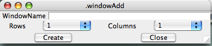

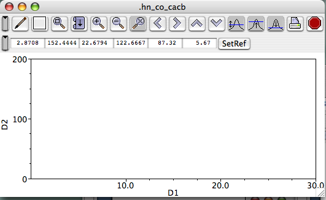

(The next section covers familiarizing yourself with the Spectrum Window
menus, buttons, cursors, and such.) Bring your dataset into the window
Somewhere in the big white space of the spectrum window, right-click to
call up a menu, then click the top choice, "Attributes." This will get
you the Spectrum Attributes panel.

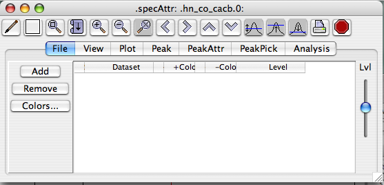

Now click "Add" and you'll get the following menu panel:

From here, select the file(s) you wish to be displayed in this window,
and click "Add." Double-clicking won't add your spectrum here. Now
you'll see your spectrum dataset name in the Spectrum Attributes File
panel:

Now you can go ahead and draw your spectrum! Just to get something in
your Spectrum Window, click the Autoscale button (the peak with a blue
line and arrows pointing both up and down, ? or ?), then the Draw button
(the pencil at the left, ? or ?). If you chose a 3D spectrum, you'll just
see the first plane, but if you choose a 2D spectrum, you'll see it in
its entirety, just like ?. This is the end of the "Alternate means of
opening and displaying spectra" section. The next sections will help
orient you with the Spectrum and Spectrum Attributes windows.

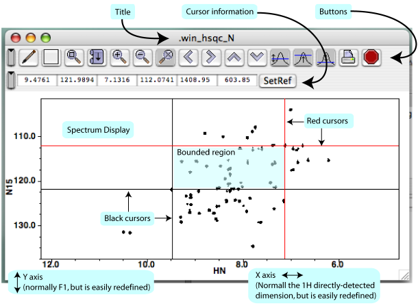

It is helpful to know the terminology describing the key features of the
Spectrum Window, and the basics are displayed in ?. From the top down,
you'll find the window's title, a row of buttons that perform certain
actions (Section 2)H, below), a row of little displays showing
information about cursor positions and separation (Section 2)G, below),
then the spectrum itself, with axes displayed. In the following
sections, we'll go over the salient details of each feature. This won't
be an exhaustive treatment, but should just give you enough familiarity
to save yourself some time and keep you from flailing about.

Once you click on your new spectrum, NMRViewJ gives you two sets of
cursors, black and red (?). The chemical shift positions of the black
and red line-cursors are shown (in ppm) in the Spectrum Window's Cursor
Information displays (?), and so are the horizontal and vertical
separations between the cursors (in Hz). You can move each of the four
cursors independently by clicking on or near them and dragging them. You
can also move them like crosshairs by clicking on or near their
intersection. One neat thing about NVJ is that you can treat each corner
of the bounded area like a movable crosshair, even if it's a mixture of
one black and one red cursor.

NVC users will notice right away that the center button no longer has
the function it used to. In NVJ, the left button can be used for all the
cursor selections. The center button, however, does have a useful new
function. If you have just moved one crosshair (red, black, or mixed)
with your left cursor, you can move your mouse pointer (no buttons held
down) to a location, then center-click to move that crosshair to the new
position.

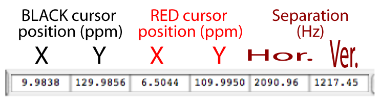

You should really just play around with the cursors for half a minute or
so to get a feel for them, particularly for how near is "near enough"
for selecting a cursor or crosshair. H. Orient yourself with respect to
the Spectrum Window buttons

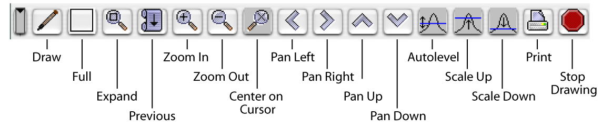

The functions of the Spectrum Window buttons are basically
self-explanatory, but here are a few explicit notes. "Draw" draws or
refreshes your spectrum/spectra in that window. "Expand" expands the
bounded region so it fills up the whole Spectrum Window display. You
would be wise to note that this is the preferred way to expand. As
described below, you can also open a menu, then select View...Expand,
but clicking to get the menu moves your cursor, thus altering your
intended bounded region. This may just be a bug that will be fixed in a
later version, but for now it stands. "Previous" will get you back to
the view you just left. So if you start with a full spectrum, zoom in on
the left (amide stripe) half, then zoom on, say, the HN-HA region, then
on a particular group of peaks, clicking "Previous" backs you out one
level to the HN-HA region. Clicking it again backs you out to the left
half of the whole spectrum, etc. NVJ will remember a fair number of
expansions, so you'll probably always be able to "back out" to a
convenient level short of reverting to the full spectrum.

The "Center on Cursor" button will shift your expanded view so that it's
centered on the location of the black crosshair. This button ignores the
position of the red cursor and has no effect if you're viewing the full
spectrum. The "Pan" buttons conveniently nudge the visible portion of
your spectrum this way and that so you can see (or hide) peaks near the
visible boundaries without zooming out and expanding on a new selection.

Clicking on "Print" will present you with a new panel (?) that basically
asks whether you want your printed output to include the whole Spectrum
Window ("Plot All") or just the spectrum ("Plot"). Choosing "Plot"
should (but doesn't yet) give you output that follows the size ,
position, and linewidth specifications in Printer preferences (Main
Toolbar...File...Prefs...Printer). The current version of NVJ doesn't
seem to pay much attention to the printer prefs, but still gives a good
output that fits into an 8.5x11" format. Clicking either Plot or PlotAll
will give you the normal Mac Print menu, which allows you to save the
output in PDF format. The PDFs are readily imported into Adobe
Illustrator, which you can use to modify line widths of peaks, add text,
change dimensions, etc. Below you'll find PDFs of the output for each
sort of output.

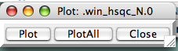

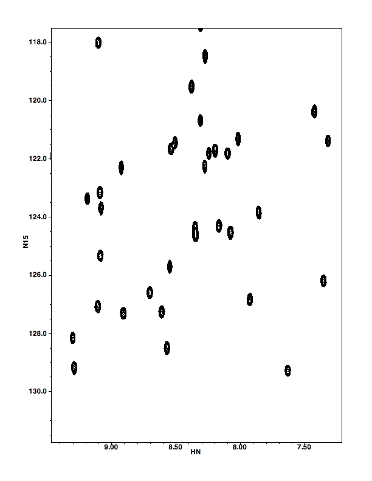

Now would be a great time to just sit and mess around to get comfortable
with your cursors and the zooming in and out functions. Really, it'll
take maybe two minutes to explore all these display features, and then
you'll know how they work. Try moving the black crosshair, then just the
horizontal cursor. Now try it with the red one. If you don't see all
your cursors, they either haven't appeared yet or they're at the edge of
your spectrum display. Click in the spectrum region and cursors should
appear. If they don't, they're at some edge or another. Click-hold near
an edge and drag your pointer into the spectrum to get a cursor away
from an edge. Once you see all four cursors, define a box (the "bounded
region" of ?), and click the "expand" button on the Spectrum Window
button bar. Keep doing that a few times, then try scrolling back to
previous views with the "Previous" button. Try the other buttons out and
see what they do. Don't worry, they won't break anything!

Right-click within the window. You'll get a menu whose selections
contain menus of their own:

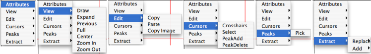

To close this menu, type the "esc" button or click somewhere in the
window that is not covered by the menu.

Here's what each does, briefly:

*Attributes*

:   Calls up a whole new panel that controls dataset management, colors,
    peak picking, and other stuff. It's covered in the next section.

*View*

:   Menu where you can find the drawing function like Expand, Previous,
    etc. These duplicate the function of the buttons with the same names
    (?). They are presented here because this is how you'd access these
    functions in NVC. As mentioned above, you'd be wise to use the
    buttons instead. The act of calling up the Spectrum Window Menu
    changes the location of your nearest cursor, making it hard to
    define a region you wish to expand.

*Edit*

:   This is a very handy feature new to NVJ. If you select Edit...Copy
    Image," you copy the image of the spectrum, axes, and axis labels to
    your computer's clipboard, and you can handily paste it in to any
    other suitable document, such as a Word, PowerPoint, or Keynote
    file. No more exporting/format changing/importing! This is very nice
    for simple presentations, but is not suitable for
    publication-quality figures.

*Cursors*

:   This is a powerful tool that lets you change the function of your
    cursors. The default function is "Crosshairs." "Select" simply
    empowers you to bring a peak's information in the peak list to the
    forefront by clicking on it. If you change your cursor to mean "Peak
    Add," clicking will pick the nearest peak and add it to your current
    peak list. "Peak Delete" is cursor function from the Dark Side,
    enabling you to eliminate picked peaks by clicking on them. This is
    most handy when getting rid of obvious noise. Both the power to
    create peaks and destroy them can be abused, but DON'T DO IT!
    Remember that with great power comes great responsibility.

*Peaks*

:   This allows you to open the peak picking menu (more on that below)

*Extract...Replace/Add*

:   These will extract subsets of your spectra for further manipulation
    and/or analysis. Usually this means taking a 1D slice from a 2d
    spectrum, or a 2D plane from a 3d spectrum. This feature will be
    described more in a later section (Spectrum Attributes...Analysis).

