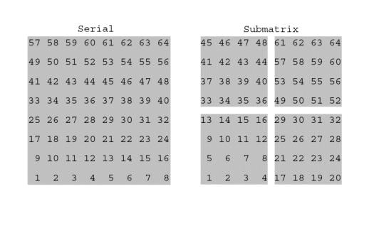
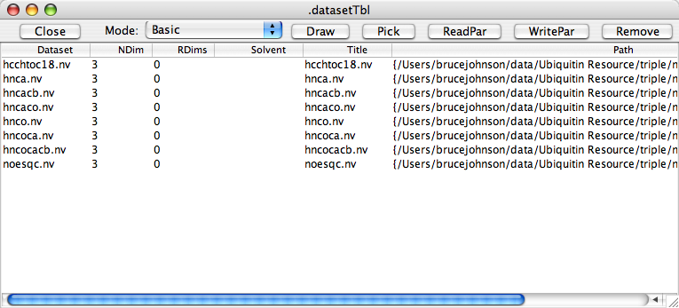
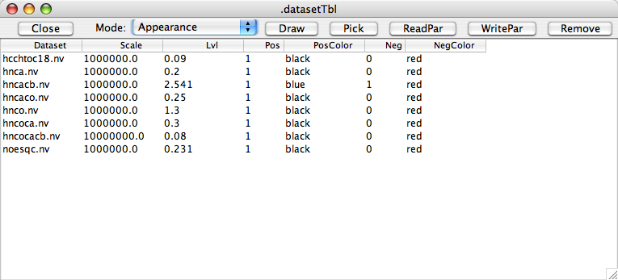
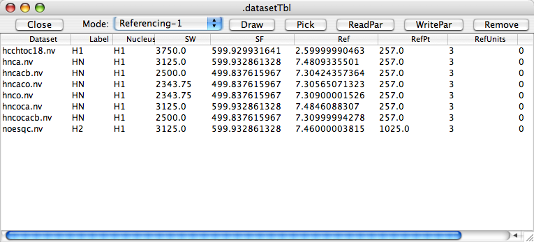
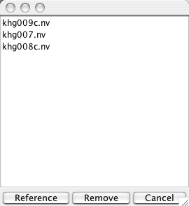

The most common use of NMRView involves visualizing and analyzing NMR
spectra. Many users of NMRView will use other programs to transform the
original time domain data into the frequency domain. Since there is no
standard data format for NMR spectra that is in common use, NMRView has
been designed to be very flexible in its ability to read spectra. Table
1 lists the file formats that NMRView can read directly without the user
needing to specify any parameters. Other file formats can be read by
creating an NMRView parameter file that contains a description of the
layout of the file.

|Program               |Format       |File Header   |Block Header   |Parameters                  |
|--------------------- |------------ |------------- |-------------- |----------------------------|
|nmrPipe               |Serial       |2048          |0              |File Header                 |
|Felix                 |Sub-matrix   |2048          |0              |File Header                 |
|Varian                |Serial       |32/28         |24             |File Header and Param File  |
|Bruker                |Sub-matrix   |0             |0              |Param File                  |
|NMRView               |Sub-matrix   |2048          |0              |File Header and Param File  |
|UCSF                  |Sub-matrix   |180           |128            |File Header                 |
|Rowland NMR Toolkit   |Sub-matrix   |0             |0              |Param File                  |
|Azara                 |Sub-matrix   |0             |0              |Param File                  |

## File Formats for Some NMR Processing Programs

The discussion of NMR file formats does not make for very exciting
reading. On the other hand many NMR spectroscopists have experienced the
frustration of having collected perfectly good spectra but not been able
to visualize them because of confusion over the data formats. In light
of this perhaps the reader will bear with us as we summarize some of the
features of the more common NMR file formats. As indicated in Table 1,
files containing NMR data are commonly found in two different formats.
In the serial format the experimental progression of data points (all
the points in one row, followed by all the points in the next row)
corresponds exactly to the order of data points in the actual data file.  
In the sub-matrix format a portion (the block size) of a row
is followed by further portions of subsequent rows before the remaining
data values of the row are found.

Of the two, the sub-matrix format provides for a layout of data on the
disk that is much more efficient for NMRView to access. This is
particularly true if the data are to be displayed in different
orientations or if multiple datasets are to be analyzed simultaneously.
Instead of accessing files with a serial format directly, it is
generally better to convert them to the more efficient sub-matrix
format.

###  NMRPipe

The data file format for nmrPipe files is the serial format. It is
possible, by creating an appropriate parameter file, for NMRView to read
these files directly. It is, however, preferable to convert them to the
native NMRView format if they are to be used for more than a brief
examination. Because of nmrPipe's elegant use of pipes, the user does
not need to actually create an nmrPipe file and then convert it.

The processing scheme in nmrPipe is implemented by having a series of
instances of the nmrPipe program executing at the same time. Each
instance carries out a single processing step, for example, the Fourier
transform. The output of one instance is directed to the input of the
next instance by the use of UNIX pipes. At the beginning of the pipeline
of programs is a program for reading data files, and at the end of the
pipeline is a program for writing files. To produce a file in the format
used by NMRView the last program in the pipeline should be pipe2xyz
executing with the "-nv" flag.

    FID | var2pipe | nmrPipe -SB | nmrPipe -FT | pipe2xyz -nv > NMRViewFile

By executing the processing scheme in this manner the data are moved
directly, via the pipeline, from the original FID to the NMRView format
output file. Parameters are stored in the nmrPipe file and are correctly
carried all the way through the processing in to the NMRView file.
Because of this it is useful to ensure that that the referencing
parameters are set up correctly at the head of the pipeline.

Sometimes nmrPipe processing is done so that the final result is stored
in nmrPipe's own format, or perhaps you've received data in this format
from another user. Typically the nmrPipe datasets are stored as one (if
it's 2D data) 2D dataset, or a series of 2D datasets (each one a plane)
for higher dimensional data. The xyz2pipe command can be used to read
these files send a series of 1D vectors to the output of the pipeline.
This data can then be piped into an instance of the pipe2xyz command
running with the -nv flag and thus output into an NMRView format
dataset. For example:

    xyz2pipe -verb -in plane%03d.ft123 -y | pipe2xyz -out hnco.nv -nv

It's important to remember that the nmrPipe data is always stored as a
series of vectors within each plane file, and the output to the
processing pipeline corresponds to a series of vectors parallel to one
particular axis of the dataset. The output dimension can be specified
with an "-x", "-y", "-z" or "-a" argument to the xyz2pipe command ("-y"
is used in the previous example). If none of these arguments are
specified, or the "-x" argument is specified, the output vectors will
correspond to the arrangement of the data as it exists in the nmrPipe
plane files. Using the other arguments ("-y", "-z" or "-a" ) the data
will be transposed as it is read and then output as the specified
dimension. Normally, these arguments can be used with the pipe2xyz
command as well, but not if the "-nv" flag is included. Using
"pipe2xyz -nv" the data is output to the NMRView file parallel to the
same dimension as it is received from the pipeline. NMRView can work
with no performance penalty with the data in any orientation, but often
users prefer to have the dataset dimensions along particular axes. You
may need to use the "-x", "-y", "-z" or "-a" arguments to the xyz2pipe
command, or the "TP" or "ZTP" transpose commands with nmrPipe to have
the data end up in your preferred orientation.

###  VNMR

The data file format for VNMR phase files is the serial
format. As with nmrPipe files, NMRView can read these files directly, but
it is preferable to convert them to a sub-matrix format such as that
used by NMRView. VNMR stores parameters in both file and block headers,
and in an associated text-format parameter file. One dimensional and
two-dimensional files can be converted to NMRView format using NMRView
itself.

To convert a VNMR file to the NMRView file format choose the "Convert
Varian Phasefile" item from the "Dataset" menu. The program will prompt
you for input and output files and then convert the file. It is very
important to note that Varian phasefiles can contain "holes" where the
actual data have not been written to the disk file. To ensure that this
is not the case, draw the entire file (full plot limits) and then issue
a flush command within VNMR.

###  Bruker

The data file format for processed Bruker files (1r, 2rr, etc.) is
the submatrix format. NMRView can read these files directly.  NMRViewJ
 can directly extract the necessary parameters to open these
files.

### Felix

The data file format for Felix files is the sub-matrix format which
is therefore already in an optimal format. NMRView can read these files
directly. As noted in Table 1 the parameters describing the layout of
the Felix file are contained within the file itself. NMRView can extract
these parameters allowing it to properly read the data without any
additional instructions. Furthermore, when copying the Felix format file
to another directory it is not necessary to copy any additional files
with it. Note, that NMRView will only read Felix files that are in a
real, rather than complex, data format.

## Loading Datasets

To load a dataset into NMRView choose the "Open Dataset" item from the
Datasets menu. From the dialog that appears you can choose one or more
datasets to open. Remember, NMRView has no arbitrary limits on the
number of datasets open at once, so go ahead and open all the datasets
you need. As a convenience, you can also choose "Open and Draw Dataset"
from the same menu. This will automatically create a spectrum display
window and draw the selected dataset in it. You can also type the
**nv_dataset open datasetName** command in the console or add one or more
of these commands to a Tcl script file to automate opening datasets.

NMRView uses a conservative approach in changing the reference
information of a data file. The original data file is never modified;
instead, changes to the referencing are made persistent by creating the
above-mentioned parameter file. A dialog panel exists for
adjusting all the reference information and then creating the parameter
file. It is important to remember that if a data file is copied from one
disk location to another location the parameter file needs to be copied to the
new location as well

The datasets used by NMRView must have been previously transformed to
the Frequency Domain and converted to a file format compatible with
NMRView (as listed in Table 1).  When NMRView opens a dataset it attempts to determine the file type
automatically. It does this by checking the consistency of various
parameters in the file header. First it tests for the NMRView format,
next for the FELIX format and finally for the VNMR (Varian Inc.) format.
If it succeeds in determining the filetype it opens attempts to open a
parameter file and interpret any commands
therein that set parameters such as sweepwidth or spectrometer
frequency. These will override any values specified in the file header.
If NMRView fails to interpret the file type it then attempts to open the
parameter file. If the appropriate
parameters are present describing the number of dimensions, dimension
sizes and block sizes NMRView will be able to read most any block
structured file.

VNMR (Varian, Inc.) phasefiles can be read directly, however, the VNMR
format is not optimal for use in NMRView. It is better to convert them
to a block structured format that is preferred by NMRView. Select the
menu item under the Dataset Menu on the Control panel to convert files
to NMRView format.

If you are using FELIX to generate the matrix you can reference the
dataset and set the axis mode to ppm. Also give meaningful names to the
label used for each axis as these labels determine cursor tracking and
peak display. Alternatively, you can leave the matrix unreferenced and
enter the referencing information in a parameter file.

If you are are using the program nmrPipe to process datasets you can use
the program pipe2xyz (with the **-nv**flag) to convert them to an
NMRView compatible format. As with FELIX datasets, NMRView will
recognize the reference information in the nmrPipe files.

When NMRView opens a spectral dataset it also attempts to open an
associated parameter file. It looks for a file of the same name as the
dataset, but with the extension .par. For example, if the dataset is
named "noesy.mat", it will look for a parameter file named "noesy.par".
If the dataset is simply named "noesy", it will also look for
"noesy.par". If the dataset is in the FELIX format the parameter values
in the .par file will override the parameters specified internally in
the .mat file.

## Dataset Table

The "Datasets Table" provides a convenient way to manage, reference and
select for display all your opened datasets. Use the "Datasets Table"
command from the "Datasets" menu on the NMRView control panel to display
this table. By default the table will display basic information about
the dataset as shown in the following figure. This includes the dataset
name, the number of dimensions, the number of "real" dimensions (which
refers to the number of frequency domain dimensions, as opposed to
dimensions that might be incremented for things like relaxation times),
the solvent, a displayable title, and the path to the actual file.

At the top of the window are a row of buttons for interacting with
datasets. Their functions are as follows:

**Close**

:   Close the Dataset Table Window

**Mode**

:   Choose one of the display modes (Basic, Structure, Appearance,
    Properties and Referencing) from this combobox.

**Draw**

:   Select one or more dataset rows in the table (in any mode) and click
    this button to create spectrum windows with these datasets. When you
    click the button you'll get the normal "Add Window" dialog prelaoded
    with a name for the window based on the datasets that are selected.
    If you have selected more than one dataset the "Rows" and "Columns"
    settings in the dialog will be preselected to give you a grid of
    containing enough spectral windows to show all the datasets. If
    instead you want the datasets superimposed, just change the "Rows"
    and "Columns" settings both to "1".

**Pick**

:   Select one or more dataset rows in the table (in any mode) and click
    this button to pick peaks in these datasets. This is only really
    useful if you have saved reasonable a reasonable default contour
    level in the datasets as this will be used as the threshold for peak
    picking, and if there are no regions of the datasets that need to be
    especially excluded (for example an area around water) from the peak
    picking. Each dataset will be picked and the peaks placed in a peak
    list with the "root" name of the dataset (e.g. hsqc for a dataset
    named hsqc.nv).

**ReadPar**

:   Select one or more dataset rows in the table (in any mode) and click
    this button to load reference parameters from the ".par" file for
    each dataset.

**WritePar**

:   Select one or more dataset rows in the table (in any mode) and click
    this button to save reference parameters to a ".par" file for each
    dataset.

**Remove**

:   Select one or more dataset rows in the table (in any mode) and click
    this button to remove the dataset from NMRViewJ.

In Appearance Mode, default parameters that are used whenever a dataset
is first assigned to a spectral window are displayed. These include a
scale parameter (by which the lvl parameter is multiplied to get actual
contour levels and peak intensities), the default contour level, whether
positive contours should be displayed and in what color they should be
drawn, and whether negative peaks should be displayed and in what color
they should be drawn. You can enter new values into the table and then
select the row and click "WritePar" to save these new values to a
parameter file.

In Reference Mode, various parameters that determine how the spectra is
referenced are displayed. As with the Appearance parameters you can
change these and then save the values to a parameter file.

Use the "Manage" command from the "Datasets" menu on the NMRView control
panel to display a popup window that lists all datasets that are
currently opened. Datasets can be closed by selecting the desired
filename and clicking SELECT on the "Delete" button. This command is
useful if you want to force NMRView to reopen a particular file, perhaps
after changing the reference data in the file header using an external
program such as FELIX.

**Reference**

:   Select this to open a panel that can be used to change the reference
    information for the dataset. Note that the reference panels may be
    opened for more than one dataset at a time. This allows the user to
    compare reference information among multiple datasets.

**Remove**

:   Click SELECT on this button to delete the file from the current
    NMRView session. The file is **not**deleted from disk.

**Cancel**

:   Click SELECT on this button to close the panel.

## Parameter Files

Every spectral data file that NMRView opens can have associated with it
a parameter file, the name of which is the base name of the data file
with a ".par" extension (e.g. the par file for *noesy.nv* is *noesy.par*).
This file can be used to store different reference parameters (which
will override those contained in the actual data file) and store
parameters which define the layout of data within the data file. Here is
a parameter file for a two dimensional HSQC file.

    dim 2 1024 256 128 32
    sw 1 4000.0
    sf 1 499.83770752
    label 1 HN
    dlabel 1 \u00B9H
    nucleus 1 H1
    complex 1 0
    sw 2 2000.0
    sf 2 50.6536026001
    label 2 N
    dlabel 2 \u00B9\u2075N
    nucleus 2 N15
    complex 2 0
    posneg 1
    lvl 0.32
    scale 1000000.0
    rdims 0
    datatype 0
    poscolor black
    negcolor red
    ref 1 11.5102987289 1.0

Opening a data file in a format that NMRView does not automatically
recognize can be accomplished by creating a parameter file defining the
layout of the content in the data file. The most important lines in the
parameter file are the first two, which specify the header and
dimensionality of the data file. Some examples:

A 512x512 file with 64x64 sub-matrix blocks and no header (typical of a
Bruker file):

    header 0 0
    dim 2 512 512 64 64
            

A 2048x2048 file in a serial format with a 2048 block file header
(typical of an nmrPipe file):

    header 2048 0
    dim 2 2048 2048 2048 1
            
The parameter file consists of a series of lines, each
one consisting of a keyword followed by one or more parameters. The
keywords are as follows.

**header** *fileHeaderSize blockHeaderSize*

:   The header sizes must be specified if the file is not declared to be
    a FELIX or VNMR file. A generic description of some NMR data files
    is as follows:

        fileHeader blockHeader1 dataBlock1 blockHeader2 dataBlock2 . . . blockHeaderN dataBlockN 

    The size of the fileHeader (in bytes) is specified with the
    *fileHeaderSize*parameter. The size of the blockHeader (in bytes) is
    specified with the *blockHeaderSize*parameter. One or both of these
    values may be 0. For example, a file may have a 16384 byte
    fileHeader, and no blockHeaders. This would be described as

        header 16384 0

    Or a file may have both, for example with a 32 byte fileHeader and a
    28 byte blockHeader

        header 32 28

**felix**

:   Specify that the file has the format used by the program FELIX.
    NMRView will attempt to extract the file attributes and referencing
    information from the header. The current version of NMRView should
    automatically determine if files are in the FELIX format so this
    should not be necessary.

**vnmr**

:   Specify that the file has the format used by the program VNMR.
    NMRView will attempt to extract the file attributes and referencing
    information from the header. NOTE: It is really more efficient (of
    memory use) to convert VNMR files to a better format. The current
    version of NMRView should automatically determine if files are in
    the VNMR format so this should command not be necessary.

**dim** *nDim size1 blockSize1 ... sizeN blockSizeN*

:   Specify the number of dimensions in the file (1-4). The
    *size*parameters specify the number of datapoints along each
    dimension. The *blockSize*parameters specify the number of
    datapoints in each block for each dimension. For example, a 2D file
    with 1024x1024 points and 64x64 points in each block would be
    specified as:

        dim 2 1024 1024 64 64

**sw** *dimNum sweepWidth*

:   Set the sweepwidth for dimension *dimNum*to *sweepWidth*. Dimensions
    are specified as an integer from 1 to 4. For example,

        sw 1 6000.0

**sf** *dimNum specFreq*

:   Set the spectrometer frequency for dimension *dimNum*to *specFreq*.
    Dimensions are specified as an integer from 1 to 4. For example,

    sf 1 599.4

**reference** *dimNum refPPM refPT*

:   Reference dimension *dimNum*to a chemical shift of *refPPM*at
    dataset point *refPT*. Dimensions are specified as an integer from 1
    to 4. For example,

    reference 2 4.73 513

**label** *dimNum label*

:   Set the label used for dimension *dimNum*to *label*. Dimensions are
    specified as an integer from 1 to 4. For example,

    label 3 15N

    The label value is used primarily for correlating crosshairs between
    spectra and peak dimensions with dataset dimensions.

**dlabel** *dimNum label*

:   Set the label used for dimension *dimNum*to *label*. Dimensions are
    specified as an integer from 1 to 4. For example,

    dlabel 3 15N

    The dlabel value is used primarily the visual label that appears on
    the axes of spectra.

    Unicode can be used to specify characters such as superscripts or greek letters.
    For example, the following makes ^15^N:

    dlabel 2 \u00B9\u2075N

