In many cases, however, one wants more control over how spectral windows
are named, configured and arranged. For example, sometimes one wants to
pack spectrum widgets inside of other windows, or create a matrix of
spectra all packed together. Accordingly, spectral display windows can
also be created either through the pop-up panels in the NMRViewJ GUI
or through Tcl commands. The latter method allows for the creation of
very complex arrangements of spectra in a way that can be used to
facilitate a complex analysis method.

The NMRViewJ canvas window is implemented as a Tk widget that is
specialized for the display of NMR data. Because of this, the actual
name for the spectral windows must conform to the hierarchical,
dot-separated, naming scheme that is required of all Tk widgets. Both,
the GUI interface for creating windows, and the NvMkSpectrum command
hide this from the user. For example, if one uses either interface to
create a window named **noesy**, a new toplevel window will be created
named **.noesy**, and will contain within it a Tk spectrum widget named
**.noesy.0**. The full name must be used when the windows are referred
to using explicit Tcl commands.

Window names cannot start with capital letters, so attempting to create
a window named "Noesy" will fail.

To create a new canvas window with one spectrum using the NMRViewJ
GUI choose Canvas NewSpectrum from the main menu bar. To create a new
canvas window with more than one spectrum using the NMRViewJ GUI
choose Canvas NewSpectra from the main menu bar. The following panel
will appear.

**Create**

:   Click on this to create a new canvas window with the specified
    number of spectra. A new canvas window will be created and the
    dialog will close. Initially new canvas windows will have a name
    like Spectrum1, Spectrum2 etc.

The grid of windows will have the specified number of rows. The number
of columns is calculated so that the there will be sufficient grid
members to contain the specified number of spectra. For example, to
create 6 windows laid out in two rows and three columns set **N
Spectra** to 6 and **N Rows** to 2. All the windows will appear in a
single toplevel canvas window.

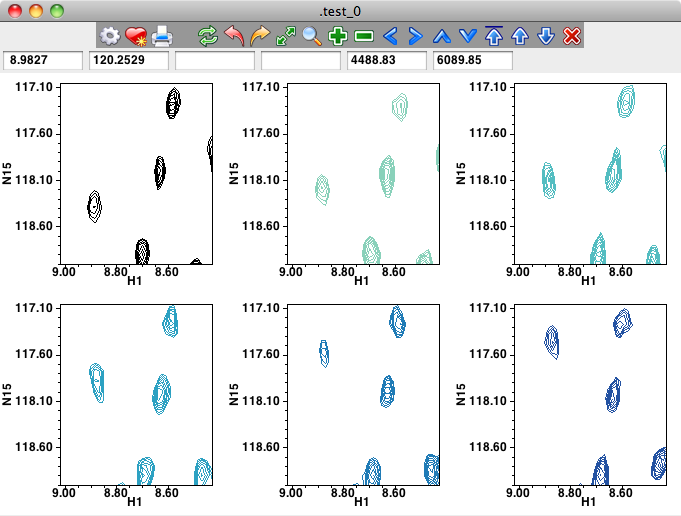

The most flexible method for creating spectral windows is to use Tcl
scripting commands, but it is certainly not necessary to understand how
to create windows in this way to make extensive use of NMRViewJ. So
beginners, are likely to want to skip this section.

The most convenient scripting method is to use the NMRViewJ procedure
**::nv::objeditor::newCanvas**. This command takes several arguments.
The first argument is the number of the spectrum items to be created on
the canvas. This defaults to one, so the command
**::nv::objeditor::newCanvas** will create a new canvas window with a
single spectrum item.

The second argument specifies the name of the window. A value of "\#"
(the default) indicates that the toplevel window should be named like
".spectrumN" where N is an integer that is automatically incremented
each time a canvas window is created. If a different value is used then
it should be specified as a Tk style window that may or may not already
exist. If the specified window doesn't already exist, it must be a value
that would specify a toplevel window (".win", but not ".win.fr"). In
this case the specified toplevel window will be created and the canvas
window and associated icon and status bars will packed inside it. If the
specified window already exists it must be a toplevel or frame widget
and the canvas window and associated icon and status bars will be packed
inside the existing widget.

The third argument specifies the number of rows to use in a grid of
spectrum items and is obviously only relevant if the first argument is a
value greater than one.

The final argument can be 0 or 1, and defaults to 0. A value of "1"
indicates that a restricted set of icons should be used so that the
iconbar is smaller.

                   # create a new canvas with one spectrum and a default name
                   ::nv::objeditor::newCanvas
                   # create a new canvas with two spectra and a default name
                   ::nv::objeditor::newCanvas 2 
                   # create a new toplevel window named .newWindow (if it doesn't exist) and put
                   # 1 spectrum item in it
                   ::nv::objeditor::newCanvas 1 .newWindow
                   # create a new canvas window with a grid of 8 spectra in 4 rows and a default name
                   ::nv::objeditor::newCanvas 8 # 4
                            
              

The lowest level command available to the user for creating a spectra
widget is to create a canvas window with the Tk/Swank **canvas** command
and explicitly create spectrum items in it.

              # create a toplevel window with a canvas in it
              toplevel .mywin
              canvas .mywin.c
              pack .mywin.c       
              # Tell the canvas about spectrum items and initialize various
              #    key and mouse  bindings in the canvas 
              ::nv::spectrum::setup::initCanvasForSpectrum .mywin.c
              # create a spectrum item on the canvas in fractional coordinates
              #     the Spectrum and anno tags are necessary for default spectrum
              #     key and mouse bindings to work
              .mywin.c create spectrum 0.1 0.1 0.9 0.9 -transformer frac  -tags "Spectrum anno"

                            
              

While this latter method is the most complicated, it also is the most
flexible. Canvas widgets can be arranged in toplevel windows along with
all sorts of other widgets such as buttons, lists, menus, text or
canvases, to create very powerful interfaces.

Most parameters effecting the display mode of spectra are specified in
the spectral attributes panel. Spectra may be displayed as 1D vectors or
as 2D slices. The 1D vectors can be displayed in a horizontal
orientation (1Dx) or a vertical orientation (1Dy). These display modes
(1Dx, 1Dy, and 2D) are selected with the pull down choice in the
spectral attributes window. Also, in 2D contour plot mode you can
display a 1D vector slice superimposed on the contour plot (seed 2D mode
below).

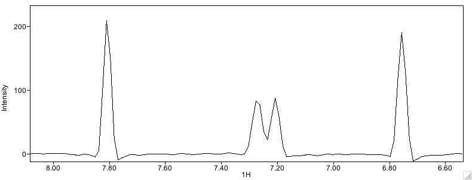

In mode 1Dx, the two x values specify the plot limits of the vector. The
y, z and z2 values specify the particular vector in the 2,3 or 4D
matrix. If a range of values is specified for y, z or z2, all the
vectors between those values will be drawn. In mode 1Dy, the two y
values specify the plot limits of the vector. The x, z and z2 values
specify the particular vector in the 2,3 or 4D matrix. In the 1D modes
the value specified in the Scale entry, specifies the intensity
difference between the maximum and minimum axes. The value specified in
the xoffset entry, specifies the point (as a fraction from zero to one,
at which a value with intensity zero will be displayed. For example, in
mode 1Dx, with Scale set to 100 , and Zero set to 0.5, the y-axis range
is from -50 to +50. With Scale set to 100, and Zero set to 0.0, the
y-axis range is from 0 to 100.

In 2D mode the spectra are displayed as contour plots. Controls are
available to specify the intensity of the lowest contour that will be
drawn, the ratio of intensities of subsequent contours, and the maximum
number of contours to display. The x values specify the plot limits
along the x-axis. The y values specify the plot limits along the y-axis.
In 2D mode "real-time" slices can be displayed that track the position
of crosshair cursor 1 (the black crosshair). Slices can be in the x, y,
z or z2(a) dimension of the spectrum. X and Z slices are drawn parallel
to the X axis of the window. Y and Z2 slices are drawn parallel to the Y
axis of the window. The slice is continuously updated as the cursor is
moved.

For 3 and 4D spectra the specific planes to be drawn are specified with
the z and z2 (for 4D spectra) values. If a range of values for z and/or
z2 are specified, all planes between the two specified values
(inclusive) are drawn. The file dimensions and the display dimensions
can correspond in any desired manner. The pull down choice box following
the x and ydisplay entries is used to specify which dataset dimension is
specified on the particular axis.

## ToolBar

An Icon Bar is present across the top of the standard toplevel windows
containing spectra. The Icons provide easy access to commands to adjust
the spectrum view and levels, as well as to print spectra and stop
contour drawing that is in progress in a given window.

Adjusting the view or scale via the Icon bar will change the view for
every spectral window that is contained within the same toplevel window
as the Icon Bar. Control of the display parameters of individual windows
can be done with the similar Icon Bar that is found in the Spectrum
Attributes dialog (see below).

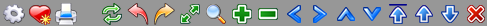

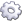 Spectrum Attributes

:   Open the Spectrum Attributes Dialog

 Add Favorite

:   Save view of current spectrum. Will prompt for a name to save the
    info to. File will be stored in the "win" sub-directory of the
    current project. Reload the view with from the Window-\>Favorites
    menu item.

 Print

:   Open a dialog for printing the spectrum. Printing in NMRViewJ
    happens through the operating systems normal print dialog. Use the
    print dialog to set such things as the output device (including
    whether to send the output to a file rather than a printer).

 Draw

:   Draw the spectrum using all currently selected parameters. Use this
    to refresh the spectrum after changing a parameter which did not
    result in the spectrum being automatically redrawn.

 Undo

:   Undo the last action. Not all actions are undoable

 Redo

:   Redo the last undone action. Not all actions are undoable

 Full

:   Set the display region of the spectrum to their full extents and
    draw the spectrum. For 1D spectra this effects only the chemical
    shift axis, and not the vertical scale. For 3D and higher spectra
    only the dimensions on the x and y axis of the display are set to
    the full values.

 Expand

:   Expand the display region so that the display region corresponds to
    the area currently enclosed in the box formed by the crosshairs.
    This effects only the chemical shift axes displayed on the x and y
    axes of the plot. Press and hold the mouse button to auto-repeat
    this action.

 Zoom In

:   Zoom the display into a region around the center of the currently
    displayed region. A smaller portion of the spectrum will be
    displayed, and the displayed peaks will look larger. The positions
    of the crosshair lines have no effect on this operation. Press and
    hold the mouse button to auto-repeat this action.

 Zoom Out

:   Zoom the display out from the center of the currently displayed
    region. A larger portion of the spectrum will be displayed, and the
    displayed peaks will look smaller. The positions of the crosshair
    lines have no effect on this operation. Press and hold the mouse
    button to auto-repeat this action.

 Pan left

:   Shift the display region left on the spectrum. The display region
    will cover the same chemical shift range, but will be at higer
    chemical shift values. Press and hold the mouse button to
    auto-repeat this action.

 Pan Right

:   Shift the display region right on the spectrum. The display region
    will cover the same chemical shift range, but will be at lower
    chemical shift values. Press and hold the mouse button to
    auto-repeat this action.

 Pan up

:   Shift the display region up on the spectrum. The display region will
    cover the same chemical shift range, but will be at lower chemical
    shift values. This only has an effect on spectra that have two or
    more dimensions. Press and hold the mouse button to auto-repeat this
    action.

 Pan down

:   Shift the display region down on the spectrum. The display region
    will cover the same chemical shift range, but will be at higher
    chemical shift values. This only has an effect on spectra that have
    two or more dimensions. Press and hold the mouse button to
    auto-repeat this action.

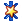 Automatic Level

:   Automatically calculate and set the display level to a "reasonable"
    value. For spectra with two or more dimensions, the command
    approximates the noise level in the spectrum, and sets the contour
    threshold to a value five times higher. For 1D spectra the command
    sets the plot scale so that the largest peak in the display region
    is completely displayed.

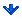 Level up

:   Raise the contour threshold of spectra with two or more dimensions.
    Generally, fewer peaks will be displayed, and their displayed
    footprint will be smaller. For 1D spectra the tops of peaks will be
    lower in the display region. Press and hold the mouse button to
    auto-repeat this action.

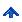 Level down

:   Lower the contour threshold of spectra with two or more dimensions.
    Generally, more peaks will be displayed, and their displayed
    footprint will be larger. For 1D spectra the tops of peaks will be
    higher in the display region. Press and hold the mouse button to
    auto-repeat this action.

 Stop

:   Stop drawing the current spectrum. As each spectrum is drawing
    itself it periodically checks for a "stop" flag. Clicking this
    button sets the "stop" flag. There may be a short delay between
    clicking the button and the time at which the spectrum display
    stops. Press and hold the mouse button to auto-repeat this action.

## Cursor Modes

The mouse cursor can be used in several different modes:  crosshairs, selector,
peak adding and peak deleting.  These modes can be set from an icon on the toolbar,
the spectrum pop-up menu or with multi-key key bindings.

### Using the Crosshair Cursor

The crosshair lines are movable lines that can be used to specify and
measure positions on the spectrum. One or two horizontal, and one or two
vertical, crosshair lines may be displayed. Two or four crosshair lines
can be used to specify a region of the spectrum to be used for some
subsequent action, such as to display an expansion of the spectrum. Each
of the four possible crosshair lines may be enabled or disabled. With 1D
spectra, only the two vertical crosshair lines are enabled by default.
The crosshairs can be positioned when the cursor is in the "crosshair"
mode. Click the cross button near the lower left corner of the window.

**To display the crosshairs:**

Click the left mouse button with the pointer positioned at the location
you want the first crosshair line(s) to appear.

Click the middle mouse button to get the second crosshairs (red).

**To move an existing crosshair:**

Press and hold the left mouse button with the pointer near the first
crosshair. Keep the button down as you drag the crosshair to a new
position. If you first position the pointer near the intersection of two
crosshairs lines, then both crosshairs will move. If you position the
point near a single crosshair line (vertical or horizontal), then only
that crosshair will move. Use the middle mouse button to position the
second crosshair. Note: it is possible to set a preferences for the
Crosshairs to make it possible to move either crosshair with the left
mouse button. This can be useful if you have a single mouse button, or
laptop without mouse. Set this preference in the Spectra Preferences
section, or set Cursors-\>Crosshair-1B from any spectra's pop-up menu.

**To remove the crosshairs:**

Click the redraw button in the control panel to the right of the
spectrum. When the spectrum is redrawn the crosshairs will not be
displayed.

**To move the spectrum region**

Hold down the Command key (Mac OS X) or Control key (Windows or Linux)
and click and drag with the left mouse button. The spectrum will pan
left and right along with the cursor. With 2D spectra you can also pan
the spectrum region vertically.

**Status panel displays crosshair positions**

As the crosshair lines are moved around the spectrum the status panel is
continuously updated with their positions (in PPM). The horizontal
distance (in Hz) between the two vertical crosshair lines is also
displayed. This can be useful for the manual measurement of couplings.
The crosshair positions can be precisely adjusted by typing a value into
the status panel entries for each of the crosshair lines. After entering
a value, hit the Return key to move the crosshair to the new position.
This is useful to, for example, set up expansions of the spectrum.

### Using the Selector Cursor

Selector mode can be used when the cursor is in the "selector" mode.
Click the arrow button near the lower left corner of the window.

**To expand the spectrum view**

Press and hold the left mouse button with the cursor at the position you
want to start the expansion at. Keep the button down as you drag the
crosshair to a new position. When you release the mouse button the
window will expand to display the selected region.

**To move the spectrum region**

Hold down the Command key (Mac OS X) or Control key (Windows or Linux)
and click and drag with the left mouse button. The spectrum will pan
left and right along with the cursor. With 2D spectra you can also pan
the spectrum region vertically.

**To add or adjust a spectrum region**

Use the same protocol as above to expand the view, but press and hold
the Alt key on the keyboard while performing the actions. If you do this
in an area that doesn't overlap any previously existing regions, a new
region will be added to the spectrum. If the area does overlap a region,
then that region will be adjusted so the limits correspond to the
selected area.

The crosshair in different windows automatically track each other in
what is generally an appropriate manner. No commands are required to
start correlated crosshair tracking. Crosshair correlation is dependent
on the label given to each axis of the spectrum during the referencing
process. For example, consider the case where 5 windows are open, with
axis labels as indicated below.

|Window-Name   |X-axis label   |Y-axis label  |
|------------- |-------------- |--------------|
|a             |15N            |1HN           |
|b             |13C            |15N           |
|c             |1H1            |1H2           |
|d             |1HN            |13C           |
|e             |15N            |1HN           |
|------------- |-------------- |--------------|

  : Cursor Correlation

If a vertical crosshair moves in window "a", the horizontal crosshair of
window "b" and the vertical crosshair of window "e" will move. If the
horizontal crosshair of window "a moves, the vertical crosshair of
window "d" and the horizontal crosshair of window "e" will move. The
crosshair in each window only tracks the motion of the moved crosshair
if the plot limits of the window overlap the position of the moved
crosshair. Crosshair tracking can be disabled in a window by changing
the window's axis label(s).

The mechanism by which cursors are correlated makes it important to use
a consistent scheme for labeling the various dimensions of experiments.
Also, multi-dimensional datasets should always have unique labels for
the different dimensions. A similar mechanism exists for displaying
peaks on spectra, so the need for consistent labeling of spectra, and
unique labeling within a dataset, is also necessary for the proper
rendering of peak displays. The best way to have cursors correlate and
peak markers display in an appropriate manner is to develop a consistent
labeling scheme, and stick with it.

And remember, there are two types of labels, one set with "label" and
one set with "dlabel". The former is used for things like crosshair
correlation as described here, and the later for the value that is
actually displayed on the spectrum.

## Key Bindings

You can quickly navigate around spectra and peak-lists using keys on 
the keyboard. To use this feature the active window must have the
"focus", that is, it must be the last window you clicked the mouse in.

### Multi-key bindings
Earlier versions of NMRViewJ supported key bindings (actions initiated by pressing
a key on the keyboard) that involved the press of single keys (e for exapnd, f for full etc.).
  Starting with 
NMRViewJ build 9.1.0-b48 key bindings are available that can involve pressing 
two or more keys in sequence.  This new mode must be activated by setting a preference (which may already 
be turned on in your running version).
Go to the Spectra section of the Preferences dialog and turn on "Extra key bindings".  These key bindings
are currently under development and the behaviour, and possibly key sequence choices may change in the
next few versions based on user feedback.

Help for the key bindings is available below, from the Help menu of NMRViewJ, and from a pop-up help
window.  You can pop-up the help by typing (in a spectrum window) the first key of a multi-key 
sequence followed by the "?" key.  So, for example,  hitting "p?" would display a window with help about the
Peak bindings.

Users can add their own multi-bindings using the "cbind" command (see below).  

***Assign***
Multi-key sequences that start with "a" are used for assigning the selected peaks in the spectrum.

**ai**

:    Open peak ID tool for peak under crosshair.  See the section on the Peak ID tool for more details.

**apLabel1,Label2...**

:    Assign peak labels to the specified value. Because the number of keypresses is indeterminate you must end the labels 
by hitting the **Enter** key.   You can specify values for more than one dimension by separating
the values by commas.   For example, typing in **ap15.h** would
set the first dimension label to **15.h**, typing **ap15.h,15.n** would set the first dimension to **15.h** and 
the second dimension to **15.n**, and typing **ap,15.n** would skip the first dimension and set the second to **15.n**.
 If the peak list has appropriate patterns set up you can use short cuts.  For example, an hsqc peak list with the patterns
set to **i.h** and **i.n** would only require typing **ap15** to set the labels to 15.h and 15.n.

***Cursor Mode***
The cursor can be used in several different modes.  These can be selected by an icon on the toolbar, the spectrum pop-up menu, or as listed here, by typing various two-key sequences beginning with the letter **c**.

**c1**

:    Set the cursor to crosshair mode so that clicking (and dragging) the mouse will move the crosshairs.  The **c1** binding specifies that
both the black and red crosshairs should be movable with the left (or only) mouse button.

**c3**

:    Set the cursor to crosshair mode so that clicking (and dragging) the mouse will move the crosshairs.  The **c3** binding specifies that
the black crosshair is moved with the left mouse button pressed and the red crosshair is moved with the middle mouse button pressed.

**cc**

:    Same as **c3**

**cd**

:    Put the cursor into Peak Delete mode (crosshair appears as a skull and crossbones).  Clicking the cursor on a peak will delete that peak.

**cp**

:    Put the cursor into Peak Add mode (crosshair appears as 1D nmr peak).  Clicking the cursor will pick a peak at that position, including searching for
a nearby maximum.

**cs**

:    Put the cursor in Selector mode.  The cursor can be used to select peaks, and dragging it across the spectrum can be used to set an expansion
region or select peaks (with Shift key held down).

***Peak Slider***

**da**

:     Add slider tools to toplevel window.

**dr**

:     Remove slider tools from toplevel window.

**df**

:     Freeze selected peaks.

**dr**

:     Restore selected peaks to predicted position.

**dt**

:     Thaw selected peaks.

***Find Peaks***
Key presses beginning with **f** are used to search peak lists for matching peaks.  Matched peaks will be selected in the current window and can then be manipulated with other key bindings or tools.

**fa**

:    Find all peaks

**fc**

:    Find peak with comment.  An input dialog will pop up and prompt for the pattern to be searched.

**fl**

:    Find peaks with label.  An input dialog will popup and prompt for the label to be searched.  Labels for multiple dimensions can be entered.  So entering
15.h will find all peaks that have 15.h on any dimension, and "15.h 15.n" will find all peaks that have 15.h on one dimension of a peak and 15.n on another dimension of the same peak.  The order the labels are entered does not matter.

**fx**

:    Find peaks along the x axis with same shift as the selected peaks y (and z...) ppm.  The search shifts will be based on a single selected peak.  If no peak 
is selected, the peak at the current cursor location will be used. If more than one peak is selected only one peak will be used.  For 2D peaks
all peaks that have the same shift as that on the y dimension of the selected peak will be selected.  For 3D peaks, the search will be based on
the shift on the y and z dimension.  The tolerance for searching is based on the bounds of the selected peak.

**fy**

:    Find peaks along x axis with same shift as selected peaks x (and z...) ppm.  The search shifts will be based on a single selected peak.  If no peak 
is selected, the peak at the current cursor location will be used. If more than one peak is selected only one peak will be used.  For 2D peaks
all peaks that have the same shift as that on the x dimension of the selected peak will be selected.  For 3D peaks, the search will be based on
the shift on the x and z dimension.  The tolerance for searching is based on the bounds of the selected peak.

***Insert***
The insert key-sequences (starting with the **i** key) will insert new spectra into the current window.  The spectra will be laid out 
as a grid, horizontal row, or vertical column based on the second key press (g, h or v).

**isg**

:    Insert new spectrum in current window.  The spectra (including the newly added one) will be relaid out in a grid pattern.

**ish**

:    Insert new spectrum in current window.  The spectra (including the newly added one) will be relaid out in a horizontal row.

**isv**

:    Insert new spectrum in current window.  The spectra (including the newly added one) will be relaid out in a vertical column.

***Jump To(x,y,z,a)***
These key sequences allow you to quickly jump the spectrum view to specified plot limits. The jump key sequences start with a **j** key 
followed by a letter specifying the axis (x, y, ...) they act on.  The behaviour of some of the key patterns differ between the visible
axes (x and y) and planes (z, a ...).  In the following descriptions, the **?** stands for the axis name.  

**j?VALUE**

:   For axes representing planes (like **z**), this will jump the view to the spcified plane. If the VALUE  has a decimal point (**jz117.3**), then
the value represents a position in ppm.  If there is no decimal point (**jz32**), the value represents a plane number.  For visible axes (x and y), 
the view will jump to be centered on the specified value.  Because the number of characters is dependent on the specified value, you
need to end the value by pressing the Enter key.

**j?b**

:    Jump to the bottom (first) plane.  Not allowed for visible axes (x and y).

**j?c**

:    Jump to the center plane.  Not allowed for visible axes (x and y).

**jzf**

:    Set the plot limits (or range of planes) for the specified axis to the full range. 

**jzm**

:    Jump to the plane that has the maximum intensity at the position of the intersecting black crosshairs.  Useful when showing a range of
planes to jump to the plane with a visible peak.

**jzt**

:    Jump to the top (last) plane.  Not allowed for visible axes (x and y).

***Link Peaks***

The link key-sequences allow you to link together two or more selected peaks so that labels and assignments are shared among the set of linked peak
dimensions.

**lu**

:   Unlink peaks.  Links on all dimensions are removed from the selected peaks. 

**lx**

:    Link selected peaks by y dimension.  Used to link together a column of selected peaks.  Links will be made between the dimensions 
used on the y axis (and z (or higher) dimensions if the peak has more than two dimensions.  Note carefully which dimension is linked.  The **lx**
command links peaks that are spread out on the **x** axis, but will now share links on the **y** (not **x**) axis.

**ly**

:    Link selected peaks by x dimension.  Used to link together a column of selected peaks.  Links will be made between the dimensions 
used on the x axis (and z (or higher) dimensions if the peak has more than two dimensions.  Note carefully which dimension is linked.  The **ly**
command links peaks that are spread out on the **y** axis, but will now share links on the **x** (not **y**) axis.

***Peaks***
The Peak releated key sequences (starting with **p**) are used to pick, view and modify peaks.

**pa**

:    Pick spectrum area within crosshairs.  This works the same as the **Peaks->Pick** command from the spectrum pop-up menu.

**pc**

:    Add comment to selected peaks.  You will be prompted for the comment to add and this will be applied to all selected peaks.

**pf**

:    Fit peaks to Lorentzian.  Selected peaks are fit to a Lorentzian line shape model (over all dimensions).

**pi**

:    Open the Peak Inspector for the selected peak.  If no peak is selected the one nearest the cursor will be used.

**pl**

:    Lump together (combine) multiple peaks. Selected peaks will be combined to a single at the average position. 

**pm**

:    Move peak to max (tmeak).  The points within the peak bounding box will be searched for the location of the point 
with maxium intensity.  The peak will be centered at a maximum located by parabolic fitting of the maximum point and adjacent points.  This applies to all selected peaks (or the one near
the cursor if none are selected).  The peak bounds and width are unchanged in the current version of code.

**pp**

:    Pick peak near cursor position.  The exact location of the peak center will be based on a search for the nearest maximum.

**pP**

:    Pick peak at cursor position.  The peak center will located at the maximum of the parabolic fit to the closest 
and adjacent data points, but no search for a maxima will be done.

**ps**

:    Set selected peaks attribute (currently just color).  An input dialog will popup to prompt for the color.  This
or related commands will be expanded to allow setting additional attributes in a subsequent version.

**pt**

:    Open the Peak Table.  Currently selected peaks in the spectrum will be selected in the table.

**pz**

:    Zoom in on selected peak(s).  Change the spectrum display view to be centered on the position of the selected peak(s).

***Project Data***
Information in NMRViewJ is best saved in the project format.  Two key-sequences, beginning with **d** are available.  One for opening the project browser and one for saving the current state of the project.  Saving state often is an important part of your workflow as the saved project history provides a way to restore the project to an earlier state.  Simply type **ds** in any spectrum window to save the state.

**rb**

:    Show project browser

**rs**

:    Save the current project

***Spectrum***
The Spectrum key-sequences allow adding, deleting and modifying canvas spectra items.

**sa**

:    Display the Spectrum Attributes Panel.

**sb**

:    Toggle the display of spectrum scrollbars on and off.

**sc**

:   Copy current spectrum view parameters into a buffer so they can
    be pasted into another window. Parameters include the dataset, plot
    limits, contour level, borders, colors, displayed peak list etc.

**sd**

:    Delete active spectrum.  If there are multiple spectrum items in the current canvas, they will be layed out to use the full space.
At present this will be done a horizontal row (regardless of the original arrangement).  If on spetrum items remain, the entired top
level window will be destroyed.

**sg**

:    Export the spectrum display to a graphics file in PDF format.  You will be prompted with a file browser to choose the file name and location.

**si**

:    Show the spectrum graphics Inspector which allows adding annotations (lines, rectangles, text etc.)

**sn**

:    Create a new toplevel window with one spectrum item on the canvas.

**sr**

:    Replicate the current spectrum by creating  a new toplevel window with one spectrum item on the canvas and copying the spectrum attributes (dataset, view etc.) from the currently active spectrum to the new spectrum.

**sv**

:   Pastes the parameters stored in the copy buffer (with copy command above) to the current window.

**sx**

:   X Slicer.  Rotate view to show plane at position of vertical crosshair. If the
    current view dimensions are 1 and 2 on the x and y axes,
    respectively, with the vertical cursor at x=7.5ppm, this will give a
    display with dimensions 2 and 3 on the x and y axes, respectively,
    with the z axis a dimension 1 plane at z=7.5ppm.

**sy**

:   Y Slicer. Rotate view to show plane at position of horizontal crosshair. If
    the current view dimensions are 1 and 2 on the x and y axes,
    respectively, with the horizontal cursor at y=7.5ppm, this will give
    a display with dimensions 2 and 3 on the x and y axes, respectively,
    with the z axis a dimension 1 plane at z=7.5ppm.

***Undo***
Some spectrum actions (changing view, levels and moving peaks) can be undone.  These keys allow quick access to the undo and redo commands.

**ud**

:    Undo last action (same as undo button on toolbar)

**ur**

:    Redo last undone action (same as redo button on toolbar)

***View***
The View commands allow quickly changing the spectrum display plot limits.  Some of the view commands have variants using a capital V.  
These do the same thing as the lower case version, but apply the command to all the spectrum windows within a single toplevel
window, rather than applying to just the active window. These commands are: Vc, Vf,Vi,Vo,Vp,Vx and Vy.

**vc**

:    Center the spectrum at the position of the crosshair.  This moves the spectrum view, but doesn't change the overall plot range.

**ve**

:     Expand the view to represent the area inside the currently displayed crosshair box.

**vf**

:     Change the view to represent the full range of the current dataset.

**vi**

:    Zoom the view in (so it shows a smaller region of the dataset, centered on current view center).

**vo**

:    Zoom the view out (so it shows a larger region of the dataset, centered on current view center).

**vr**

:   Read Limits: Stores into a buffer the current plot limits of the
    window including the dataset dimensions assigned to each axis, and
    the chemical shift range displayed on each axis. Does not store
    parameters such as the assigned dataset, peak lists, colors etc. Use
    Copy/Paste (see above) for those parameters.

**vu**

:   Unify Limits: Sets the plot limit parameters of the all the windows inside the toplevel window to 
    be the same as the currently active window.

**vxAxis<Return>**

:   Sets the x axis of the window to display the specified dimension of the dataset.  The axis can be specified
    as the label on the axis (like HN, N, C) or the dimension number (1,2,3...).  Because the label may be multiple
    characters you need to terminate the key binding by hitting the Return (Enter) key.

**vyAxis<Return>**

:   Sets the y axis of the window to display the specified dimension of the dataset.  The axis can be specified
    as the label on the axis (like HN, N, C) or the dimension number (1,2,3...).  Because the label may be multiple
    characters you need to terminate the key binding by hitting the Return (Enter) key.

**vw**

:   Write Limits: Sets the plot limit parameters of the window to those
    store to the limits buffer with the read limits command (see above).

***Windows***
Use the Windows key sequences (starting with **w**) to display various toplevel dialogs.

**wa**

:    Show the Atom Assignment Table Window

**wc**

:    Show the Console Window (in which Tcl commands can be type)

**wd**

:    Show the Datasets Table which provides a table view  of the attributes of all currently open datasets.

**wp**

:    Show Peak Lists Table which provides a table view  of all the current peak lists.

**wr**

:    Show the Resonance Table which provides a table view of all Resonances (which can link peak dimensions with atoms)

### Adding new multi-key bindings.

Multi-key bindings can be added with the **cbind** command.  This takes two arguments, the key-sequence that needs to be 
pressed and the command that should be executed.  The command that can be executed can use the following variables: 
win (the name of the window in which the key was pressed), x (the x posiion of the mouse when the key was pressed) and
y (the y position of the mouse when the key was pressed).  For example, the following command will add a binding 
that prints out the window name and mouse coordinates when **hp** is typed.

    cbind hp {puts "$win $x $y"}

User defined key-sequences that have an indeterminate number of keypresses (like the existing **jz142.0** binding) is not yet
supported, but will be in a later release.

> **Tip**
>
> Multi-key bindings are currently under development.  New key-sequences are being added so
> be aware that ones you add may overwrite newly added built-in ones.

### Single-key bindings

These are the key bindings that were present in previous versions of NMRViewJ, and which are active if the "Extra Key Bindings" 
preference is not turned on.

Use the f,e, p, c, v, r, w, x, and y keys as follows:

**f**

:   Full View : same as Full button on icon bar (see above)

**e**

:   Expand View : same as Expand button on icon bar (see above)

**p**

:   Previous View : same as Previous button on icon bar (see above)

**c**

:   Copy View: copies current view parameters into a buffer so they can
    be pasted into another window. Parameters include the dataset, plot
    limits, contour level, borders, colors, displayed peak list etc.

**v**

:   Paste View: Sets the parameters of window to those stored in the
    copy buffer with copy command (see above).

**r**

:   Read Limits: Stores into a buffer the current plot limits of the
    window including the dataset dimensions assigned to each axis, and
    the chemical shift range displayed on each axis. Does not store
    parameters such as the assigned dataset, peak lists, colors etc. Use
    Copy/Paste (see above) for those parameters.

**w**

:   Write Limits: Sets the plot limit parameters of the window to those
    store to the limits buffer with the read limits command (see above).

**x**

:   Rotate view to show plane at position of vertical crosshair. If the
    current view dimensions are 1 and 2 on the x and y axes,
    respectively, with the vertical cursor at x=7.5ppm, this will give a
    display with dimensions 2 and 3 on the x and y axes, respectively,
    with the z axis a dimension 1 plane at z=7.5ppm.

**y**

:   Rotate view to show plane at position of horizontal crosshair. If
    the current view dimensions are 1 and 2 on the x and y axes,
    respectively, with the horizontal cursor at y=7.5ppm, this will give
    a display with dimensions 2 and 3 on the x and y axes, respectively,
    with the z axis a dimension 1 plane at z=7.5ppm.

###  Numeric keypad

Use the numeric keypad to zoom and pan the spectrum as follows.

**1**

:   Pan down and to the left.

**2**

:   Pan down.

**3**

:   Pan down and to the right.

**4**

:   Pan left.

**5**

:   Shift view to center on crosshair position.

**6**

:   Pan right.

**7**

:   Pan up and to the left.

**8**

:   Pan up

**9**

:   Pan up and to the right.

**-**

:   Zoom out.

**+**

:   Zoom in.

###  Arrow Keys

Use the cursor keys to move up or down planes in 3D and 4D spectra,
increment or decrement rows and columns in 1D displays of 2D,3D or 4D
spectra, change contour levels, and rotate spectra.  These keys are active
in both the legacy key binding and new (Extra) key binding modes.

**Down Arrow**

:   1Dx: Move up a row. 3D,4D Spectrum: Move Down a plane.

**Up Arrow**

:   1Dx: Move down a row. 3D,4D Spectrum: Move Up a plane.

**Left Arrow**

:   1Dy: Move left a column. 4D Spectrum: Move Down a Z2 plane.

**Right Arrow**

:   1Dy: Move right a column. 4D Spectrum: Move Up a Z2 plane.

**Control-Up Arrow**

:   Increase contour level.

**Control-Down Arrow**

:   Decrease contour level.

**Shift-Right Arrow**

:   Rotates the view of the spectrum by incrementing the dimension
    displayed on the y axis. For example, for a three-dimensional
    dataset, if the dataset dimensions displayed on the x, y and z axis
    are 1, 2 and 3, after this key-action, the dataset dimensions will
    be 1,3 and 2. Clicking again will rotate the view again, back to
    dimensions 1,2 and 3. Rotation is around the center of the currently
    displayed view, so that the new chemical shift of the z axis, is the
    value that was at the center of the previous y axis.

**Shift-Left Arrow**

:   Same as Shift-Right Arrow, but instead the dataset dimension on the
    y axis is decremented. The direction of rotation only matters if the
    dataset has more than three dimensions.

**Shift-Up Arrow**

:   Rotates the view of the spectrum by incrementing the dimension
    displayed on the x axis. For example, for a three-dimensional
    dataset, if the dataset dimensions displayed on the x, y and z axis
    are 1, 2 and 3, after this key-action, the dataset dimensions will
    be 3,2 and 1. Clicking again will rotate the view again, back to
    dimensions 1,2 and 3. Rotation is around the center of the currently
    displayed view, so that the new chemical shift of the z axis, is the
    value that was at the center of the previous x axis.

**Shift-Down Arrow**

:   Same as Shift-Down Arrow, but instead the dataset dimension on the x
    axis is decremented. The direction of rotation only matters if the
    dataset has more than three dimensions.

### Document Keys

Use the Insert,Delete,Home,End,PageUp and PageDown keys to navigate
peaklists.

**Insert**

:   Undelete the current peak.

**Delete**

:   Delete the current peak.

**Home**

:   Move to the first peak of current list.

**End**

:   Move to the last peak of current list.

**PageUp**

:   Move to the previous peak of current list.

**PageDown**

:   Move to the next peak of current list.

### Trackpads and scroll mice

Use the trackpad and scroll mouse to change display level and pan
through the spectrum. Trackpad use has only been tested on a Mac, but
may work on other operating systems.

**ScrollMouse Wheel**

:   Pan display region of the spectrum up and down.

**Control-ScrollMouse Wheel**

:   Scroll the mouse wheel with control key down to increase or decrease
    the contour display level (2D) or vertical scaling (1D).

**TrackPad**

:   Two fingered-swipe on the trackpad will pan the spectrum left/right
    and up/down with the direction corresponding to the swipe direction.

**Control-TrackPad**

:   Two fingered-swipe on the trackpad in the "vertical" direction will
    increase or decrease (depending on swipe direction) the contour
    display level (2D) or vertical scaling (1D).

## Spectrum Attributes

This dialog collects together a wide variety of controls for interacting
with spectral display windows. Only one window is controlled at a time
through this dialog. The title bar of the dialog will indicate the name
of the window whose attributes are being set, and the name of the
dataset currently assigned to the window. This dialog is selected by
choosing the **Attributes** entry of the Spectral Display Menu or by
choosing Windows \> Attributes from the
main NMRViewJ control bar.

The Attributes Dialog is composed of an Icon Bar across the top and a
tabbed window which forms the majority of the dialog. The Icon Bar has
the same icons and functions of the Spectrum Window Icon Bar described
above. Remember, though, that the controls of this Icon Bar (in the
Spectral Attributes Dialog) only effect the current active window, not
all the windows in a "toplevel" window. The tabbed window allows the
user to select from a series of panel controlling different aspects of
the interface. The various tapped panes that compose the Attributes
Dialog are described in the following sections.

### File Panel

The File Panel is used to assign individual spectra to a particular
window, and to control the colors and levels used to render the spectra.
There is no practical limit to the number of spectra that can be
assigned to a particular spectral window. The spectra need to have some
dimensions with the same axis labels (one for 1D spectra, at least two
for spectra with two or more spectra. The spectra do not need to have
the same sweep widths, sizes or spectrometer frequencies. On the other
hand, if the selected display region does not include valid data from
each spectrum, the results may be undefined.

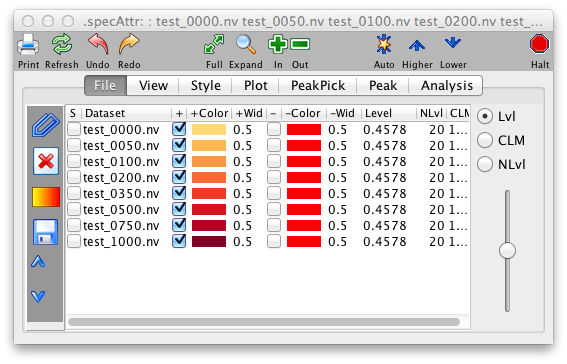

The File Panel is divided into two regions, the left side consisting of
a set of buttons, and the right side contains a table of all the spectra
currently assigned to the current spectrum window.

Add and Remove Buttons

Clicking the "Add" button gives you a new panel showing you all the
datasets in your working memory, thus all the spectra you can add to
this window. If you wish to add one, highlight it and click the "Add"
button at the bottom of the panel. To remove datasets from the spectrum
window, highlight the corresponding rows in the file table and then
click the "Remove" button.

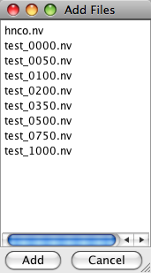

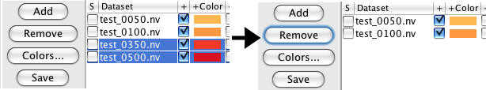

The columns of the datasets table are as follows. The first column,
labeled "S" is contains checkboxes which can be used to select datasets
whose contour levels will be controlled individually. The column labeled
"Dataset" contains the name of the dataset whose properties are
displayed and controlled by that row of the table.

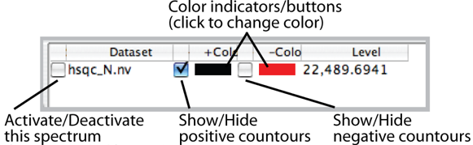

The next column, labeled "+" is a checkbox, that when turned on allows
the display of positive contours of the dataset. The "+Color" column,
which is a colored rectangle, displays and controls the color used for
positive contours. Click on the rectangle to display a Color Selection
Dialog. After you choose a color using either the "Swatch", "RGB", or
"HSV" modes, click OK. You'll see the colored rectangle change to
reflect the new color but you need to click the "Draw" button to
actually refresh the spectrum with the new color. The next two columns
"-" and -Color" are the same, but display and control negative contours.

The contour threshold (for 2D displays) or vertical scale (for 1D
displays) is displayed and controlled with the column labeled "Level" or
with the slider at the far right side of the File Tab display. You can
type a new value into the Level column and hit the enter key to set it.
Sliding the slider up or down will adjust the levels of al datasets up
or down. If you want to control individual datasets select them with the
checkboxes in the "S" column. Note that the slider will change dataset
levels in a multiplicative way, so that if individual datasets have
different levels assigned they will retain their relative scale as they
are adjusted.

The "Colors..." button brings you to two menus that control a host of
color functions (?). The first choice, "Spectrum," enables you to apply
preset coloring schemes to sets of overlaid data (?). The second choice,
"Background etc.," determines the colors of your background, axes, and
cursors.

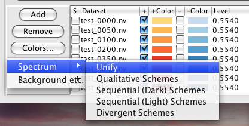

Consider the "Background etc." menu first. Clicking on any of the four
buttons Background, Axes, Cursor 1, or Cursor 2 will get you a standard
color selection chooser panel (?), which is self explanatory. Click on a
color, and that's what you get. You can create a color in the HSB or RGB
panels should you be so motivated. NVJ comes with six preset color
combinations for these four items, and this menu is available with the
"Schemes" selection of the Background etc. menu (?).

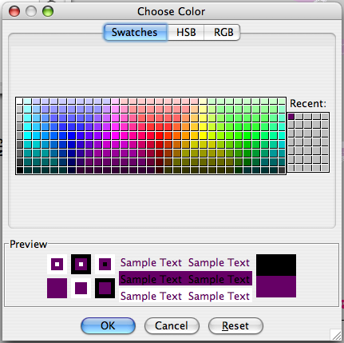

Next consider the "Spectrum" menu. Using this menu is a great way of
applying a coherent color scheme to a set of related spectra, such as
one would find in a titration or screening assay. Let's skip the "unify"
choice for a minute. Clicking "Qualitative Schemes" gives you the color
palette shown in the bottom left of ?. Each row in the palette
represents a set of colors to be applied to the peaks of each spectrum.
In this example, we have four overlaid spectra, so there are four
columns in the palette. Clicking on any member of a row will select that
color scheme. Here, I clicked the toprow, identified by the black arrow,
which changed the colors of the positive peaks in the Spectrum Window
and in the Spectrum Attributes...File display window (?). "Qualitative
schemes" gives you an apparently unrelated assortment of colors for your
spectra. The "Sequential" choices imbue your first spectrum's peaks with
a light shade of one hue, then apply progressively darker shades of the
same hue to subsequent spectra. The "Divergent" choices employ two
distinct colors for your first and last spectra and fill in the
intermediate spectra by adding these colors to one another in
progressive quantities (which, by the way, makes them lighter). No
matter which scheme you choose, you can always modify the color of
individual spectra later (which will be important if the light shades
are too light for your presentation).

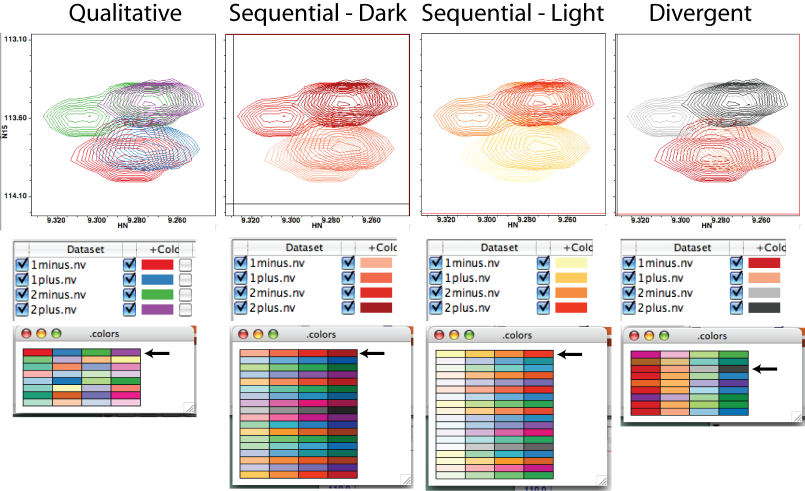

Each dataset can have a default contour level, positive contour color,
negative contour color, and flag specifying which contours (positive or
negative) to draw. Having these values set makes it much easier when
opening new datasets, especially when using the analysis tools like
RunAbout, Strips, Titrations etc. Whenever a dataset is assigned to a
spectrum, these default values will be used for that window. Setting the
default values can be done in the Dataset Table or Manager, but an even
simpler method is to set up the display within one spectrum window and
then click the Save button in the Spectrum Attributes File Tab. This
will set the defaults for any datasets displayed in that window, and
save the values to the parameter files corresponding to the datasets.

> **Tip**
>
> Make setting and saving defaults as described above the first thing
> you do with any spectra. It will save lots of time as you work with
> the dataset in the future.

The amount of information in an NMR spectrum is generally so great that
it is often only informative to look at a portion of the spectrum at one
time. In NMRViewJ, sub-regions may be selected by limiting the region
limits on the x or y axis of the display, and/or choosing a
sub-selection of planes in spectra with three or more dimensions.

### View Panel

The View Panel provides controls to interactively select the display
regions. It is itself divided into three subregions. The first contains
a series of "combo boxes" for selecting display modes, the second
contains a group of controls for selection of region limits and
dimensions, and and the third provides an interactive graphical view of
the display region.

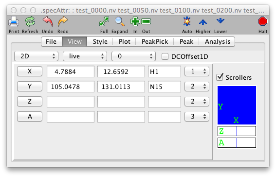

### 

**Dimensions**

:   This menu provides control of whether the spectral display is a one
    dimensional vector drawing, or a two dimensional contour plot.

    **1Dx**

    :   In this mode the the spectrum is displayed as one or more
        one-dimensional vectors in a horizontal orientation.

    **1Dy**

    :   In this mode the the spectrum is displayed as one or more
        one-dimensional vectors in a vertical orientation.

    **2D**

    :   In this mode the the spectrum is displayed as a two-dimensional
        plot.

**Mode**

:   The selected entry in this menu determines whether or not contour
    data is read from the matrix or a contour file..

    **Live**

    :   Data for the contour plot is obtained from the matrix file.

    **Record**

    :   Data for the contour plot is obtained from the matrix file, but
        the contours are recorded in a file for future playback. Only
        those planes that are actually drawn while in this mode are
        recorded.

    **Play**

    :   Data for the contour plot is obtained from the contour file that
        was created in record mode.

**1D Offsets.**

:   This determines how the offsets between 1D vectors are calculated
    when more than one spectrum (or row) is drawn in a single window.

    **0**

    :   With a setting of 0, there will be no DC offset between spectra.

    **1**

    :   With a setting of 1, the DC offset will be calculated so that
        spectra will be evenly spaced across the vertical range of the
        spectrum.

    **2**

    :   With a setting of 2, the DC offset will be taken from the
        "deltaoffset" parameter, set with "nv\_win deltaoffset".

    **3**

    :   With a setting of 3, the DC offset will be calculated so that
        the spectra will be evenly spaced across the vertical range of
        the spectrum.

    **4**

    :   With a setting of 4, the DC offset will be calculated from the
        "deltaoffset" parameter and the number of spectra to be
        displayed.

**DCOffset1D.**

:   This only effects the display of vectors (either true 1D spectra, or
    slices of higher dimensional spectra). If selected then the spectrum
    will be offset so that the edges of the spectrum will be displayed
    at zero. This is accomplished by subtracting a straight line
    calculated between the left and right edges. The offset is
    dynamically calculated as the spectrum plot limits are changed. The
    effect is only really appropriate when the spectrum is positioned so
    that the left and right edges are "baseline" regions.

### 

**X**

:   Press the Left Mouse button over the X to pop-up a menu of
    predefined plot limits, or enter values in the next two text fields
    to set the plot limits (in ppm) for the x (horizontal) axis. If the
    entry is followed (without an intervening space) by a "p", then the
    value is considered to be in units of points of the dataset. The
    minimum and maximum plot limits can be entered in either order.
    These values are automatically set to give the full spectrum when a
    new dataset is assigned to this window.

    The text in the third field is used as a label for the x
    (horizontal) axis. This value is used to label the axis on hard copy
    plots, is used for determining the correlation of cursors between
    different windows (see cursors, below), and is used during
    peak-picking and peak display (see Peak Picking, below). This is
    automatically set to the value assigned to the corresponding
    dimension (see below) during the referencing of the matrix, but can
    be changed by entering a new value in this field. 1(2,3,4) Hold down
    MENU over this item to select the dimension of the matrix to be
    displayed on x axis.

**Y**

:   Press the Left Mouse button over the Y to pop-up a menu of
    predefined plot limits, or enter values in the next two text fields
    to set the plot limits (in ppm) for the y (horizontal) axis. If the
    entry is followed (without an intervening space) by a "p", then the
    value is considered to be in units of points of the dataset. The
    minimum and maximum plot limits can be entered in either order.
    These values are automatically set to give the full spectrum when a
    new dataset is assigned to this window. The text in the third field
    is used as a label for the y (vertical) axis. This value is used to
    label the axis on hard copy plots, is used for determining the
    correlation of cursors between different windows (see cursors,
    below), and is used during peak-picking and peak display (see Peak
    Picking, below). This is automatically set to the value assigned to
    the corresponding dimension (see below) during the referencing of
    the matrix. 1(2,3,4) Hold down MENU over this item to select the
    dimension of the matrix to be displayed on y axis.

**Z**

:   Press the Left Mouse button over the Z to pop-up a menu of
    predefined plot limits, or enter values in the next two text fields
    to set the plot limits (in ppm) for the z (3rd Dimension) axis. If
    the entry is followed (without an intervening space) by a "p", then
    the value is considered to be in units of points of the dataset. The
    minimum and maximum plot limits can be entered in either order.
    These values are automatically set to display the full range of
    planes when a new dataset is assigned to this window. If the return
    key is pressed in the first Z field, then the second field will be
    set to the same value. The popup menu has a convenient entry to
    select the first or last plane. The spectral display window will be
    cleared prior to drawing the first plane is set. Subsequent planes
    will be overlaid on top of the first plane. To draw a single plane,
    set both values equal to each other.

**Z2**

:   Press the Left Mouse button over the Z2 to pop-up a menu of
    predefined plot limits, or enter values in the next two text fields
    to set the plot limits (in ppm) for the z2 (4th Dimension) axis. If
    the entry is followed (without an intervening space) by a "p", then
    the value is considered to be in units of points of the dataset. The
    minimum and maximum plot limits can be entered in either order.
    These values are automatically set to display the full range of
    planes when a new dataset is assigned to this window. If the return
    key is pressed in the first Z2 field, then the second field will be
    set to the same value. The popup menu has a convenient entry to
    select the first or last plane. The spectral display window will be
    cleared prior to drawing the first plane is set. Subsequent planes
    will be overlaid on top of the first plane. To draw a single plane,
    set both values equal to each other.

### 

The zoombox in the lower right corner of the spectrum provides a
graphical view of the current display region. The display region can
also be changed by interactively dragging the zoombox around. The
current display region is shown as the blue box. The position of the
view can be adjusted by pointing the cursor near the middle of the box,
holding the left mouse button down, and dragging the blue view box
around. The size of the view region can be adjusted by pointing the
cursor near an edge of the box, holding the middle mouse button down,
and dragging the side to its desired position.

The two rectangular regions at the right side of the zoom box display
the current display ranges for the 3rd and 4th dimensions of the
datasets (with these higher dimensions). A horizontal blue line will be
drawn at the relative position of the selected display planes. The width
of the line will represent the number of selected planes. You can use
the mouse to drag the blue line to a new position, or change its width,
and thereby update in real-time the display planes for the current
spectra.

### Graph Panel

The Graph Panel provides controls for altering the attributes of the
visible display of the spectrum, aside from the actual spectral data.
These attributes include fonts, colors of non-spectrum objects, borders
and whether or not axes are displayed. Together these are useful, not
only for altering the onscreen appearance, but also allow you to change
the appearance in a way that will be suitable for publication quality
output.

Fonts can be changed by clicking on the word Axes (to set the font used
for tic and axis labels), Crosshair (to set the font appearing in the
crosshair position display) or Peaks (to set the font used for drawing
peak labels on the spectra) in the Fonts section. A font chooser dialog
will appear in which you can change the font family, style and size for
the corresponding items.

When displaying spectra that are homonuclear in the two displayed
dimensions (proton COSY or NOESY, for example) it can be useful if the
cross-hairs are constrained so that the position of crosshairs 1 and 2
are mirrored across the diagonal. This can be turned on by clicking the
SymMode checkbox. Then, if the crosshair 1 (typically the black one) is
pointed at, for example, 7.0,3.0 ppm, then crosshair 2 (typically the
red one) will automatically be moved to 3.0,7.0 ppm.

The colors of the background, axes, and crosshairs are displayed as
colored squares. Clicking on these squares will display a color chooser
dialog with which the values can be changed. Alternatively, you can
choose from a set of predefined schemes by clicking on the "Schemes..."
button. This will display a choice of color schemes for these four
parameters. Click on the desired scheme and then close the scheme
dialog.

The size of the borders, these are the areas in which the axis labels
are drawn at the four edges of a spectrum, can be set by changing the
values in the "Borders" section. The values are specified as the number
of pixels between the edge and the axis line.

The Axes section controls the appearance of the the two axes, and a grid.
Whether or not axis labels and tick marks are drawn is controlled for
the vertical and horizontal axis by the two checkboxes in the "Axes"
section. The AxisWidth parameter controls the linewidth of the axis. By
default, the tick mark positions are automatically calculated to give a
reasonable spacing of major tick marks. You can change this by
explicitly entering a tic mark spacing in the Tic Delta X and Tic Delta
Y fields. If the values are set to 0 then automatic calculation of the
spacing will be done. Grid lines are drawn across spectrum if the Grid
checkbox is set. By default, the axis units are in PPM, but this can be
changed with the selector to the right of the Grid checkbox.

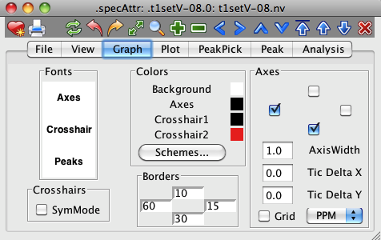

### Plot Panel

The Plot Panel provides a set of sliders to control contour levels of 2D
displays and x and y offsets of 1D spectra. It does not give you special
control of how your spectrum is plotted on paper beyond its appearance
on the screen. In that sense, NVJ is very WYSIWYG, which is good!

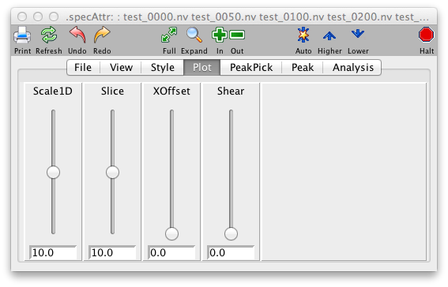

**NLvls**

:   Select a value using the slider to specify the maximum number of
    contours to be drawn.

**CLM**

:   Select a value using the slider to specify the ratio between
    subsequent contour levels. For example, a value of 1.5 means that
    each contour will be 1.5 times as high as the previous one.

**Scale1D**

:   Type an entry in this box to specify the scale value at which 1D
    slices are to be drawn. This value is multiplied by a global scale
    parameter (set in the Prefs dialog, default 1e6) to generate the
    actual value that is used. The up and down arrows provide a
    convenient means to increment or decrement the scale level. Clicking
    on the up arrow raises the scale level to a value equal to the
    current level times the current value of the multiplier (the value
    in the next field). Clicking on the down arrow lowers the scale
    level to a value equal to the current level divided by the current
    value of the multiplier (the value in the next field). Whenever the
    **Level**value is changed the **Scale**value is changed to be 10.0
    times the **Level**value as this generally provides good results.

**Xoffset**

:   Select a value using the slider to specify the offset position(from
    0.0 to 1.0) at which X (and Z) slices are drawn. be drawn.

**Yoffset**

:   Select a value using the slider to specify the offset position(from
    0.0 to 1.0) at which Y (and Z2) slices are drawn. be drawn.

Below, you see the effects of changing the settings the CLM and NLvls
settings on 2D peaks.

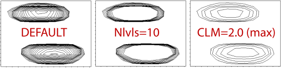

### PeakPick Panel

While it is possible to analyze NMR data by directly decomposing the raw
data into lists of parameters such as frequencies and linewidths, most
users still rely on Fourier transformation of the FID and then
identifying peak positions in the transformed data. Accordingly, NMRView
provides many tools for locating and analyzing these spectral peaks. The
PeakPick Panel is the standard starting point for generating lists of
peaks in a spectrum.

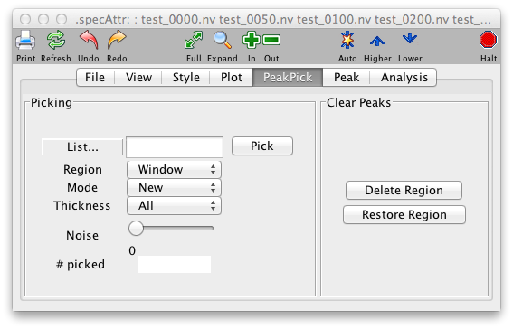

The algorithm used for locating peaks is quite simple, but relatively
robust and rapid. Peaks are considered points of local maxima (that is,
any point which has a higher intensity than all adjacent points). When
NMRView locates peaks it also performs the following steps: identify the
peak bounds (the width of the peak at the level of the intensity
threshold); estimate the half-height peak width; determine whether the
peak is on the edge of the spectrum or adjacent to other peaks;
calculate the center position by interpolating the intensities of the
adjacent data points. Locating peak positions does not, however, include
estimating the peak volume. This must be done as a separate operation.

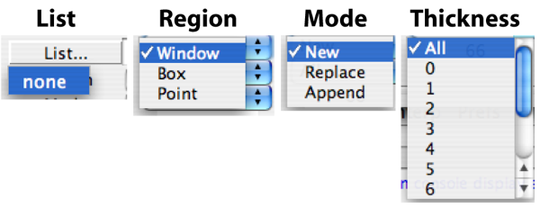

Once you've picked your peaks, you'll notice a few things. First, you'll
find the name of your peaklist in the peak list identifier window,
between the List pulldown and Pick button. This is the active list for
picking purposes, and can now be selected in the List... pulldown.
Second, you'll see a bunch of rectangles with crosshairs will be drawn
over your peaks in your spectrum display. Also, you'll see that the
number of peaks picked becomes displayed in the Peak Peak panel. If
you're appending to an existing list, this number will be the number of
new peaks, not the total number of peaks in the list.

To pick peaks in a particular region of the spectrum, display the region
in any spectral window. Then choose PeakPick from that window's pop-up
menu. The PeakPick Control Window will appear. Type the name that you
wish to be associated with the new peaklist in the text field of the
control window. Click on the Pick button to start the automatic
peakpicking. As peaks are identified in the spectrum, boxes annotated
with the peak number will be drawn on the spectrum at the position of
each identified peak.

Some spectra, especially 3D and 4D spectra, may be collected with a
sweep width narrower than the frequency range of the spectral peaks. In
these spectra, peaks are folded to a position that differs from their
true position by an integer multiple of the sweep width. Peaks on the
edge of such spectra "wrap" around to the opposite edge. At present
NMRViewJ wraps for peak searching at all times. Thus, the peakpicker
will wrap at the edge of the spectrum so that the peak width and
position are properly determined.

To pick peaks in a specified region of the spectral window, place the
crosshair cursors so as to box in the desired region. Select the Box
attribute in the PeakPick Control Window. Now, only the region within
the box will be analyzed for peaks. To pick peaks in the entire window
select the Window attribute instead. The peaks that are picked may be
stored as a new peak list, they may replace an existing peak list, or
they may be appended to an existing peak list. The desired option may be
selected from the pulldown list that specifies the New, Replace, or
Append Attributes.

Not yet supported in NMRViewJ. The filter option under pick region
restricts the peak pick to regions of the dataset defined by a
previously acquired peak list. For example one might peak pick an hncacb
spectrum looking in regions of the spectra that correspond to the 1H and
15N coordinates of an HNCO spectrum. If the list that is used for
filtering contains close or overlapping peaks this will result in the
same region of the active dataset being peak picked multiple times. To
prevent this first remove the overlapping peaks in the filter list using
the "couple" function under the edit menu in the peak analysis tool.

**List**

:   Enter the name of the peaklist. If mode (see below) is "New" there
    must not be an existing peaklist with this name. If mode is "Append"
    or "Replace", there must be an existing peaklist with this name.

**Region**

:   Specify whether to pick the entire region of the displayed in
    spectral window, or just that within the crosshair box.

    Window

    :   Peakpick the entire region displayed in spectral window.

    **Box**

    :   Peakpick the entire region within the crosshair box

    **Filter**

    :   FIXME Not yet implemented in NvJ. Peaks will be picked in
        regions defined by a pre-defined peak list. Selecting Filter
        causes the Filter List portions of the window to open. Once a
        peak list has been selected the Filter Axes and Correlate Axes
        Input sections open.

**Filter List**

:   Specify the peak list that will be used to control the filtered peak
    pick.

**Filter Axes**

:   Axes of the active dataset that is to be peak picked using the
    filter.

**Correlate Axes**

:   Specify which axes of the filter peak pick list are to be used to
    control the filtered peak pick.

**Mode**

:   Specify whether to create a new list, replace an existing one or
    append to an existing one.

    **New**

    :   Picked peaks will go into a new peaklist.

    **Replace**

    :   Picked peaks will replace an existing peaklist.

    **Append**

    :   Picked peaks will be appended to the end of an existing peaklist

<!-- -->

**Thickness**

:   Value is zero for a 2D peak pick. Set to non-zero value for 3D-peak
    pick when displaying only a 2D plane of the 3D dataset. Set to zero
    to peak pick a   series of 2D planes in a 3D dataset (e.g. when
    relaxation data is collected as   2D planes combined in a 3D
    dataset).

**Pick**

:   Do the peakpick.

**\# Picked**

:   Indicates how many peaks were picked.

### Local Noise Thresholding

NMR datasets often have regions that have much higher noise levels than
other areas. These are often areas with systematic artifacts, for
example a stripe from residual water. A threshold that is appropriate
for most regions of the spectrum may be completely inappropriate in these
artifact rich areas and if they are included in the peak picking process
a large number of peaks will be found that do not represent actual
resonances from the targeted molecule. NMRViewJ now includes a method
to determine a local estimate of the noise level at all points in the
spectrum. The peak picker can be set to only identify points that are
both above the general threshold for the whole spectrum, and above a
specified multiple of the locally calculated noise.

The local noise estimate is calculated by estimating the noise in
vectors that intersect from all dimensions at each data point. The noise
estimate from the dimension that has the largest noise estimate is used
as an estimate of the local noise at that peak. Calculating these
estimates is quite fast for 2D spectra, but can be somewhat
time-consuming for higher-dimensional spectra.

Local noise thresholding is turned on by setting the Noise value in the
PeakPick tab to some value greater than zero. A value of 10.0 seems to
be a reasonable choice. After setting this value click the Pick button.
If a local noise estimation has not been done for the spectrum you will
be prompted as to whether to do the calculation. At this point estimates
are not saved between NMRViewJ sessions. You can pick multiple times
in one session, trying different values of the Noise multiplier each
time, without needing to regenerate the noise estimate.

Here is a region of an HSQC spectrum where the peaks have been picked
without Local Noise Thresholding. Note the streak of peaks at the
position of the residual water.

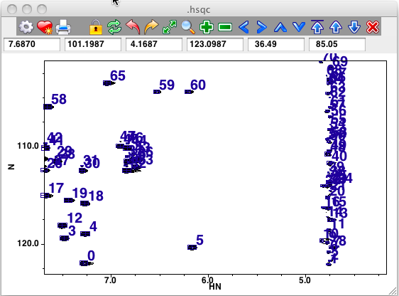

Here is the same region where the peaks have been picked with a noise
multiplier of 10.0 Note that, even though water region was included in
the peak picking, no peaks were found there. Not shown here, but users
will find that "real" peaks that are quite close to a streak will be
found.

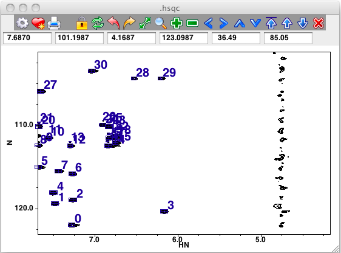

### Peak Panel

This panel works in a similar way to the File Panel, only instead of
controlling which datasets are displayed it controls which peak lists
are displayed. As with datasets, there is no practical limit to how many
peak lists can be displayed in a single spectrum window.

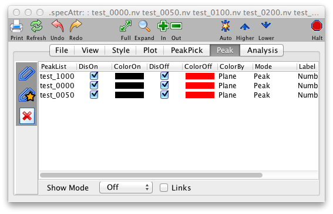

The left hand side of the Peak Display Panel is a list of all the peak
lists that are currently open within NMRViewJ. The right hand side of
the panel lists all the peak lists that are currently assigned to be
displayed in the spectrum. To add a peak list to the display list just
select the desired list in the left hand list box, and then click
the \>\>\> button. To remove a peak list from the lists that will be
displayed, just select the desired list in the right hand list box, and
then click the \<\<\< button.

When peaks are displayed the peaks will be drawn as rectangular boxes
centered on the peak position.

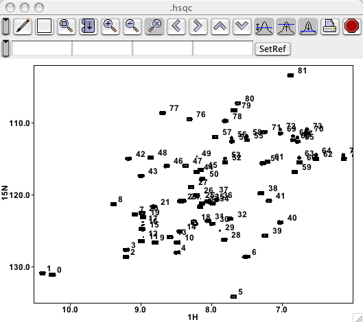

This panel provides controls to specify the display of peaks in the
spectral windows. The window header will indicate the name of the window
whose attributes are being set, and the name of the dataset currently
assigned to the window. The panel is displayed by selecting the
Attributes option of the Peak Menu in the Spectral Display Menu.

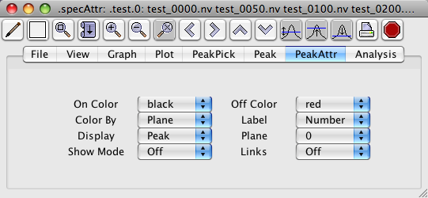

You can color-code your peaks, give them meaningful labels, and display
them in various ways using the controls in the Peak Attributes panel of
the Spectrum Attributes window (). NVJ defaults to coloring peaks
according to plane, making them black if they're in the plane you're
examining (which means all peaks in a 2D spectrum), and red if they're
not. Thus those in the plane are called "On" and those outside are
called "Off". Likewise, if you color by "Assigned," then peaks that are
assigned are "On" and adopt the "On" color, and those that aren't
assigned are "Off" and adopt the "Off" color. The "Plane" selection
allows you to display peaks from neighboring planes, and the pulldown
lets you choose how many extra planes to either side of the one you're
viewing will be included. Note that only the picked-peak rectangles,
crosshairs and labels get displayed this way, not the actual peaks. This
is useful for a number of purposes, especially for identifying sinc
wiggles flanking real peaks. In this case, you would observe two or more
small peaks one or two planes away from one major peak; by looking at
the peaks in neighboring planes, you could judge whether a small peak is
genuine or probably a sinc wiggle. NVJ defaults to 0 extra planes. If
you should select, say, 2 planes, you would see black peaks
corresponding to those in your active plane, and red peaks from two
planes on either side of it.

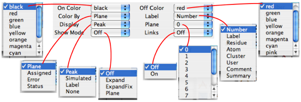

The Display pulldown lets you conveniently turn off the peak display.
Just pull down the menu and select "none", then click the "Draw" button
either in the Spectrum Attributes window or the Spectrum window.

The other controls are relevant only in connection with the Peak panel
(Main Toolbar...Assign Peaks, ) or in the case of Draw...Simulated, a
simulation routine. These will be described briefly for completeness
here, more extensively later, when discussing how to assign peaks.

The "Show Mode" is a fun feature that lets you scroll through your
peaklist and examine each peak on its own terms. If you select "Expand"
then go to your Peak panel, which shows information about a single peak,
then click in the display indicating the peak number , then hit your
return key. Zing! Your spectrum display places that peak smack in the
middle of your spectrum and scales your display so your peaks' rectangle
occupies about 25% of your window. If, in your Peak panel, then you
click the up or down arrows to examine the next or previous peak,
respectively, then that peak will be displayed (in its plane) such that
it occupies about a quarter of the screen in either direction. Choosing
"Expand Fix" in the Show pulldown retains the size of the currently
displayed region of the spectrum but still centers the peak in your
widow. This feature is useful when determining whether a peak is signal
or noise, as small peaks shown in Expand (not Expand Fix) mode show
little of their surroundings, making it hard to gauge their relative
significance. Selecting "Plane" in show mode seems like it should
display the current 2D region of the spectrum but only the plane
associated with the peak. When I tried it it didn't work, so this
feature is probably still in development.

The Label pulldown allows you to display the peak with a variety of
annotations. The default choice is the most basic, the Peak Number -
which simply corresponds to the order in which the peaks were picked.
Displaying the "Label" label shows the assignment (requiring your labor
or that of an automated routine) of the form F2(residue number.atom)
F1(residue number.atom), e.g. "12.HN 12.N" in an hsqc. If "Residue" is
chosen as the label, you just see the residue number, e.g. "12." "Atom"
will give the F2 and F1 atom types, e.g. "HN N". "Cluster" will show the
cluster this peak to which the peak has been assigned (peak clustering
will be covered in a later section of this guide). "User" corresponds to
the a line in the Peak window for entering the spectroscopist who takes
the credit/blame for a peak assignment. Likewise, "Comment" will display
the comment associated with a peak in the Peak window. "Summary"
displays the peak's intensity, number is series ("s 0" if it's not part
of a series), and X-axis chemical shift.

"Links" will enable an action related to the Link A and Link B lines in
the Peak panel.

With 3D and 4D spectra, only peaks whose z and/or z2 dimensions are
within a specified number of planes of the planes currently displayed
will appear. The range within which planes are displayed is specified
with the "Plane" control on the "Peak Attributes Panel" (see below) or
with the nv\_win peak\_off command. Peaks whose z and/or z2 dimensions
are closest to the display plane appear with the color red. Those peaks
that are off the display planes, but within the specified range appear
with the color green. These colors may be changed with the "On Color"
and "Off Color" controls on the "Peak Attributes Panel" or with the
nv\_win peak\_col\_on and nv\_win peak\_col\_off commands.
Alternatively, the color choice may be based on whether the peak has
been assigned (defined as the lack of a ? in the peak label fields).
This option may be selected with the "Color By" control "on the "Peak
Attributes Panel" or with the nv\_win peak\_col\_type command. The
second method to display peaks is by selecting the desired peak list
name

**On Color**

:   A pull-down menu of colors. If "On Color" is set to **Plane**, this
    specifies the color of peaks that are within the range of displayed
    planes. This mode is only applicable to three or four dimensional
    spectra. If colortype is set to **Assigned**, this specifies the
    color of peaks that have been assigned to specific atoms. If
    colortype is set to **Status** this specifies the color of peaks
    whose status value is greater than zero. If colortype is set to
    **Error** this specifies the color of peaks whose error values are
    **++**in all dimensions.

**Off Color**

:   A pull-down menu of colors. If colortype is set to "plane",this
    specifies the color of peaks that are **not** within the range of
    displayed planes, but are no more than "offset" number of planes
    outside this range. This mode is only applicable to three or four
    dimensional spectra. If colortype is set to **Assigned**, this
    specifies the color of peaks that have **not** been assigned to
    specific atoms. If colortype is set to **Status** this specifies the
    color of peaks whose status value is equal to zero. If colortype is
    set to **Error** this specifies the color of peaks whose error
    values are **not** **++** in all dimensions.

**Color By**

:   Specifies how the color of peaks is determined.

    **Plane**

    :   Color is determined by whether or not peaks are within the range
        of displayed planes.

    **Assigned**

    :   Color is determined by whether or not peaks have been assigned
        to specific atoms.

    **Status**

    :   Color is determined by whether or not the status field of the
        peak is greater than zero.

    **Error**

    :   Color is determined by the value of the Error field for the
        peak. If any dimension has a value not equal to "++" then the
        peak is drawn in the "Col Off" color.

**Label**

:   Specifies how the label displayed with each peak is determined.

    **Number**

    :   The label is the peak number.

    **Label**

    :   The label is composed of the assignment labels for each peak
        dimension.

    **Residue**

    :   The label is composed of the unique residue numbers from the
        assignment label for each peak dimension.

    **Atom**

    :   The label is composed of the atom fields from the assignment
        label for each peak dimension.

**Display**

:   Specifies how the peak is displayed.

    **Box**

    :   The peak is drawn has a box centered on the peak position, with
        a width equal to the peak bounds. A label is placed at the
        corner.

    **Simulated**

    :   The peak is drawn with simulated contours. The intensity and
        linewidth for the simulation are taken from the peak intensity
        and width.

    **Label**

    :   The peak position is labeled, but a box is not drawn.

**Plane**

:   Peaks are displayed that are within this number of planes of the
    range of planes that are displayed (for three and four dimensional
    spectra). For example, if planes 17 to 18 are currently being
    displayed in the spectral window, any peak that was closest to
    planes 17 to 18 would displayed, with the color selected in the "Col
    On" menu. Any peaks closest to planes 13 to 16 or 19 to 22 would be
    displayed with the color selected in the "Col Off" menu. Peaks
    outside of this range of planes would not be displayed.

**Show Mode**

:   This menu controls the response of the spectral window to actions
    taken in the peak analysis window.

    **None**

    :   If this item is selected, no action will occur in this window in
        response to peak selections in the peak analysis window.

    **Expand**

    :   If this item is selected an expansion of the spectrum around a
        particular peak will appear when a peak is selected in the Peak
        Analysis window. The width of the display region around the peak
        will be automatically set to five times the peak width in each
        of the display dimensions.

    **ExpandFixed**

    :   If this item is selected an expansion of the spectrum around a
        particular peak will appear when a peak is selected in the Peak
        Analysis window. The display limits will be changed so that they
        are centered on the new peak, but the width of the display
        region will not change from the current values.

    **Plane**

    :   If this item is selected the spectrum will be plotted at the
        particular plane(s) corresponding to the peak selected in the
        Peak Analysis window. The x and y plot limits will not change
        from the current values.

**Links**

:   If this is selected then peaks that have "links" between them will
    be drawn with a line connecting them.

**Close**

:   Close this panel.

### Analysis Panel

NMRView facilitates both visual and quantitative analysis of NMR
spectra. One of the simplest quantitative measures of the dataset is to
calculate some basic statistics. This can be done through the Analysis
Panel.

Place the cross hairs so that they form a box around the region you wish
to analyze. You can set the cross hair positions by moving them with the
mouse, or by entering values in the four entry boxes (x1,y1,x2,y2).
Next, click the Get Values.

The results of the analysis are placed in the the labeled fields as
follows:

volume

:   Return the sum of the points in the region.

evolume

:   Return the sum of the points in an ellipse bounded by the region.

min

:   Return the minimum value from the region.

extreme

:   Return the most extreme (maximum or minimum) value from the cursor
    region.

mean

:   Return the average value in the cursor region.

center

:   Return the value at the center of the cursor region.

jitter

:   Return the largest value (of the same sign as center point) within a
    certain tolerance (+/- 25% of the region width) of the center of the
    cursor region.

sdev

:   Return the standard deviation of the values in the cursor region.

The values are also stored in a global Tcl variable named `Nv_Value`.

It is often useful to look at not only the contour plot of a spectrum
with two or more dimensions, but to also look at vector slices through
the spectrum. The Extract Panel allows one to extract vectors from the
displayed spectrum. The extracted vectors are displayed in a separate
"vecGraph" window. The vecGraph window is fundamentally the same as any
other spectral display window, but has additional control widgets for
interacting with the displayed vector. Either one will extract a 1D
spectrum corresponding to the position of your black cursor (in the
default color scheme), calling up a new window. Extract/Replace extracts
one spectrum for display in a new window , and Extract/Add allows you to
overlay multiple 1D spectra in that window.

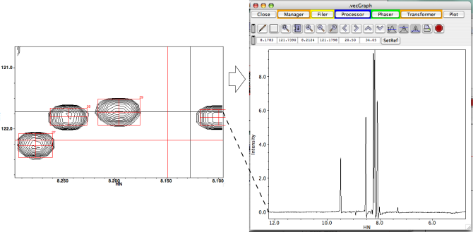

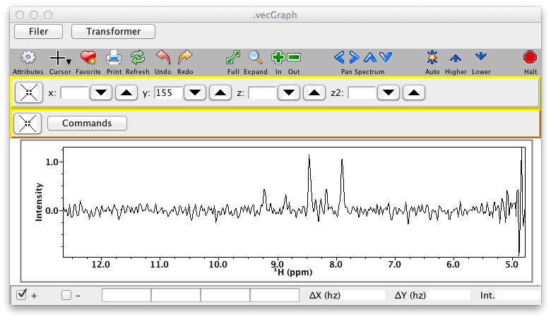

Vectors can either replace any previously existing vector in the
vecGraph window, or be displayed along with any existing vectors. This
latter mode can be used to easily compare slices at different positions
in the spectrum. Note, if multiple spectra are to be extracted into the
vecGraph window, then they should have the same axis labels.

**X**

:   Extract the slice parallel to the x-axis defined by crosshair 1.

**Y**

:   Extract the slice parallel to the y-axis defined by crosshair 1.

**Z**

:   Extract the slice parallel to the z-axis defined by crosshair 1.

**A**

:   Extract the slice parallel to the a-axis (z2-axis) defined by
    crosshair 1.

### Spectrum Pop-up Menu

Hold down MENU (the right mouse button) within a spectral display window
to display this menu.

**Attributes**

:   This command will open up the spectral attributes window. If the
    window is already open it will set it to display the attributes for
    the active spectral window.

**View**

:   The commands in this menu allow the user to change the region of the
    spectrum that is displayed in this window.

    **Draw**

    :   Draw the current view.

    **Expand**

    :   This command changes the plot limits to include the region
        bounded by the two crosshairs and redraws the spectrum.

    **Previous**

    :   This command changes the plot limits to that which was active
        prior to the last expansion and redraws the spectrum. The
        previous 8 views are saved so the user can return to them with
        this command.

    **Full**

    :   This command changes the plot limits to that of full spectral
        width for each of the two displayed dimensions and redraws the
        spectrum.

    **Center**

    :   Center the current view on the crosshair cursor (number 1).

    **Zoom In**

    :   Zoom the display into a region around the center of the
        currently displayed region. A smaller portion of the spectrum
        will be displayed, and the displayed peaks will look larger. The
        positions of the crosshair lines have no effect on this
        operation.

    **Zoom Out**

    :   Zoom the display out from the center of the currently displayed
        region. A larger portion of the spectrum will be displayed, and
        the displayed peaks will look smaller. The positions of the
        crosshair lines have no effect on this operation.

**Edit**

:   This menu provides commands to copy display attributes from one
    window to another.

    **Copy**

    :   This command saves the display attributes of the current window
        into the copy buffer.

    **Paste**

    :   This command sets the dataset and plot limits of the current
        window to those in the copy buffer, and redraws the current
        window.

    **Paste Limits**

    :   This command sets the plot limits of the current window to those
        in the copy buffer, and redraws the current window.

    **Copy Image**

    :   This command copies an image of the currently displayed window
        to the computers clipboard. From there it can be pasted into
        other applications that support graphical images.

**Cursor**

:   This menu can be used to switch between different cursor modes. The
    use of the crosshair cursors is described in the section on
    Cursors. The use of the PeakAdjust, PeakAdd
    and PeakDelete modes is described in the section on Interactive Peak
    Editing.

    **Crosshairs-1B**

    :   Crosshair cursors are drawn as the mouse is dragged. This mode
        is appropriate for one-button mice, but will also work with the
        left mouse button of three-button mice. The crosshair that is
        moved is determined by which crosshair is closer to the mouse
        pointer.

    **Crosshairs-3B**

    :   Crosshair cursors are drawn as the mouse is dragged. This mode
        is appropriate for three-button mice. The left mouse button
        controls crosshair 1 (usually black), the middle mouse button
        controls crosshair 2 (usually red), and the right mouse button
        is used to display the pop-up menu.

    **Select**

    :   The cursor, which will look like an arrow pointer, can be used
        to select peaks. Click once on a peak to select it. Any
        previously selected peaks will be deselected. Clicking with the
        Shift key held down will append peaks to the list of selected
        peaks. Selected peaks will be displayed with their foot print in
        a transparent yellow color.

        If the cursor is clicked and dragged a selection box will be
        dragged out. When the cursor is released any peaks in the box
        will be selected.

        Selected peaks can be moved by pressing the left mouse button
        with the cursor near the center of a peak and dragging them to a
        new position.

        A selected peak can be resized by, while holding down the Alt key, 
        pressing the left mouse button
        with the cursor near the edge of the peak and dragging the
        footprint to a new size.

        W> Adjusting peaks when using the Gnome Window Manager
        W>
        W> On the Gnome Window Manager moving the mouse while the Alt key is down will drag the whole window around, preventing you from resizing peaks.  You can change this behavior by entering the following command in a terminal.  This changes the window manager so that moving windows is done by moving the mouse with the Super, not Alt, key down.
        W>
        W> **gsettings set org.gnome.desktop.wm.preferences mouse-button-modifier "\<Super\>"**
        W>

    **PeakAdd**

    :   The cursor, which will look like a peak shape, can be used to
        interactively add peaks at the cursor position.

    **PeakDelete**

    :   The cursor, which will look like a skull and crossbones, can be
        used to interactively delete peaks at the cursor position.

**Peaks**

:   This menu can be used to switch between different cursor modes. The
    use of the crosshair cursors is described in the section on
    Cursors. The use of the PeakAdjust, PeakAdd
    and PeakDelete modes is described in the section on Interactive Peak
    Editing.

    **Pick**

    :   Pick peaks in the crosshair region. If no crosshairs are
        displayed pick the entire region that is displayed. If no peaks
        are currently displayed then the list name will be that of the
        displayed dataset. If peaks are currently displayed then the
        newly picked peaks either replace them (if there are any current
        peaks within the crosshair region), or append to them (if there
        are no peaks currently displayed within the crosshair region).
        If multiple datasets are displayed then the peak picking process
        will be repeated for each dataset.

    **Link**

    :   Create links between the selected peaks (that is connect them to
        a common resonance). Links are made along only one dimension.
        The link dimension is the one with the smallest chemical shift
        range among the selected peak. For example, if the peaks are
        from a 2D HSQC spectrum displayed with H on the x axis, and N on
        the y axis, and the selected peaks are in a vertical column then
        the peaks will be linked by along their N dimension.

    **UnLink**

    :   Remove links between the selected peaks (selected peaks will now
        be connected to distinct resonances).

    **Delete Selected Peaks**

    :   Any peaks selected will be marked for deletion. They will no
        longer be displayed, but will not be permanently gone until the
        peak list is compressed.

**Reference**

:   This menu can be used to adjust the referencing of the current
    spectra or peak lists.

    **Shift Spectrum**

    :   The referencing will be changed so that the point on the
        spectrum that is at the position of the intersection of the red
        crosshair will be the chemical shift at the position of the
        intersection of the black crosshairs. This is often done to
        align to spectra by placing the black crosshairs on a peak in
        the correctly referenced spectrum, and placing the red
        crosshairs on the corresponding peak in the incorrectly
        referenced spectra. Choose this menu option from the window
        containing the correctly reference spectrum.

        After the reference is adjusted you will be prompted as to
        whether to save the new reference values into the datasets
        parameter file. If a peak list is displayed you will be prompted
        as to whether to shift the peak positions by the same amount.

    **Shift Peaks**

    :   This action is performed the same as the above action, in that
        the black crosshairs are positioned at the correct position and
        the red crosshairs at the position that should be adjusted.
        Typically this is done when a peak list is displayed on a
        spectrum, but the peaks are not aligned properly, perhaps
        because the dataset was referenced as above, without also
        shifting the peaks, or perhaps the peak list is from a
        different, but related dataset. Place the black crosshairs at a
        specific spectral peak contours, and the red crosshairs at the
        peak box that corresponds. Then choose this menu option.

    **Save Dataset Pars**

    :   This item will save the current reference values into the
        dataset's parameter file and is useful if you didn't do so when
        doing the Shift Spectrum command above.

**Slices**

:   This menu can be used to display 1D slices across 2D (or higher
    dimensional) spectra. The vector extracted from the displayed
    dataset, to generate the slice, will be chosen based on the position
    of crosshair number one.

    **Shift Spectrum**

    :   Pick peaks in the crosshair region. If no crosshairs are
        displayed pick the entire region that is displayed. If no peaks
        are currently displayed then the list name will be that of the
        displayed dataset. If peaks are currently displayed then the
        newly picked peaks either replace them (if there are any current
        peaks within the crosshair region), or append to them (if there
        are no peaks currently displayed within the crosshair region).
        If multiple datasets are displayed then the peak picking process
        will be repeated for each dataset.

    **Shift Peaks**

    :   Create links between the selected peaks (that is connect them to
        a common resonance). Links are made along only one dimension.
        The link dimension is the one with the smallest chemical shift
        range among the selected peak. For example, if the peaks are
        from a 2D HSQC spectrum displayed with H on the x axis, and N on
        the y axis, and the selected peaks are in a vertical column then
        the peaks will be linked by along their N dimension.

    **Save Dataset Pars**

    :   Remove links between the selected peaks (selected peaks will now
        be connected to distinct resonances).

**Extract**

:   Use this menu to copy the slice defined by crosshair 1 through the
    selected dimension to the vecGraph window, and display it. Selecting
    from the "Replace" sub-menu will extract the vector and replace any
    vectors currently displayed in the vecGraph window. Selecting from
    the "Add" sub-menu will extract the vector and add it to any vectors
    currently displayed in the vecGraph window.

    **X**

    :   Extract the slice parallel to the x-axis defined by crosshair 1.

    **Y**

    :   Extract the slice parallel to the y-axis defined by crosshair 1.

    **Z**

    :   Extract the slice parallel to the z-axis defined by crosshair 1.

    **A**

    :   Extract the slice parallel to the a-axis (z2-axis) defined by
        crosshair 1.

**Phase**
:   PREMIUM\_PHASE
    Use this menu to phase the spectrum.

    **X**

    :   Phase the dataset dimension parallel to the x-axis.

    **Y**

    :   Phase the dataset dimension parallel to the y-axis.

    **Z**

    :   Phase the dataset dimension parallel to the z-axis.

    **A**

    :   Phase the dataset dimension parallel to the a-axis (z2-axis) .

Regardless of the method used to create spectrum widgets, each such
widget will be listed in the **Spectrum Manager**. You can use this GUI
to delete existing windows and bring them to the front with the controls
in this panel.

**Close**

:   Dismiss this panel.

**Delete**

:   Delete the spectral window that is selected in the window list
    above.

**To Front**

:   Bring the spectral window that is selected to the front of the
    display.

## Spectrum Synchronization

Advanced tools like RunAbout provide features for synchronizing the
display of different windows, but sometimes one wants to set this
synchronization up in a more ad hoc way. You can set up synchronization
between windows using the Synchronize... menu entry on the main Windows
menu. First make sure the window you want to be the "source" of
synchronization events is the active window. Choosing Synchronize...
will display the following dialog.

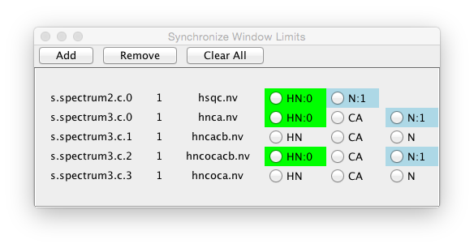

This dialog can be used to set up synchronization of the plot limits
of two or more windows.  Every time the display of one
window is changed, any synchronized dimensions of other windows 
will be changed. 

To add a synchronization, select two or more dimension names and 
click the **Add** button.  The synchronized dimensions will be added
into a sync group.  Dimension names in the same sync group will have
a common integer number after their name (like HN:0) in the dialog panel.
Dimension names in a common sync group will be displayed with a 
common background color as well.  Dimensions not currently in an active
synchronization group can be added to an existing group by selecting one
dimension in the group, and the new dimension.  The dimension names 
do not have to be the same within a synchronization group, but obviously
the synchronization only makes sense if they at least have overlapping 
view ranges.
