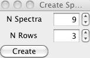
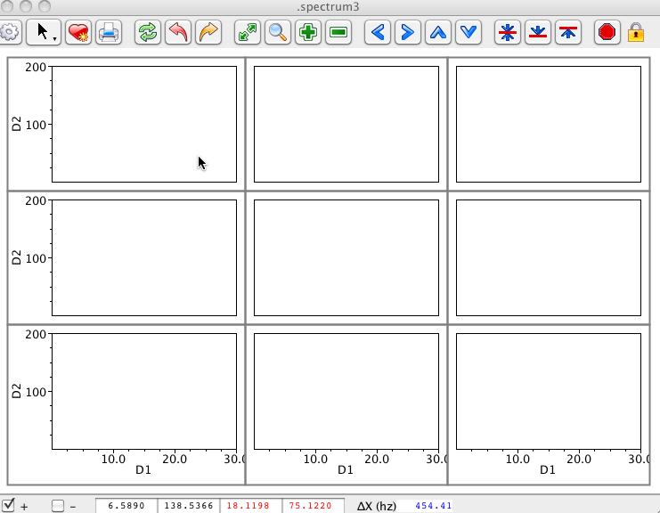
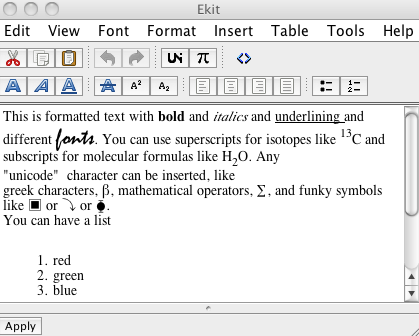
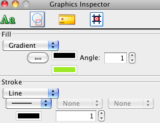

Canvas windows are display windows in which you can place graphical
objects that can be as simple as lines and rectangles, or as complex as
NMR spectra or charts. They can be used in a way completely analogously
to spectrum display windows, where most of the display is taken up by a
spectrum, and there is an iconbar across the top that gives access to
spectral view controls. Or they can be simple blank canvases waiting for
you to add any particular object.

When you display a spectrum on a canvas the spectrum is just another
canvas object that can be positioned anywhere. That means you can create
complex arrangements of spectra, not just in a simple grid as with the
conventional spectral display windows. Spectral items can be positioned
in any arbitrary size and location, including overlays that are exactly
superimposed, or positioned as insets. Printing and exporting of
canvases with multiple spectra is simpler than with conventional gridded
spectral windows as well. With the normal spectral windows a grid is a
whole series of "widgets" packed into a single frame, all of which have
to be printed or exported in a correct arrangement to reproduce the
display. With canvases, there is just one single canvas to print or
export.

The simplest way to get a spectrum displayed in a canvas is to use
Datasets Open Dataset in Canvas from the main menu. In many cases,
however, one wants more control over how spectral windows are named,
configured and arranged. For example, sometimes one wants to pack
spectrum widgets inside of other windows, or create a matrix of spectra
all packed together. Accordingly, spectral display windows can also be
created either through the pop-up panels in the NMRViewJ GUI or through
Tcl commands. The latter method allows for the creation of very complex
arrangements of spectra in a way that can be used to facilitate a
complex analysis method.

The NMRViewJ canvas window is just the Tk/Swank canvas widget, extended
with additional display items. Because of this, the actual name for the
canvas windows must conform to the hierarchical, dot-separated, naming
scheme that is required of all Tk widgets. Both, the GUI interface for
creating windows, and the NvMkSpectrum command hide this from the user.
For example, if one uses either interface to create a window named
**noesy**, a new toplevel window will be created named **.noesy**, and
will contain within it a canvas widget named **.noesy.0**. The full name
must be used when the windows are referred to using explicit Tcl
commands. All items on a canvas are identified with integer canvas item
numbers, and optionally with a tag. When a spectrum item is created, a
low level Tcl command is also created that can give one access to
properties of that particular spectrum. If you're creating a spectrum in
a canvas named .win.canvas, and the spectrum's item number is "2", then
the command will be "s.win.canvas.2".

Window names cannot start with capital letters, so attempting to create
a window named "Noesy" will fail.

To create a new canvas that already contains one spectrum item, and has
the spectrum tool bar across the top, choose Canvas \> New \> Spectrum from the main menu
bar. A new toplevel window containing an icon bar at the top, a canvas
in the middle, and a crosshair position bar at the bottom, will appear.
The canvas will contain one graphical object, a spectrum.

You can also create a toplevel window, with a canvas, and a grid of
multiple spectra. Choose the Canvas \> New \>
Spectra menu item from the main menu. You'll get a dialog in
which you can specify the total number of spectra items to be created
and the number of rows they should be displayed in. Just select these
values and click Create. Note that as you increment the N Spectra entry
the N Rows entry will be automatically incremented to give you an
appropriate number to give a nearly square grid of windows. But, you can
change it to any value between one and the number of windows to be
created.

The spectra, either one filling most of the window, or a grid of spectra
will be created in fixed positions as with traditional grids of spectra.
You can, however, unlock their positions, and drag them around to any
location and size. See the section below on the Lock icon in the icon
bar for details.

You can also create toplevel canvas windows that don't contain any
spectra items. Just choose Canvas \> New \>
Figure from the main menu bar and you'll get a toplevel window
with a canvas. Note that when doing this the window will not include a
spectrum icon bar at top, or crosshair status bar at bottom. It will,
however, have a menu bar at top that includes the canvas menu, and a
menu for controlling data fitting in case you add any charts.

Documentation coming.

Controlling the display of spectra in a canvas window is done exactly
the same as with traditional NMRViewJ windows. The Spectrum Attributes
window works with both traditional spectra and canvas spectra. Whichever
window is "active" (recently clicked in) will be controlled. Please see
the chapter **Creating and Using Spectral Display Windows** for details.

When creating a toplevel window with a canvas containing one or more
spectra items, as described above, you'll find that an Icon Bar is
present across the top of the window. These Icons provide easy access to
commands to adjust the spectrum view and levels, as well as to print
spectra and stop contour drawing that is in progress in a given window.
Most icons work the same way as those in the traditional spectrum window
icon bar, but there are a few differences to be aware of.

First, there are two additional icon buttons on canvas containing
windows for controlling the cursor mode and layout of spectra items. The
lock  button serves to
lock or unlock the positioning of spectra items on the canvas. If
locked, the spectra cannot be moved or resized (though any other canvas
items can). When unlocked they can be selected, moved, and resized.
Typically you'll want to leave them locked so you don't accidentally
move or resize them. Unlock them when you wish to adjust their layout,
adjust them, and then re-lock them.

The cursor button serves gives easy access to
changing the mode of the cursor between Selector, Crosshair, Peak
Delete, and Peak Pick modes. The actual icon displayed will represent
the current mode.

Actions induced by clicking on the icon bar buttons might apply to more
than one spectrum item displayed in the canvas. The default is that
actions like zooming in or out, or raising and lowering the contour
level will apply to every spectrum item that is activated. All spectra
items are normally activated when they are created, but may be
deactivated by pressing the Esc key while the mouse cursor is over the
item. Activated items will always have a gray border around the
periphery of the item. Deactivated items will not respond to any actions
from the icon bar or crosshairs, other than responding to a double-click
of the left mouse button which will cause them to be activated.

The canvas can display a variety of items, including text, graphical
shapes, annotation lines, charts, and spectra. Items are inserted by
choosing an entry in the Canvas \>
Insert menu. The item will be added to the canvas in an arbitrary
place. You can then move and resize it, as well as change various
attributes such as its color.

Item types fall into categories of graphical objects, text, annotations,
spectra and charts.

Graphical Objects

:   Lines, Rectangles, Arcs and Ovals. Use the Graphical Inspector to
    alter attributes such as colors, stroke widths, arrows, and dash
    styles.

Text

:   Text can be simple, formatted, or tabular. Simple text can be
    modified in which case you can change the actual text, the font and
    the color. Formatted text, can be modified by setting the attributes
    of individual characters to create complex formatted text, using
    various fonts, colors, bold, italic, superscripts and subscripts.
    You can also insert virtually any symbol. Text can also be inserted
    in a tabular form. Formatted text and tables are edited with a
    special editor that gives access to the various formatting
    attributes.

    Formatted text and tables is actually created using HTML, the
    language of web pages, and the text editor is basically an HTML
    editor. It is basically WYSIWYG (what you see is what you get), but
    the advanced user might want to see and edit the actual HTML code.
    Double clicking on formatted text or tables will display the editor.
    Once you've created and formatted your text, click the Apply button
    at the bottom of the editor.

    

Spectra

:   As discussed above, you can have one or more spectra. Use this
    insertion menu item to add an additional spectrum item to the
    canvas.

Charts

:   You can insert one or more XY, bar, and statistical bar charts on a
    canvas. When inserted they will have some simple example data. We
    don't provide a graphical editor yet for the chart data, but you can
    use commands entered in the console to change the data and
    attributes of the charts. See the chapter on Charts for details.

Text

:   In text mode you can edit the actual text to be displayed, the color
    of the text, its alignment, and the font used. This is obviously
    used for text items, but note that rectangles and ovals can have
    text displayed as part of the item as well.

Attributes

:   Fill attributes apply to items such as rectangles, ovals, and arcs.
    Even spectra have a fill property. When using the spectrum
    attributes panel to change the spectrum background you are effecting
    the background of the entire canvas. You can change the fill
    property to change the fill of just a single spectrum on the canvas.
    Clicking the color chips for a fill, and either of the two color
    chips, for gradients will bring up a color editor. Colors can have
    varying levels of transparency, as selected in the color editor.

    

    Stroke attributes affect the width, color, and dash style of lines
    (including the bordering line of filled shapes like rectangles), and
    the presence and type of arrow heads at either end.

Geometry

:   The size and location of items on the canvas can be manipulated by
    selecting them and dragging the whole object to position them, or
    one of the handles that appear when selected to resize them. You can
    also use the controls in this dialog area to adjust the size and
    position.

    Graphical items can be positioned and sized in three different
    coordinate spaces.

    Pixels

    :   In this default space, coordinates are expressed in pixel units
        of the graphical display with the origin of the coordinate
        system (0,0) being at the upper left corner of the canvas.

    World

    :   In this space, coordinates are expressed in units of a spectrum
        object. In particular, they will be in chemical shift (ppm)
        units of the object that is below them when they are switched to
        this coordinate system. Items using this space will then stay in
        the same chemical shift position no matter how the underlying
        spectrum is zoomed or panned.

    Fraction

    :   In this space, coordinates are expressed as fractions of the
        canvas size, so that the origin 0,0 is at the upper left corner,
        and 1,1 is at the lower right corner. Objects positioned in this
        system will take up the same relative portion of the canvas no
        matter how the canvas is resized.

    You can switch items between the three coordinate systems by simply
    clicking on one of the three radio buttons in this geometry dialog.
    The actual position of the displayed item will not be changed, but
    the coordinates of the item will be transformed to give the same
    position on the canvas as it was in the previous coordinate space.
    Note that the values in the size and location spinboxes are always
    displayed in pixel units no matter what coordinate system the item
    is using.

AnnoLines

:   Annotation lines are vertical, horizontal or diagonal lines that are
    drawn between crosshair lines. They are always drawn in world
    coordinates, that is chemical shift (ppm) space. Just position the
    crosshairs where you want on the spectrum and click the appropriate
    button on this dialog. The location of the simple lines is
    independent of the relative positioning of the black and red
    crosshairs. For example, if you click the button showing a vertical
    line on the left side, a line will be added to the spectrum along
    the left most vertical crosshair. The annotation line, with arrow
    and text is always drawn from the intersection of the two black
    crosshairs to the intersection of the two red crosshairs.

Canvas items are drawn in a certain order and those drawn later will
appear over (in front of) items drawn earlier. You can select an item
with the cursor and choose Canvas \> Arrange \>
Send Backward or Canvas \> Arrange \>
Send Forward to move them behind or in front of other items.

Spectrum items can be moved around into arbitrary positions on the
canvas. You may wish, however, to arrange them in some organized
fashion. You can arrange them in a series of equally spaced vertical or
horizontal slices, or in a grid by choosing from the Canvas \> Arrange Spectra menu.

An NMRView user may spend considerable time creating and configuring a
canvas. Canvas windows can be saved to external files. NMRView has its
own file format which stores all the information necessary to recreate
the canvas window, with the exception of the actual datasets and peak
lists. The names and locations of datasets will be saved in the file, so
when reloading a canvas file NMRViewJ will attempt to locate the files
necessary to recreate the file, or prompt the user to browse to them if
necessary. Peak list information should be in memory, perhaps by loading
a STAR file, before loading the canvas.

Canvas files are actually a Zip archive. The archive contains a file in
XML format that describes the attributes of every item on the canvas, as
well as the names of datasets and peak lists used. The canvas file also
includes a thumbnail image of what the spectrum looks like, and a full
resolution image of the canvas. These images are used in the NMRViewJ
canvas file browser.

Canvas files can be saved by choosing the Canvas \> File \> Save... menu item. A file
browser will pop-up and prompt for the location to save the file in.
Files automatically get a ".dcxf" extension. Canvas files can be loaded
by choosing the Canvas \> File \>
Open... menu item. A file browser will pop-up and prompt for the
location of the file to open.

NMRViewJ includes a canvas file browser, accessed via the Canvas \> File \> Browse... menu item. Since
each file includes a thumbnail image of what the canvas looked like you
can easily browse and choose your file visually. A file browser will
pop-up and prompt for the directory to browse. Choose the directory that
contains files, not individual files. The browser will appear and you
can use the scrollbar at bottom to scroll through the available canvas
files. Click the View button to pop up a full resolution image of the
file so you can examine it in more detail, or the Open button to
actually open the file.

Canvas files opened via Open... or Browse.. will displayed in a toplevel
window whose name is chosen automatically (typically .spectrum1,
.spectrum2 etc.) You can open the same canvas file multiple times, each
time it will appear in a new window.
