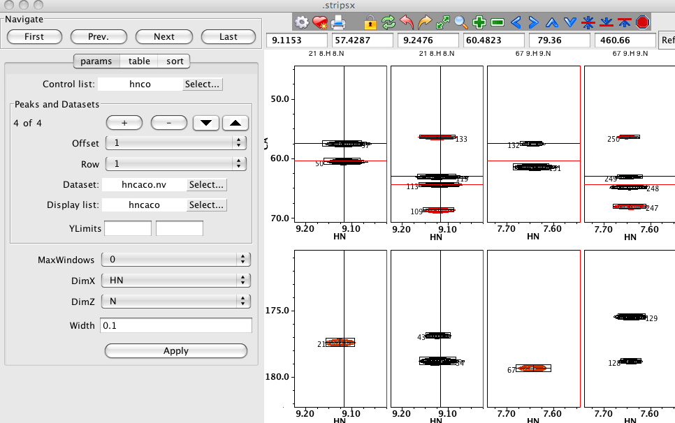
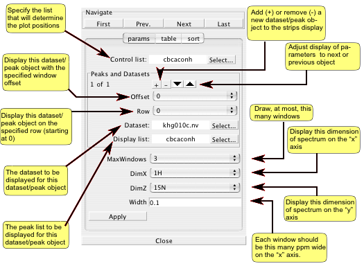
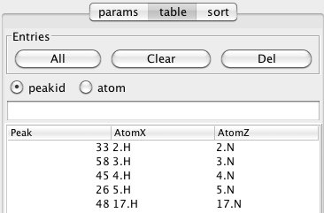
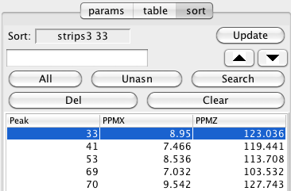

##Strip Plot Overview

A fact about NMR data is that the significant signals can exist in a
vast emptiness of noise. Peak picking routines can extract this
information into a concentrated set of numerical values, but it remains
valuable to have a visual way to represent the essence of the data sets.
One way to attain this is to render the data in a series of narrow
strips, the coordinates of which are chosen to select only regions of
the data that contain signals.

Typically the coordinates for a particular strip are chosen based on the
chemical shift values of an individual peak in a peak list obtained by
the peak picking procedure. The coordinates along the x axis are chosen
to center the peak in the strip, which generally has a predefined width.
The y axis coordinates are generally the full plot limits along the
corresponding dimension of the spectrum, though a more narrow range may
sometimes be chosen. If the strip has more than two dimensions, then the
strip is drawn at the dataset planes closest to the chemical shifts of
these additional dimensions.

An issue more complicated than establishing the coordinates of the
strips, is deciding what order the strips should be drawn in. The
simplest procedure is simply to draw them in order of the peaks in the
peak list. Generally this results in strips that are ordered by chemical
shift value. Often, however, it is more useful to draw the peaks in an
order which places related strips adjacent to each other. For example,
in an HNCA experiment strips derived from sequential residues might have
peaks with the same carbon chemical shifts, and this can be visually
displayed if the peaks are drawn with carbon chemical shifts along the y
axis of the strip.

This is often more clearly shown, if the strips are alternately chosen
from two different, but complementary, datasets. For example, by
alternately displaying the HNCA and HNCOCA experiment, the overlap of
the CA chemical shift as derived from the intra-residue HNCA, and the
inter-residue HNCOCA experiment can be displayed. Sequential
connectivities could also be visualized by alternately displaying a
TOCSY and NOESY experiment.

It should be noted that NMRViewJ provides powerful features for
coordinated analysis of spectra with its RunAbout tool (see below), but
if one wants to set up an explicit display of a series of strips of one
or more datasets as described here, the Strips tool is appropriate. The
Strips tool allows for an unlimited number of datasets to be displayed
with varying offsets and rows. In this example the Strips Tool is used
so that HNCA and HNCACB datasets are displayed in alternate columns of
the first row, and HNCO and HNCACO datasets in alternate columns of the
second row.

##Strip Plot Configuration

You can have multiple Strip Plot windows active at one time. First
select the Windows \> Strips menu item
to display an interface from which you can choose a name for the strip
window. After setting the window name and clicking Create you'll get the
Strips Window. The Strip Plot GUI automatically generates strip plots
from datasets based on the positions of a series of specified peaks.

The Params area of the window is used to specify which datasets and
peaks should be used along with several other parameters that determine
how the spectrum strips are displayed. Multiple datasets and peak lists
can be displayed in the Strip Plot GUI. Each associated pair of dataset
and peak list are referred to here as a dataset/peak pair. Regardless of
how many dataset/peak pairs are chosen for display, the user must choose
a single peaklist to be the Control List. The chemical shifts of the
peaks in the Control List are used to determine the display region for
each of the individual strip windows.

When only a single dataset/peak pair is to be drawn, the Offset and Row
parameters (see below) should be left at the default values of 0. When
the Control List is selected, the Display List for the first
dataset/peak pair will be set to the same list. The Dataset for this
pair will be set to the dataset associated with this particular peak
list. If a different dataset and/or peak list is desired use the
Select... buttons to bring up a menu of possible choices for these
parameters. The dataset used for the display doesn't need to be that
from which the peak was originally picked. It is possible to use a
peaklist picked in a spectrum different from that used as the dataset in
the Strip Plot. The only thing to take into account is that the names of
the labels in the peaklist are identical  to those used in the dataset
and the dataset must be loaded into NMRView prior to starting the Strip
Plot tool.

When more than one set of dataset/peak pairs are to be displayed, the
Offset and Row parameters are used to determine in which window strips
the data will be displayed. For example, if two dataset/peak pairs are
to be drawn and the first one has an Offset of 0, and the second an
Offset of 1, the pairs will be drawn in alternating windows. The first
dataset/peak pair will appear in windows 0,2,4,... and the second in
windows 1,3,5,...

For each additional dataset/peak pair to be displayed click the +. The
display area right below the Peaks and Datasets label will show which
set is currently displayed and how many sets are available. Click the
up/down arrows to advance through the sets. Move to each set and set the
Offset, Row, Dataset and Display List as desired. You can remove a
dataset/peak pair by clicking the - button.

The maximum number of window strips that are displayed is specified with
the MaxWindows parameter. If 0 is specified for this parameter, then the
maximum number of windows will be automatically calculated based on the
size (in pixels) of the window display area. The X axis limits for each
spectral display will be centered on the peak position, with a width
equal to a value specified by the Width parameter (0.1 ppm by default).
The Y axis limits are set by default to the maximum value for the
dataset. You You can enter values in to the YLimits entries to specify a
smaller range if desired. Each row of windows can have its values for
the Y axis limits.

Use the DimX and DimZ controls to set up which dataset dimensions will
appear on the X axis and Z plane (for 3D datasets). The remaining
dimension will appear on the Y axis. Because the symbolic name of the
dimension is used, rather than the sequential dimension, you can use
datasets collected with different dimension orders. The plot limits for
the X axis of the spectra are set with the Width parameter which
specifies the half-width of the window (in PPM).

Click the Apply button to configure all the spectra. If peak entries for
the control list have not been loaded into the Peak table (see below)
all peaks in the peak list will be loaded.

##Strip Plot Peaks

The regions displayed in each window of the strip plot are determined by
the chemical shift positions of the peaks in the Control List (as
specified above). The actual order of peaks used is determined by their
order in the Peak Table area of the Strips Tool. If this table is empty
(as it will be when the Strips Tool is first deployed), then when you
click the Apply button it will be filled with all the peaks from the
control list, in increasing order of their identifier number. There are
several ways to explicitly populate the table with peak entries.

Clicking the All button will load the table with all the peaks from the
Control list if the peakid checkbutton is selected, or all the peaks
from the Control list that have atom specifiers in their label fields if
the atom checkbutton is selected. Alternatively, you can add a specific
set of peaks by typing a list of peak identifiers into the field located
just above the table, and hitting the Enter key (if the table is already
loaded with all the peaks, you'll want to click the Clear button to
remove all the table entries first). Peaks should be entered as a space
separated list ("3 4 5") and can include peak ranges ("3-10 15-20").
After loading peaks into the table it is a good idea to hit the First
button in the Navigate section in order to update the actual display of
windows.

The buttons in the Navigate section of the Strips Tool let you change
which peak is positioned in the first column of windows. Clicking First
will set it to be the first peak in the table, and clicking Last will
change the display so the last peak entry is in the last column. Prev.
and Next will increment the display backwards and forwards through the
list of peaks.

You can change the ordering of peaks in the windows, by changing the
order of the table. The simplest way to do this is to sort the table
based on the values in any of the columns. Just click on the column
header, as is done with any table within NMRViewJ. After sorting refresh
the display with the First button. You can also interactively rearrange
the table by choosing a row, and with the left mouse button held down,
dragging it to a new position in the table. As soon as you release the
mouse the spectrum display windows will be updated with the new
positioning. Individual rows can be removed from the table by selecting
them and then clicking the Del button in the Entries section.

You can also use the Strips Tool to display a fragment generated in the
RunAbout tool. Each fragment in RunAbout is a series of clusters of
peaks that are linked together, with each cluster containing one peak
from a specified Reference List. First, set up the Strips Tool so that
the RunAbout Reference list is the Control list in the Strips tool and
choose the appropriate other datasets and peak lists. Then, instead of
entering one or more peak numbers in the peak entry area, enter a
cluster number with a suffix of "f". Thus if you want to display the
fragment that includes (anywhere within it) cluster number "45", just
enter "45f", and hit the Enter key. The table will now be populated with
the list of reference peak numbers in the order they appear in the
fragment containing cluster 45. Remember that cluster numbers are
actually the peak identifier number of the reference peak contained in
the cluster. You can specify multiple values (45f 52f) and combine
cluster numbers and peak numbers. For example, "45f 32", would add all
the reference peaks in the fragment containing reference peak 45,
followed by reference peak 32.

##Sort Mode

The sorting mode was devised as a way to aid in building up fragments of
sequential peaks. For uses such as assigning triple resonance backbone
experiments it is largely superseded by the RunAbout tool which is
generally more automated and provides much more information about the
quality of matches. But it is still useful in some applications.

The basic idea of this mode is to provide a way to select one strip out
of the series, and then use various alternative peak positions to update
the display of that strip. This allows you to visually step through
various candidate strips to find the best one that matches at the
current location.

First choose a strip to check by clicking in the spectrum window for
that strip and then click the Update button in the Sort section of the
Strips tool. Now load a series of peaks into the Sort sections own peak
table. You can click All, to add all peaks, Unasn, to add peaks that
don't have assignments, or type in a series of peak numbers into the
entry above the All button (click Enter to load them). All entries can
be deleted by clicking Clear, and the selected row by clicking Del.

Now you can use the up/down arrows (below the Update button) to cycle
through each entry in the list. As you move to a new entry, the value in
the main Peak Table (of the Strips Tool) will be replaced with the new
value, and the currently selected strip updated to show the strip at the
positions of the new peak.
