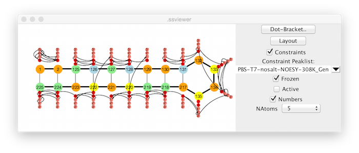

NMRView applications are all about studying molecules, so it's not
surprising that you can use it to keep track of information about your
molecule. But how do you get all those bonds and atoms into the program
where you can do something useful with them. Most NMRView users are
studying molecules made up of amino acids and/or nucleic acids. Since
these molecules are polymers of a small number of residues all you need
to do is give NMRView a list of the names of the monomers. The simplest
format for this information is just a text file containing the names of
the monomers. Something like: met, ala, asn, glu, lys The entries in the
file are the three letter names of the amino acids, and four letter
names for nucleotides. For nucleotides, the first letter is "d" or "r"
depending on whether the monomer is for DNA or RNA, respectively.

To read the file, use the Molecules \> Read
Topology \> Sequence File menu command. If you like typing more
than mousing, type the command "nv\_sread seq fileName" and you will get
the same result. In the current version of NMRView, the "fileName"
argument needs to be the complete path to the molecule. Both these
methods will read the molecule in, and setup up some information within
NMRView so that when you save a "STAR" file the molecular structure will
be saved as well. That way, you only need to explicitly read the
molecule in once.

The "nv\_sread seq" command allows you to read a structure without an
external file by using the "-list" option. For example, nv\_sread
seq -list "ala gly phe" molname. Just be sure to have quotes or curly
braces around the list of residues. In this example, "molname" specifies
a name to be used for the molecule.

Lots of scientists are interested in studying the interactions of two
molecules so you may want to have more than one molecule loaded at once.
There is no hard limit in NMRView for the number of molecules. You'll
probably have your head swimming in molecules before NMRView complains.
To keep track of all these molecules they need to have a unique names..

By default the molecule name used within NMRViewJ is derived from the
name of the sequence file. What if you want your file named
myfavoritemoleculein2006.seq, but want to use a simpler name within the
program, like Fred? Just put a name for the molecule in your sequence
file. To do this you should include a molecule line at the beginning of
the sequence file. This line should have two fields, the first should
read "-molecule" and the second should be the name of the molecule. Two
additional special lines can also be added to further define the molecule.
The "polymer" and the "coordset" fields lines have the same format as
the molecule line, that is "-polymer" or "-coordset" followed by the
name. NMRViewJ will use them to allow multiple polymer and coordset
entries. Think of the polymer as being a unique amino acid (or nucleic
acid) sequence. The coordset corresponds to what X-ray crystallographers
refer to as an assymetric unit. A homodimer would have one polymer, and
two coordsets.

Ligands can be specified in the ".seq" file with a line like "-sdfile
fileName.sdf". The file specified with the name must an ".mol" or ".sdf"
file and must be in the same directory as the ".seq" file.

What if you already have a PDB file and don't want to be bothered
writing a sequence file. Not too worry, you can read the PDB file
directly with the Molecules \> Read/Write
Topology \> PDB File (using library) menu command. You're
probably wondering what the parenthetical "using library" comment is all
about. If you use this command, then NMRView figures out what the
residue sequence is from the PDB file, and then loads the appropriate
residue topologies from NMRView's own residue library. The resulting
atoms and bonds should be the same as if you had read a sequence file
with the same sequence as the that in the PDB file. Because of this, the
atom names may not be exactly the same as what's in the PDB file. If
instead, you use the Molecules \> Read/Write
Topology \> PDB File menu command, then NMRView will use the
exact atoms that are in the PDB file. In this case NMRView figures out
the bonding based on inter-atomic distances and it may not get the
bonding exactly right.

You can also enter a molecular sequence directly within NMRVIEW without
loading a file. Just use theMolecules \>
Read/Write Topology \> Sequence GUI menu item to display a
sequence editor. You enter a molecule name at the top, and then enter a
sequence using either the three letter or one letter codes. NMRVIEW will
try to figure out which format you're using (space separated triplets of
letters will be assumed to be the three-letter code, contiguous letters,
like used in a Blast search will be assumed to be using the one letter
codes, etc.).

The Topology from Sequence commands just generate molecular topology
information within NMRView. (Whats topology? Just the names of the
atoms, and what atoms are bonded to what other atoms.) There is no
information about where in space (not to mention time) they are. You can
have your topology and coordinates too (if you know what they are). If
you've already generated a topology and want to add coordinates use the
Molecules \> Read Coordinates \> PDB
File menu command. The above two methods that use PDB files will
get coordinates for each atom they can find in the PDB file

When using the above menu option to read coordinates in NMRViewJ will
read all the "models" in the PDB file. Each model will be stored in a
structure accessible with the specified model number. For example, all
the coordinates after "MODEL 4" will be in structure number "4" in
NMRViewJ. All the models will be used when using the peak identification
tools and when calculating atom rmsd values and molecular
superpositions. When NMRViewJ first reads a sequence file it will
automatically generate 3D coordinates for the atoms. These will be for
the molecule in an extended conformation and will be stored in structure
number "0". Structure number "0" is deselected in coordinates are
explicitly read in. To specify which structures are currently active use
the Structure Selector described below.

| Option | Entry |
| ------ | ----- |
| Simple sequence |met, ala, asn, glu, lys |
| Sequence starts at "5"      |met 5, ala, asn, glu, lys |
| Sequence with breaks     |met 5, ala, asn 8, glu, lys, thr, his 15, arg, thr |
| DNA/RNA sequence |dade, dthy, dgua, dcyt, rade, ruri, rgua, rcyt |         
| Sequence with entity names  |-molecule fred, -polymer chainA, -coordset mono1, met 5, ala, asn, glu, lys |
| Heterodimer| -molecule mymol, -polymer poly1, -coordset A, met, ala, asn, glu, -polymer poly2, -coordset A, val, asp, arg|
| Homodimer  |-molecule mymol, -polymer poly1, -coordset A, -coordset B, met, ala, asn, glu|
| Polymer with ATP ligand | -molecule atpBinding, -polymer chainA, -coordset A, -sdfile atp.sdf, met, ala, asn, glu, lys   |
| DNA with negative resnum | -molecule quad -polymer A -coordset A da -2 dt dg 1 dc -polymer B -coordset B dg -2 dc da 1 dt |

## Atom Nomenclature

Unfortunately, there are two schemes, rather than just one, for naming
atoms that are in common use by NMR scientists. First, there is the
IUPAC standard which was agreed upon by a committee of scientists who,
we presume, hoped that their proposal would be universally adopted.
Second, there is the nomenclature used by the program XPLOR. There are
several differences between the nomenclatures, but the most obvious ones
are in the naming of methylene protons, which in IUPAC are values like
HB2 and HB3, or HG2 and HG3. In XPLOR these same atoms would be HB1 and
HB2, and HG1 and HG2. Another notable difference is that of the amide
proton, which in IUPAC nomenclature is "H", and in XPLOR is "HN".
Occasionally, one will see a structure which uses IUPAC nomenclature
for everything but the amide protons, which are labeled "HN" as with
XPLOR. Any particular structure may also have deviations from either
nomenclature, especially for the N-terminal protons and C-terminal
oxygens. There seems to be no particular advantage for the continued use
of the XPLOR nomenclature, other than inertia. Since it was already
widely used at the time of the ratification of the IUPAC nomenclature
it's continued use is, even if unfortunate, not surprising.

Some programs, for example CYANA, default to the use of the IUPAC
nomenclature, and others, obviously XPLOR for one, default to the use of
the XPLOR nomenclature. The consequence of this is a considerable loss
of time and wasted effort in dealing with two nomenclatures. It is also
a barrier to the facile use of multiple programs in one project.

NMRVIEW can support either nomenclature, and has some tools for
inter-conversion. The primary factor in determining which nomenclature
is in use is the choice of residue libraries that are used when a
molecular topology is created. Two sets of libraries, reslib\_iu for
IUPAC nomenclature, and reslib for XPLOR nomenclature are available. The
choice of residue library can be made in the Paths and Filenames section
of the Preferences Dialog. Also, if you are creating a new project with
the Project Browser you will be prompted as to whether to use IUPAC as
the nomenclature for the project. Finally, when a STAR file is saved the
current nomenclature setting will be saved in the STAR file. When the
STAR file is reopened that setting will be used when reconstructing the
molecular topology, regardless of what the reslib preference is
currently set at.

If you are unsure what nomenclature your current molecule is using you
can select the Molecules \> Nomenclature \>
Check/Change Nomenclature menu item. This will execute a
procedure that examines the current atom names and will report which
nomenclature most clearly matches. Sometimes one nomenclature will match
best, but there will be some atoms which don't match. A selection of
these will be reported. If the nomenclature is not IUPAC you will be
given the option of changing the nomenclature to IUPAC. This will not
only change the atom names in the molecular topology, but also the names
of any atom labels for peaks that are interpretable.

The numbering of residues is a related issue. Some structures being
studied correspond to a fragment of a larger macromolecule, or may have
an N-terminal addition used to aid in the expression or stability of the
molecule. In these cases the numbering may start at 1, corresponding to
the actual residues in the structure, or start at some other number that
represents the position of the first residue relative to the complete
macromolecule. You can select Molecules \>
Nomenclature \> Renumber... menu item to have the option of
adjusting the residue numbering. This will not only change the residue
numbers in the molecular topology, but also the residue numbers of any
atom labels for peaks that are interpretable.

## Atom Specifiers

Within NMRViewJ, atoms can be specified using a syntax as follows:

coordSetName.entityName:residueNum.atomName

The meaning of residueNum and atomName are relatively obvious, though it
should be noted that the residueNum can be prefixed with the single
letter amino acid code of the specified residue. That is you could enter
32.CA or F32.CA for the CA atom of residue CA (which happens to be a
phenylalanine). But what is a coordSet and entity? Imagine a dimer of
two identical polypeptide chains. Each polypeptide chain as represented
by an amino-acid sequence is, in the terminology of NMRViewJ, an
"entity". In this example there is only one entity. However, the entity
is represented twice (each monomer) in the actual molecule. Each of
these monomers is, in the terminology of NMRViewJ, a "coordSet" (so
named because in the molecular structure each monomer is represented by
a set of coordinates). A molecule that is a heterodimer would have two
entities, one for each polymer. Similarly, a protein with a bound ligand
would also have two entities, one for the polymer and one for the
ligand. Multiple coordsets and entities can coexist, so for example a
homopolymer with a ligand on each polymer would have two entities, each
represented once in each coordset.

Use the "mol select" command to select a set of atoms, then use "mol
listatoms" to return a list of them, and use "foreach" to loop over
them. Here's an example: This would print out all the chemical shifts of
the protons in a molecule.

~~~~~~~~
    mol select atoms *:*.H*
    foreach atom [mol listatoms] { 
       set ppm [nv_atom elem ppm $atom]
       if {$ppm != ""} {
             puts $ppm
       }
    }
~~~~~~~~
                

Note: the "nv\_atom elem ppm" command now returns "" (an empty string)
if the atom doesn't have an assigned chemical shift (which I think is a
better design than returning some stupid large negative number).

Within NMRViewJ, atoms can be specified using a nomenclature as follows:

coordSetName:residueName.atomName

The meaning of residueName and atomName should be obvious, but what is a
coordSet?

Imagine a dimer of two identical polypeptide chains. Each polypeptide
chain as represented by an amino-acid sequence is, in the terminology of
NMRViewJ, an "entity". In this example there is only one entity.
However, the entity is represented twice (each monomer) in the actual
molecule. Each of these monomers is, in the terminology of NMRViewJ, a
"coordSet" (so named because in the molecular structure each monomer is
represented by a set of coordinates).

Use the "mol select" command to select a set of atoms, then use "mol
listatoms" to return a list of them, and use "foreach" to loop over
them. Here's an example:

This would print out all the chemical shifts of the protons in a
molecule.

~~~~~~~~
    mol select atoms \*:\*.H\* foreach atom [mol listatoms] {

    set ppm [nv\_atom elem ppm \$atom] if {\$ppm != ""} { puts \$ppm } }
~~~~~~~~

Note: the "nv\_atom elem ppm" command now returns "" (an empty string)
if the atom doesn't have an assigned chemical shift (which I think is a
better design than returning some stupid large negative number).

## Structure Family Analysis

The structure tool displayed here can identify "core" regions of the
structure, calculate superpositions using the specified residue and atom
filters, and align all structures on a selected entry. In the calculate
mode the "most representative" structure is identified (shown with an
RMSD value of 0.0 in the table). RMSD values in the table are from each
structure to that structure. The structure analysis tool is also used to
activate and deactivate individual members of the family of structures.
Deactivated ones will not be used in calculations involving, for
example, NOE violations.

Residues

:   A space separated list of residues which will be used in calculating
    superpositions of the structures. Hyphenated values indicate
    inclusive ranges (30-33, means residues 30,31,32 and 33). If the
    list is empty then all residues will be used. An appropriate list
    can be calculated with the "Core" tool (see below).

Atoms

:   A comma separated list of atom names which will be used in
    calculating superpositions of the structures. If the list is empty
    then all residues will be used.

Core

:   The atomic coordinates of different residues in a macromolecule are
    more or less well defined, depending both on molecular motions and
    on the number and precision of restraints used in there calculation.
    Well defined regions are referred to as the "core". Clicking this
    button will find the core regions of the current molecule. The
    resulting list of residues will be placed in the Residues section of
    this interface. NMRVIEW

    Core identification is done by finding a representative model (see
    below), superimposing the remaining models on that one, and then
    calculating the atomic rmsd values on a per residue basis. Residues
    whose rmsd value is less than 2.0 times the median rmsd across all
    residues are considered core residues.

Calc

:   Clicking this button will first find a representative model, and
    then calculate the rmsd of all models to that one. The RMSD values
    will be displayed in the RMS column of the table in this interface.
    The row with an RMS value of 0.0 corresponds to the representative
    model.

    Calculation of the representative structure is done by doing a
    superposition of all possible pairs of models. The model whose
    average RMS deviation to the remaining models is lowest is the
    representative model.

RMSD

:   Clicking this command will generate a plot of the residue RMSD
    values. The same calculation is used in the core identification tool
    mentioned above

    

Rama

:   Clicking the Rama button will generate a Ramachandran (Phi-Psi) plot
    of the structures. Only those structures that are activated (have a
    value in the state column of "1" will be used. Each model is
    displayed with a different color and symbol and a legend is
    displayed to show this symbol-model match.

    

The molecular viewer can display one or more structures to allow you to
view the family of structures

## RNA Viewer 

This tool allows displaying the secondary structure of RNA and can include
the display of distance constraints and deuterium labeling.  Open the tool
up by choosing the **RNA Sec Structure** menu item from the Molecule -> Analysis
menu.  If you're RNA molecule has not had a secondary structure assigned
within NMRViewJ using the dot-bracket notation, then click the Dot-Bracket
button.  This will display the following dialog.

The dot-bracket notation is used to indicate base-pairing.  A left parenthesis,
is base paired to the corresponding base with a right parenthesis.  Either
a dot ("."), or the nucleotide base character can be used to indicate the base
is not paired.

The first row of the display shows the sequence of RNA bases.  The row
below shows the dot-bracket assignment.  By default this will consist of
all "." values, indicating that there are no base pairs.  You can update
the assignment by typing dot-bracket notation into the text box, and 
hitting the Return key, or by clicking with the mouse on the assignment
symbol below each base pair character.  Clicking the mouse will toggle
through values in the following order: "(",")","X","." (where X is 
the base pair character.  If the number of left and right parentheses
are not equal, the background will be displayed in yellow.

Clicking the Layout button will cause NMRViewJ to attempt to layout the
sequence in a manner consistent with the base-pairing specified with
the dot-bracket notation.  This works well for relatively small RNAs.  We
have not yet optimized it for larger RNAs (which may take some time to layout).
We plan to add the ability to import a file of x,y positions, so that the layout 
could be done in an external program.

The display can be annotated with lines indicating the presence of distance constraints.
If a Peaklist is not selected with the **Constraint Peaklist** selector, the constraints
currently present in the NMRViewJ constraint table will be used.  If a peak list is
selected, then any assigned peaks in the peak list will be used (NOTE: this will overwrite
any constraints currently present in the normal NMRViewJ constraints data).

If the **Frozen** checkbox is selected, then only peaks that have been marked as Frozen in 
the Peak Slider will be used for generating constraints.  This allows a visual display of 
the location of frozen peaks.  If the checkbox is not selected, then all peaks with assignments
will be used.

If the **Active** checkbox is selected, then the display of hydrogen atoms (the smaller circles) will
reflect the "active" state of atoms.  The "active* state is normally used in the tool used to
generate RNA Peaks (RNA Peak Generator).  Atom types that are marked as deuterated (turned off in the
Peak Generator) are inactive.  Atom types marked as non-deuterated are active.  Thus, the tool 
can be used to display the deuteration profile of the molecule.

If the **Numbers** checkbox is turned on, then the residue number rather than nucleotide base character (G,C,A,U) will
be displayed.

The number of hydrogen atoms to be displayed can be specified with the NAtoms control.  For example, a value of 0, 
turns all hydrogen atoms off, a value of 2 would display only the H2,H8,H5, and H6 (base) hydrogens.  Larger numbers 
would additionally allow display of ribose hydrogens (in order H1', H2', H3', H4', and H5').  Constraint lines
are only drawn to displayed hydrogens.

## Template Library

When generating a molecular structure in NMRVIEW by reading in a
sequence file it is necessary to translate the residue names into the
set of atoms and bonds that define the molecular topology. To do this,
NMRVIEW, looks at each residue name in the sequence file, and checks to
see if a file corresponding to that name with a ".prf" extension exists
in the residue library. If an appropriate residue file is not found in
the standard directory (specified with the reslib entry in Preferences),
then NMRVIEW can also look in a local residue library directory
(specified with the local,reslib entry in Preferences). This is the
appropriate place to place your own special .prf files. This way they
won't be accidentally deleted when you upgrade to a new version of
NMRVIEW.

If a residue file is found, that file is scanned to extract the topology
for that residue. NMRVIEW works with residues using an internal
coordinate system, where the molecular topology is determined by a
tree-like structure starting from the first atom in the structure. To
properly define the structure then, it is necessary to provide values
for the valance angles, dihedral angles, bond distances and
connectivity. Most of this information is defined in the ATOM and FAMILY
records. The .prf files, which are derived from information originally
published by Robson & Osguthorpe (J. Mol. Biol. 132:19-51) are described
below. Our original use of .prf files was in our structure calculation
program, PEGASUS (Johnson & Sugg, Biochem., 1992, 31,8151-8159). some of
the parameters are only relevant to this structure calculation program,
and do not need to be absolutely correct to use the .prf file for NMR
assignment purposes.

    LNAME Serine
    SNAME ser
    RCHAR S
    ATOM   N      N'   1.32  114.00  -120.0
    ATOM   H      H'   1.00  123.00     0.0
    ATOM   CA     C1   1.47  123.00   180.0
    ATOM   HA     H    1.08  109.47  -120.0
    ATOM   CB     C2   1.53  109.47  -121.5
    ATOM   HB2    H    1.08  109.47  -120.0
    ATOM   HB3    H    1.08  109.47  -120.0
    ATOM   OG     O    1.42  109.47     0.0
    ATOM   HG     HO   1.00  110.00     0.0
    ATOM   C      C'   1.53  109.47   120.0
    ATOM   O      O'   1.24  121.00   180.0
    FAMILY   -      N      H      CA
    FAMILY   N      CA     C      CB     HA
    FAMILY   CA     CB     OG     HB3    HB2
    FAMILY   CB     OG     HG
    FAMILY   CA     C      +      O
    ANGLE     CA      PHI 1
    ANGLE     CB     CHI1 2
    ANGLE     OG     CHI2 6
    ANGLE     C       PSI 1
    ATREE  CA  CB  C
    ATREE  CB  OG
    ATREE  OG
    ATREE  C  +
    PSEUDO QB HB2 HB3
    CRAD CA   4.0
                
            

**LNAME**

:   Full name of residue. Unused at present.

**SNAME**

:   Short name of residue. Unused at present.

**RCHAR**

:   Single letter name of residue. Unused at present.

**ATOM**

:   Properties of the atoms in the residue. There should be one line for
    each atom. The line is composed of 6 fields separated by white space
    (spaces or tabs).

    1.  Atom name

    2.  Atom type, which should reference one of the atom types listed
        in the atoms.def file. Used for getting atomic number and energy
        parameters when doing structure calculations.

    3.  Bond length, from this atom to the previous atom in the tree
        structure of the residue (as defined in the FAMILY lines).

    4.  Valance Angle, between this atom, its parent, and grandparent,
        as defined in the tree structure of the molecule.

    5.  Torsion Angle, between this atom, its parent, grandparent, and
        great grandparent (as defined in the tree structure of the
        molecule). The angle for the first "child" atom bonded to a
        given parent, as defined in the FAMILY lines, is an absolute
        torsion angle. The angles for subsequent atoms are relative to
        the previously defined dihedral.

**FAMILY**

:   Defines the tree structure of the residue. Each line can be
    considered of the form

    "**FAMILY parentAtom thisAtom childAtom1 childAtom2...**".

    For example, a line like, "**FAMILY N CA C CB HA**", implies that
    the atom **CA**, is bonded to the **N** atom (the parent of **CA**
    is **N**), and it has three children, C, CB and HA. If the parent is
    specified as "-", then it is a connector atom in the previous
    residue. If a child is specified as "+", then it is the connector
    atom in the subsequent residue. Child atom names preceded with a
    "-", like**-CD2** imply that this child atom will actually be
    defined in the tree structure in some other FAMILY entry in the
    structure, but that there should be a bond drawn between this child
    atom and the main atom of this FAMILY line. This is used to define
    bonds that close rings.

**ANGLE**

:   Each rotatable bond in the residue has an ANGLE entry.

    1.  The rotatable bond is that between the specified atom and its
        parent.

    2.  The name of the angle (PHI, PSI, CHI etc.)

    3.  A number indicating an entry in the file irp.def, which gives
        energy parameters for the intrinsic rotation potential for this
        atom. Only used in structure calculations.

**ATREE**

:   One entry for each rotatable bond. The order in which they are
    specified gives the tree of rotation groups. Unused at present in
    NMRVIEW

**PSEUDO**

:   Mapping of actual atoms in structure to pseudo atom names, "**PSEUDO
    pseudoAtomName atom1 atom2 ...**". The pseudo atom position would be
    at the geometric mean of all the actual atoms that are listed. At
    present this is only used when reading in constraint files using
    pseudo atom names (like CYANA .upl files) and is used to translate
    the pseudo atom name into the set of actual atoms stored in the
    molecular structure.

**CRAD**

:   This specifies the name of an atom near the center of the residue
    and the approximate radius of a sphere around the central atom that
    would encompass all atoms of the residue. Used for accelerating
    calculation of non-bond contact list. Unused at present in NMRVIEW.

