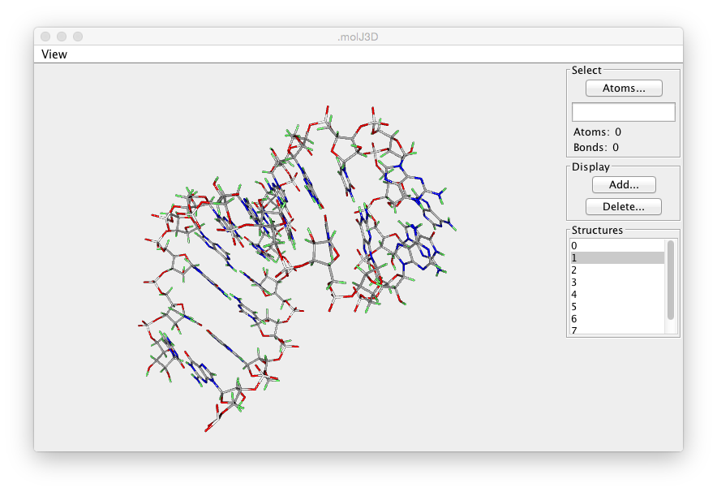

The Crescent Molecular Viewer is, like all of NMRViewJ, a cross-platform
tool written in the Java programming language. It makes use of the JavaFX
3D environment which gives access to hardware accelerated three
dimensional graphics. The viewer is not designed to be a full featured
molecular graphics program, but rather to be able to allow you to make
effective use of molecular visualization while working on an NMR
project. Because it is integrated directly inside NMRViewJ it is easy to
use to visualize any internal 3D data. The viewer is implemented in a
way that makes it analogous to other canvas windows in NMRViewJ. It can
render various graphical items, from simple shapes like spheres and
cylinders, to more complex items like full molecular structures. This
allows us to use it to render molecules and associated information like
constraints and the coordinate system of an orientation tensor. The
Crescent Viewer is still under development, so features will be added
and the interface changed in the coming versions.

The Crescent molecular viewer is a premium feature. That means it only
runs if you have installed a current, valid license file. License files
are available for users who are paying annual support. We don't like
limiting availability of features in this way, but we need to have some
financial support for NMRViewJ development, and this is one way we can
encourage users to do so.

The Crescent Molecular Viewer will display the currently active
molecule. See the previous chapter (Molecules) for information about
loading molecular structures. Displaying the molecule consists of two
steps, selecting the atoms to be displayed, and selecting the mode, lines
or spheres, in which they are to be rendered. Molecules can also be
rendered as a tube that follows the backbone and is colored with colors
that sequentially change from one end to the other end of the molecule.
When displaying a Tube, there is no need to first select atoms. A set of
atoms appropriate to either a protein or nucleic acid will automatically
be chosen when you click the Tube button.

The control sections at the right of the molecular viewer are described
here.

Select

:   Click *Atoms...* to select atoms based on one of the following choices:
    Backbone, Heavy, Sidechain, All, CAlpha, Active,  and Current Residue.
    Choosing *Active* will select the atom (or atoms) that are currently
    selected in the molecular display.  Choosing *Current Residue* will
    select all the atoms in residues that have an atom selected in the
    molecular display.
    Alternatively you can type in selections like 3.\* to select all atoms in residue
    "3" or 5-10.N,C,CA to select backbone atoms in residues 5 through
    10. After entering a value, hit the Enter key to activate the
    selection. Whether you use the menu items, or explicit atom selections,
    the Atoms: and Bonds: fields will show the number of Atoms and Bonds
    that have been selected.

Display

:   After selecting a set of atoms, click the *Add* button and
    choose from Lines, Sticks, Ball & Sticks, or Spheres
    button to render these atoms and bonds. 
    Choosing one of these modes will add the atoms and bonds to the display list, and then clear the
    selection. You can repeat the cycle of Select-Display to display
    additional selections.
    You can also choose from Tube (to display a tube along the backbone), Box
    (to display a box that encloses all atoms), or Coordsystem (to display a coordinate
    system with x,y and z axes). 
    Displaying Labels on atoms is currently under development.

Delete

:   Clicking Lines, Spheres or Tube in the Delete selection will remove
    all of the corresponding objects from the display.

Structures

:   If you have a whole family of structures loaded you can select which
    ones will be displayed using the list of structures at the bottom of
    the control region. Only structures highlighted in the list will be
    used in the display. If no structure is highlighted, then structure
    number 0 will be used. Remember that you can use the tools started
    from the Molecule \> Analysis \>
    Structures menu item of the main menu.to align multiple
    structures.

The molecule can be rotated, translated or scaled as follows.

Rotate

:   The molecular view can be rotated by pressing and then dragging with
    the left mouse button.

Translate

:   The molecular view can be translated by pressing and then dragging
    with the middle mouse button..

Scale

:   The molecular view can be scaled by pressing and then dragging with
    the right mouse button. Dragging right will increase the size of the
    viewed molecule, and dragging left will decrease it.

Selection

:    Click with the left mouse button on atoms or bonds to select them.
     If the shift key is held down you will select an additional atom/bond
     without deselecting any existing ones.

The rotation, translation and scaling done with the mouse can be reset
to the original transform by View \> Reset
Transform menu item on the molecular viewers menu bar. You can
center the molecule by using the by View \>
Center menu item on the molecular viewers menu bar.
