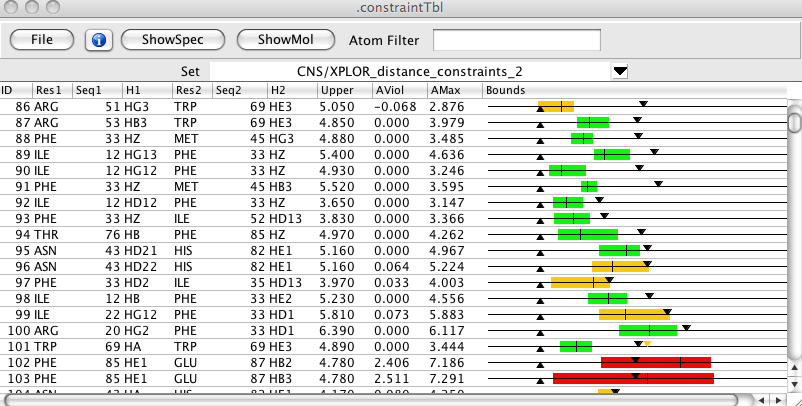
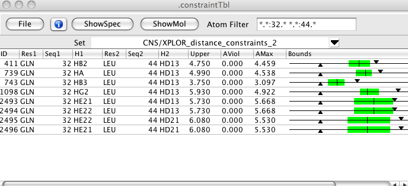
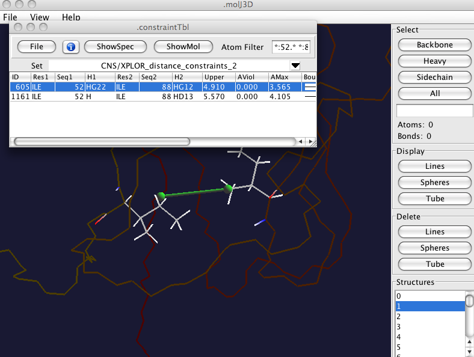
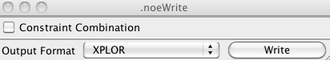

##Introduction

The Constraint Tool provides features for both analyzing and generating
constraints for structure generation, and for assigning NOE spectra. The
tool can take one or more peak lists and generate possible assignments
for the peaks. A first step in the analysis displays the number of peaks
that can be assigned, including a count of those with an excessive
number of assignment possibilities. An iterative procedure can be used
to automatically adjust the assignment tolerance to match a target
fractional assignment.

##Distance Constraint Table

The constraint table displays a large amount of information about
structural constraints. These constraints can be generated internally,
through manual peak assignment, the peak identification tool, or the
peak extract and assign mode of the constraint table. They can also be
read in from external sources such as XPLOR constraint files, ARIA XML
restraints files. The values displayed here were obtained upon reading
in a merged STAR file from the BMRB containing assignments, constraints
and a family of conformers.

Over 35 different values can be displayed for constraints. These include
the atomic assignments, the origin peak, chemical shift violations,
whether cross diagonal peaks were found, upper and lower distance
constraints, and various distances both for the specific constraint, and
averaged over all the constraints assigned to a peak. In addition there
are columns for a network anchoring contribution, a distance violation
contribution, and a summary value indicating the probability for the
particular assignment. Bounds are graphically displayed within the
table. The total amount of information can be somewhat overwhelming, so
it is possible to turn on and off the display of each column.

Filters can be set so that only constraints involving a single or pair
of residues are displayed. This table is shown with a small set of
columns, including the graphical bounds which illustrate the lower and
upper bounds with triangles, the range of distances in the set of
structures with a colored region, and the mean distance with a single
vertical line. If bounds are violated the bound region is colored orange
or red, depending on the violation.

ID

:       A unique numerical id for this constraint

List

:     The peak list this constraint came from

Gen

:      How was this constraint generated. See list below for
           descriptions.

Peak

:     The id number for the peak this constraint came from

Active

:   Is the constraint currently active

Flags

:    Character flags indicating reasons the constraint might be
           inactive. See list below for descriptions.

N

:        The number of possible assignments for the peak giving rise to
           this constraint.

Delta

:    The difference in residue numbers for the two atoms of this
           constraint.

CSet1

:    The coordset for atom 1 of this constraint.

Entity1

:  The entity for atom 1 of this constraint.

Res1

:     The residue name for atom 1 of this constraint.

Seq1

:     The sequential number for the residue of atom 1 of this
           constraint.

H1

:       The name of the atom (typically a hydrogen) for atom 1 of this
           constraint.

CSet2

:    The coordset for atom 2 of this constraint.

Entity2

:  The entity for atom 2 of this constraint.

Res2

:     The residue name for atom 1 of this constraint.

Seq2

:     The sequential number for the residue of atom 1 of this
           constraint.

H2

:       The name of the atom (typically a hydrogen) for atom 1 of this
           constraint.

DPPM

:     A number running from 0 to 1 representing a Gaussian function
           of the deviation between the chemical shifts of the peak and
           those of the assigned atoms. The higher the number the more
           likely the assignment.

Sym

:      Peak has a symmetry related (cross diagonal) peak with the same
           assignment as this constraint.

Upper

:    Upper Bound

Viol

:     The distance violation for the structure with the biggest
           violation.

Mean

:     The mean distance between these atoms.

SDev

:     The standard deviation of the distance between these atoms in
           all structures.

Min

:      The minimum distance between these atoms in all structures.

Max

:      The minimum distance between these atoms in all structures.

AViol

:    The distance violation for the structure with the biggest
           violation. Violation is averaged over all constraints from the
           originating peak. This value will be the same for all
           constraints from that peak.

AMean

:    The mean distance between these atoms. The distance is averaged
           over all constraints from the originating peak. This value will
           be the same for all constraints from that peak.

ASDev

:    The standard deviation of the distance between these atoms in
           all structures. The distance is averaged over all constraints
           from the originating peak. This value will be the same for all
           constraints from that peak.

AMin

:     The minimum distance between these atoms in all structures. The
           distance is averaged over all constraints from the originating
           peak. This value will be the same for all constraints from that
           peak.

AMax

:     The minimum distance between these atoms in all structures. The
           distance is averaged over all constraints from the originating
           peak. This value will be the same for all constraints from that
           peak.

Bounds

:   A graphical depiction of the constraint bounds. Downward
           pointing triangle is the upper bound. Upward pointing triangle
           is the lower bound. Colored bar indicates the range of
           distances in the set of structures. The vertical line in the
           bar is the average distance in the set of structures. The bar
           will be green if all structures are within the bounds, orange
           if some are outside the bounds, but the mean is withing the
           bounds, and red if the mean is outside the bounds. If the
           constraint is a short range one for which an analytical value
           for the maximum distance can be calculated this will be
           indicated as an orange triangle.

Network

:  Network constraint value. The more constraints there are, and
           the higher there contribution values are, between the residue
           pairs this constraint involves, the higher this value will be.

DisCon

:   If structures are present this is a measure of well the
           distances between the atoms fit with the distance bounds. The
           value ranges from 0 to 1 and 1 indicates that all structures
           have the distance within the bounds.

Contribution

:  A value that summarizes the contribution of this constraint to
   the possible assignments for this peak. The value runs from 0
   to 1 and 1 is best.

Intensity

:     The intensity of the peak that this constraint is derived from.

Volume

:   The volume of the peak that this constraint is derived from.

Constraints can be derived in various ways and this is indicated in the
Gen column of the table. The values that may be seen in the table are
described here.

Auto

:   Constraint generated by the automated extract and assign procedure
    using the internal peak id code. If constraint list was read in from
    an ARIA XML file then this indicates the constraint was
    automatically generated by ARIA.

AutoP

:   Constraint generated by the automated extract and assign procedure
    using the internal peak id where at least one manually assigned
    constraint for the peak was present. code.

Semi

:   If the constraint list was read in from an ARIA XML file then this
    indicates that one of the dimensions of the constraint was
    automatically generated by ARIA and the other was from a manual
    assignment.

Man

:   Constraint generated from a specific assignment of the atoms of the
    peak.

Constraints can be marked as inactive based on various criteria. These
criteria (and there may be more than one value for each constraint) are
indicated in the Flag column of the table. The characters in the table
have the following meanings.

r)edundant

:   There is more than one constraint between the same two atoms. This
    is one of the ones removed.

f)ixed

:   The distance between these atoms is fixed by the structure so this
    restraint is of no value.

a)mbiguous

:   There are more than the specified maximum number of constraint
    possibilities for this peak. That is, it is too ambiguous.

d)iagonal

:   The proton pairs for this constraint represent the same atom.

p)pm

:   The Gaussian function of the deviation of chemical shifts between
    the peak and the atom assignments is below the specified threshold.

v)iolation

:   The distance violation of this constraint in the current structures
    is too large.

u)user

:   Constraint inactivated by the user.

##Generating Constraints from NOESY Peaks

The first step of generating constraints from one or more NOESY peak
lists is to specify which lists are to be used, and check the tolerances
and offsets of these peak lists. Select the File \> Peaklists... menu item from the menu
bar of the Constraint Table to get the interface shown.

Next, click the Add List button to add a new peak list row to the
interface. Here we've added two rows and then selected an N15 Noesy for
one row and the C13 NOESY for the other. The peak lists are selected
with the pull down menu in the PeakList column. Constraints can be
generated with values proportional to the peak volume or intensity.
Select the value with the combobox in the MMode (for Measurement Mode)
column.

Before continuing with extracting and identifying constraints from the
peaks it's important to check the tolerances that will be used. Click
the button in the Tolerance column to bring up the following interface.
The values in the the fields directly under the peak dimension labels
(HN, H1, and N) are the current peak identification tolerances for this
peak list. The Assignability Statistics in the lower section of the
interface is updated when you click the Update button (or execute
various other functions in the interface). Each peak can be classified
in one of three ways. Assignable Peaks are those whose chemical shifts
are consistent (within the specified tolerances) of some assigned set of
atoms in the molecule. If the peak is assignable, but there are more
than the specified (with the MaxAmbig entry at top) possible assignments
it is instead put in the MaxAmbig category. If the peak cannot be
assigned it is in the Unassignable category. The number of peaks, and
the fraction of the total number of peaks, is shown in the N and
Fraction columns. Every time you click the Update button the software
essentially simulates the assignment of the peak list to calculate these
statistics.

If the tolerances are too tight, a large number of peaks will be
unassignable, whereas if the tolerance is too loose, there will be too
many possible assignments for the peaks, and the number of peaks in the
MaxAmbig category will be high. A good starting point for the tolerances
can be obtained by clicking the Guess button. This will set the
tolerance to the median line width for the peaks in each dimension.

You can optimize the tolerances by clicking the Optimize button. This
will iteratively modify the tolerances until the fraction of assignable
peaks (Assignable + MaxAmbig)/nPeaks is close to the target value set
with the slider. The tolerances for the different dimensions will be
changed so that the ratio between the tolerances will be the same at the
end of the optimization as they are at the beginning. To explicitly
change that ratio for the starting point enter specific values into the
tolerance fields.

The referencing of the peak list and the assigned atoms may be different
depending on where the atom assignments came from. Clicking the Optimize
button in the Offsets section will systematically shift the positions of
all peaks in each of the three dimensions (one dimension at a time)
until the number of peaks that are assignable (Assignable + MaxAmbig) is
maximized. The resulting offsets will be displayed in the interface. The
criteria used means that the result may not be desired. You can click
the Undo button to restore the positions to their original values. Note
that Undo just subtracts off the offset value shown in the Offset
fields, so you can independently and manually shift the peaks by
entering values and clicking Undo. Also, it is important to note that
when the offset is done, the peaks are shifted, and the dataset
referencing for the corresponding dataset is changed. Use carefully.

Having set up the tolerances you can now return to the Noe Peak List
dialog and do the automatic peak identification. Clicking Extract and
Assign will use the specified tolerances to analyze each peak in the
specified peak lists and enter zero or more constraints into the
Constraint table. If you just want to use peaks that already have
assignments click the Extract Unambiguous or Extract Ambiguous buttons.

##Calibration

Controls for calibrating the peak lists are available from the NOE Peak
List dialog. Calibration can be done by binning peaks according to their
intensities (or volumes) into three categories and applying an upper
bound for each category or by directly converting the peak intensity (or
volume) into an upper bound value using an exponential function. Use the
combobox in the CMode (for Calibration Mode) column to select bin or
exp. When you choose a value, or click the button in the Calibrate
column a calibration interface will appear.

The binning calibration interface is shown here. Enter appropriate
values into the intensity and distance fields. The upper bounds for
strong, medium and weak peaks are set by default to 2.5, 3.7 and 5.0,
respectively. You can get a reasonable starting point for the bin
intensities by clicking the Guess Bins button. This will set the upper
bound intensity to the intensity value corresponding to the 75th
percentile for all intensities in the list, and the medium intensity to
the 50th percentile value. That is half of all peaks will be weak, 25%
medium and 25% strong. The lower bound value is set by default to 1.8,
and can be changed. When the peak table is updated constraints that
represent the same assignment (redundant assignments) will be trimmed so
that only the weakest constraint is retained. You can turn off this
behavior for the specified list by clicking the Keep Redundant button.
If you do this for only one of the lists that contributes the redundant
constraint, you will ensure that the peak from this list is included.

The exponential function calibration interface is shown here. You can
change the exponent from it's default value of "6". A reasonable
starting guess for the reference intensity can be obtained by clicking
the Calc. Median button. This will set the reference intensity to the
median intensity found in the list. The upper bound of the constraint
will never be set below the Shortest Bound value (default 2.2) and above
the Longest Bound value (default 6.0). Lower bounds and the redundancy
control are set as in the binning calibration.

The active or inactive state of constraints is in part determined by
settings that can be controlled in the following interface.

MaxAmbig

:   The maximum number of assignments that a peak can have. Constraints
    from peaks with more than this number (default 20) are inactivated.

MinContrib

:   Each constraint has a contribution number that is a measure of the
    probability of the constraint being valid. Constraints with
    contribution values below this threshold (default 0.2) are
    inactivated.

MinPPM

:   The similarity of the peak and atom chemical shifts is measured with
    a Gaussian function whose value runs from 0.0 to 1.0. Constraints
    with DPPM values less than this threshold (default 0.0) are
    inactivated.

MaxViol

:   If there are model structures in memory then the distance that the
    atoms are apart can be calculated for each constraint. Constraints
    whose distance violates the bounds by more than the specified value
    (default 1.5) lt 20) are inactivated.

By default the table only shows active constraints. You can show all
constraints (and see their inactivation flags) by turning off the Active
Only button.

##Inspecting Constraints

###Constraint Peak Info

The identification and atom patterns used by the Constraint Table tool
are the same as that used by the Peak Identify tool. Because of this you
can easily inspect a row in the constraint table. Just highlight one row
of the table and click the Info button at the top of
the table. This will open both the Peak Inspector and the Peak Identify
tool for the peak that gives rise to the selected constraint.

Clicking the ShowSpecbutton will display a spectrum window showing the
appropriate region of the peak's originating dataset. The peak will be
displayed and several lines will be drawn across the spectrum. A blue
horizontal and vertical lines will be drawn at the chemical shift of the
atoms involved in the current constraint. Narrower red lines will be
drawn at the chemical shifts of the atoms for all the other active
constraints that involve the current peak. The spectrum crosshairs will
be positioned at the center of the current peak.

If you have the premium version of NMRVIEW with the crescent molecular
viewer active then clicking the ShowMolbutton will display the atoms as
shown here. The backbone will be shown somewhat dimmed, the bonds in
each of the two residues involved in the constraint will be displayed,
and a green connector drawn between the two highlighted atoms.

###Constraint Map

The residue-residue pattern of constraints is displayed in a map colored
by the number of restraints between that residue pair. You can display
this map by selecting the File \> Restraint
Map menu item from the menu bar of the Constraint Table. Clicking
on an item in the map will filter the constraint table to show all
constraints involving that pair of residues If you have the premium
version of NMRVIEW with the Crescent molecular viewer active then you
will also see the molecule displayed with backbone as a tube, and lines
connecting all residues involved in constraints as shown here.

##Constraint Export/Import

The general goal of constraint generation is to obtain a file of
constraints that can be used in one of several structure calculation
program. You can export the restraints displayed in the table to
appropriately formatted files. Select the File \> Write Constraints... menu item from
the menu bar of the Constraint Table to get the following dialog. There
are two items to select in the dialog. One is the format of the
constraint file, which can be that used by XPLOR or that used by CYANA.
The other is whether or not to use Constraint Combination. This is a
method used within the CYANA program. By providing a similar capability
here one can generate constraint files that already have combined
constraints and use the appropriately formatted one in CYANA or XPLOR.
Constraint combination is a way to minimize the effect of erroneous
assignments. It works because if an erroneous constraint is combined
into an ambiguous constraint with a valid constraint the erroneous
constraint will have little impact on the calculated structure. If you
randomly combine constraints, and a minority of them are erroneous it is
likely that most of the erroneous constraints will be found in
combination with a valid constraint. Having selected the two output
options, click the Write button. A File Dialog will appear in which you
can select the output file name.

Constraints can also be imported from the files formatted for XPLOR and
the output files of ARIA. Use the File \> Read
XPLOR Constraints menu item of the Constraint Table to read XPLOR
distance constraints. Use the File \> Read ARIA
XML Output menu item of the Constraint Table to read the output
of an ARIA run. In both cases you will be prompted for the file to open.
