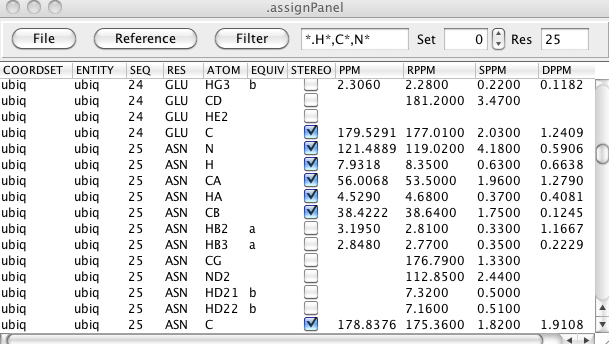
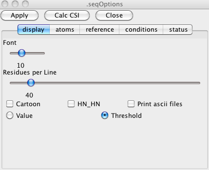

##Atom Assignment Tables

The Assignment table can be displayed by selecting the Assign \> Atoms menu item. It provides a
tabular display of the atoms in the current molecule and lets you view
and change chemical shift assignments. You can filter the table to show
any subset of atoms by atom type and residue range. The table can also
be loaded with Reference Information from various sources so you can
display the deviation between your shifts and typical shifts for the
same atom and residues. NMRVIEW can store and display multiple
assignments for each atom, so the table also lets you select which shift
set to display.

Menus give you access to functions for evaluating your assignments,
reading and writing chemical shift files, generating synthetic peak
lists from the assignments and choosing reference data. As with all
NMRVIEW tables you can sort the table in any order by values in one or
more columns.

The columns..... Editable...

##File Menu

Analyze Shifts

:   

    Check Shifts

    :   Display a dialog in which you can display any atom assignments
        whose chemical shift values deviate from the expected range for
        an atom of that type by more than a specified amount. The amount
        (NSigma) is the number of standard deviations away from the mean
        value for that atom type (means and standard deviations are from
        the BMRB). The listed of violating atoms can be directed to the
        NMRVIEW console, or to a file.

    LACS Plot

    :   Display a plot for a Linear Analysis of Chemical Shifts. See
        below for more information and an example.

Read Chemical Shift Files

:   

    Read NvJ PPM

    :   Read a simple text file containing atom names and chemical shift
        assignments. The file should be in the format written by NMRVIEW
        and will look like:

             1.CA 54.938 1 
             1.HA 4.207 1 
             1.CB 33.248 1 
             1.HB2 2.082 2 
             1.CG 30.933 1 
             1.HG2 1.956 2 

        The fields are atom specifier (residue.atom), chemical shift,
        and stereospecificity code. When you select this menu entry a
        file browser will appear with which you can choose the file.

    Read PPM From STAR3

    :   Read the chemical shift assignments section of a BMRB STAR
        version 3 formatted file. If there are multiple assignment
        sections in the STAR file shifts will be read from the first
        one.

    Read PPM From STAR3 To...

    :   Read the chemical shift assignments section of a BMRB STAR
        version 3 formatted file. You will be prompted for which
        assignment section to read from the STAR file (default is 0, the
        first one in the file). The shift will be stored into the set
        numbered by the current Set value at the top section of the
        Assignment table.

    Read CYANA PPM...

    :   Read chemical shifts from a file in the format used by the CYANA
        structure calculation program.

Write Chemical Shift Files

:   

    Write NvJ PPM

    :   Write chemical shifts in simple text file using the NMRVIEW
        format. The file will be named "ppm.out".

    Write NvJ PPM as...

    :   Write chemical shifts in simple text file using the NMRViewJ
        format. You will be prompted for the file in which to save the
        assignments.

    Write STAR2 PPM...

    :   Write a chemical shift assignment saveframe in an abbreviated
        STAR Version 2 format. This is the section used for input by
        some web based programs at NMRFAM (don't ask me why they don't
        read a whole STAR file, or even a whole save frame).

    Write STAR3 PPM...

    :   Write a chemical shift assignment saveframe in STAR version 3
        format.

    Write Aria PPM...

    :   Write a chemical shift assignment file in the simple text format
        used by ARIA.

    Write Aria XML PPM...

    :   Write a chemical shift assignment file in the XML format used by
        ARIA.

    Write Talos XML PPM...

    :   Write a chemical shift assignment file in the tabular format
        used by Talos.

    Write CYANA PPM...

    :   Write a chemical shift assignment text file in the format used
        by CYANA.

Seq Display

:   Display the Sequence GUI that can be used for doing Chemical Shift
    Index calculations etc.

Get Shifts from Peaklists

:   Get Chemical shifts from a peak list. You'll be prompted with a
    dialog in which you can specify what list and which dimensions of
    the list should be extracted. Any peaks with assignments on the
    specified dimension of the specified list will be used. If more than
    one peak has the same assignment the values will be averaged. You
    can specify whether or not to unfold chemical shifts. If specified
    the peak shift will be checked plus or minus the sweep width. The
    value most consistent with the atom and residue type will be used.

Gen PeakList

:   

    HSQC

    :   Generate a peak list with two dimensions, corresponding to the
        amide proton and nitrogen of each assigned residue. You will be
        prompted for the names of the dimensions to use (these should
        match those of any dataset you plan on displaying the list with)
        and which ppm set (default of 0) should be used as the source of
        the chemical shifts.

##Reference Menu

The assignment table has three columns devoted to displaying and
comparing chemical shifts with reference values. The **RPPM** column is
the reference chemical shift. The **SPPM** column is the standard
deviation of the reference shift. The **DPPM** column indicates the
deviation of the assigned values (**PPM** column) from the reference
value (**RPPM** column). The source of the reference shifts and the
method of calculating the deviation can be set with the Reference menu.

BMRB\_Avg

:   Use the average and standard deviation values from the statistics
    reported by the BMRB.

RCoil

:   Use Random Coil values calculated with NMRVIEW from the RefDB
    database. Standard deviations are taken from the BMRB values.

Reference Set 1

:   Use the values loaded into PPM Set 1. Standard deviations are taken
    from the BMRB values.

Delta Mode

:   

    Abs (delta/sdev)

    :   The deviation value is calculated by dividing the actual
        deviation between the measured and reference values by the
        standard deviation and reporting the absolute value.

    delta/sdev

    :   Same as above, but do not take the absolute value.

    delta

    :   Just use the deviation, without scaling by the standard
        deviation.

You can display a subset of the assignments by setting a filter for the
atom and residue. There are predefined filters available from the Filter
menu or you can simply type in values into the entry next to the menu.
You can use wild cards (\*.ca, \*.c\*), coma separated lists
(\*.ca,n,c) and residue ranges (32-40.ca) and various combinations of
these styles.

NMRVIEW can store multiple assignment sets for the molecule in memory.
You can use this spin box to select which set to display and edit.

Enter a residue number and hit Enter to jump the display to show that
residue. This doesn't change the filtering, but rather scrolls the table
so that the atoms of that residue is visible.

##LACS Plot

The Linear Analysis of Chemical Shifts is a graphical way of examining
chemical shift assignments. For details see the original publication
(Journal of Biomolecular NMR (2005) 32: 13–22 ). Note that the robust
fitting method used by NMRVIEW is not the same as that used by the
authors of the original publication, and we have independently calculated
slopes of the lines to be used in fitting the different atom types.
Because of this the results calculated here, and those calculated at the
LACS web site may differ.

When you first display the interface the current assignments will be used
to calculate a LACS plot of the CA shifts. The two blue lines will
indicate the best fit (using a robust fitting technique) to the data
using lines of pre-calculated slopes. The ordinate value of these lines
at an abscissa value of 0.0 will be displayed as the Offset, and should
be near 0.0 if your data is correctly referenced. Click on the atom
selectors (CA,CB, C, HA) to calculate the LACS plot for various nuclei.

##Sequence Display and CSI Analysis

The sequence display window has a graphical view of the molecular
sequence and provides tools for showing atom assignments, Chemical Shift
Index analysis, and structural cartoons. You can display it by selecting
the Assign \> Sequence File menu item.

To change the settings of the sequence display window click on the
Options button to get the following window. The Options window allows
the user to change the various display parameters such as the font size,
the atom types that will be displayed, the number of residues displayed
on each line, various annotations and to control options used in doing
the CSI calculations.

##Atom Assignments

The Atoms tab of the Options window lets you control what atoms are
displayed. This can be useful for checking the completeness of your
assignments. Here we've turned on the display of all the available
atoms. Clicking the Apply button is necessary for the display to be
updated with the new set of display atoms.Clicking the Color Assigned
button at the top of the sequence display window will now color atoms
red if they have a chemical shift assignment, and black if they don't.
Here's an example with fairly complete assignments done.

##Chemical Shift Index (CSI) Calculation

The Chemical Shift Index is a measure of the deviation of the actual
chemical shift assigned to an atom, and a random coil (or other
standard) value for an atom of the same type and residue. Since the sign
and magnitude of these deviations correlate with the secondary structure
type that the residue is found in, this provides a way to get a measure
of the secondary structure profile of the molecule from just the
chemical shift assignments.

The first step of doing a CSI calculation is determining which atom
types are going to be used in the calculation, and displayed in the
graphical viewer. You can set this in the CSI Calc and CSI Display rows
of the **Atoms** tab. More then one type of atom may be selected for the
calculation of the CSI and for displaying the results. It is also
possible to calculate the CSI of more then one atom type and display the
result of only one atom type at a time. The result of the CSI
calculation can be displayed using the actual differences in ppm by
selecting the **Value** checkbox in the **Display** tab. Selecting
**Threshold** will show the results using the index values +1, 0 and -1.
In both cases a positive value/threshold will be red, a negative
value/threshold will be blue and a zero value/threshold will be gray.
After selecting the settings click on the Apply button. This will update
the sequence display window (see figure 5 ).

Proper calculation of the CSI values requires choosing appropriate
reference data and solvent conditions. Thanks to various user
contributions, NMRVIEW includes a variety of reference datasets
representing values collected under different conditions, including
denaturants. You can select the Reference dataset in the **Reference**
tab. Clicking the Infobutton will bring up a new window with some
information about the selected database

In the **Reference** tab you can also select which Chemical Shift
Reference compound (DSS, TMS, etc.) was used when collecting and
assigning your datasets. If the standard used in the experiments differs
from the standard used to obtain the values of the database the CSI
program will automatically include a correction factor if necessary.

The next tab, **Conditions**, can be used to enter the information about
the pH and temperature used to obtain the chemical shifts. If the data
was obtained using deuterated protein and the chemical shift data has
not been corrected select the Deuterated Protein option and the CSI
program will correct the carbon chemical shift data automatically. The
last set of parameters refer to special experimental conditions which
may have an effect on the observed chemical shift. The CSI program can
correct for the effect of cosolvents like TFE, acetonitril, urea or
guanidinium HCL on the chemical shift assuming a linear correlation for
the correction factor in relation to the concentration of the cosolvent.
When the chemical shifts are obtained using the TROSY experiments and
the experimental chemical shifts have not been corrected the CSI program
will correct for this when the TROSY options is selected. The CSI may
also be used to check the assignments. The CSI program will check the
assignments within a certain tolerance if the Check Assignment option is
selected. The tolerance is calculated using the cutoff value used in the
selected database multiplied by a value which is set by the user.

When all parameters are set click on the Calc CSI button to start the
CSI calculations. The results will be shown automatically in the
sequence display window using the settings selected in the Option
window. In this figure the HA, CA, CB and C atoms are used for both CSI
calculation and display, and the secondary structure cartoon is turned
on. Since **Threshold** mode is on, the graphical CSI display of circles
shows red circles at the top (for shifts consistent with helical
structure, blue circles at the bottom (for shifts consistent with sheet
structure, and gray circles at the center (for intermediary shifts) of
the plot range. The coloring of the top CON row of atoms is by the
secondary structure prediction based on the consensus of all the atom
types, and with contributions over a three (sheets) or four (helices)
residue window. The cartoon display showing sheet or helical regions is
based on the filtered, consensus CSI values.

When the **Value**, rather than **Threshold** setting is turned on the
displayed circles are plotted relative to the maximum absolute delta for
that atom type in the current data. In this case, be aware that some
atom types (e.g. CB) will have their shifts going in the opposite
direction to the way they move in **Threshold** mode.

If the "Print ascii files" option is selected in the Options window the
following files will be created in the directory where NMRVIEW has been
started. ATOMTYPE.csi.REF : file containing the data for the CSI per
residue. ATOMTYPE.ppm.REF: file containing the difference (in ppm)
between the chemical shift data and the random coil values per residue.
ATOMTYPE.csi.as.REF: file containing the observed chemical shifts per
residue and a flag indicating if the values are within the assignment
tolerance (0) or outside the assignment tolerance (1) or no assignment
tolerance was selected (-1). consensus.txt: Only when three or more
different atom types are used in the CSI calculation will this file be
created. It contains information about the consensus secondary structure
elements between the different selected atom types.
