Runabout is a tool for semi-automated assignment of protein NMR spectra.
Not only does it arrange regions from related spectra to facilitate
comparisons of peak positions, it also uses the patterns one expects to
detect between sequential peaks in related spectra to make best-guesses
at sequential assignments. Thus, the spectroscopist can leave much of
the assignment task to the automated portions of Runabout, and spend
more time resolving the trickier assignment questions using a
combination of knowledge and software guidance. Runabout is
distinguished from fully automated assignment routines by its users'
ability to choose between 1) trusting the software's assignments, 2)
reviewing every suggested assignment and approving or disapproving it,
and 3) manually assigning the peaks in an environment with easy and
robust bookkeeping.

## Experiments

For Runabout to be useful, a number of experiments must be performed on
a uniformly-13C/15N- labeled polypeptide. At minimum, these include the
HNCO, HNCACB, and CBCACONH (aka HNCOCACB). Redundant spectral
information, however, make assignment much easier, so several more
experiments should, if possible, be performed. These include, in order,
the HNCA, HNCACO, HNCOCA. The CCONH should also be considered, as it can
readily identify the amino acid type of many residues by their 13C
chemical shift patterns.

Extra care should be taken to acquire high-quality data for the HNCO, as
it will be used as the reference spectrum. Also, little progress will be
made if the signals are weak in the HNCACB and HNCOCACB/CBCACONH
experiments. When budgeting experiment time, it will not make sense to
skimp on these experiments.

It's very important to the use of RunAbout that you assign reasonable
contour levels to each of your spectra. Whenever RunAbout assigns a
dataset to a particular window, it will use that contour level. If it's
not set appropriately your likely to see the spectrum displayed at too
high or low of a level. The same goes for setting whether negative and
positive contours should be displayed. If you’ve already set appropriate
display levels in your spectra’s .nv files, you may wish to check them
by opening up “Datasets…Datasets Table” and pulling down to the
“Appearance” choice in the Mode pulldown. You should see something like
this:

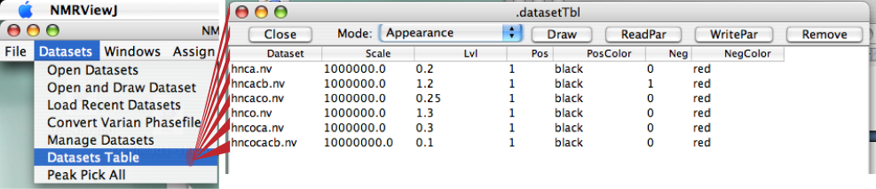

Close the window if these levels look OK.

The simplest way to save these display parameters is to draw each
spectrum in a window, get it set to look correct, and click the "Save
Dataset Preferences" icon at the lower left of the File Tab of the
Spectrum Attributes Window. This will save your current contour level,
contour colors and contour positive/negative drawing state to a ".par"
file.

Prior to starting Runabout, you need to pick your spectra's peaks. If
you have a well-defined system, and you have appropriate contour levels
stored in the NVJ .par files, you may be able to pick all the peaks
simultaneously using the main toolbar's Datasets...Pick all peaks menu
choice.

If this a new protein system, you should pick each spectrum's peaks
separately. The most care should be taken with the HNCO peak list, as
this will be used as the reference for all other lists. You should
manually clean it up to ensure it carries no spurious peaks. Once you
have a good HNCO list, pick peaks in the other spectra, but there's no
need to be quite as careful about them. You'll be using Runabout to
filter out most of your unwanted peaks anyway.

If the levels are OK and you want to pick peaks completely
automatically, click on the Main Toolbar, "Datasets...Peak Pick All".
You should see something that looks like this in your swkcon window:

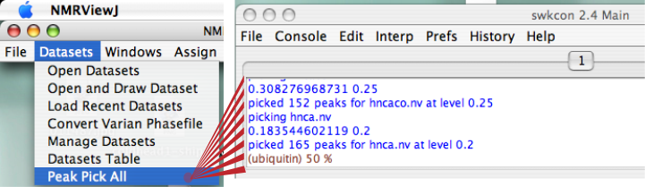

Make sure you have your protein sequence file, described elsewhere in
the documentation.

Start Runabout by clicking on the Main Toolbar "Analysis...RunAbout".
You'll then see the main RunAbout window:

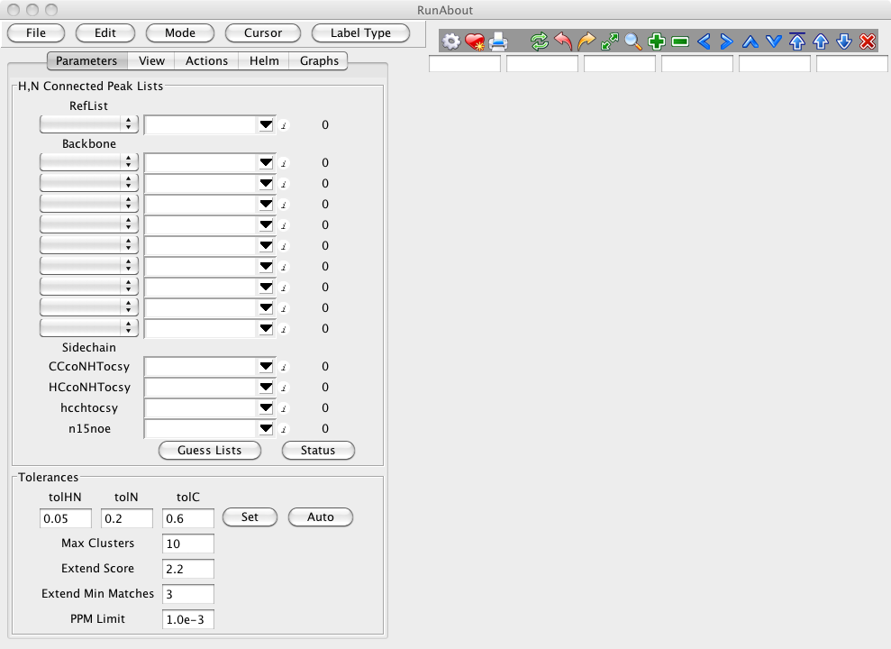

It will help to load some data before trying to orient yourself with the
RunAbout window. In Runabout's Parameters panel (), click "Guess Lists".
If your peaklists are eponymously named for their spectrum type, you
should see:

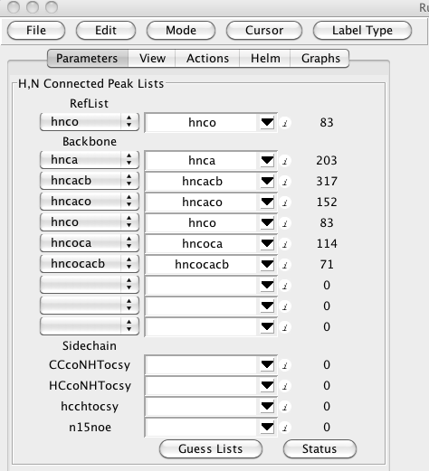

If you've named your lists in a way that doesn't match up with the
canonical names, then select them manually. For each list you want tot
use, select the type of peak list in the combobox at the left side of
each peak list row. Then in the central section of each row choose the
actual peak list that corresponds to that type.

RunAbout uses one list as a reference peak list. Typically this will be
the hnco (or hsqc if you don't have an hnco). The reference list is
selected as the first entry in the Peak List section (labeled RefList).

Much of RunAbout’s analysis concerns matching up chemical shifts in
different experiments to determine whether they represent the same
resonance. Some error is expected in this process, and the bottom of
this Parameters panel is where you can set the tolerances that
compensate for this error. The default values, 0.05 (H), 0.2 (N), and
0.6 (C) are pretty good, but you can change them here if you wish.
Clicking the Set button will set the tolerances for all the backbone
lists to the specified values. You can also have RunAbout calculate
appropriate tolerances automatically. Click "Auto" in the Tolerances
section of the RunAbout Parameter tab. This will calculate the median
line width for each dimension of each peak list and set the tolerance to
that value. The underlying code accepts a scale parameter (0.5 would set
the tolerance to half the median line width). At present the scale is
set to 1.0.

Next to each peak list, there's a circular "i" button. Clicking it
reveals the information RunAbout expects to see in each peak list. This
is editable, so if you'd like to add an experiment type, you can edit
its expected information here. Here are the informational entries for
each of these peak lists:

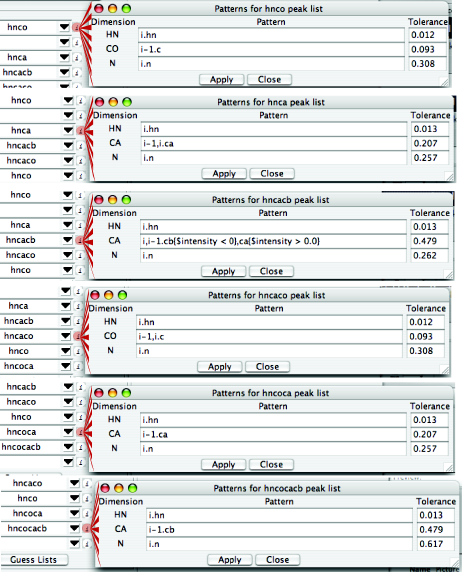

Consider the hnca and hncacb lists as examples. RunAbout expects the
hnca to exhibit peaks with 1H and 15N chemical shifts from the amide of
residue i, and two 13Ca resonances, one from residue i-1 and one from
residue i. The pattern for the hncacb experiment indicates extra
information specifying that negative peaks should be interpreted as
corresponding to beta carbons.

## Edit Peaks

RunAbout is set up to operate in a series of modes as you move through
the process of assigning your protein. The first mode "Edit Peaks" is
designed to let you rapidly examine your datasets. In particular, before
you continue with the process of assignment you want to know whether
your spectra are peak picked at appropriate levels and whether they are
referenced to a common value so that peaks representing the same
information align as closely as possible between the different spectra.

Enter Edit Peaks mode by the choosing the corresponding menu entry under
the RunAbout Mode menu. Then switch from the Parameters tab to the Helm
tab. The Helm tab, as its name suggests provides tools for navigating
through your datasets. As shown in this figure the Helm, when in Edit
Peaks mode shows the Reference Spectrum and provides buttons for
navigating through a peak list (typically set to the reference list). As
you move to each peak the chemical shift of the HN and N dimension of
that peak are used to set the spectrum display of the reference spectrum
which will be shown with the proton dimension on the X axis, and the
nitrogen dimension on the Y axis. The Z plane will be set to the
carbonyl frequency of the peak (if it's an HNCO spectrum. At the same
time as the display of the reference spectrum is changed, all the
spectra in the main spectrum display window of RunAbout will be updated.

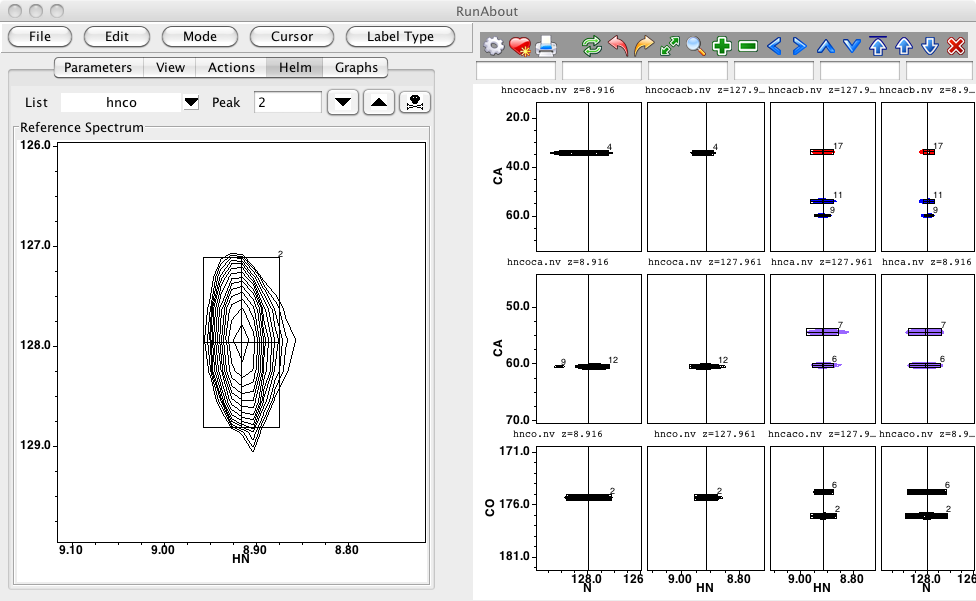

The number of spectra displayed in the main window will depend on what
datasets are available. Typically there will be one row of spectra for
each atom type (C, CA, CB). The actual atom types available are
determined from the peak list patterns specified. The left half of the
spectra are for those experiments that (again, according to the peak
list patterns) give rise to i-1 (inter-residue) connectivities (like
HNCOCA, HNCOCACB, or HNCO). The right half of the spectra are for those
experiments that (again, according to the peak list patterns) give rise
to i (intra-residue) connectivities (like HNCA, HNCACB, or HNCACO).

Each spectrum may be shown in two orthogonal views. The carbon dimension
is always on the Y axis, but the X axis may display the proton or
nitrogen dimension. A set of spectra with the proton dimension on the X
axis is always shown. Whether or not the N-C views are displayed depends
on the setting of the "N Wings On" button in the View tab. Showing the
N-C views allows you to discriminate between peaks that are overlapping
in the H-C view, but resolvable in the N-C view. Sometimes, especially
if your peaks are well resolved, you may prefer to not display the N-C
view, so more screen space is available for the H-C view.

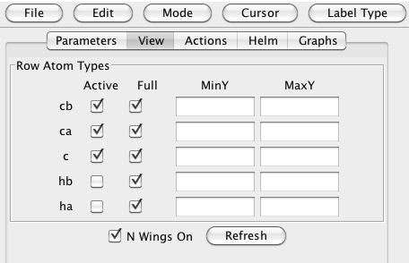

You can also use the controls in the View tab to specify which rows of
spectra are displayed. You might, for example, temporarily turn off the
display of the carbonyl (C) spectra by deselecting the "c" checkbox in
the "Active" column. Also, by default the complete carbon sweep width of
all the spectra is displayed. You can specify a range by entering in
values to the MinY and MaxY fields, and turn off the Full checkbox for
the appropriate row. Whenever you make a change to these settings, click
the Refresh button to update the main spectrum display.

You'll probably find it useful to step through most, if not all, of the
peaks in the reference list and observe the corresponding spectra. If
you notice many peaks that are not picked, or many artifacts that are
picked, you may well want to go back and redo the peak picking at a more
appropriate contour level. If there are many reference peaks that are
picked at positions of artifacts or noise you may want to re-pick the
whole spectrum at a different contour level. But you can easily delete a
few peaks by clicking the Delete (Skull and Crossbones) button to the
right of the up/down peak navigation buttons.

Also note how well the peaks are aligned. In each spectrum a vertical
black line is drawn at the chemical shift of the reference peak. The
peaks that are likely coming from the same amide proton should line up
right on that line. If not, you may need to adjust the referencing of
the spectra. Getting your spectra well aligned at this point, will make
things work better in later stages, so spend some time getting this
right. Tools available for alignment are described in the next section.

Peak lists can be manually or automatically aligned. To align peaks
manually step through the peaks in the Helm until you find a set of
peaks you want to use for alignment. Choose a spectrum window in the
main RunAbout spectrum display and move the black vertical cursor and
adjust it till it is centered over the peak that you wish to be aligned
to the reference line. Now click the Manual button in the Alignment
section of the "Actions" tab. This will adjust the chemical shift
referencing of both the dataset and peak list displayed in that window
so that the position is adjusted specified by the crosshair is shifted
to the reference line position. You'll need to repeat this process for
each spectrum that you wish to align, and for both the proton and
nitrogen views of each spectrum.

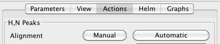

An automatic peak registration procedure can also be used. In the
Actions tab click the "Auto" button in the Alignment section. This will
take each peak list and compare it to the reference list. A comparison
score is calculated by using a bipartite matching algorithm to come up
with the optimum matching between reference peaks and the other list.
The offset (for HN and N) between the two lists is iterated till it
converges to a minimum. The lists should not be dramatically different
in alignment before starting.

Orient yourself briefly. Besides the alignment features, the Actions
panel exists to refine your peak lists in such a way that the most
probably productive peaks and peak clusters are retained before you
proceed with the assignment. It is organized so you first choose a
reference peak list, and then proceed by clicking the buttons at the
right, starting from the top and working downward. None of these actions
is compulsory, but they can make assignment much easier.

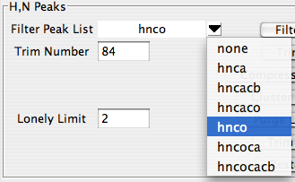

First, you might wish to “filter” your peak lists. This action compares
each of your peak lists to the selected reference peak list and
jettisons peaks that do not exhibit amide 1H and 15N frequencies found
in the reference list. For the experiments handled by RunAbout, all
spectra should look like HNCO spectra when projected on to an 1H-15N
plane, so choose the hnco peak list as your “reference peak list” unless
you have a special reason for not doing so. When filtering, RunAbout
looks for reference peaks that are within two times the tolerance value
set for the peak list. This increased tolerance is to minimize the
probability of erroneously removing peaks that are valid, but not well
aligned.

Click the "filter" button. You should see something like this result in
the SWKcon window:

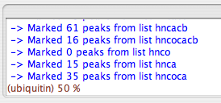

Next, consider the “trim” function. For a given protein and a certain
spectrum type, one expects a certain number of crosspeaks. If you picked
your peaks conservatively, you should probably have more than the
expected number of peaks, even after filtering. The “Trim” function
allows you to cut out the less intense peaks, thus the ones most likely
to not be valid, based on the number of expected peaks. Here, you should
provide a “trim number”, which RunAbout equates, just for this purpose,
with the number of residues in your protein; to be safe, give an
estimate that’s \~10% larger than the number of residues in your
protein. Ubiquitin bears 76 residues, so here the trim number is set to
84. Click “Trim”, and you should see something like this appear in your
SWKcon window:

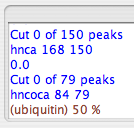

> **Tip**
>
> Trimming could be considered somewhat more likely to remove "real"
> peaks than the above Filtering action. With any of these commands, and
> periodically throughout the assignment process, you should save
> versions of the project into a STAR file.

After filtering and trimming, click “Compress and Degap” to remove the
filtered trimmed peaks from your peaklists, and renumber to them to
remove numerical gaps in their sequence. This action will not result in
any message window or text in the swkcon window.

##

Now you need to group your peaks into clusters. This will group together
peaks from your peaklists that have the same amide H and N frequencies.
Clustering is thus the basis by which sequential assignment is made:
clustering determines which resonances in different peak lists belong to
the same residues, and also begins distinguishing intra- and
inter-residue peaks. Click "cluster Peaks" to group them on the basis of
your reference peak list; you should see the following in the swkcon
window:

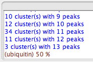

Peaks are clustered together based on the tolerance values set up for
each list. Additionally, the clustering is constrained so that every
cluster must have one, and only one, peak from the reference list.
Clusters will be assigned an identification number that corresponds to
the index of that cluster's reference peak.

Some spurious clusters will probably be created in this process. The
ones most easily identified as being misleading are those with just one
or two peaks in the cluster - so-called "lonely clusters." You can
easily get rid of these by setting a "lonely Limit," which corresponds
to the minimum number of peaks in a legitimate cluster, and clicking
"Purge Lonely". Here, we set the lonely limit to 2 so that all clusters
with just one peak are eliminated, and all those with two or more are
kept. After clicking "Purge Lonely", you should observe something like
this in your swkcon window:

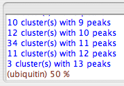

Note that this is just the tail end of a message that also announces how
many lonely clusters were encountered.

The "Purge Lonely" button also renumbers the clusters, much like the
"Compress and Degap" function renumbers peaks. If you originally had 84
clusters, for example, and five lonely clusters were purged, the
resulting 79 clusters are numbered 0-78.

The actions panel has a button labeled "Trim All". Unlike the previous
trim button, this one eliminates the peaks from clusters, and it does so
by eliminating the peaks least likely to be included in the cluster so
that the number of peaks remaining in the cluster matches the number
expected. This action is normally performed in the next step, "Edit
Clusters", on a cluster-by-cluster basis. But if you have already worked
with this dataset before, you can use 'Trim All" to speed up your
process; you should still check to see whether it eliminated more peaks
that it should have. If you click 'Trim All", you should see something
like this in your swkcon window:

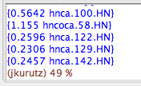

## Edit Clusters

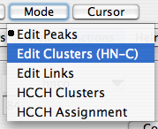

Now you’ve grouped your peaks into clusters, you should check whether
they are reasonable. Enter into “Edit Clusters (HN-C)” mode in
RunAbout’s top toolbar by clicking “Mode…Edit Clusters (HN-C)”.

Clicking this will refresh the spectra in the display, but the spectra
corresponding to each position in the panel are the same as in the “Edit
Peaks” mode. However, you’ll witness that the peak labels all being with
“c” in the “Edit Clusters” modes, indicating that the labels correspond
to cluster number. The Actions panel isn’t much use for editing
clusters, so it’s time to switch to the “Helm” panel. When you click the
“Helm” button, you should see your panel transform into something like
this:

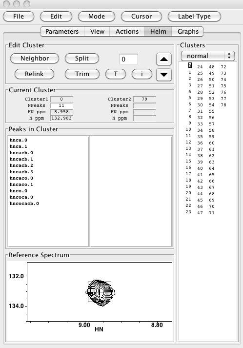

You can see immediately from the display between the “Split” button and
the up-arrow button that you’re working with cluster \#0. The cluster
numbering is pegged to the peak numbering in your reference spectrum
(probably your HNCO), and the reference peak itself is displayed in the
“Reference Spectrum” panel at the bottom left of the Runabout window.
The up- and down- arrows enable scrolling between clusters. The
“Fragments” display, in Edit Clusters mode, provides a list of all the
clusters, and draws a little box around the one you’re looking at now.
You can move directly to any cluster by clicking its number in the
Fragments panel; try it – it’s fun! Note that the Fragments panel may be
blank when you first look at it, but will work OK when you scroll up and
down or click in the cluster number display and hit return. The “Peaks
in Cluster” panel shows the peaks from different peak lists that are
linked into this cluster; “hnca.1” is peak \#1 from the hnca peak list,
for example. The “Current Cluster” section provides some handy numerical
data about your active cluster in the “Cluster1” section: cluster
number, number of peaks in the cluster, and the HN and N frequencies.
“Cluster2” refers to the peaks in the right-hand panel in the “Peaks in
Cluster” panel. Right now, this is blank in our figure because we have
78 clusters, and Cluster2 is set to \#79, which is empty.

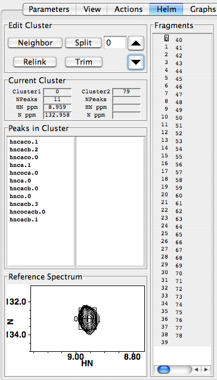

The right-hand portion of RunAbout’s Edit Clusters display presents your
spectra in a way that aligns peaks from different experiments, thus
enabling you to assess whether they truly belong in the same clusters.
These can be arranged however you want by configuring the “parameters”
panel, but this default configuration works well for most circumstances.
Every cluster has a single pair of 1H and 15N frequencies, so every peak
in this display shares these values. The left two columns display
spectra showing only (i)–to–(i-1) connectivity: the HNcoCACB, (shown
here; alternatively, you can show the HNcoCACB to include CA peaks), the
HNcoCA, and the HNCO. Of these two, the leftmost column’s panels’ X-axes
correspond to 15N frequency, and others correspond to 1HN frequency. The
right two columns display spectra showing both (i)–to–(i-1) and
(i)–to–(i) connectivities: the HNCACB (in which CB’s appear negative and
CA’s appear positive), the HNCA, and the HNcaCO. The rightmost column’s
X-axis corresponds to 15N frequency, and the other column’s to 1HN.

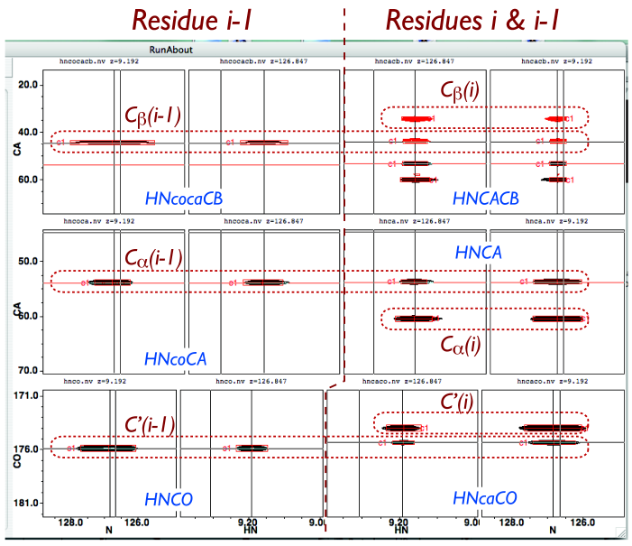

For most residues, you observe that the three different types of
(i)–to–(i-1) 13C frequencies each appears as four peaks aligned
horizontally. Some spectra, such as the HNCO and HNcaCO shown here, may
have been taken with different 13C spectral widths, in which case the
peaks will not exactly align visually, but horizontal cursors will still
correspond to the same frequencies in different spectra. You also
observe that the three types of (i)–to–(i) 13C connectivities share 13C
frequencies. When both residues i and i-1 are not glycine or proline,
you should expect to observe 11 peaks in the cluster (13 if you used the
HNcoCACB or CBCAcoNH instead of the HNcoCACB). The number of peaks you
would expect to see in a cluster, depending on residue type, is
displayed in Table 1.

Table 1. Numbers of peaks expected in RunAbout clusters. Residue i-1
Residue i Expected peaks in cluster (w/ HNcoCACB/CBCACONH) Expected
peaks in cluster (w/ HNcoCACB/CBCAcoNH) Non-Gly Non-Pro, Non-Gly 11 12
Gly Non-Pro, Non-Gly 9 10 Non-Pro, Non-Gly Gly 10 11 Non-Pro, Non-Gly
Pro 0 0

A chief reason you should be interested in the number of peaks to expect
when reviewing a RunAbout cluster is that RunAbout can automatically
“trim” clusters down to this size automatically. For instance, if a
cluster contains 15 peaks, which is clearly too many, you can cut out
the least likely members by clicking the “Trim” button in the left-hand
portion of the Helm panel.

In general, the best way to edit your clusters will simply by to scroll
through each cluster, check out the alignment of the member peaks, and
assess the validity of the number of peaks in the cluster. Clusters with
more than expected peaks surely have something that needs fixing, and
clusters with fewer than expected peaks should be investigated for
overlap.

To create a new cluster from peaks already picked, simply move peaks
from the left-hand list of peaks corresponding to the cluster of
interest to the right-hand list, which always starts out empty. To move
a peak from the left panel to the right in the Helm panel, simply click
the name of the peak (e.g., hncacb.45). Likewise, clicking on a peak’s
name in the right-hand panel moves it back to the left.

You can treat each spectrum display in the right-hand set of spectra
just as you would if it were an individual spectrum. RunAbout includes a
number of single-letter keys that facilitate this process:

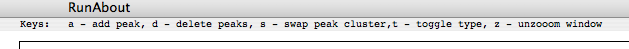

“z” (for “zoom/unzoom”) enables you to make one spectrum occupy the
whole panel. Click in the spectrum of interest and type “z”. Once you’re
in this mode, you can move peaks individually by clicking on them (which
fills them with transparent yellow tint to show they’re active), moving
them around, and changing their boundaries.

“t” lets you toggle the identity of a peak between being an (i)–to–(i-1)
correlation and an (i)–to–(i) correlation. RunAbout automatically
assigns these types to peaks when creating clusters, but will retain
these manual edits if you make them. You can tell which type a peak is
by which side of the peak its cluster label is on: (i)–to–(i-1)
correlations are labeled on the left, and (i)–to–(i) are labeled on the
right.

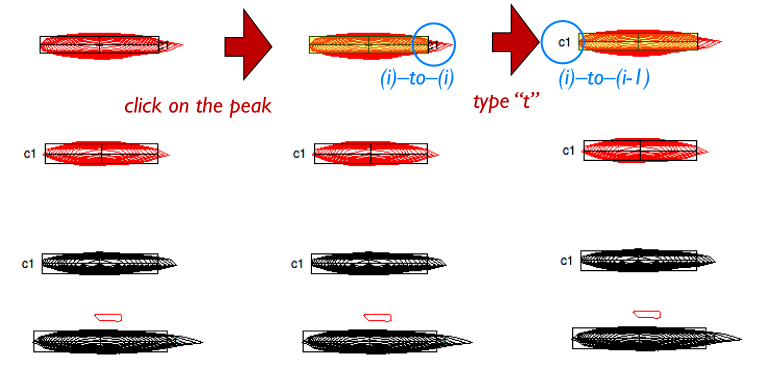

You can check the i/i-1 status of a peak by examining its entry in the
peaklist:

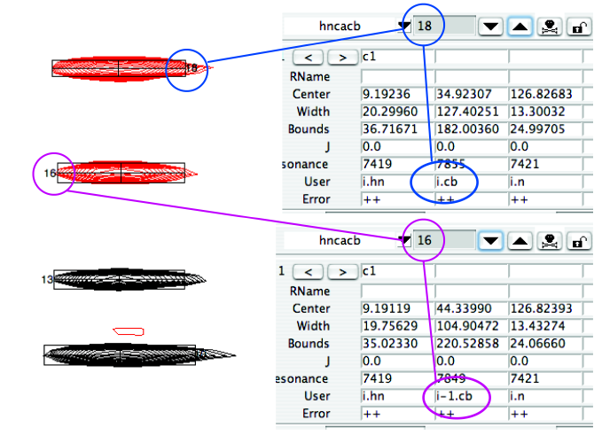

The remaining single letter commands are basically self-explanatory: “a”
– Add peak – adds a peak pick to the nearest peak when the left mouse
button is clicked.

“d” – Delete peak – deletes the nearest picked peak when the left mouse
button is clicked.

“s” – Swap peak cluster

Special Features Neighbor: Clicking the “Neighbor” button will bring to
the right-hand panel the cluster nearest to the cluster you’re editing.
This will facilitate resolution of some overlap problems, where some
peaks are initially assigned to one cluster but really belong in another
one nearby.

‘Split” ‘Relink” is the button you MUST click after you’ve adjusted
cluster membership. The establishes the new set of links between peaks
that constitute the cluster.

### Cluster Details

Having good cluster information is really key to all the other steps of
the assignment process so it makes good sense to carefully examine the
information for each cluster. This is made easy with the Cluster Details
window. Clicking the "i" button in the Link Edit Helm (also in the
Cluster Edit Helm) popus up a window that shows a "picture" of the
current cluster (updated each time you go to a new cluster in "Edit
Clusters" Mode. For each peak list it information for each peak in that
cluster. Peak numbers or peak chemical shifts are shown under the type
of atom that peak has been typed as (ca, cb, c, and intra- or
inter-residue). Next to each peak number is a little bar, showing the
relative intensity of that peak. Bar is blue for positive, red for
negative peaks. If there are more than the appropriate number of peaks
for a given peak list, the weaker peaks will be shown in subsequent
rows. The detail window shows a yellow box where there is an expected
peak for each atom type in each list. For example, an hncacb experiment
with a "i,i-1.ca,cb" pattern would have four boxes. Empty boxes are
something you will want to look at as they indicate either missing
peaks, or peaks that were incorrectly assigned by the software to atom
name and type (inter or intra residue).

The cluster detail window also shows the chemical shift range for each
atom type. Three numbers appear at the bottom of each atom, the minimum
shift, the maximum shift, and the delta between those two. If the delta
is greater than 0.5, it will be highlighted in a magenta color. A large
delta isn't necessarily bad, it may just mean that a peak has been typed
as "i,i-1" (could be either the intra-residue or inter-residue peak),
and will still match to the sequence properly. But if you like to have
all your "ducks in a row", you should pay attention to this. Peaks that
are probably "inter-residue" peaks but haven't been typed that way are
shown in magenta (fix this).

When looking at the cluster details you can switch the display (with the
check boxes at top) between the display of peak numbers or peak chemical
shifts. Displaying peak chemical shifts makes it easy to see which peaks
account for the a large range of shifts for the atom type, and which are
therefore possibly wrongly typed.

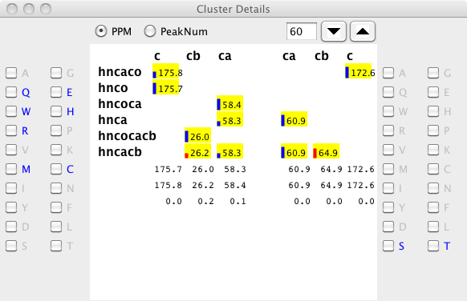

Illustrated here is a cluster with large deviations for the i-1 cb
chemical shifts. The problems with this cluster arise from the presence
of an artifactual peak (corresponding to the entries at 58.3 ppm). The
presence of this peak makes it difficult to unambiguously type the
remaining peaks.

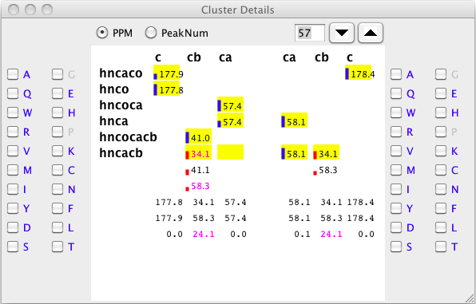

To resolve this issue, delete the peak (in this case, by zooming into
the hncacb window, selecting the weak peak at 58.3 ppm, and clicking the
"d" key). The peak types can be reassessed by clicking the "Assess All"
button on the Actions tab. Now the cluster detail will appear as
follows.

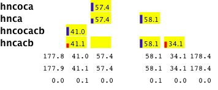

You can interactively alter the assignment type of an atom by just
clicking, and with the mouse button held down, dragging the peak number
(or shift value) to a different box. If you drag it away from the
current location and release the mouse button while the peak label is
located somewhere other than one of the yellow boxes, that assignment
possibility will be removed from that peak. (You can only do this if
there are currently two types, like i,i-1 for the peak).

On the left and right sides of the cluster detail window you'll find
columns of checkbuttons with labels corresponding to the 20 amino acids.
The buttons are arranged from top to bottom in increasing order of the
typical chemical shift found for the CB atom of that residue. The left
list corresponds to the i-1 residue, and the right list, to the "i"
residue. Based on the chemical shifts for the ca and cb peaks in the
current cluster the amino acids that are most consistent with the
cluster are indicated with the labels drawn in blue.

You can also use the detail window to constrain clusters to amino-acid
type. Simply click to select the checkboxes for any amino acid types
that you want to restrict the cluster assignment to. If no checkboxes
are selected, then the cluster can be assigned to any amino acid type
(but will be scored corresponding to the quality of the match).
Constraints become a property of the pattern for each reference peak, so
at the moment you can only constrain the "i-1" residue if your reference
list is an hnco (or anything where the carbon is on the previous
residue). For example, if you select "A" and "C" in the left side set,
that cluster will only assign to a position in the sequence where the
previous residue is an alanine or cysteine.

## Link Clusters

The Edit Links mode the real heart of RunAbout. It is where you and the
software connect up the clusters in such a way that the peaks can be
assigned to protein residues. Older tools, such as NvAssign for NMRView
version 5, would help you with your assignments by evaluating “scores”
related to the probability that two clusters are “linked”, i.e.,
represent two sets of atoms in the protein sequence. Runabout goes
further by evaluating the probability that a cluster could be associated
with a particular amino acid type, examine the clusters already linked,
then determine where in the amino acid sequence that grouping is most
likely to occur. Moreover, RunAbout uses the scores of neighboring
residues to automatically extend assignments through connections of high
probability, thus speeding assignment of easily-determined connections.

Begin editing links by selecting “Edit Links” from the “Mode” pulldown
menu atop the RunAbout panel:

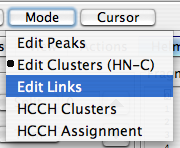

Here’s what will show up when the “Helm” panel is active when editing
links:

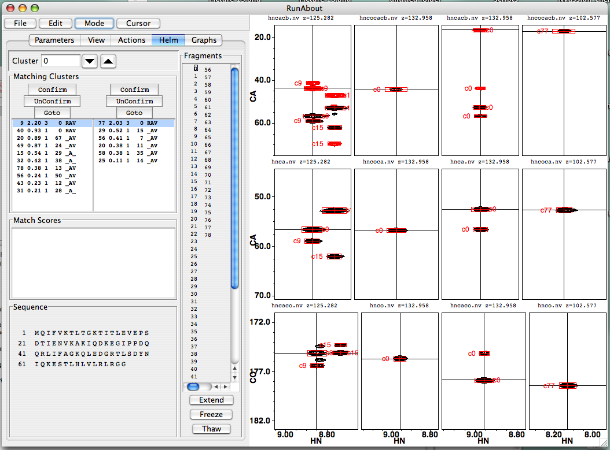

As in Edit Clusters, the Helm panel is divided into spectra on the right
and textual information on the left. First, consider the left-hand
portion. The information displayed pertains to a particular cluster,
designated in the “Cluster” window, and also specified by the small box
in the “Fragments” window. You can scroll through cluster data using the
up and down triangle buttons, and you can also click on a cluster number
in the Fragments display to call up its information. The “Sequence”
panel at the bottom shows your protein’s sequence. It is uninformative
in this figure, but as fragments can be associated, then assigned, to
particular stretches of residues, the letters will change color.
Similarly, the “Match Scores” window is relevant only after the first
link has been made, so we’ll discuss that shortly, but not now.

The “Matching Clusters” panel bears further examination, so we’ll
examine it in an expanded figure:

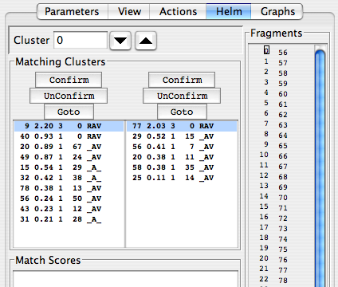

The goal in the Edit Links mode is to establish links between clusters.
Each cluster, identified in the “Cluster” window, is paired up with a
number of other clusters in each direction of the backbone; candidates
for the N-terminal link are presented in the left-hand panel, and those
for the C-terminal link are in the right-hand panel. Your job is to
evaluate which of these clusters in each list is the best, highlight it,
and click “Confirm” to establish a link. To undo a link, click
“Unconfirm”, and to switch to focusing on one of the peaks in the
panel’s list, highlight it and click “GoTo”.

Each list of clusters presents a number of parameters that will help you
decide which is the most appropriate link. The left-hand number is the
cluster’s number. The next number over, given to three significant
figures, is a score indicating the probability that this cluster matches
the on under consideration. Displayed scores range from 0.20 to 3.0, and
embody how many peaks match in each cluster, their signs (± and how
similar their chemical shifts are. Clusters are sorted in the panel
according to their match score. Clusters with scores over 2.20 are
usually good choices. The middle column, showing integers, indicates how
many pairs of the peaks in the two clusters share chemical shifts. The
next column indicates sort of a reciprocal preference: the label of the
cluster that best matches the candidate cluster. For instance, cluster
0’s best N-terminal match is \#9, with a score of 2.20. Cluster 9’s best
C-terminal match is \#0, so the \#9-\#0 link is probably good. Custer
\#40’s best C-terminal match is also \#0, though the pair exhibit a low
match score; this is probably a poor match, and cluster \#40 will need
to be matched with a cluster that is not \#0. The next column indicates
three characteristics of the potential match: R, “Reciprocal Matching”,
i.e., each cluster gives the other a high probability of matching; A,
“Available”, i.e., not linked in a cluster yet; V, “Viable”, i.e., three
or more carbon frequencies match one another across spectra, and the
proposed pair exhibits chemical shifts consistent with a pair of
residues in the protein sequence.

By default, the top ten best cluster matches are shown in the list. You
can change the number that will be displayed by setting the "Max
Clusters" parameter in the Parameters tab.

Clicking on a cluster in the list of clusters will update the
appropriate peaks in the peak display. Here’s what it looks like when
cluster 0 is being examined and clusters 9 and 77 are being considered
as link partners. Recall that peaks are labeled with their cluster
number preceded by the letter “c”.

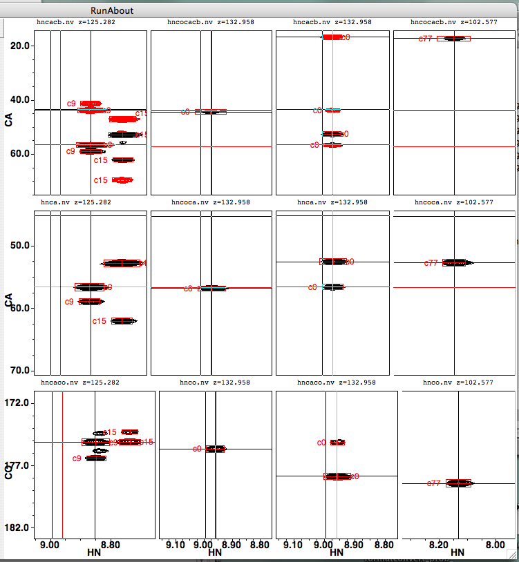

If you switch to examining cluster 20 as a potential N-terminal link
mate, you’ll see the left-hand column of spectra change:

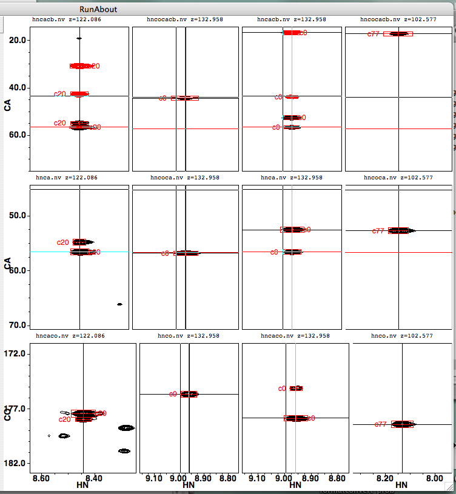

Here’s a figure that should help you figure out which peaks should be
lining up with which:

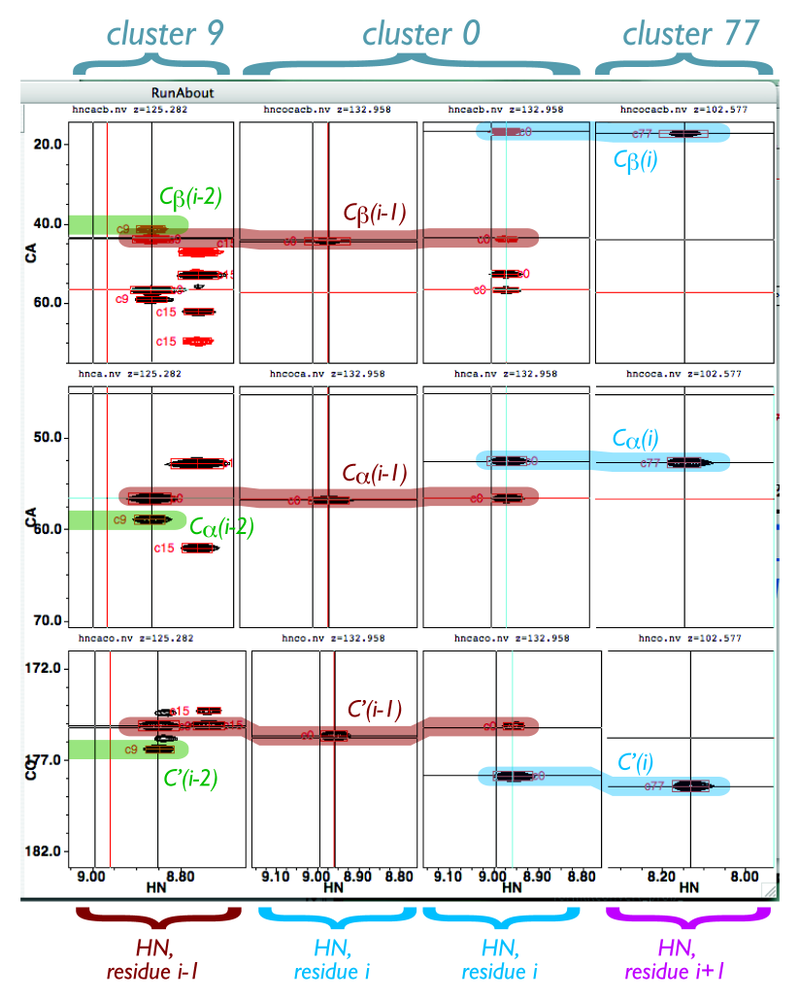

If you think you’ve found a good match, click the Confirm button. You
should see something like this if you highlighted N-terminal cluster 9
and clicked the left-hand/N-terminal Confirm button:

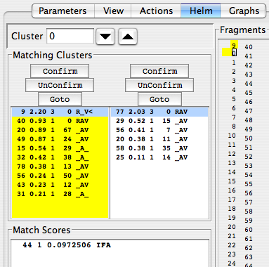

Several things happen when you click Confirm. 1) The panel becomes
highlighted in yellow. 2) In the Fragments display, the number of the
cluster you’re linking to changes position so it is adjacent to your
current cluster; here, clicking to link cluster 0 to cluster 9 moves the
numeral 9 immediately above the numeral 0 and highlights the area
between them in yellow. 3) New information suggesting potential residue
assignments appears in the “Match Scores” section of the Helm panel. 4)
The “A” becomes an “\_” to indicate it’s no longer available.

The RunAbout software examines your clusters and their links, and
compares them to those expected for your protein and continuously tries
to match your linked fragments to stretches of amino acids. The best
potential matches are listed in the Match Scores panel. Column 1 in this
display shows the number of N-terminal residue in the proposed matching
segment; the final column shows the amino acids in the proposed
fragment. In the figure shown here, the confirmed link between clusters
9 and 0 is proposed to correspond to the three residue segment “IFA”
beginning with residue I44. Column 2 shows whether this sequence
fragment has been assigned already; “1” indicates it has not, and “0”
indicates it has. Column 3 shows a Bayesian score (from 0 to 1) that
assesses the probability that the assigned clusters match the proposed
amino acid segment. The high this number is, the better, when comparing
different segment choices, but its value necessarily goes down as the
fragments get longer.

If you now click the right-hand/C-terminal Confirm button to link
cluster 0 to cluster 77, you will observe similar changes:

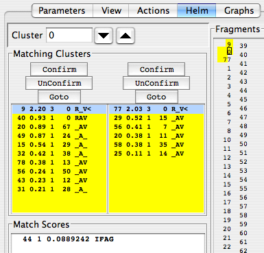

### Tocsy Display

When assessing the possible assignment of a cluster it is useful to see
not only the experimental data involving the CB,CA an C atoms but
additional sidechain atoms as measured in TOCSY experiments. At any
cluster in either the Cluster Edit or Link Edit modes you can pop up a
Tocsy-CO-NH display. Do use this feature you need to specify CCcoNNH
Tocsy and/or HCcoNNH Tocsy peak lists in in the "Parameters" tab.
Clicking the "T" button in the Helm tab will then display a strip for
these datasets at the HN-N position of the current cluster. These will
be displayed in a separate window from the main RunAbout window. The
display will be updated as you move to new clusters. At the left side of
the display that appears is a list of the 20 amino-acids. Move the mouse
over each entry to see a label on the spectra displayed at mean-chemical
shift of the carbon and hydrogen atoms of that amino acid type.

### Fragment Scoring

The scoring of fragments is based on the joint probability of the
assignments of clusters in a fragment. Each cluster gets a score, based
on the match of chemical shifts for available peaks.

For each peak in cluster: The score is the ((ppmPeak-ppmAtom)/sdev)\^2
where ppmPeak is the chemical shift of the peak ppmAtom is the chemical
shift expected for the atom type (from BMRB) sdev is the standard
deviation for the atom type (from BMRB)

This gives a number from 0 to some large number, where 0 is for a
perfect match.

The scores for all peaks in cluster are summed and a probability is
calculated from a Chi square distribution based on the number of peaks,
and the total score.

This number runs from 1.0 for a perfect match, to 0.0, for the worst
possible match.

If probability is less than the "ppm limit" value (which I realize is a
bad name) for any cluster in the fragment the whole fragment is
rejected.

The probabilities for each cluster in a fragment are multiplied together
to get the final score. Because of this, longer fragments have lower
scores. The final score shown is really only useful for comparing
possible assignments of a single fragment, rather than different
fragments (especially of different lengths).

Now here is the exciting part! You can see that the scoring algorithms
work reasonably well to predict clusters that should be linked.
Oftentimes, there is clearly one link that has a score superior to all
the others, and deciding that it should be confirmed is easy. RunAbout
now allows you to quickly assign all this “low-hanging fruit”
automatically with a single button: “Extend” (located at the bottom of
the window under the Fragments display):

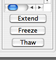

Clicking the Extend button will instantly link all the highest-scoring
clusters that are consecutively linked to the cluster you’re currently
examining. Three criteria must be met for the assignments to be
extended: 1) the score for the match must be \> 2.2, 2) three carbon
frequencies must match (thus, links with glycines must all be manually
confirmed), and 3) the link must be classified as RAV. These criteria
can be changed in the Parameters tab. To illustrate, here is what
happens to the data shown above when the Extend button is clicked:

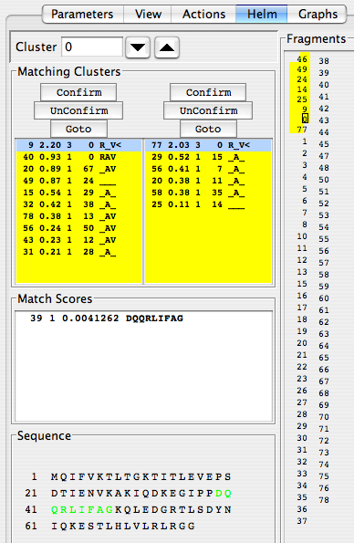

You can see right away that the series of linked clusters “9-0-77” is
instantaneously extended to “46-49-24-14-25-9-0-77”. Wow! RunAbout also
suggests that this segment corresponds to the amino acid residue
sequence “DQQRLIFAG”, as indicated in both the “Match Scores” and
“Sequence” panels. “Extend” operates in both directions, but here it was
stopped in the C-terminal direction because it encountered a potential
glycine residue, which “Extend” does not link to automatically. In the
N-terminal direction, Extend stopped at D39 because there is no cluster
in that direction that scores high enough for cluster 46 to link to.
Extend only works with links that score high enough that they would be
pretty obvious anyway; it is thus more of a time-saving device than a
mystery solver.

At this stage, it makes good strategy to continue manually Confirming
links, automatically Extending them, and manually Confirming them to
overcome hurdles the automation cannot handle.

For the data shown in these figures, the thing to do now is extend in
the C-terminal direction. In the Fragments panel, clicking on cluster 77
brings you to that cluster, and you find there’s a probable link to
cluster 31, but its score, 1.60, is below the 2.20 threshold used by the
Extend algorithm. If you click Confirm to link clusters 77 and 31, then
click Extend, you should see another handy stretch of residues becomes
automatically linked and assigned:

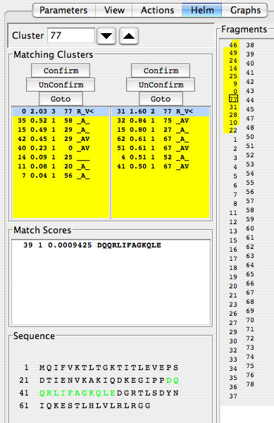

When you are sure you wish to keep the assignments for this stretch,
click the “Freeze” button just below the “Extend” button. Don’t worry.
If you want to reconsider your commitment to these assignments, you can
click the ‘Thaw” button, and they will become more flexible again.
Freezing assignments send the assignment data to the Assign…Atoms table,
which can be written to a text file. Freezing also disable your ability
to link to frozen clusters.

Clicking “Freeze” turns the letters in your Sequence display back to
black and draws lines over and under the frozen, assigned region:

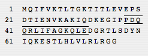

You can see the results of freezing in the Atom Assignments panel by
clicking from the main toolbar: “Assign…Atoms.”

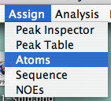

Figure 33. Calling up the Atom Assignments panel

Selecting “Assign…Atoms” will give you the panel showing chemical shift
assignments for all the atoms in the protein, subject to you filtering
specifications. In the figure below, the filter is set so all CA and CB
atoms are displayed.

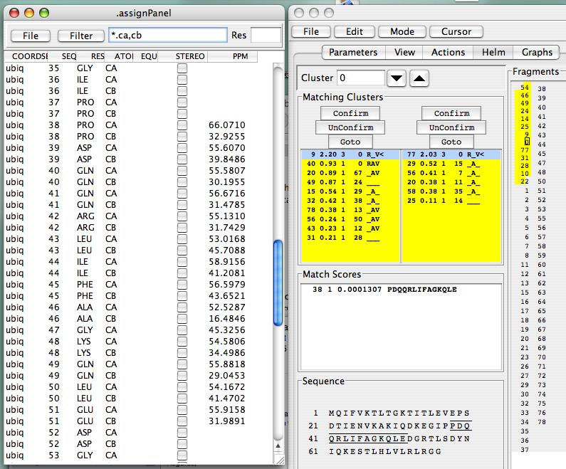

Continue in this fashion, and, after solving the last few problematic
links, you will have completed you assignments. This is what you should
see when you’re done with the EditLinks mode, and you’ve frozen all your
assignments:

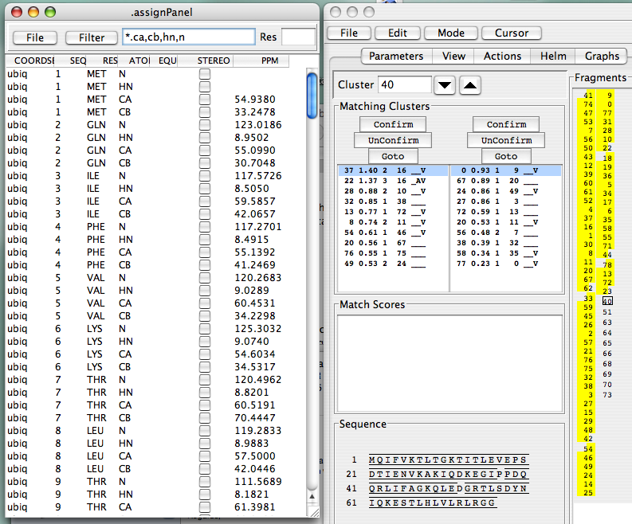

##Sidechain Assignments

Having completed the backbone assignments your are now ready to proceed
to assigning the side chain atoms. Two of the common sets of experiments
for this involve TOCSY experiments that relay magnetization through the
atoms of the side chains. The two methods differ in whether whether the
magnetization is relayed through the carbonyl carbon and amide nitrogen
and ultimately detected on the amide proton, or alternatively remains on
the carbons and carbon bound protons.

Because these experiments differ in the best way to present and analyze
them, RunAbout provides separate modes for working with them.

###TocsyCONNH Assignment Mode

To assign TocsyNNH experiments you should first ensure that you have
entered the carbon and proton experiments in the parameters tab. Choose
the experiment that indirectly detects the carbon atoms in the peak list
chooser labeled CCcoNHTocsy. Choose the experiment that indirectly
detects the hydrogen atoms in the peak list chooser labeled HCcoNHTocsy.
Make sure you check that the pattern and tolerance information for each
list. Both experiments should have the amide proton dimension set to i.h
(or i.hn) and the amide nitrogen dimension to i.n. The carbon experiment
should have the remaining dimension set to i-1.c\* (though any carbon
pattern should work) and the proton experiment should have this
dimension set to i-1.h\*.

In this mode the "Helm" will have controls to step through the assigned
residues (so use this tool after assigning the backbone). An atom
assignment table is present below the Residue navigation tools. As you
move to each residue the atoms present in that residue type will appear,
with the carbon and nitrogen atoms in the left column, and any attached
hydrogens in the next columns. Next to each name is the current chemical
shift assignment for that atom (empty if not assigned). At the beginning
of the sidechain assignment process you will typically find that the ca,
cb, n and h atoms will have chemical shift values displayed, and the
remaining values will be empty. Amide chemical shifts are displayed for
your convenience, but are not normally assigned in this module.

The main spectrum window of RunAbout will now be displaying the
appropriate spectral regions of the datasets associated with the carbon
and proton tocsy experiments you set up in the parameter panel. They
should be displayed with the amide proton on the X axis, the amide
nitrogen frequency selecting the Z plane, and the sidechain carbon or
proton on the Y axis. The amide frequencies are taken from those for the
currently displayed residue.

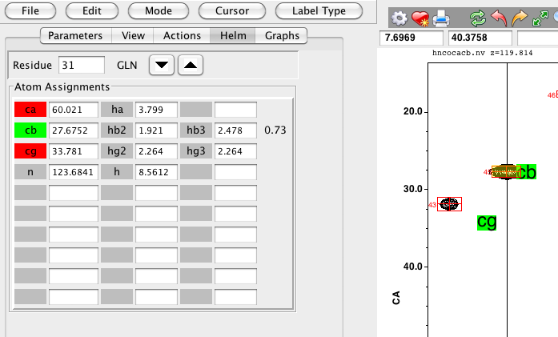

On each carbon and proton Tocsy strip a text symbol will be displayed
for each atom type. If the current atom is not assigned, the text
background will be yellow, and it will be drawn at the mean chemical
shift (on the Y axis) for an atom of that type (and residue type). If
the current atom is assigned, the text background will be green, and the
label will be positioned at the assigned chemical shift. The text labels
will be drawn alternately to the left and right of the center. This is
just to minimize the chance they'll appear directly on top of each
other.

Make sure the cursor is in selection mode (Use the Cursor menu on
RunAbout) and then select a peak in either the carbon or proton tocsy
that you're interested in assigning. A number will appear at the right
side of each row of the table. This number indicates the probability
that the selected peak is of that atom type. If both a carbon and proton
peak are selected the probability will be based on the chemical shift
distribution of both atom types. The atom names in the table will be
colored with a green or red background, based on whether they are an
acceptable (above a certain probability) assignment for that peak.

You can assign the selected peak by clicking on the atom label (CB,CG,
HB etc.) that is displayed on the spectrum. When assigned, the peak
shifts will inserted into the appropriate entry of the table, and the
atom assignment table will be updated.

If the selected atom has already been assigned (has a chemical shift
value), you will prompted as to whether you want to replace the existing
assignment. You can also enter assignments by just typing a chemical
shift value into the table.

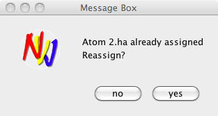

###HCCH Assignment Mode

To assign HCCH experiments you should first ensure that you have entered
an appropriate HCCH experiment in the parameters tab. Select this list
in peak list chooser labeled hcchtocsy. Make sure you check that the
pattern and tolerance information is set for the list. The proton
dimensions should be set to i.h\* and the carbon dimension to i.c\*.
Also, RunAbout needs to be able to determine which hydrogen dimension
represents a hydrogen directly bonded to the carbon atom detected in the
carbon dimension. To do this, open the Peak Inspector for the HCCH Tocsy
list, choose Edit-\>Reference from the Peak menu, and enter a value into
the relation field for that hydrogen dimension. For example, if your
dimensions are H, H and C, and the second dimension is the hydrogen
attached to the carbon (third dimension) enter D3 into the second
relation field. You can also do this in the console: "nv\_peak relation

The first step in the assignment process is to set up clusters of peaks
that are connected to a common proton/proton pair. While this protocol
is not strictly necessary, the clustering technique allows us to set up
peaks that will be used to anchor the sidechain assignments for each
residue. At present, the code is set up to cluster peaks based on the
first (the directly detected proton) and second dimension (an indirectly
detected proton) of the experimental data set. If your datasets are
different you may need to have the script adjusted. Click the Cluster
Peaks button in the HCCH Peaks section of the Actions Tab to actually
carry out this process.

After the peaks are clustered, the clusters are also searched to find
those that have a C13 ppm that is greater than 50 ppm, and thus are
potential HA, CA pairs (excluding Gly residues). These clusters are
stored into an internal array, sorted by the carbon chemical shift.

As with the backbone assignment mode, the next step after clustering is
to examine, modify and possibly delete some clusters. This is done, as
usual, in the Helm, which will now look like this:

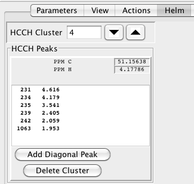

The Navigation controls let you move back and forth through the list of
clusters identified in the previous list. The chemical shift of the
directly detected proton and its attached carbon are shown labeled as
PPM C and PPM H. The list below shows the peak number and proton
chemical shift for all the peaks in the cluster. One entry will have the
shift shown in the PPM H entry, and is presumably the HA proton.

As you step through the cluster list the spectrum display will be
updated to display the corresponding region of the dataset. The
indirectly detected proton will be shown on the X axis, and the directly
detected on the Y axis.

There are three classes of editing actions to do as you step through the
clusters. First, for the convenience of our subsequent analysis every
cluster strip should have a diagonal peak. Sometimes, for example for HA
peaks near the water, the peak may be missing. RunAbout will draw a
green horizontal line at the expected position of the diagonal. You will
be alerted to the absence of a diagonal peak by the phrase No Diagonal
appearing in the Helm display. If no peak is present you can add it by
clicking the Add Diagonal Peak button. Second, some clusters correspond
to just noise or artifacts and can be deleted by clicking the Delete
Cluster button. Finally, you make changes to the set of peaks present in
the cluster by using key bindings in the spectrum.

To add a peak that has not been picked, position the mouse cursor over
the desired peak location, and press the a key. To delete a peak, select
the peak (click on it with the cursor in selection mode) and press the d
key. To remove a peak from the cluster, without actually deleting it,
select the peak and press the r key.

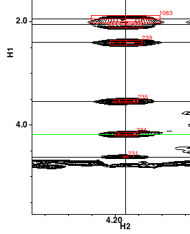

Having worked through all the clusters you are now ready to assign the
sidechain atoms. The assignment process works by stepping residue by
residue through the sequence and evaluating possible assignments.
RunAbout uses the chemical shifts of the previously assigned CA and CB
atoms to present you with HCCH clusters that are likely related to that
residue. Switch into HCCH Assignment mode to start the process. In this
mode the RunAbout helm appears as in this figure.

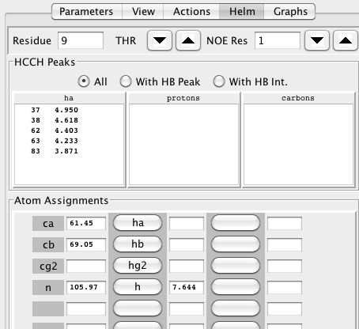

The top section of the helm lets you navigate through the residues, by
either clicking the up down arrows, or entering a number in the residue
field (and hitting the Return key). The amino acid type of the current
residue will be shown, and the Atom Assignments section will be updated
to show the names and assigned chemical shifts of the assignable atoms
in the residue. When you start a new residue, you will typically see
chemical shifts for the ca, cb, n, and h atoms (as these were determined
in the backbone phase).

The HCCH Peaks section of the helm will have three lists of peaks. At
first, only the first list will be populated. It will contain a list of
peaks and their proton shifts that are candidates for the assignment of
the HA atom. The list of peaks consist of any HCCH peaks with a proton
shift between 6.5 and 3.3 ppm, and whose carbon shift is close to that
of the CA carbon of the current residue.

The list of possible peaks can be relatively long and therefore somewhat
time consuming to evaluate. Fortunately, we have additional information
that can be used to restrict the possible peaks. In particular, since we
will generally also know the CB shift for the residue, we can limit our
peaks to those that are in a cluster that have a peak with a carbon
shift corresponding to the CB shift. This filtering can be done by
setting the "With HB Peak" button located above the peak lists. A less
restrictive form of this filtering can be done by instead setting the
"With HB Int." button. This will look, rather than for an already picked
HB,CB peak, for intensity above a threshold in the dataset at the
expected position of the HB,CB peak.

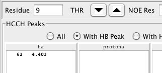

The spectrum display area shows three strips. As soon as you navigate to
a residue the first strip will show the H-H view of the HCCH Tocsy at
the carbon plane of the CA residue. The Y axis will show the full range
of proton chemical shifts, and the X axis will be set to show an area
that is likely to encompass any HA shift.

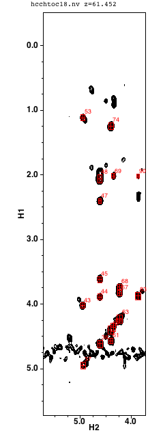

When you select (by clicking with the mouse) an entry in the ha list the
display region of the first strip will be changed to narrow in on the X
axis around the the chemical shift of the selected peak in the list. At
the same time the second list (labeled protons) will be updated to show
the peaks and shifts of all the protons in the cluster corresponding to
the selected peak (one of the peaks in the list will be the same as the
selected peak). These are all the possible assignments for the protons
of that residue.

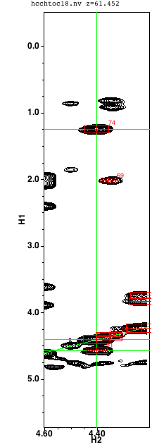

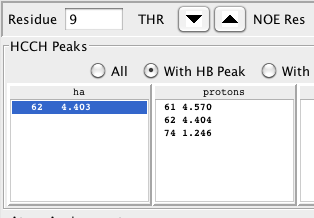

At this point you want to be checking whether the originally selected
peak is reasonable for this residue by evaluating the list of protons.
Clicking on any peak/proton pair in the protons list will perform
several actions that will help you make this assessment. First, the
chemical shift of the proton will be scored as a possible assignment for
each proton in the residue. The calculated score will be a probability
(from 0 to 1) based on the chemical shift distribution of atoms of that
type (from BMRB statistics) for both the proton and the carbon shift
selected in the third list (see below). Any probabilities above a
threshold will have the probability value displayed in the right column
of the atom assignments table, and if the probability is above 0.05 the
atom row background will be set to green (rather than red). Second, the
display of the second strip will be updated to display the region of the
dataset corresponding to the selected peak. The x axis will be set to a
narrow range around the proton chemical shift, and the carbon plane will
be set to the carbon chemical shift of the peak. Both the first and
second spectral strips will have green horizontal lines at the position
of each proton in the cluster, and a green diagonal line intersecting
the center at the position of the diagonal peak. Finally, a search will
be done of the dataset to find carbon planes with proton peaks
consistent with the protons in the cluster.

This search is done by scanning through the dataset and extracting a
vector at each carbon chemical shift that corresponds to a proton shift
of the selected proton. Each vector is compared to a reference vector
formed from a slice at the shifts of the alpha carbon and proton. If the
scanned vector corresponds to the same residue as that of the reference
the vectors should be similar. That is, they should have peaks at
similar proton shifts along the vector. A mathematical similarity
measure is calculated between the pairs of scanned and reference vectors
and any vectors with a value above a certain threshold will be listed in
the third list (labeled carbon). Three numbers appear in each list
entry, the carbon plane number, the corresponding carbon chemical shift,
and the similarity measure. The similarity measure will range from zero
up to the number of protons available for matching in the residue. The
list will be sorted in descending order of the similarity measure, so
the most likely carbon matches will be at the top. Typically you'll see
several values with close numbers corresponding to adjacent carbon
planes.

In the example shown below there is an HA proton selected in the first
list, a proton selected in the second list, and a carbon in the third
list. In this example, we've selected the HA proton at 4.403 ppm,
another proton at 1.246 ppm, and a carbon at 21.6 ppm. The green
highlighting and probability level of 0.92 indicate that these are
consistent with the expected values for the gamma carbon and its
attached methyl protons. The matching vector corresponding to plane 96
at 21.6 ppm is clearly better than the match at plane 51, and better
than the nearby planes 94, 95, 97 and 98. Though not shown here, in this
example selecting any other plane yields a lower value for the
probability score as well.

The chemical shift values of these peaks can be assigned to the specific
atoms by clicking on the buttons in the "Atom Assignments" table.
Clicking the button labeled ha will take the proton chemical shift for
the HA atom of this residue from the values in the selected row of the
first (ha) list. Clicking the other buttons, hb or hg2 in this example,
will take the proton shift for the corresponding atoms from the selected
row in the second list, and the carbon shift from the selected row in
the third list.

The carbon shifts listed correspond to the exact shift of each plane,
and thus are only as precise as the digital resolution in that
dimension. Peak positions are interpolated to have greater precision.
You can use a peak position for the carbon dimension by selecting a peak
(of the current residue) in the second spectral window prior to clicking
the proton button. If no peaks are selected a confirmation dialog will
be displayed asking whether or not to use the value of the carbon plane.

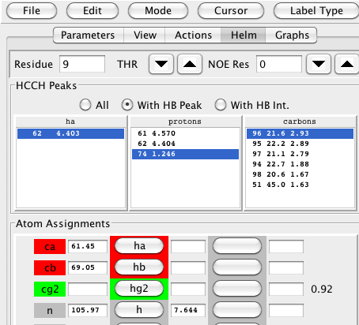

Additional information is always useful in confirming that one has the
correct set of peaks assigned. One of the most useful complements to the
HCCH experiments is the 15N-NOESY experiment. RunAbout is designed to
allow you to simultaneously view this spectrum as you work through the
HCCH spectra. To use this feature simply select the appropriate peak
list on the n15noe line of the Parameters tab. Now each time you
navigate to a residue the third spectrum will be updated to display the
appropriate region of the NOE spectrum. One is generally looking for
NOEs from the atoms of the current residue to the amide proton of the
subsequent residue. Accordingly RunAbout will show the NOE spectrum at a
plane corresponding to the amide nitrogen, and centered on the X axis at
the amide proton, of the next residue. You can vary which residue is
used by changing the "NOE Res" value. By default it is set to 1, but you
can change it to any other value. Horizontal green lines will be drawn
at the chemical shifts of the protons in the current reside so it is
easy to identify the corresponding NOE peaks.

This figure illustrates the three spectral strips of the HCCH mode for a
Val residue. The first strip is on the CA plane, and the second strip on
the CG plane. The last strip is the NOESY spectrum and clearly shows the
NOEs between the alpha, beta and gamma protons of the Val 17 to the
amide proton Glu 18.

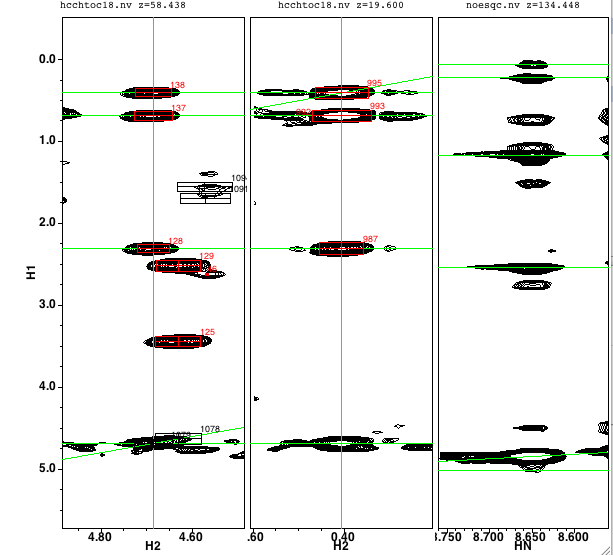
