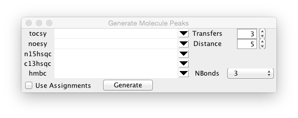
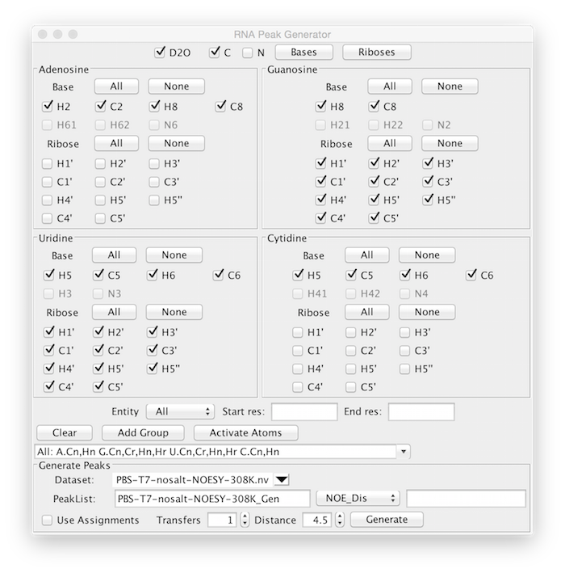

The conventional protocol in NMR peak assignment is to identify the locations of peaks
in the NMR spectrum and then attempt to identify what atoms in the molecular structure 
give rise to each one.  NMRViewJ adds a new, inverted protocol, for peak assignment.
In this new protocol the molecular structure is used to predict where peaks might appear
in the spectrum and then the peaks are interactively moved from their predicted
positions to locations that coincide with signals in the spectrum.  The advantages of
this approach arise from the implementation used in which interactively moving
a single peak actually moves an entire network of peaks.  Every peak in the spectrum
that shares an atom assignment with the moved peak will move to the corresponding position.
The network of moved peaks can, advantageously, include peaks in multiple spectra.
The user is then able to visually observe the alignment of not just the single peak 
being moved, but the whole network of related peaks.  This network alignment 
substantially reduces the ambiguity present that would occur if one was moving 
a single peak to one of several nearby signals.  Observing the network of peaks
is not possible in the conventional protocol because the identities of the peaks are
unknown prior to assignment and so the network of connections cannot be created.  In
the new protocol all peaks start with assignments so the network is known completely.

## Generating Peak Lists

Predicted peak lists can be generated for several types of experiments including NOESY,
HMQC/HSQC, and TOCSY.  Assignments of large RNA molecules benefit from using a
combination of different isotopic labeling strategies.  To accommodate these we provide
a special interface for the generation of predicted peak lists from RNA.
Predicting peak positions require four sets of information: a molecular structure,
an experiment type indicating the interactions between atoms in the molecule,
predicted shifts of the atoms, and experimental datasets to associate each list with.

### Molecular Structure

Molecular structures can be input in a variety of formats ranging from amino-acid
or nucleotide sequences, ligand files in *.mol* or *.sdf" format, PDB files, and 
XPLOR PSF files.  See the chapter on *Molecules* for more information.

### Experiment Types

The general peak generator has options for specifying peak connectivities based on
TOCSY, NOESY, ^15^N and ^13^C HSQC/HMQC, HMBC and NOESY experiments.  TOCSY experiments
require the specification of the number of transfers that magnetization occurs through.
Specifying a value of "1" essentially specifies a COSY experiment with transfers that
can occur through geminal (2-bonds) or vicinal (3-bond) couplings.  HMBC experiments 
require specification of the number of bonds involved in the magnetization transfer.

NOESY experiments require specification of the upper limit of the inter-atomic distance 
that gives rise to an NOE interaction.  Generating NOE peaks also requires that an approximate
structure (or structures) have been loaded into NMRViewJ first.

### Predicted Shifts

The utility of the network assignment protocol is dependent in part on the accuracy of 
the chemical shift predictions.  NMRViewJ has a built-in protocols for generating 
chemical shift predictions for RNA molecules based on the secondary structure.  Protein
shifts can be set based on BMRB average values for each residue/atom type.  A forthcoming
version of NMRViewJ will also include protein predictions.  All atoms can have predicted
values set by importing a text file of reference shifts.  The predicted shifts used
are the values that are stored in the *reference* value for each atom, as shown
in the *RPPM* column of the Atom Assign table.

### Datasets

Generated peak lists are always done in association with a specified dataset.  The dataset is
used to figure out spectrometer frequency and sweep width, as well as axis labeling.

###Non-RNA Peak Generation

Choose *Generate Slider Peaks* from the Analysis menu to create the interface for 
generating peaks from peptides, proteins and generic small molecules.

The five rows (tocsy, noesy etc.) specify the experiment type that will be used for prediction.  Click
on the button at the right side of each row to choose one of the currently open datasets to associate
with that experiment type.  Peaks will only be generated for types that have a dataset selected.  The
generated peak list will be based on the name of the corresponding dataset with "_Gen" appended.  Thus,
the peak list for dataset *tocsy.nv* will be *tocsy_Gen*.

By default peaks will be generated for each possible peak, based on the experiment type, at the atom reference
shift associated with each atom.  Predictions will also have a small random amount proportional to the atoms
reference error value added.  This is done so that atoms of the same type, with the same predicted value, don't
fall directly on top of each other.  If the *Use Assignments* box setting is turned on, then the shift used
will be the currently assigned value for that atom (if present), rather than the reference shift.

Peaks will be generated for all the experiment types that have datasets specified when you click the *Generate* 
button.

###RNA Peak Generation

Choose *Generate RNA Peaks* from the Analysis menu to create the interface for 
generating peaks from RNA molecules.  The following interface will appear:

The RNA Peak Generator is more complex than the general peak generator so that almost
any isotopic labeling scheme can be accommodated.  Each atom in the molecular structure has an 
*active* property associated with it.  The basic protocol of generating peaks is to choose various
atom selections that will be used to activate the corresponding atoms.  When peaks are generated
only those atoms that are activated will be used.  Multiple selection groups can be present simultaneously
so that different subsets of the molecule can have different patterns.  This is used to allow
simulation of peak lists corresponding to molecules consisting of two or more chains with different 
isotopic labeling.  Atom selections can also be used to generate peak lists that correspond to 
different experiments.  For example, if an experiment is run that only generates interactions among aromatic base
atoms, the ribose atoms could be left unactivated.

The upper section of the interface basically consists of selectors for each possible atom type, grouped by nucleotide type.
These selectors can be turned on and off individually, but it will generally be more convenient to turn them
on and off as groups.  At the top of the display is a *Bases* and a *Riboses* button.  These can be used to 
turn all base atoms or all ribose atoms on.  Within each base type there are buttons to turn all base atoms on and off
and all ribose atoms on and off.  The buttons that act on groups respect the settings made for *D2O* ( 
turn off or on nitrogen and the hydrogens attached to them), *C* (deactivate carbons, to represent a sample 
without ^13^C labeling), and *N*, (deactivate nitrogens, to represent a sample without ^15^N labeling).

Once you've selected the appropriate atom selects click *Add Group*.  This will create a named group that 
represents the current selection.  You can now, if needed, setup additional selections, each time clicking
*Add Group* to create an additional group with the new selections.  Molecular structures within NMRViewJ
can have multiple entities (for example multiple named polymer chains).  You can use the *Entity* selector to
specify that only atoms in the specified entity will be activated.  Additionally you can specify a start and end
residue so that only atom within that residue range will be activated.  The entity and residue range settings 
are associated with the group when you click *Add Group*.  All groups can be cleared by clicking the *Clear* button.
Once you have your groups set up click the *Activate Atoms* button.  This will cycle over each group, and activate
the atoms represented within that group.

Once you've activated the appropriate set of atoms, you can proceed to generate one or more peak lists that use
those atoms.  Choose a dataset to associate with the peak list.  When you choose the dataset, a default peak list
name (the dataset followed by "_Gen") will be set in the PeakList entry box, but you can change it to any desired name.
Choose an experiment type (HSQC, TOCSY, NOE Dis, or NOE SS).  Select a transfer number (for TOCSY) or a distance limit (for NOESY) 
lists and click *Generate*.  You can repeat this multiple times to generate different peak lists using
the same atom selections, just as you would use the same actual sample to run multiple NMR experiments.

Two types of NOE modes can be used.  *NOE Dis* generates peaks corresponding to NOEs between the atoms that are within the
specified distance based on coordinates in the current molecular conformation.  Distances are measured between
atoms in structures that are currently active (Use the Molecule>Analysis>Structures menu entry to bring up the 
interface for activating and deactivating different models).  *NOE SS* generates peaks between atoms in helical regions 
as specified in the secondary structure used in RNA shift prediction.

As with the general peak generator, the peak positions are by default based on each atoms reference shift value (typically
as set with the RNA prediction tool), but if the *Use Assignments* selector is activated then shifts are taken from 
each atoms current assignment, if present.

## Using the Network Peak Slider

Having now generated peak lists you can use the Peak Slider tool to interactively position them to align
with actual signals in your experimental data.  Display each of the datasets you want to use, and for which you've
generated peak lists.  It is often most convenient to display the windows in a row of sub-windows in a single
toplevel window, but you can display them in any desired arrangement.  You can also use multiple windows for 
a single dataset.  This can be useful because displaying a single dataset with multiple regions of peaks 
might not allow you enough of an expansion to carefully position the peaks.  After you have the datasets 
displayed turn on the display of the corresponding peak list for each dataset (the button with a **paper-clip with star**
icon in the Spectrum Attributes Peak Tab is useful for this).

Once you've set up the appropriate spectrum display windows activate the Peak Slider tool.  You need to do this once
for each of the toplevel windows you've set up.  When activated, a new row of controls (Freeze, Thaw and Status buttons,
and a mode selector) will appear near the bottom of the window.

Now that you have the datasets and peak lists displayed, and the Slider Tool activated, you are ready to start
repositioning peak networks.  Switch the mouse cursor in to selection mode (use the Cursor icon in the toolbar at top of
window, or just tap the *z* key to toggle through cursor types).  Select a peak by clicking on it and then while 
keeping the left mouse button down, drag it into a new position on the spectrum.  Note that as you drag the selected
peak all other peaks in the spectrum that have at least one atom assignment the same as the selected peak will also
move.  Moving many peaks in multiple spectra can be a little slow, so the default mode is only to update the positions
of peaks in the spectrum that you're currently working in.  When you pause in moving the peak, the peaks in other spectra
will be updated.  You can eliminate this delay, at the risk of slowing the peak dragging down, by changing the
Sliders mode setting from *Delayed* to *Immediate*.

Once you've positioned the peak in alignment with the appropriate spectrum signal you can click the *Freeze* button.
This does two things.  First, it transfers the chemical shift position of the peak (in both dimensions) to the assigned
chemical shifts for the corresponding atoms.  Second, it freezes the peak in place so it can't be repositioned.  All other
peaks, in all spectra, that share atoms with the frozen peak will also be frozen (but only in any dimensions they share 
assignments with the actively frozen peak).  The color of peaks that have one or more dimensions frozen will be 
changed from the default black color.  Peaks frozen in both dimensions are shown in red, peaks frozen in the horizontal
dimension (along x axis) are colored orange, and peaks frozen in the vertical (y axis) are colored magenta.  Peaks
that are in other spectra may not have there colors updated until you click the mouse in the other window (to activate the window)
or redraw the window.  You can also force the updating of colors by clicking the Status button.

Peaks that have been frozen can be thawed, so that they can be repositioned, by clicking the Thaw position.  Clicking 
the thaw button will also *remove any assignment* for the corresponding atoms.

Peaks can be manipulated with the Peak Slider tools in any order, but it generally makes sense to start with well resolved
peaks displaced from crowded regions of the spectrum.  The correct positioning of these peaks will generally be 
less ambiguous.  As you freeze these peripheral peaks, however, you will often see peaks in more crowded regions change in
color as they may share a peak assignment with the frozen peak.  Working with multiple spectra is also advantageous as
positioning a peak in a resolved region of one spectrum may resolve an assignment in a crowded region of a second spectrum.
Pay careful attention as you move a single peak to the network of peaks that move in association with it.  The correct
positioning of a single peak may be ambiguous as it may be positioned near multiple actual signals.  But by experimental
moving it to the different choices and observing how close the network of peaks are to signals you may be able to
resolve the ambiguity.  It will often be the case that positioning the peak to one of the signals will bring the network
of peaks into close alignment with a set of signals, whereas another position may leave the network of peaks more distant
from real signals.

