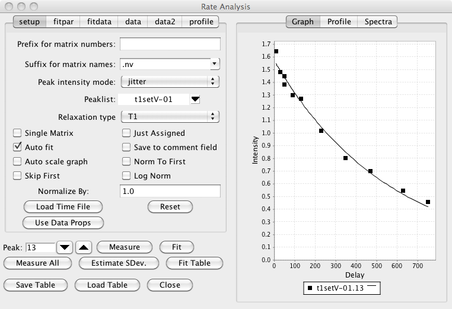
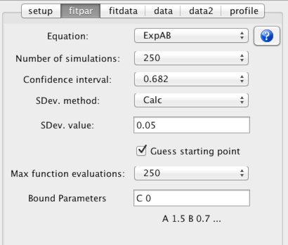
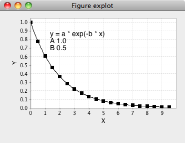
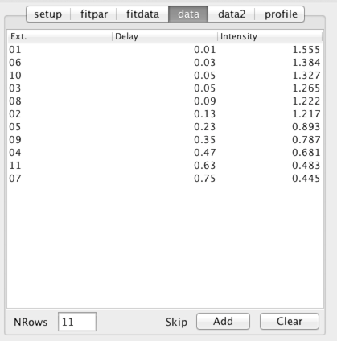
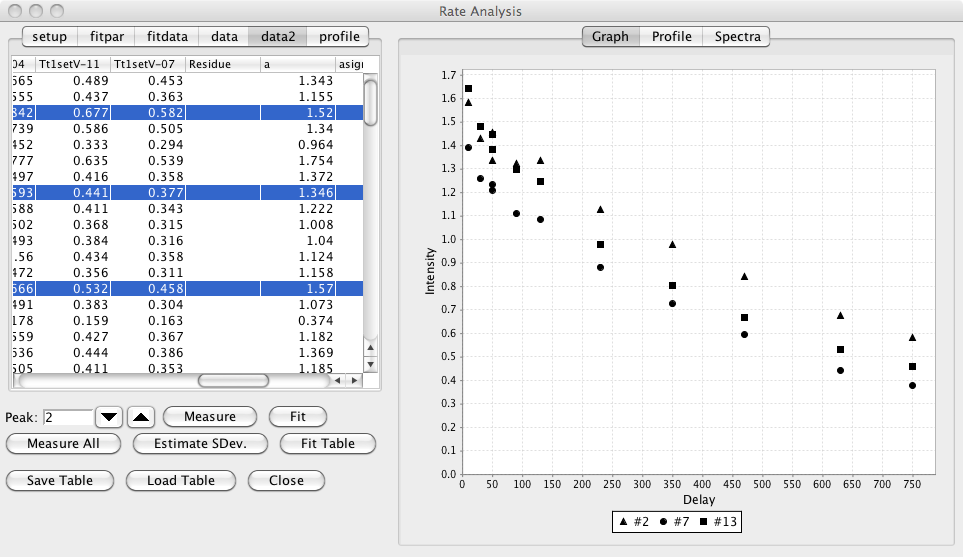
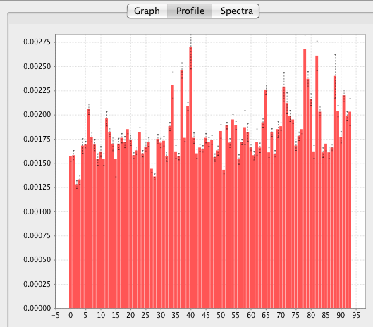

The Rate analysis system is designed to facilitate the analysis of time
dependent NMR properties. It can be used, for example, to extract
relaxation rates or to visualize NOE build up curves. The procedure is
used to analyze the intensities in a series of spectra collected with
different mixing times. The analysis proceeds in a series of steps as
follows:

1.  Peak pick the spectrum with highest intensities.

2.  Clean up peak lists.

3.  Open the Rate Analysis Panel.

4.  Set appropriate analysis parameters.

5.  Analyze each peak in list.

Peak pick spectrum with highest intensities.

Choose one spectrum to peak pick. For relaxation analysis this is
typically the spectrum with shortest mixing time. For NOE buildup curves
it is typically one with an intermediate mixing time.

Clean up peaks

This step is not necessary, but it is useful to eliminate artifactual
peaks at this stage. This is particularly relevant if all peaks are to
be automatically analyzed. Any of the peak tools can be used for this
step.

Open the Rate Analysis Panel.

Choose "Rate Analysis" from the Analysis Menu of the NMRView Control
Panel. The following analysis panel will appear.

Set appropriate analysis parameters.

Matrix Prefix

:   Sometimes you'll have a series of 2D spectra whose names can be
    decomposed into a prefix common to all spectra, and a unique
    descriptor for each spectrum. For example, T1\_1.nv, T1\_2.nv,
    T1\_3.nv ..., or noe\_0, noe\_20, noe\_40, ..., or T2a, T2b, T2c ...
    There is no requirement that the descriptors be numeric, or that the
    spectra be collected or numbered in any particular order. The prefix
    (T1\_, T2, or noe\_ in the above examples) should be entered into
    the field labeled "Matrix Prefix". It is necessary that the data
    files be named this way if you name are going to store the
    relaxation time into the dataset parameter file. If you are going to
    use a "Time File" you can leave this blank.

Matrix Suffix

:   The suffix for the matrices described above. For example, if the
    matrices are T1\_1.nv, T1\_2.nv, T1\_3.nv, you would enter nv for
    the matrix suffix.

Intensity analysis mode

:   The estimation of the intensity of the peaks uses the "nv\_peak
    analysis" command. This command returns various estimates of the
    peak intensity, including both peak height and peak volume values.
    The desired estimator type should be selected with the "Mode" menu.
    The default mode (Jitter) determines the height of the most intense
    point found within a certain range (+/- 25 % of the peak bounds) of
    the peak center. This allows for a certain level of variation of the
    peak position (i.e. jitter) from one spectrum to the next.

PeakList

:   The appropriate peak list (created in the step above) should be
    selected from the peak list menu.

Descriptor/Time File

:   A file must be created containing the unique descriptor portions of
    the file names and the corresponding mixing times. The file should
    have the a format where the each row corresponds to one dataset. The
    first column of the file contains a descriptor of the file and the
    second column contains the relaxation time. If you entered a value
    in the "Prefix for matrix numbers" field discussed above, then the
    descriptor is the part of the file name after the prefix. If you
    didn't enter any prefix, then use the whole file name (except for
    the file extension). For example: 1 20 2 100 3 60 4 200 5 50 6 140
    Times should be entered in ms. The file can have any unique name.

Relaxation Type

:   This is used when saving data to a STAR save frame or peak comment
    field, and has no effect on the actual analysis process.

Single Matrix

:   The data to be analyzed can either be in individual datasets, or
    individual planes of a single pseudo-3D matrix. In the latter
    situation check this box. Then the description column of the Time
    File will be assumed to represent the plane number of the 3D matrix
    to be analyzed for relaxation time specified on that row of the
    file.

Just assigned

:   When automatically analyzing all peaks (see Measure All below), only
    peaks that have assignment values in their label fields will be
    included.

Auto fit

:   If checked, the non-linear regression analysis will be done each
    time you step to a new peak.

Save to comment field

:   Each peak as a comment field that can contain any string of text. If
    this check box is selected, then after each peak is analyzed its
    comment field will be set to contain the calculated relaxation rate.

Auto scale graph

:   Not currently used.

Norm to first

:   It is sometimes useful to normalize the measured intensities to the
    first value in a series. This is commonly done, for example, with
    the Relaxation-Dispersion analysis of CPMG datasets. Clicking this
    check box will divide each value in the series of data points
    measured for each peak by the first value in the series (hence the
    first value will now become 1.0).

Skip First

:   In some circumstances, for example analysis of Relaxation-Dispersion
    datasets, where the data is normalized by the first data point in
    the series, it is generally appropriate to exclude the first data
    point from the subsequent analysis. This data point may not for
    example, really be part of the relaxation series, but instead is a
    reference value. Clicking this check box will exclude the first data
    point from subsequent analysis.

Log Norm

:   If normalization (as described above) is done, it may also be
    appropriate to take the logarithm of the normalized values
    (typically this is done to convert the normalized values into a
    relaxation rate). Note, in some respects this log normalization may
    be considered to have adverse effects on the quality of the data
    fitting. This is because standard fitting algorithms presume that
    the errors in the experimental measurements are normally
    distributed. After taking the logarithm of the data this is not the
    case. When doing analysis of Relaxation-Dispersion experiments to
    calculate exchange rates there are two available equations (within
    NMRViewJ) that can be fit. If log-normalization is done you should
    use RDispSin, otherwise (and this author thinks that this is
    probably statistically more valid) you should use RDispESin.

Normalize by:

:   If normalization is done, as described above, you can also enter an
    explicit normalization value that will be included in addition to
    the normalization to the first data point.

Having setup the above parameters you can now load the relaxation
delays. This can be done by either loading values stored in the
relaxation delay file (as described above), or by extracting delay times
from a delay parameter stored in each datasets parameter (.par) file.

Load Time File

:   When the user clicks this button a File Open dialog will appear. The
    user should select the previously created Descriptor/Time file. The
    file will be read, the descriptor and time data will be displayed in
    the data table, and the appropriate datasets will be automatically
    opened if they have not been previously opened.

Use Data Props

:   When the user clicks this button the names of any opened datasets
    will be scanned to find those that start with the specified prefix.
    The relaxation delay will be taken from the delay property specified
    for each dataset.

Reset

:   When the user clicks this button the relaxation information (delays)
    will be cleared.

Once the above parameters have been set, and the data loaded from the
Time file, or dataset properties, you can use step through the peaks in
the list using the up/down arrows next to the Peak entry. You can jump
directly to an individual peak by typing its peak number into the peak
entry and hitting the Enter key. As you step through each peak the
intensity (or volume etc, as specified with the "Peak intensity mode")
will be measured at the position of that peak in each of the datasets.
The graph will be updated to show these intensity values as a function
of the relaxation delay.

You can also observe each of the individual spectral peaks that are
being quantified by choosing the "Spectra" tab (rather than the Graph
tab) on the right hand side of the Rate Analysis interface. You may need
to use the zoom in/out and scale up/down buttons on the icon bar to set
the appropriate spectral display width and contour level.

Before actually performing a least squares fit of the data to determine
the relaxation rate from the data you need to check several parameters
in the fitpar tab.

Equation

:   Choose an equation appropriate to the experiment used to collect the
    data. An important decision is whether to use a two or three
    parameter fit. The three parameter fit, which includes a parameter
    to estimate the intensity at infinite time, might be considered by
    some to be the most appropriate mode. Unless, however, the data has
    very low noise, and long mixing times are included in the
    experimental data the two parameter fit, which assumes the value at
    long mixing times, often gives the most reasonable estimate of the
    amplitude and rate parameters. It is, of course, up to the user to
    select and justify the most appropriate equation.

    Equations are chosen from the "combobox" labeled Equation. To see the
    actual equation and a plot of it over a typical data range click the
    ? icon next to the equation chooser.

    

Confidence interval

:   Select a probability level to be used for the estimate of the
    confidence intervals of the fitted parameters. The confidence
    intervals are estimated using a Monte Carlo procedure.

Number of simulations

:   Select the number of simulations to be used in the Monte Carlo
    estimate of confidence intervals. There is no reason other than
    speed not to use a high value.

SDev. method

:   The Monte Carlo procedure used to estimate the confidence intervals
    of the fitted parameters requires and estimate of the standard
    deviation of the data intensities. This can be done in two ways.
    Either you can choose the Calc. method or use the Set method and
    explicitly set a value. The Calc method could be considered
    cheating, though can give a reasonable estimate. In this protocol,
    you fit the data, and use the root mean square value of the
    deviations of the measured values from the calculated values as an
    estimate of the standard deviation. This process happens
    automatically if you set the SDev method choice to Calc.

    Alternatively you can explicitly enter a value in the Sev. value
    field and set the SDev. method to "Set". The value you enter could
    be taken from the analysis of the noise in a peak free region of the
    spectrum, or as is commonly done, from intensity values measured at
    a relaxation time that is replicated.

Analyze the peaks.

The peak to be analyzed can be selected by entering a peak number in the
Peak field, or by using the up/down buttons to navigate through the
list. As each peak is selected, the peak intensities for that peak will
be extracted from each dataset and displayed in the XY plot window. The
spectrum window will show an expansion of the spectrum region containing
the peak. The dataset used for the spectrum display can be changed by
selecting the check button next to the appropriate entry in the data
table.

The intensity measured for each peak will also displayed as a table in
the "data" tab. The first column is the dataset descriptor, the second
column is the relaxation time for that dataset, and the third column is
the measured intensity (as defined by the Peak intensity mode). The Norm
to First and Log Norm modes will affect the measurement process and the
values displayed in the table will reflect the state they were in when
the datasets are analyzed.

Measure

:   Click this button to measure the intensities for the current peak.
    This is not normally necessary as intensities are automatically
    measured each time you step to a new peak. You might want to use it
    if you are checking the effect of changing the Peak intensity mode.
    Each time you change it click the Measure button to view the graph
    of the intensities calculated with the new mode.

    

    NMR is a technique that can be subject to an occasional artifact
    which might significantly affect the intensity of peaks in the
    spectrum. Such peaks will have a marked influence on parameters
    derived in this analysis. In some cases it may be judicious to
    remove these peaks from the analysis. This can be done by selecting
    one or more rows in the above table and clicking the Add button.
    This will add the data points corresponding to the selected row and
    the current peak to a list of peaks to be skipped during peak
    measurement and fitting.

Fit

:   Click this button to perform the non-linear fit to the currently
    displayed data. Non-linear fitting procedures generally require a
    starting point (a guess, hopefully educated) for each parameter to
    be fit. If the Guess Starting Point mode is on (and this is the
    default), the fitting procedure will automatic determine a starting
    point. Each equation built in to NMRViewJ has some rules that it
    uses to formulate a guess for each parameter.

    After fitting, either by clicking this button, or going to a new
    peak if the "Auto Fit" mode is selected, the table in the fitdata
    tab will be populated with the results of the non-linear, least
    squares, fitting procedure. Each row of the table will correspond to
    one parameter from the equation used to fit the data. The starting
    value (guess) is displayed in the second column of the table and the
    best fit value in the third.

    After the fitting procedure is performed once to determine the best
    fit value for each parameter, it is repeated a number of times as
    specified by the "Number of Simulations" parameter. Each of these
    subsequent fits is done to a simulated data set that is generated
    using the best fit parameters in the chosen equation. Random noise
    with a Gaussian distribution and a standard deviation equal to that
    set in the SDev Value field is added to the simulated data before
    fitting.

    This Monte Carlo method generates a set of values for each of the
    parameters in the equation. The values for each parameter are
    sorted, and then values that bracket the fraction of values
    specified by the confidence interval are determined. Strictly
    speaking, for equations with non-linear parameters, the interval
    corresponding to a given percentile can be asymmetrical about the
    best fit parameter. For example, if the best fit value is 100, 5% of
    the values might be below 95, and 5% of the values above 110. Thus
    the 90% confidence interval would be from 95 to 110. Because of this
    it is not really appropriate to report the error distribution as a
    single number (a standard deviation). But, for NMR data fit to
    exponential decays the deviation from symmetry is often not huge, and
    it seems customary to report values as the best fit parameter plus
    or minus a single standard deviation value. NMRViewJ generates a
    single number by taking the geometric mean of the upper and lower
    values of the 0.682 confidence interval.

    The standard deviation and upper and lower values of the specified
    confidence interval are displayed in the third,fourth and fifth
    columns of the table. The RMSD value (deviation of the data points
    calculated using the best fit parameters to the measured parameters)
    is displayed at the bottom of the table.

Measure All

:   Click this button to loop over all the peaks in the specified list
    and measure the intensity at the corresponding position in each of
    the datasets.

    The table in the tab labeled data2 will now be populated with the
    measured data. The first column will contain the peak number and the
    second column will contain the number of datasets analyzed for each
    peak (this will be the same for every peak). The remaining columns
    will contain the intensity measured in each dataset (the column
    header will indicate the corresponding dataset descriptor).

Estimate Standard Deviation

:   A common protocol for estimating the standard deviation to be used
    in the Monte Carlo analysis depends on collecting two data sets at
    the same relaxation time. From the distribution of deviations
    between the intensities for each peak, in the two data sets, one can
    estimate the standard deviation.

    Click this button to check the list of relaxation times for a
    replicate pair, If found, the standard deviation will be calculated
    and the entry in the "fitpar" tab will be updated with the value.
    You must have done the "Measure All" command prior to using this
    command.

Fit Table

:   Clicking this button will loop over the table of data generated with
    Measure All, and perform the non-linear least squares, fit on the
    data in each row. After fitting, additional columns will appear in
    the data2 table. A pair of columns will be present for each
    parameters best fit and standard deviation values. The last column
    will display the rmsd value for the fit. Additionally there will be
    one column (just before the best fit values) that will contain the
    residue number for the peak. This will only be populated with a
    value if the peak has an assignment label in the standard NMRViewJ
    format (residue.atomName).

    Highlighting any rows (contiguous or non-contiguous) in the table
    will update the graph with the data values measured values and best
    fit lines (bug, line not showing).

    

Save Table

:   You can save the table of measured data (and best fit values if
    you've done the fitting) by clicking this button. You will be
    prompted for a file name in which to store the data. This provides a
    convenient way to export the data to be fit or displayed in some
    other application.

Load Table

:   You can reload a saved table of measured data (and best fit values
    if you've done the fitting) by clicking this button. You will be
    prompted for a file name from which to retrieve the data.

Having measured the data you might want to plot all the relaxation rates
as a function of peak or residue number (if the peaks were assigned).
This can be done by going to the Profile tab and selecting either Peak
or Sequence mode and clicking the Display button. The Profile tab at the
right side of the Rate Analysis interface will now show a bar chart
(with indicators of the standard deviations) for all the relaxation
rates (assumed to be the "b" parameter) in the data2 table.

