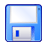
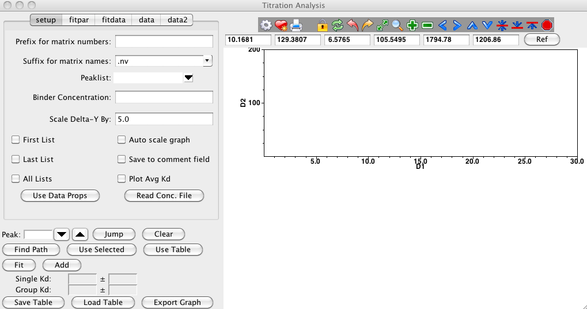
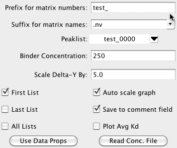
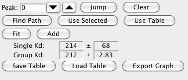
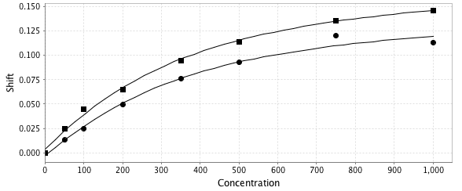

The Titration analysis system is designed to facilitate the analysis of
ligand dependent NMR properties. It can be used, for example, to extract
binding constants or to visualize titration curves. The procedure is
used to analyze the chemical shift positions of peaks in a series of
spectra collected with different ligand concentrations. The analysis
proceeds in a series of steps as follows:

1.  Prepare spectra and concentration information.

2.  Peak pick all the relevant spectra.

3.  Clean up peak lists.

4.  Open the Titration Analysis Panel.

5.  Set appropriate analysis parameters.

6.  Analyze relevant peaks (those that show ligand dependent shifts).

Ideally, you're spectra will be stored in a single directory with each
file ending in a unique integer. So you might have files named
titration1.nv titration2.nv, etc. Open all spectra by using Datasets \> Open Datasets....

The concentration of ligand that is associated with each dataset can be
stored either in each dataset's parameter (.par) file, or all the values
can be stored in a single text file. If you want to store them in the
parameter file, you'll need to ensure that you have parameter files for
each dataset. Open the Datasets Table (Datasets \> Dataset Table....), select all the
datasets and click the WritePar button. This will save a ".par" file for
each spectra (in the same directory as the ".nv" files). Manually edit
each ".par" file to add a "property ligcon" line that specifies the
ligand concentration for that file. You can also add a "property
protcon" line the specifies the protein concentration for each dataset.
This is useful, because often as you titrate in ligand to a sample you
are also diluting the sample so the protein concentration is not the
same for each file. Concentrations can be specified in any units, as
long as you are consistent in all files, and use the same units for
ligand and protein concentrations.

A typical parameter file will look like (with concentrations in
micro-molar):

                    dim 2 512 256 64 64
                    sw 1 3940.88647461
                    sf 1 499.718994141
                    label 1 H1
                    complex 1 0
                    sw 2 1320.0
                    sf 2 50.641998291
                    label 2 N15
                    complex 2 0
                    posneg 1
                    lvl 0.1
                    scale 1.0e6
                    rdims 0
                    datatype 0
                    poscolor black
                    negcolor red
                    ref 1 4.77299976349 513.0
                    ref 2 120.01499939 109.0
                    property ligcon 750
                    property protcon 100
                

Now, reload the parameter files by selecting them in the Datasets Table
and clicking the "ReadPar" button. Change the Datasets Table mode to
Properties. You should now see a ligcon property (and protcon property if
you entered it) for each file, with the appropriate value listed.

Alternatively, you can specify a single text file containing the
information. The file has a single row for each dataset, with two or
three fields per row. The first field is always the unique portion of
the dataset file name. In this example the files were titr0000.nv,
titr0050.nv, titr0100.nv etc. If you have not followed this naming
scheme, with a common name portion (here titr) and a unique portion
(0000, 0050 etc.) then you can simply specify the entire filename
(without the ".nv" extension). The second field is the ligand
concentration, and the third field (if present) is the protein
concentration.

                   0000 0.0 204
                   0050 50 204
                   0100 100 204
                   0200 200 204
                   0350 350 204
                   0500 500 204
                   0750 750 204
                   1000 1000 234

                

This is most easily done by opening all the spectra in one window. To do
this, select all the titration spectra in the Datasets Table and then
click the "Draw" button. In the "Window Add" dialog that appears, change
both the Rows and Columns values to "1" and click the "Create" button
(if you don't change the Rows and Columns numbers each spectrum will
appear in a separate gridded window). A window should appear with all
the spectra displayed in it. It is very useful when displaying the
spectra if they are colored in a sequential fashion, with colors
starting at one value for low ligand concentrations, and blending into a
different color for the high ligand concentration. You can easily do
this by clicking the color gradient button
 on the Spectrum Attributes
File Tab and choose one of the sequential color schemes. At this point
you should also check the contour levels for the spectra and adjust them
to a point where you think that if you peak pick the data you'll get, as
much as possible, one peak for titrating nucleus for each dataset in the
titration. Having set up the colors and contour levels, you again save
the parameter files with this information. Just click the Save icon
 located on the File tab
below the gradient icon.

Put the crosshair cursors around the spectral region you wish to pick
and choose "Pick" from the Spectrum Menu's Peak submenu. This will pick
all the spectra displayed in the window within the regions of the
crosshairs. Each peak list will have a name corresponding to the dataset
(titr0000 for dataset titr0000.nv etc.). You can also do this from the
PeakPick tab of the Spectrum Attributes menu. Leave the peak list entry
empty so each list will automatically pick up the name of the dataset.
Note, at present the titration tool assumes that this mapping of peak
list names to dataset names holds true. If not, because you created your
peak lists in some other manner, it may not be able identify the
appropriate peak lists, and you'll get an error about "Need to pick
peaks first".

Now that you've picked peaks you might want to examine the spectrum
again to double check the appropriateness of your contour level
selection. You may want to change it and re-pick the peaks. If you change
the contour level, then you should click the Save icon
 located on the File tab
below the gradient icon again to save the parameter files with the new
contour level.

Choose the Analysis \> Titration
Analysis menu item and the following analysis panel will appear.

Various parameters effect how the titration analysis proceeds. In this
step you'll set a series of parameters specified in the **setup**
section of the Titration interface.

Prefix for matrix numbers

:   The analysis system typically assumes the the datasets consist of a
    series of 2D spectra whose names can be decomposed into a prefix
    common to all spectra, and a unique descriptor for each spectrum.
    For example, ligand\_1.nv, ligand\_2.nv, ligand\_3.nv. There is no
    requirement that the descriptors be numeric, or that the spectra be
    collected or numbered in any particular order. The prefix (ligand\_
    in the above examples) should be entered into the field labeled
    "Matrix Prefix". If you are using a single text file to store the
    concentration data, and the first field of that file contains the
    complete file name, then leave the Prefix field empty.

Matrix Suffix

:   The suffix for the matrices described above. For example, if the
    matrices are ligand\_1.nv, ligand\_2.nv, ligand\_3.nv, you would
    enter nv for the matrix suffix.

PeakList

:   The peaklist corresponding to the lowest ligand concentration should
    be selected from the peak list menu.

Binder Concentration

:   The standard equation used for binding analysis as a parameter for
    the concentration of the molecule that the ligand is binding to.
    Enter the concentration of that molecule here. The concentration
    should be expressed in the same units as that used for the ligand
    concentration specified in the spectrum parameter files. This value
    will only be used if you did not specify a binder concentration
    along with the ligand concentration for each dataset.

Scale Delta-Y By

:   When the titration tool measures the chemical shift change of the
    peaks from one ligand concentration to another it uses a combination
    of the chemical shift change (expressed in PPM) in each of the two
    dimensions (typically hydrogen and nitrogen). Because nitrogen
    resonances shift over a larger chemical shift range than protons, if
    one weighted the change in the two dimensions equally, nitrogen
    shifts would disproportionately effect the combined shift value.
    Accordingly it is common to scale down the shifts in one dimension.
    The default value used is 5.0, but some users will wish to use
    different values. For example, some researches prefer 10.0 as that
    is the ratio of the magnetogyric ratios for hydrogen and nitrogen.
    The default value was set to 5.0 as that is approximately the ratio
    of the standard deviation of the the linewidths (in ppm) of the
    nitrogen and hydrogen peaks, and thereby scales the data relative to
    the uncertainty in the peak positions.

First List

:   As you move from peak to peak the spectrum will be updated to show
    the region around the current peak. Peak boxes for the peaks will
    optionally be displayed as well. It may be too cluttered to see all
    peaks. Click this checkbutton on to display the peaks corresponding
    to the lowest ligand concentration.

Last List

:   Click this checkbutton on to display the peaks corresponding to the
    highest ligand concentration.

All Lists

:   Click this checkbutton on to display the peaks corresponding to all
    ligand concentrations.

Auto Scale

:   Click this checkbutton on so that the XY titration graph is
    automatically scaled each time you move to a new peak. Having it off
    makes it easier to tell the absolute value of the shift changes.

Save to comment

:   Each peak has a field available for comments. If this checkbutton is
    turned on, then each time you fit a peak the measured Kd will be
    stored in the peaks comment field.

Plot Avg Kd

:   Ideally, when measuring the Kd for some phenomenon you will be
    fitting peaks that all are titrating with the same Kd. When you
    multiple titration curves in this tool you have the choice of
    plotting each curve with its own best fit Kd, or plotting them all
    with the average Kd. This is a very qualitative measure, but if the
    fits look significantly worse with the average Kd it is likely that
    multiple binding phenomena are occurring and you are measuring
    contributions with distinct Kd values.

Your choice here will depend on whether you stored the concentration
data in individual parameter files for each dataset, or in a single text
file.

Use Data Props

:   When the user clicks on the "Use Data Props" the ligand
    concentrations associated with each spectrum will be loaded and
    various variables used in the analysis will be initialized.

Read Conc. File

:   When the user clicks on the "Use Data Props" the ligand
    concentrations associated with each spectrum will be loaded and
    various variables used in the analysis will be initialized.

<!-- -->

Equation

:   Choose an equation appropriate to the experiment used to collect the
    data. At present, the relevant equation in the titration analysis
    tool is Quadratic10: A+(C-A)\*((Pt+x+10\^B)-((Pt+x+10\^B)\^2 -
    4Pt\*x)\^0.5))/(2\*Pt) The parameters for this equation are: A, the
    chemical shift difference at zero concentration, B, the logarithm
    (base 10) of the dissociation constant, C, the chemical shift
    difference at infinite concentration. Pt, in this equation, will be
    replaced with the "Binder Concentration" described above.

    Note carefully that the fitted B value corresponds to the logarithm
    of the dissociation constant. For example, if the best fit value
    is -3.0, and the concentrations have been entered in Molar
    concentration units, the dissociation constant is 1.0 mM. There are
    a variety of reasons why the fit is done this way. For example, this
    ensures that it is impossible to end up with a dissociation constant
    that is negative (a physical impossibility). If you prefer to not
    fit this way, use the Quadratic equation.

Confidence interval

:   Select a probability level to be used for the estimate of the
    confidence intervals of the fitted parameters. The confidence
    intervals are estimated using a Monte Carlo procedure.

Number of simulations

:   Select the number of simulations to be used in the Monte Carlo
    estimate of confidence intervals. There is no reason other than
    speed not to use the a large value.

SDev. Method

:   Proper estimation of the uncertainty of the fitted parameters by the
    Monte Carlo method requires an estimate of the uncertainty of the
    chemical shift positions. There are two supported methods for doing
    this. First, setting **SDev. Method** to **Calc**, will fit the data
    to the specified equation, then estimate the standard deviation from
    the deviations of the original data points to the fitted values. The
    alternative is to set the **Method** to **Set**, and enter a
    specific value into the **SDev. value** field. One method to
    estimate the standard deviation value to enter here would be to
    measure the average line width of the peaks, as this provides an
    estimate of the uncertainty of the peak positions.

Bound Parameters

:   The equation used in the titration analysis has a parameter A which
    defines the peak movement at 0.0 ligand concentration. You might
    want to hold this parameter fixed at 0.0. Just enter "A 0" into the
    Bound Parameters field. You can of course enter different or
    additional parameters to be fixed to specified values.

The peak to be analyzed can be selected by entering a peak number in the
Peak field, or by using the up/down buttons to navigate through the
list. As each peak is selected the region around that peak will be
displayed in the Titration Analysis tool's spectrum window. You may
need, at this point, to adjust the spectrum view, zooming in or out
depending on how large the shift of titrating peaks are, and also adjust
the vertical scaling for a good view. Selecting the "First List"
checkbutton will generally make the display easier to see and tell which
peak corresponds to the first point in the titration. When you move to
each peak the current peak will be selected (shown with a filled yellow
footprint).

You can also jump to a specific peak displayed in the spectrum. Click on
the peak in the spectrum, and then click the Jump button. The peak
number will be set to that of the selected peak and the display will
center on it.

Once the peak is selected there are three methods to extract the shift
values to be used in the fit. Each time you load the data with the first
two methods, the table in the data pane will be updated with the actual
titration shift values.

Find Path

:   Click this button to automatically find a series of peaks that are
    presumably derived from the same atom. The search starts at the
    first peak and then searches outward, testing various possible
    "paths" through nearby peaks to find the one with the best
    linearity.

    The path through the peaks will be highlighted with a green arrow on
    the spectrum. The arrows (all of them) can be cleared by clicking
    Clear.

Use Selected

:   When a titrating residue crosses paths with another residue, NvJ can
    get confused and choose a bad path (using **Find Path** to
    automatically follow the titration) To correct the path, zoom into
    residue closely . Ensure that the "All Lists" checkbox is selected
    in the Titration Analysis setup tab and that the cursor is in Select
    mode (choose Cursor-Select) from the spectrum's pop-up menu (it
    should default to this mode, in the Titration Analysis spectrum).
    Holding the shift key down, manually select peaks in the titration.
    You can also press the shift key down and drag the cursor across the
    set of peaks you desire to be selected. The order in which you
    select peaks doesn't matter. One you've selected the peaks
    corresponding to the titration of a single residue, click on Use
    Selected to load the titration shift values for the selected peaks.
    If you accidentally choose a peak from the other residue’s peak
    list, you will get an error message.

Use Table

:   It is also possible to manually type values into the table present
    on the "data" tab. Type new values into the table, hitting the
    Return key, after entering a value, and then click the "Use Table"
    button. You should see the graph update to reflect the new values in
    the table.

<!-- -->

Fit

:   Click this button to perform the non-linear fit to the currently
    displayed data.

    The best fit, standard deviation, and the minimum and maximum values
    for the specified confidence level will be displayed in the
    "fitdata" tab. The Kd measured for the currently fitted data, and
    the standard deviation will be displayed below the Fit button on the
    row labeled "Single Kd:". Note that even if the best fit parameter
    is log(Kd), the value displayed here will be the actual Kd.

    

Add

:   Each time you fit the data for a different residue you can add the
    fitted data to the data2 table. Each row of the table will show the
    Kd, its standard deviation, the actual best fit A, B and C
    parameters, and the actual concentration and chemical shift data
    that was used in the fit. The Group Kd: display area will show the
    average Kd of all the values in the data2 table if now rows are
    selected, or the average of the values in any selected rows.

    The best fit, standard deviation, and the minimum and maximum values
    for the specified confidence level will be displayed in the
    "fitdata" tab.

    You can titration curves for data loaded into the data2 table. Just
    highlight one or more rows and the corresponding plots will appear
    in the chart

    .

Save Table

:   All the data in the data2 table can be saved by clicking this
    button. The saved text file can be a useful resource if you wish to
    do data fitting in some other program or reload a project.

Load Table

:   Click this to reload a table of saved data.

Export Graph

:   Click this to export the titration graph into a a graphical file.

