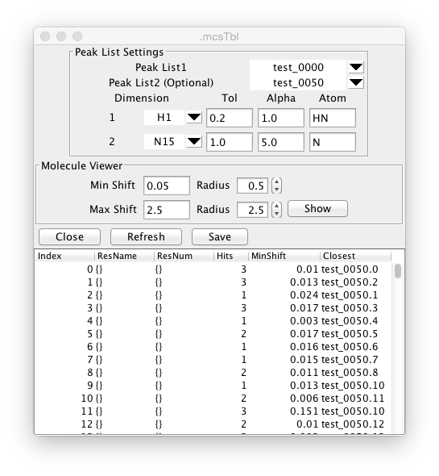
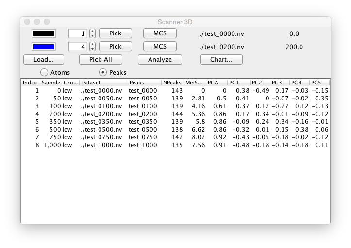
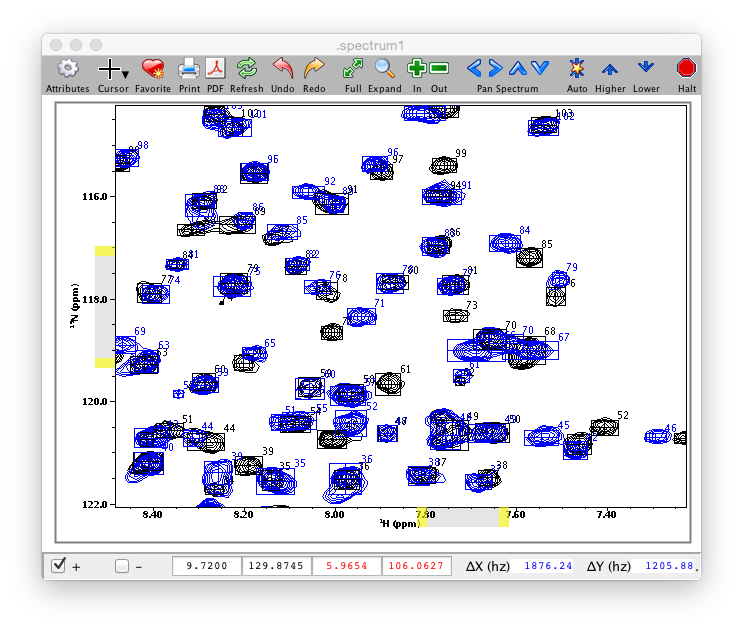
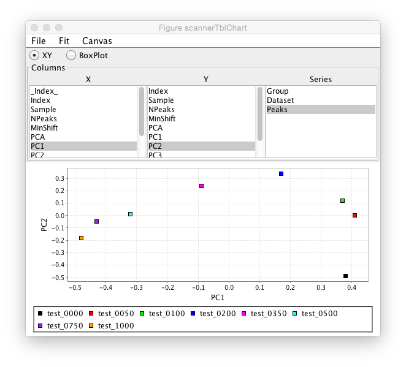
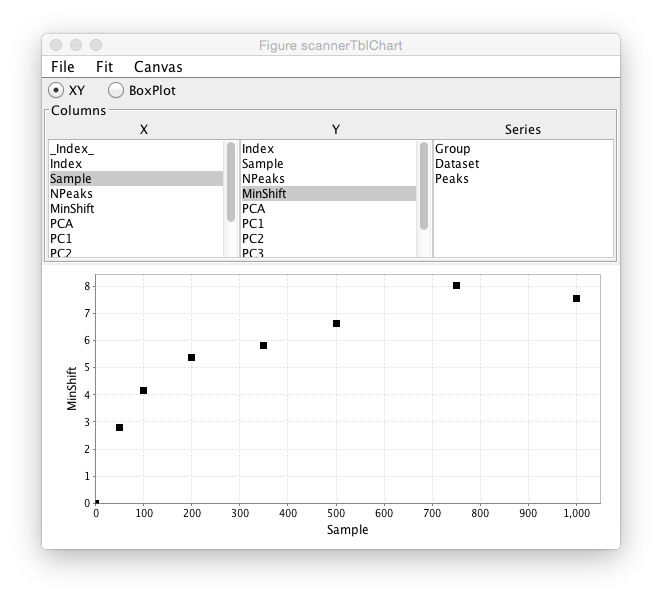

NMR is a great tool for analyzing the binding of ligands to macromolecules.  You can do qualitative screens to identify compounds that bind, gain atomic level detail on where ligands bind, and do quantitative analysis of binding parameters. Measurement of binding constants via analysis of titrations is described in the chapter on Titration Analysis.  This chapter describes using methods such as Minimum Chemical Shift analysis for quick analysis of residues involved in binding and Principle Component Analysis for categorizing groups of ligands by their effect on the spectra.

##Minimum Chemical Shift Method

The minimum chemical shift method was originally described by Farmer et al. (Nature Structural Biology 3(1996): 995-997).  In this method each chemical shift position in a reference set is searched for nearby peaks in an experimental dataset.  The distance to the nearest peak is taken as the minimum distance that a peak at the reference position might have moved as a result of the experimental perturbation (typically the addition of a ligand).  This method has the benefit that it is not necessary to assign the experimental peak list so it can be used to rapidly analyze multiple experimental datasets.  It's possible, of course, that the nearest peak does not correspond to the atoms of the reference peak.  This could be because the experimental peak has moved farther away, in which case the shift difference will underestimate the actual movement.  Alternatively the peak could have broadened to a point where it is undetectable.  In this case the shift will overestimate the distance moved.  However, it will still flag the peak as having been perturbed.

The MCS method is performed by choosing "Minimum Chemical Shift" from the Peak->Analyze menu.  The following dialog will be displayed.

The analysis can be performed in two ways.  If a molecular structure with shift assignments are loaded into memory then the reference positions can be taken from the positions of the specified atoms for each residue.  The experimental positions are taken from positions of the peaks entered as Peak List1.  Alternatively, two peak lists can be entered.  The reference positions are take from Peak List1, and the experimental positions from Peak List2.  The following parameters (as discussed in the Farmer paper) should be set.

Dimension

: Specify which dimensions of the peak lists should be used.  The selectors will be set up with one row for each dimension of the peak list. Dimensions can be ignored by entering a blank value in the dimension selector.

Tol

: Specifies an upper limit on how far away a peak can move and still be considered a shifted peak.  This sets an upper limit on what the minimum shift can be.  The results table will list the number of peaks within this tolerance range of the specified peak.

Alpha

: Nuclei of different types are expected to have different relative shift ranges.  The actual shift is divided by the alpha parameter.  Typically for H-N HSQC experiments the proton alpha value is set to 1.0, and the nitrogen alpha value is set to 5.0

Atom

: The type of atom in the residue topology that corresponds to this peak dimension.  Typically for an H-N HSQC this will be set to H (or HN) for the proton dimension and N for the nitrogen dimension.  Once the peak lists and parameters are set up click the Refresh button to perform the analysis.  The table in the lower part of the window will be updated with the following information.

Index

: A number counting from 0.  If the two-peaklist mode is being used, this will be the number of the reference peak.

ResName

: The name (amino acid type) of the residue if known.  This will be known if Atom-Peak mode is being used, or if the reference list has assignments in Peak-Peak mode.

ResNum

: The number (sequence position) of the residue if known.

Hits

: The number of peaks within the specified tolerance of the reference position.

MinShift

: The scaled (by the alpha values) distance from the reference position to the nearest peak.

Closest

: The peak specifier for the peak that is closest to the reference position.
	

The output table can be updated after changing any parameters by clicking the Refresh button again.  Clicking the Save button will open a file dialog for selecting an output file in which the table data can be saved.

If you have a molecular structure with coordinates in memory, and the MCS table has values in the ResNum column you can display the perturbed residues on the molecular display.  Open up the Molecular Viewer (Molecule->Analysis->Viewer) and display the molecule.  Click the Show button in the Molecular Viewer section of the MCS window to render spheres on the molecular display.  The radius of the spheres will be determined by the MinShift value for that residue.  Spheres will only be drawn for atoms with a MinShift value greater than the specified "Min Shift".  Spheres for that shift value will be drawn at the specified radius size.  Atoms with shifts equal to or greater than the specified "Max Shift" value will be drawn at the radius size specified next to the Max Shift parameter.  Atoms with intermediate shifts will be drawn with a radius proportional to the value of the shift relative to the Min and Max shifts.

##Ligand Scanner 

The ligand scanner allows one to scan through a list of 2D datasets and analyze differences between the datasets.  The scanner tool can use several techniques including, Minimum Chemical Shift, and PCA to analyze spectra.  It is typically used for screening a library of ligands to test for binding to a macromolecule, but could be used with any collection of datasets that differ based on some perturbation.  The analysis starts with a text file that describes the datasets to be analyzed.  A typical example of the text file is shown here.

|index |fid |dataset |group |sample|
|------|----|--------|------|------|
|0 |1 |1/data_1.nv |G1 |S1|
|1 |2 |2/data_2_1.nv |G1 |S2|
|2 |22 |22/data_22_2.nv |G3 |S3|
|3 |3 |3/data_3_3.nv |G3 |S4|
|4 |4 |4/data_4_4.nv |G3 |S5|
|5 |5 |5/data_5_5.nv |G2 |S6|

The first line must be a header and all columns should be separated by tabs.  The only column that is actually required is the one labeled "dataset".  Values in the dataset column specify the location of NMRView readable datasets.  The location of the datasets should be relative to the location of this text file.  Datasets can already be open without an error occurring when reading the file.  The "index" and "fid" columns are ignored, but are shown here as they might be present in files generated by the Scanner tool in NvFX.  The "group" and "sample" fields are optional, but will be used if present.  The sample column can contain some descriptive text that identifies the sample used to generate the dataset.  The group column can contain text that describes a group to which the sample belongs.  A group might be, for example, a set of structurally similar compounds.  Typically there will be more than one row with the same group identifier.  Groups can be used to color symbols in the PCA plots.

Before using the Ligand Scanner you should activate a spectrum window.  You can either create an empty window (For example, use the Canvas>New>Spectrum menu command) or click in an existing window that has the dataset or datasets of interest.  Then choose *Ligand Scanner* from the Analysis menu.  The Scanner window will appear.  Click the **Load...** button in order to browse to and open the scanner table file described above.

The display in the selected spectrum window will be controlled by the two numerical selectors (one in each of the first two rows of the scanner control window).  The specified values determines which dataset (or plane of a pseudo-3D dataset)  (and corresponding peak list if present) will be displayed in the spectrum window.  The tool is designed to display two datasets at once.  Typically the first selector is set to display the "reference" experiment (typically a ligand-free sample) and the second selector is set to display one of the experimental (typically ligand containing sample).  The user can quickly step through the selectors to display each dataset (or plane) and visibly observe the change in spectra.  The two color boxes to the left of the selectors can be used to specify the color that the contour and peaks will be drawn in.  Click on either box to display a color chooser.  A typical spectrum display will look like the following.

For most analyses you will need to have picked peaks.  You can use preexisting peak lists, or use the Scanner tool to pick them.  The currently displayed spectra can be picked by clicking the Pick button in the appropriate row.  Alternatively, click **Pick All** to pick peaks in all the datasets.

As you step through the available datasets with the selector buttons the current dataset and sample value (from the ligand scanner table) will be displayed at the right side of the corresponding row.  Clicking the MCS button in either row will perform the Minimum Chemical Shift method using the peak list for the row with the button as the reference list, and the peak list for the other row as the experimental list.

A multi-step analysis of all the datasets can be performed by clicking the Analyze button.  The first step of this analysis consists of performing a Principle Component Analysis of all the spectra.  The next step is performing the minimum chemical shift method for each peak list, using the peak list in the first control row as the reference. The results of the PCA and Minimum Chemical Shift analyses are stored in the table in the lower section of the Ligand Scanner tool and can be plotted in a chart display.

### Principle Component Analysis (PCA)
The Principle Component Analysis (PCA) works by dividing the selected region (area within the crosshairs) of the spectra into a two-dimensional grid.  By default, each cell of the grid is 10x10 data points in size.  Each grid region is measured for each dataset.  If the maximum intensity in the grid cell of any of the datasets is above the contour level that grid cell is marked as active.  Next, the integral of intensities in each active cell is measured for each dataset.  A two-dimension matrix of values is formed where each column of the matrix corresponds to one of the datasets, and each row corresponds to one of the active cells.  The general concept of the analysis is that if two datasets are perturbed in a similar manner, the intensity values in the corresponding columns of the matrix will be similar.  Variability between the data values, on the other hand, correspond to a perturbation of the chemical shifts by ligand binding (or other studied phenomena).  Performing the PCA analysis on the matrix of data transforms the data into a new coordinate system where the first component is oriented such that it explains the largest possible amount of the variance in the original data matrix.  Successive components are orthogonal to each previous component, and themselves explain a maximal amount of the remaining variability.  Each dataset can be represented as a point in a new coordinate system represented by two or more of the principle components.  Since most of the variance in the datasets is explained in the first few components it is possible to observe the differences in the dataset responses to the experimental perturbation in a very low dimensional space.  For example, peaks that cluster near each other in the 2D plot of the first two principle components are likely to represent very similar spectra and hence physical effects on the chemical shifts, whereas those that are at distinct positions represent different interactions.

### Analysis output
The output table of the Ligand Scanner has the following information.

Index

: Index of the dataset (or plane of a pseudo-3D experiment)

Sample

: The Sample value for that dataset (taken from the input table file)

Group

: The Group value for that dataset (taken from the input table file)

Dataset

: The dataset name

Peaks

: The peaklist name

NPeaks

: The total number of peaks in the peak list

MinShift

: The sum of all the minshift values for this peak list, relative to the reference list.  Gives an overall indication of how different the peak list is

PCA

: The distance (Euclidean) between this peaklist and the reference peak list as measured by the difference of the coordinates of the first and second Principle Component values.  Gives a single number indicating how different this peak list is from the reference list.

PC1,2,3,4,5

: The values of the first five Principal Components for this dataset.

### Chart
After the analysis is done a chart tool will be displayed which will allow plotting of any numerical value in the analysis table.  The chart tool consists of an area with three columns of information.  The first two allow the user to select the table columns to be used for the X and Y axes of the plot.  For example, clicking PC1 in the X column and PC2 in the Y column would plot the first two Principle Components.  The Series column lists all the data table columns with non-numerical values and can be used to color the plot symbols by the value they have in that table column.  For example, one might do an analysis with a series of compounds that were in related chemical series.  The group value could be set to the series name and then one could observe how the members of the different series clustered in the plot.  The example below just selects the Peak column as the group, so the symbol for each Peak list is in a different color.

This chart example shows data from a ligand titration.  The sample value is set to the ligand concentration and a plot is done of sample value on the X axis and MinShift on the Y Axis.  It can be seen that the overall MinShift value gives a good representation of the titration profile.

The chart is linked to the original scanner table, so clicking on a symbol in the chart plot will highlight the corresponding row of the table in the scanner window.

### Summary of steps for analysis
1. Canvas > New > Spectrum  (to make empty spectrum window)
2. Analysis > Ligand Scanner  (to show the ligand scanner)
3. Click Load…  and select file with the format described above
	Spectra should appear in empty spectrum window
4. Zoom in window around peaks
5. Click Pick All (assuming you don’t already have picked peaks for spectra)
6. Choose Peaks or Atoms mode.  In Peaks mode the Minimum Chemical Shift method will be setup to work in the Peak-Peak mode described in the Minimum Chemical shift section above.  In Atoms mode, the MCS method will be done in Atom-Peak mode and requires that a molecular structure be loaded with chemical shift assignments.
7. Display and position the crosshairs in the spectrum window around the region of peaks you wish to use for the PCA method.
9. Click the Analyze button. The table will be filled in with numbers. A chart window will appear
10. In the chart window select an X and Y value to plot (for example, PC1 and PC2)
11. If you have group information in the table, click on the Group entry in the Series column to color PCA by group
12. Click on a symbol on plot and see the corresponding row in the table get selected.

