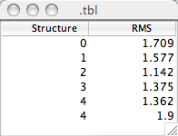
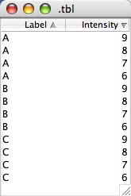

NMRViewJ presents a lot of information in the form of tables. Peaks,
atom assignments, open datasets and more can all be presented with a
table widget. The table widget can also be used by other NMRViewJ
developers and users to present their own information and to otherwise
customize the program. Fundamentally the table widget is used like any
other Swank/Tk widget (menus, buttons, entries, lists etc.). New tables
are created with "jtable widgetName". Because it can be used in a more
complicated ways, however, it is generally used through a specialized
library of Tcl procedures.

This chapter will demonstrate how to create and interact with tables
within NMRViewJ. We'll focus on using the table Tcl commands that wrap
up the low level jtable commands. Developers who want to dig deeper into
the code should look at the script "table.tcl" in the nvtclJ directory.

When using the library of table commands one creates a new command for
each table. That new command is then used to create and interact with
the actual table widget. For example, the we can create a test example
with the following command: `::table::table
        testTbl` After executing this command a new command, named
testTbl, exists. In the following discussion we'll use this example
command. If the command testTbl already exists you will get an error
message indicating that fact. Once you have the table command you can
proceed to creating an actual table. The table command will have a whole
series of subcommands you can use. For example, the simplest way to
create a new toplevel window containing a table is:
`testTbl createtl .tbl "A B C"` In this example, we'll get a new
toplevel window named .tbl that contains a table with three columns
named A, B and C. Because tables can often contain many rows and columns
it's a good idea to have them placed inside a jscrollpane widget, that
will automatically provide scrollbars for scrolling through all the
table. The "createtl" subcommand will create a jscrollpane, pack it into
the new toplevel window, and add the new table widget to the
jscrollpane.

If you want to have more control over where your new table is placed,
create the toplevel window and jscrollpane yourself. You're now free, of
course, to place the jscrollpane anywhere in the toplevel widget and
pack in any other widgets along with it. To create and add the table
widget to an existing scrollpane use a command like `testTbl create
            .tl.tbl .tl.spane "A B C"`. This will create a new table
widget named .tl.tbl and add it to an existing scrollpane named
.tl.spane

Having created a table we now need to add data to it. We can do that in
several different ways. One way is to add data a line at a time, and
have the table automatically grow to accommodate it. The addline
subcommand will add one line of data to the table and takes two
arguments. The first argument specifies the position to add the data at
and is normally specified as -1 to signify that the data should be added
at the end of the existing data. The second argument, is a set of values
to be added to the table. There should be one element in the set for
each column in the table. Because this set of values may come from an
external file or source where the fields may be separated in different
ways you can specify the field separator prior to using the "addline"
subcommand. The field separator can be a space character, a comma or a
tab and is specified with the "pattern" subcommand. A complete example,
of creating and populating a table follows.

                ::table::table testTbl
                testTbl createtl .tbl "Peak Label Intensity"
                testTbl pattern ","
                testTbl addline -1 "1,3.HN,8.3"
                testTbl addline -1 "2,4.HN,7.5"
                testTbl addline -1 "3,5.HN,9.7"
                testTbl addline -1 "4,6.HN,4.3"
                
        

We can also load data from an existing file using the "load" subcommand.
In order to allow greater flexibility the load subcommand takes, as an
argument, a handle to an already opened file, rather than the name of a
file to read. This allows us to actual read not just from traditional
files but from a connections to data sources like web servers.

The following script will prompt us for a file to open and then create a
table and read the file and load it into the table. With no options
besides the file handle the load subcommand parses the file assuming the
fields on each line are separated with white space (one or more space
characters). The optional second argument specifies the field separator
character to use, and is one of the four words: "auto", "tab", "csv" or
"space". If the argument is "auto", as in this example it will look at
the first row of the file and attempt to determine the correct separator
to use. If a tab character is found it will assume tab separation. If
there is no tab character, but a comma is found it will assume the file
has comma separated values (csv). Finally, if neither is found it will
assume space separated values. Note that, whereas we must open a file or
connection and pass the handle as an argument to the load subcommand we
don't explicitly close the file or connection. This is done
automatically after the date has been loaded.

~~~~~~~~
        proc loadTable {} {
            set fileName [tk_getOpenFile]
            if {$fileName == {}} {return}
            set f1 [open $fileName]
            ::table::table sampleFileTbl
            sampleFileTbl createtl .sampleFileTbl ""
            sampleFileTbl load $f1 auto
        }
~~~~~~~~
        

Following is the contents of a file that would create the table shown in
the figure. The first line of the file should specify the names of the
columns that will be created in the table.

            Atom Label RMS
            0    3.HN   0.4
            1    4.HN   0.3
            2    5.HN   0.7
            3    6.HN   0.2
            4    7.HN   0.9
            5    8.HN   0.8
            6    9.HN   0.7
            7    10.HN   0.4   
        

We can also set the content of tables more explicitly. The number of
columns and their names can be set with the headers subcommand (
`testTbl headers headerList` ). Then we can set the number of rows with
the "rows" subcommand ( ` testTbl rows
        nRows` ) and fill in the values with the "set" subcommand (
`testTbl set row
            column value` ). You can also add a column to an existing
column with `testTbl
            addcolumn newColumnName`. An example of explicitly setting
the row and column values in a table would be:

            
          
~~~~~~~~
            ::table::table testTbl
            testTbl createtl .tbl "Structure RMS"
            set nRows 5
            testTbl rows $nRows
            for {set iRow 0} {$iRow < $nRows} {incr iRow} {
                testTbl set $iRow 0 $iRow
                testTbl set $iRow 1 [expr {rand()+1.0}]
            }
            testTbl update data
~~~~~~~~
              
        

Setting values in tables doesn't always result in the tables display
being refreshed. That's why in the above example we follow the setting
commands with a call to the update subcommand. The "data" argument in
this command indicates that only the data in the table has been changed,
and not the whole structure (number of rows and columns etc.).

The get subcommand is complementary to the set subcommand and has the
obvious result of returning the data value at the specified row and
column ( `testTbl get row
        column`. Similarly, the "rows", "cols" and "headers" command,
specified without any arguments will return the number of rows, the
number of columns and the names of the columns, respectively.

Sometimes you'll want to get all the values in a row or a column of the
table and this can be done as follows:

     
~~~~~~~~
                set rowValues [testTbl getrow 0]
                set columnValues [testTbl getcol 0]
~~~~~~~~
            

The unique values in a give column can be returned with

     
~~~~~~~~
                set uniqueValues [testTbl values 0] 
~~~~~~~~
            

and the number of unique values with

     
~~~~~~~~
                set nValues [testTbl nvalues]
~~~~~~~~
            

Having created a table and populated it with values, we might want to
save it to a text file. This can be done with the "save" subcommand.
This subcommand has one required argument, the name of the file, and one
optional argument, the field separator to use. The default separator is
the tab character. To specify a different character (or string of
characters) give this explicitly as an option. So to save a file to
test.txt with a space character separating fields use

~~~~~~~~
            testTbl save test.txt " "
~~~~~~~~
        

If for some reason you want to save a file with a series of dashes as
the separator use:

~~~~~~~~
            testTbl save test.txt "----"
~~~~~~~~
            

Tables can be sorted by clicking with the left mouse button on the
column header. Clicking the same column header a second time will invert
the order of the sort, and clicking a third time will cancel any
sorting. You can specify secondary sortings by holding down the Control
key when you click. Sorted columns are indicated with a triangle on the
header that will point in the sorted direction (increasing or
decreasing). If you specify secondarily sorted columns they will be
indicated with smaller triangles, decreasing in size in the order they
were specified. The following example script will generate a table which
is then sorted first on the Label column and secondarily on the
Intensity column and displayed in the next figure.

~~~~~~~~
            ::table::table testTbl
            testTbl createtl .tbl "Label Intensity"
            testTbl pattern ","
            set lines {"C,9" "B,7" "A,9" "B,9" "C,7" "A,8" 
                       "B,6" "B,8" "C,8" "A,7" "C,6" "A,6"
            }
            foreach line $lines {
                testTbl addline -1 $line
            }
~~~~~~~~
        

If a table has been sorted you should be careful about reading and
writing values from the table. Does a row argument to the "get" or "set"
subcommands specify the row in its sorted or presorted position? One way
to think about this is to realize that tables are all implemented with
an underlying data model that is never sorted. What you see displayed is
a sorted representation of that data model. The "get" and "set" commands
refer to the row position as you see it in the displayed table so
"testTbl get 0 0" will get the first value in the table as it is
displayed and thus may get a different value depending on how the table
has been sorted. There are corresponding "mget" and "mset" commands
which always operate directly on the data model and thereby get or set
the same position in the model no matter how the displayed table is
sorted. The "getrow" and "getcol" commands always operate on the
displayed table, so the values they return will depend on how the table
is sorted. At present there are no corresponding "sort independent"
versions of these commands.

The columns of a table can be reordered, by pressing and dragging the
mouse on a column header. Reordering the columns in this way does not
effect the values set or returned by the above commands. Pressing the
mouse button on the header and dragging it to a new position will resize
the column.

One or more rows in the table can be selected, either by clicking on the
rows with the mouse, or programmatically with the "selectRow" subcommand.
Pay close attention here as this is unfortunately confusing. The
"selectRow" command selects a row based on its position in the unsorted
model. So, for example, if you do "testTbl selectRow 0" on a sorted
table the row that appears selected may not be the top one in the table.
The row that is selected will be the one whose values correspond to the
first one in the table model. Here's the confusing part, the "selected"
command, which returns a list of selected columns returns rows that are
in their sorted positions. So, on an unsorted table, "testTbl selectRow
0" will select the top most displayed row, and "testTbl selected" would
then return 0. But if the table was sorted, so the table model values
for the first row are displayed in the fourth row (row 0), that fourth
row would be displayed as selected and "testTbl selected" would return
"4".

You can move back and forth between row values in the two
representations with the "rowforindex" and "indexforrow" subcommands.
The "rowforindex" command will return the table model row that
corresponds to the displayed row that is specified. So in the above
example `testTbl rowforindex 4` would return "0". The "indexforrow" does
the opposite, returning the displayed row position for the specified
model row. So `testTbl
            indexforrow 0` would return "4". If you're going to be
working with these commands and sorted tables it is a good idea to do
some experimentation till your comfortable with this.

The data stored in a table model is normally stored in a type specific,
optimized manner, so integer values are stored in a Java class that can
store integers, doubles in a doubles class, and strings of characters in
a String class. If you create a table with the load or addlines command
the code will attempt to put the data in the most specific column type.
So first, it will look to see if the values is an integer, if not it
will test it as a double, and finally if neither store it as a string of
characters. You can see what type of values are in a column with the
"type" subcommand.

You can set up various bindings on tables. The binding most unique to
the table is a binding that fires when the selection changes in the
table.

            
~~~~~~~~
                  proc tableChanged {tbl} {
                      puts [$tbl selected]
                  }
                  set tblWidget [testTbl widget]
                  bind $tblWidget <<SelectionChanged>> {tableChanged testTbl}           
~~~~~~~~

            
            
        

There are many more subcommands available, but the ones discussed above
should get you going with some sophisticated uses of tables. Also
remember that you can use these commands to interact with the predefined
tables of NMRViewJ, such as the relaxation table (use the "rateTbl")
command, or the titration table (use the "titrationTbl" command).
