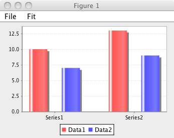
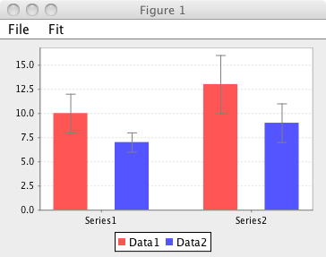

##Introduction

NMRViewJ incorporates a sophisticated charting library, JFreeChart
(http://www.jfree.org/jfreechart/) for the graphical display of data. In
NMRViewJ, this library is integrated into the canvas widget. This allows
developers and users to generate canvases that combine all the normal
canvas items such as lines, circles, rectangles, and text, with xy and
bar charts.

This chapter will demonstrate how to generate your own charts within
NMRViewJ. Since the primary use of charts in NMRVIEW is to plot data
extracted from NMR experiments the main interface to the charting is
through scripts. Charts are generally displayed in a toplevel window
created with the figure command, though they can be inserted into any
canvas in the program. The figure command can be issued with zero or one
arguments. With no arguments it generates a toplevel window with a title
like "Figure 1". Each time you issue the figure command it will
increment the numerical suffix to give you "Figure 2", "Figure 3" etc.
If you give invoke the figure command with one argument, the new figure
will have that argument as its title. So "figure Relaxation" will give
you a figure with title "Figure Relaxation". Subsequent charting
commands will be directed at the currently active figure. You can
activate a figure by either clicking on its window, or by issuing the
figure command with an argument that is the title of an existing window.

Plots are created within figure windows with one of three plotting
commands, plot to create XY (scatter) plots, barplot to create Bar
Charts, and statplot to create Bar Charts where each item as an
indicator of the statistical deviation of the data. If no figure exists
already, these three commands will first call the figure command to
create one. If you're in Premium mode, you can also create a new Figure
with the <span class="menuchoice">Canvas \> New Figure</span> menu item.

##XY Plots

XY plots can be created with the plot command. The XY values are most
simply specified as a standard Tcl style list of numbers. So the command

    plot "0 1 2 3 4 5" "10 6.6 3.1 1.8 0.9 0.4"
                

would create the following plot:


If, as is the case here, the x values simply count from 0 to n-1, where
n is the number of data points, you can leave off the x values. So

    plot "10 6.6 3.1 1.8 0.9 0.4"

would result in the same plot. Multiple data sets can be displayed on a
single plot. You just need to provide an alternating series of lists of
x and y values: `plot $xvalues1
                $yvalues1 $xvalues2 $yvalues2`. Each pair of x and y
values must have the same number of datapoints, but different sets can
have different numbers. So

    plot "0 1 2" "4 5 3" "1.5 2.5" "3 7"

is a valid plot. Each xy set can be preceded with arguments that specify
whether to draw connecting lines (-l 0|1), whether to draw symbols at
the data points (-s 0|1), what color to plot the symbols and lines with
(-c colorName), and the legend name (-L legendName). For example,

    set x1 "0 1 2 3"
    set y1 "4 5 3 6"
    set x2 "0.5 1.5 2.5 3.0"
    set y2 "3 8 2 5"
    plot -L Data1 -c blue -l 0 $x1 $y1 -L Data2 -s 0 -l 1 -c red $x2 $y2

creates the following chart. Legends are automatically displayed if
there is more than one data set.

Besides the basic data values XY plots have a variety of configuration
options. These can be set with the pconfig command. For example,
pconfig -rmin 1 -rmax 10. The arguments that can be used are listed
here. Note that in axis specific arguments (-dmin, -rmin, -rmax etc.)
arguments beginning with "d" specify the domain (x) axis and those
beginning with "r" specify the range (y) axis.

-shapesvisible

:   Should a symbol be drawn at each data point. The argument value is
    list of "0"s (indicating no symbol) and "1"s (indicating a symbol)
    with one element for each data series. So if you have two sets of x
    and y data in the plot and want the first to have no symbol and the
    second to have a symbol use **pconfig -shapesvisible "0 1"**

-linesvisible

:   Should a line connecting the data points be drawn. The argument
    value is list of "0"s (indicating no line) and "1"s (indicating a
    line) with one element for each data series. So if you have two sets
    of x and y data in the plot and want the first to have no line and
    the second to have a line use **pconfig -linesvisible "0 1"**

-shapesvisible

:   Should a symbol be drawn at each data point. The argument value is
    list of "0"s (indicating no symbol) and "1"s (indicating a symbol)
    with one element for each data series. So if you have to sets of x
    and y data in the plot and want the first to have no symbol and the
    second to have a symbol use **pconfig -shapesvisible "0 1"**

-legendstate

:   Should a legend be drawn at the bottom of the plot. The argument
    value is boolean value (0,1, true, false). By default legends are
    drawn if there are more than one series, but you can use this
    configuration value to explicitly turn it on or off. For example,
    **pconfig -legendstate 1**

-d(r)label

:   Specify the label for the domain (range) axis. For example,
    **pconfig -rlabel "Intensity Value"**

-d(r)min

:   The lower plot limit for the domain (range) axis. If you specify
    this autoscaling for the axis is turned off.For example,
    **pconfig -dmin 1.5**

-d(r)max

:   The upper plot limit for the domain (range) axis. If you specify
    this autoscaling for the axis is turned off.For example,
    **pconfig -rmax 10**

-d(r)auto

:   Turn autoscaling on or off for the domain (range) axis. If you
    specify this then previous min or max values are ignored. For
    example, **pconfig -dauto 1**

-paint

:   The color used for each series The argument value is a color value,
    either a symbolic name (red) or rgb values (255 0 0) So if you have
    to sets of x and y data in the plot and want the first to be red and
    the second to be yellow use, for example, **pconfig -paint {red "255
    255 0"}**

-spline

:   Use this to specify that the line should be curved. If set to zero
    lines are plotted with a straight segments connecting each data
    point. Any value greater than zero will result in a a curved line
    calculated with spline interpolation. The value specifies the number
    of segments to use between each data point.

Multiple values can be specified at once, for example, **pconfig -rmin
0 -rmax 10**The pconfig command with no arguments returns a list of all
the settable parameters and their current values. With one argument
(parameter name, but no value) it returns the current value for that
parameter. The plabel command provides a simpler access to setting the
axis labels: plabel xLabel yLabel.

##Fitting XY Chart Data

Data in XY charts can be fit to various equations. For example, here we
create a chart with the following commands:

``` {.tcl}
 
                set x "0 1 2 3 4 5" 
                set y "11.5 6.3 2.9 1.6 0.7 0.4" 
                plot $x $y 
                pconfig -dmin -0.2
```

Then we select the<span class="menuchoice">Fit \> Controls...</span>
menu item. This brings up the Fitting dialog from which we can set the
equation to be fit, and parameters defining the Monte Carlo method used
to estimate the standard deviations of the fit parameters. After
fitting, the chart is automatically updated with a line defined by the
equation with the best fit parameters, and a text description of the
equation and fitting results.

##Bar Charts

Bar charts are also easy to create. We again create a figure with a
canvas and then instead of plot, we use the barplot command. The data in
this case is stored in a single Tcl list. The data in the list consists
of triplets of data. The first point in each triplet specifies a row
name, the second data point a series name, and the third data point the
actual value to be plotted. The following plot was created with this
command

    barplot "Data1 Series1 10 Data2 Series1 7 Data1 Series2 13 Data2 Series2
                    9"



The series name (Series1 and Series2) will be displayed under each set
of bars in the series. Row names will be displayed in the legend, if it
is turned on. Colors will be chosen automatically.

##Statistical Charts

Statistical charts are similar to bar charts described above, but each
bar also has a line indicating the statistical variability of the data.
The variability measure is typically the standard deviation of the
values contributing to each bar. We again create a figure with a canvas
and then instead of barplot, we use the statplot command. The data in
this case is also stored in a single Tcl list. The data in the list
consists of quartets of data, and differs from bar chart data only in
the addition of the variability value. The first point in each triplet
specifies a row name, the second data point a series name, the third
data point the actual value to be plotted, and the fourth the
variability. The following plot was created with this command

     statplot "Data1 Series1 10 2 Data2 Series1 7 1 Data1 Series2 13 3 Data2
                    Series2 9 2"



The series name (Series1 and Series2) will be displayed under each set
of bars in the series. Row names will be displayed in the legend, if it
is turned on. Colors will be chosen automatically.

##Chart Menu

Save Canvas...

:   Saves the current figure as an NMRView canvas file

Open Canvas...

:   Open an existing canvas file

Print

:   Print the figure's canvas

Copy

:   Copy the figure's canvas to the clipboard as an image.

Export

:   Export the figure's canvas into one of the many supported graphic's
    file formats.

Figure windows created in Premium mode from the <span
class="menuchoice">Canvas \> New Figure</span> menu item will also have
a full Canvas menu allowing the insertion and configuration of other
graphical objects.
