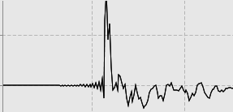

Set parameters used for controlling processing and referencing of each dimension. 

dataset (Dim 1 only)

:    Name of dataset that will contain the processed data. This is set, by default, to the name of the pulse sequence. The format of the dataset 
is determined by the extension specified in the next parameter.

extension (Dim 1 only)

:    Extension for the name of dataset that will contain the processed data. At present, this parameter can be set to ".nv" to create an
NMRViewJ format file or to ".ucsf" to create a SPARKY UCSF format file.  This is set, by default, to ".nv".  Note:  during processing
to create ".ucsf" files the file header will contain information that is not standard for UCSF files.  This information, used in processing,
will be removed at the end of normal processing.

Datasets are, at present, only created in the NMRView format. The dataset will be created in the directory that holds the fid/ser file.
acqorder (Dim 1 only)

:    Multidimensional NMR datasets are normally acquired by collecting a series of FIDs at a combination of incremented time and phase values. The acqOrder parameter indicates the order in which these values are incremented and having the correct value can be important for processing of datasets with three or more dimensions. Three dimensional, Agilent datasets are typically acquired with an order of p1,p2,d1,d2 (array parameter set as phase2,phase)or p2,p1,d1,d2 (array parameter set as phase,phase2). Bruker datasets are typically acquired as p1,d1,p2,d2. The software attempts to figure out what acquisition order was used, but modified pulse sequences can generate acquisition orders that are not correctly reflected in parameter values.

As an alternative to using the full description (like p1,p2,d1,d2) you can use shortcuts for the different orders.  For example, Bruker pulse programs can have an *acqseq* parameter.  For a 3D experiment this would typically be "321" (equivalent to "p1,d1,p2,d2"), but might be set to "312" (equivalent to "p2,d2,p1,d1").  You can enter this value (312 or 321) in the acqorder field.   Varian/Agilent systems have an array parameter that specifies the order which the phase values  (used, for example, in hypercomplex data) are incremented.  For a 3D dataset these could be set to "phase,phase2" in which case you could specify an acqorder of "12", or "phase2,phase", in which case you could specify "21".

Note that the acqorder parameter, even when specified like "312" is a text string, not an integer number.  If you're entering it directly in a processing script (rather than in the parameter field) you must enclose it in quotes (like '312').

fixdsp (Dim 1 only)
    
:  If you're in a hurry, ignore the following and if the "fixdsp" checkbox is present, turn it on and off and see which way gives your processed direct dimension FID a better baseline. Use that setting. If you're curious about what it does, read on.

:  NMR spectrometers need to implement some method to filter out signals with frequencies outside of the desired spectrum width. On modern NMR systems this is typically done with a software algorithm implemented in a digital signal processor (DSP). These algorithms conventionally generate a new data point in the filtered FID, by taking a weighted combination of the original data points that are at earlier and later times than that corresponding to the new point. At early time points, there aren't enough acquired data points for all the filter coefficients and some adjustment must be made in the algorithm.

:  Bruker systems seem to deal with this by providing the filtering algorithm with zeros for the unmeasured values. This leads to the generation of an output FID that has a region of increasing intensity at its beginning whose length is related to the so-called group delay of the filter. These FIDs require special processing. 

: 

:  Simply removing the data points in this region will result in a processed spectrum that has significant baseline artifacts. Most dramatically, "smiles" or "frowns" at the edges of the spectrum are observed, but more importantly a broad curvature across the entire baseline can be present. We provide several methods for correcting for the group delay of the filter. If the "fixdsp" button is checked, then an algorithm is used to remove this region in a way that generally preserves a good baseline. If the "fixdsp" button is not checked then the FID is left unchanged until the Fourier Transform is performed. At that time an alternative algorithm is applied to correct it. Most operations that can be used before the FT have been modified to recognize and alter their actions based on whether the group-delay region is present or not. Finally, there is a specific operation, BZ, that can be inserted in the processing operation list. It provides several optional methods and parameters to deal with this issue. 

:  Agilent systems deal with the lack of data points before time zero by padding the data with estimated (rather than zeroed) values and generating a final FID that appears as a conventional FID. No special processing is needed and the fixdsp control is not displayed with Agilent datasets. 

EchoAntiEcho (Dim 2 and higher)

:    Datasets collected in echo-antiecho mode require taking pairs of FIDs and creating a new pair by addition and subtraction of the original FIDs. This is done during processing using the TDCOEF operation. Selecting this flag effects only the display of indirect FIDs (dimension 2 and greater) so that you can see what will happen during processing. It does not, in the current implementation, change any processing operations.

label, acqsize, tdsize, sf, sw and ref

:    Used to specify the labels, data sizes, spectrometer frequency, sweep width and referencing for each dimension. See the Referencing section of the documentation for details.
